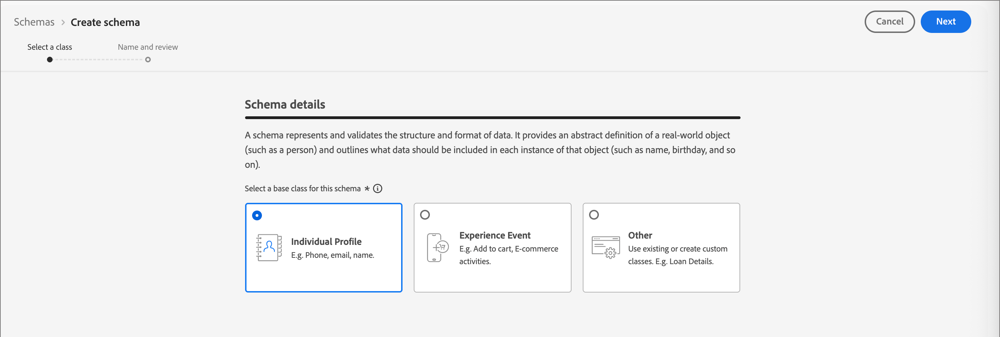

# Testprofile {#test-profiles}

Testprofile sind erforderlich, um Landingpage-Inhalte in [&#x200B; Journey Optimizer B2B edition in der Vorschau &#x200B;](../content/landing-pages-create-publish.md#test-landing-page) testen. Sie können einen Satz von Testprofilen definieren, indem Sie ein Schema erstellen, den Datensatz erstellen und eine CSV-Datei hochladen.

<!--
>[!NOTE]
>
>[!DNL Journey Optimizer B2B Edition] allows testing different variants of your content by previewing it and sending proofs using sample input data uploaded from a CSV or JSON file, or added manually. 
-->

Das Erstellen eines Testprofils ähnelt dem Erstellen regulärer Profile in [!DNL Adobe Experience Platform]. Weitere Informationen finden Sie in der [Dokumentation zu Echtzeit-Kundenprofilen](https://experienceleague.adobe.com/docs/experience-platform/profile/home.html?lang=de){target="_blank"}.


## Erstellen eines Schemas {#create-schema}

Um Profile zu erstellen, müssen Sie zunächst ein Schema in [!DNL Journey Optimizer B2B Edition] erstellen.

1. Erweitern Sie **[!UICONTROL Daten-Management]** in der linken Navigationsleiste, wählen Sie **[!UICONTROL Schemata]** und klicken Sie oben rechts **[!UICONTROL Schema erstellen]**.

   {width="800" zoomable="yes"}

1. Wählen Sie **[!UICONTROL Standard]** als Option zur Schemaerstellung aus.

1. Wählen Sie einen Schematyp aus, z. B **[!UICONTROL „Manuell]**, und klicken Sie auf **[!UICONTROL Auswählen]**.

   {width="500"}

1. Wählen Sie einen Schematyp aus, z. B. **[!UICONTROL Individuelles Profil]**, und klicken Sie auf **[!UICONTROL Weiter]**.

   {width="700" zoomable="yes"}

1. Geben Sie einen Namen (erforderlich) und eine Beschreibung (optional) für das Schema ein und klicken Sie auf **[!UICONTROL Beenden]**.

   {width="700" zoomable="yes"}

   Die Schemastruktur wird mit dem Bedienfeld _[!UICONTROL Komposition]_ auf der linken Seite angezeigt.

1. Klicken Sie im Abschnitt **[!UICONTROL Feldergruppen]** auf **[!UICONTROL Hinzufügen]** und wählen Sie die entsprechenden Feldergruppen aus.

   Verwenden Sie das Suchwerkzeug, um die Feldergruppe **[!UICONTROL Testdetails des Profils]** zu finden und auszuwählen.

   {width="700" zoomable="yes"}

   Klicken Sie abschließend **[!UICONTROL Feldergruppen hinzufügen]** und die Liste der Feldergruppen wird dann auf dem Bildschirm Schemaübersicht angezeigt.

   Wiederholen Sie diesen Schritt, um zusätzliche Feldergruppen hinzuzufügen, die Sie für Testprofile verwenden möchten, z. B. **[!UICONTROL Personen-Kontaktdaten]** und **[!UICONTROL Arbeitskontaktdetails]**.

1. Klicken Sie in der Liste der Felder auf das Feld, das Sie als die primäre Identität definieren möchten.

1. Markieren Sie im rechten Bereich _[!UICONTROL Feldeigenschaften]_ die Optionen **[!UICONTROL Identität]** und **[!UICONTROL Primäre Identität]** und wählen Sie einen Namespace aus.

   Wenn die primäre Identität eine E-Mail-Adresse sein soll, wählen Sie den Namespace **[!UICONTROL E-Mail]**.

   {width="700" zoomable="yes"}

   Klicken Sie auf **[!UICONTROL Übernehmen]**.

1. Wählen Sie das Schema aus und aktivieren Sie die Option **[!UICONTROL Profil]** im Bereich **[!UICONTROL Schemaeigenschaften]**.

   {width="700" zoomable="yes"}

1. Klicken Sie auf **[!UICONTROL Speichern]**.

Weitere Informationen zur Erstellung von Schemata finden Sie in der [XDM-Dokumentation](https://experienceleague.adobe.com/docs/experience-platform/xdm/ui/resources/schemas.html?lang=de#prerequisites){target="_blank"}.

>[!IMPORTANT]
>
>Stellen Sie beim Erstellen oder Ersetzen eines Datensatzes für die Aufnahme von Testprofilen sicher, dass auf das Schema der richtige Identitätsdeskriptor für den beabsichtigten Namespace auf das primäre Identitätsfeld (`/personID`) angewendet wurde. Wenn der Identitätsdeskriptor fehlt oder falsch konfiguriert ist, werden in diesen Datensatz aufgenommene Profile möglicherweise nicht als Testprofile (`testProfile = true`) gekennzeichnet, selbst wenn der Aufnahmeprozess erfolgreich abgeschlossen wird.
>
>Wenn Ihre Testprofile nach der Aufnahme nicht korrekt gekennzeichnet sind:
>
>1. Prüfen Sie das mit Ihrem Datensatz verknüpfte Schema.
>1. Vergewissern Sie sich, dass das Feld Primäre Identität den richtigen Identitätsdeskriptor für Ihren Namespace hat.
>1. Wenn der Deskriptor fehlt, aktualisieren Sie das Schema, um den Identitätsdeskriptor hinzuzufügen und Ihre Daten erneut aufzunehmen.

## Erstellen eines Datensatzes {#create-dataset}

Nachdem Sie das Schema erstellt haben, erstellen Sie den Datensatz, der zum Importieren der Profile verwendet wird. Weitere Informationen zur Erstellung von Datensätzen finden Sie in der [Dokumentation zum Katalog-Service](https://experienceleague.adobe.com/docs/experience-platform/catalog/datasets/user-guide.html?lang=de#getting-started){target="_blank"}.

1. Wählen _[!UICONTROL im]_ Navigationsbereich unter „Daten-Management“ die Option **[!UICONTROL Datensätze]**.

1. Klicken Sie oben rechts auf **[!UICONTROL Datensatz erstellen]**.

   {width="800" zoomable="yes"}

1. Wählen Sie **[!UICONTROL Datensatz aus Schema erstellen]** aus.

   {width="500"}

1. Wählen Sie das zuvor erstellte Schema aus und klicken Sie auf **[!UICONTROL Weiter]**.

1. Wählen Sie einen Namen aus und klicken Sie auf **[!UICONTROL Beenden]**.

   {width="700" zoomable="yes"}

1. Aktivieren Sie im rechten Bedienfeld die Option **[!UICONTROL Profil]** .

## Erstellen von Testprofilen mithilfe einer CSV-Datei {#create-test-profiles-csv}

In [!DNL Adobe Experience Platform] können Sie Profile erstellen, indem Sie eine CSV-Datei mit den verschiedenen Profilfeldern in Ihren Datensatz hochladen. Dies ist die einfachste Methode.

1. Erstellen Sie eine einfache CSV-Datei mithilfe einer Tabellenkalkulationssoftware.

1. Fügen Sie für jedes erforderliche Feld eine Spalte hinzu.

   Stellen Sie sicher, dass Sie das primäre Identitätsfeld (z. B. `personID`) und das `testProfile` Feld auf `true` setzen.

1. Fügen Sie für jedes Feld eine Zeile pro Profil und die Werte hinzu.

   {width="600" zoomable="yes"}

1. Speichern Sie das Arbeitsblatt als CSV-Datei und stellen Sie sicher, dass Kommas als Trennzeichen verwendet werden.

1. Navigieren Sie in [!DNL Adobe Experience Platform] zu **[!UICONTROL Workflows]**.

1. Wählen Sie **[!UICONTROL CSV zu XDM-Schema zuordnen]** und klicken Sie auf **[!UICONTROL Starten]**.

   {width="800" zoomable="yes"}

1. Wählen Sie den für den Import zu verwendenden Datensatz aus und klicken Sie auf **[!UICONTROL Weiter]**.

   {width="700" zoomable="yes"}

1. Klicken Sie **[!UICONTROL Dateien auswählen]** und wählen Sie die CSV-Datei aus, oder ziehen Sie die Datei per Drag-and-Drop aus Ihrem System.

   Klicken Sie nach Abschluss des Datei-Uploads auf **[!UICONTROL Weiter]**.

   {width="700" zoomable="yes"}

1. Ordnen Sie die CSV-Quellfelder den Feldern des Schemas zu und klicken Sie dann auf **[!UICONTROL Beenden]**.

   {width="700" zoomable="yes"}

   Der Datenimport beginnt. Der Status wechselt von _Verarbeitung_ zu _Erfolg_.

1. Klicken Sie oben rechts auf **[!UICONTROL Datensatz in der Vorschau anzeigen]** und überprüfen Sie, ob die zum Datensatz hinzugefügten Testprofile korrekt sind.

   {width="700" zoomable="yes"}

   Die Testprofile können dann verwendet werden, um [Landingpage-Inhalte zu &#x200B;](../content/landing-pages-create-publish.md#test-landing-page).

>[!NOTE]
>
>Weitere Informationen zum CSV-Datenimport finden Sie in der [Dokumentation zur Datenaufnahme](https://experienceleague.adobe.com/docs/experience-platform/ingestion/tutorials/map-a-csv-file.html?lang=de#tutorials){target="_blank"}.

<!--
## Create test profiles using API calls {#create-test-profiles-api}

You can also create test profiles via API calls. Learn more in [[!DNL Adobe Experience Platform] documentation](https://experienceleague.adobe.com/docs/experience-platform/profile/home.html?lang=de){target="_blank"}.

You must use a Profile schema that contains the **[!UICONTROL Profile test details]** field group. The `testProfile` flag is part of this field group.
When creating a profile, make sure you pass the value: `testProfile = true`.

You can also update an existing profile to change its `testProfile` flag to `true`.

Here is an example of an API call to create a test profile:

```bash
curl -X POST \
'https://dcs.adobedc.net/collection/xxxxxxxxxxxxxx' \
-H 'Cache-Control: no-cache' \
-H 'Content-Type: application/json' \
-H 'Postman-Token: xxxxx' \
-H 'cache-control: no-cache' \
-H 'x-api-key: xxxxx' \
-H 'x-gw-ims-org-id: xxxxx' \
-d '{
"header": {
"msgType": "xdmEntityCreate",
"msgId": "xxxxx",
"msgVersion": "xxxxx",
"xactionid":"xxxxx",
"datasetId": "xxxxx",
"imsOrgId": "xxxxx",
"source": {
"name": "Postman"
},
"schemaRef": {
"id": "https://example.adobe.com/mobile/schemas/xxxxx",
"contentType": "application/vnd.adobe.xed-full+json;version=1"
}
},
"body": {
"xdmMeta": {
"schemaRef": {
"contentType": "application/vnd.adobe.xed-full+json;version=1"
}
},
"xdmEntity": {
"_id": "xxxxx",
"_mobile":{
"ECID": "xxxxx"
},
"testProfile":true
}
}
}'
```
-->
