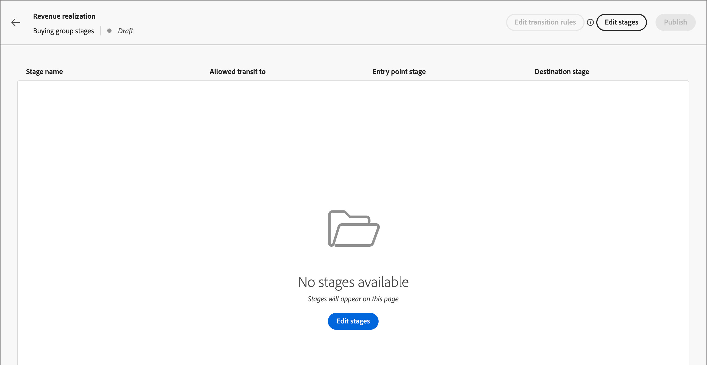
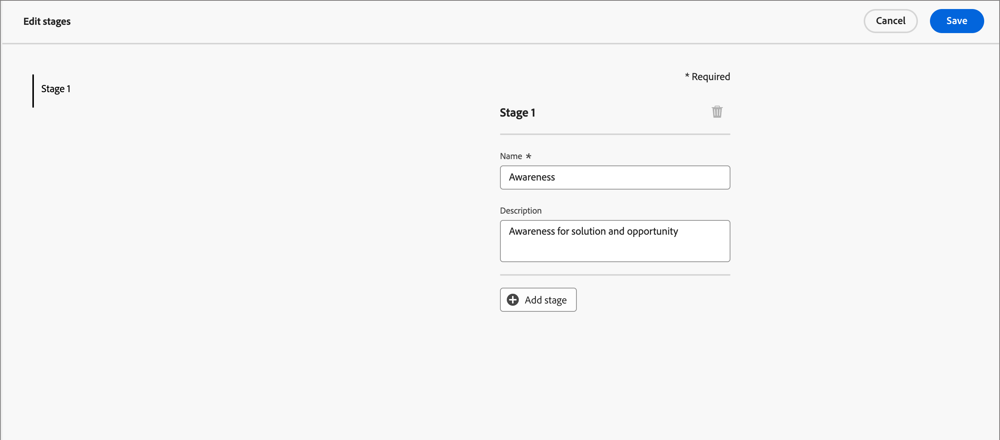

# Käufergruppenphasen

Der Kauf von Gruppen-Bühnen dient dazu, das Fortschreiten von Einkaufsgruppen bei der Konvertierung von Chancen in Kunden zu verfolgen. Verwenden Sie diese Funktion, um den Fortschritt der Einkaufsgruppe zu verfolgen und die nächsten besten Aktionen für die Mitglieder der Gruppe zu ermitteln.

Definieren Sie die Phasen in einem Staging-Modell, definieren Sie mehrere Phasen und den Übergangsfluss zwischen ihnen. Eine oder mehrere Phasen sind für den Eintritt in den Lebenszyklus vorgesehen. Das Modell ermöglicht auch eine nicht-lineare Progression, bei der Sie Transitionen von einer Phase zu einer anderen angeben können, z. B. von Stufe A zu Stufe B, C oder D. Es ist erforderlich, dass eine Phase als Erfolgsphase bezeichnet wird, z. B. ein Kauf- oder ein unterzeichneter Vertrag. Es ist optional, dass eine andere Phase als Fehlerstufe bezeichnet wird, z. B. ein abgelehnter Vertrag oder der Kauf einer konkurrierenden Lösung bei einem anderen Anbieter.<!-- This is achieved through intelligent dashboards that show how buying groups are progressing in terms of completing a sale opportunity or converting an opportunity into a customer. -->

{width="800" zoomable="yes"}

## Definieren Sie das Bühnen-Modell für die Kaufgruppe

Erstellen und konfigurieren Sie ein Bühnen-Modell für eine Käufergruppe, indem Sie:

* Hinzufügen der Lebenszyklusphasen
* Definieren der Übergangsflüsse
* Einstiegs- und Zielphasen bestimmen

Es wird nur ein Modell unterstützt. Daher ist es wichtig, dass Sie alle Marketing- und Vertriebsteams zusammenarbeiten, um das optimale Modell für Ihr Unternehmen zu planen, bevor Sie es in Journey Optimizer B2B edition erstellen und veröffentlichen.<!-- Initially, only one stage model can be created, but future releases will support multiple stage models, allowing users to select which model to use in a journey. -->

Wenn Sie das Modell für die Kaufgruppenstufe erstellen, befindet es sich automatisch im Status _Entwurf_ und kann nicht gelöscht oder umbenannt werden. Dieser Status behält sich den Status vor, da Sie die Phasen definieren und den Übergangsfluss zwischen den Phasen konfigurieren. Wenn sich das Modell in einem veröffentlichten Status (_Live_) befindet, kann es nicht geändert werden.

### Modell erstellen

1. Navigieren Sie im linken Navigationsbereich zu **[!UICONTROL Konten]** > **[!UICONTROL Gruppen kaufen]**.

1. Wählen Sie auf der Seite &quot;Gruppen kaufen&quot;die Registerkarte **[!UICONTROL Phasen]** aus.

   {width="800" zoomable="yes"}

   Diese Registerkarte _[!UICONTROL Phasen]_ weist den Status _leer_ auf, bis Sie das Modell erstellen.

1. Klicken Sie in der Mitte der Seite auf **[!UICONTROL Modell erstellen]** .

1. Geben Sie im Dialogfeld die Werte **[!UICONTROL Name]** (erforderlich) und **[!UICONTROL Beschreibung]** (optional) für das Modell ein.

   {width="700" zoomable="yes"}

   Wenn Sie in diesem Dialogfeld auf _[!UICONTROL Abbrechen]_ klicken, kehren Sie zur Registerkarte _[!UICONTROL Phasen]_ mit dem Status _leer_ zurück.

1. Klicken Sie auf **[!UICONTROL Erstellen]**.

### Definieren der Phasen

Nachdem Sie das Modell erstellt haben, wird es im Arbeitsbereich geöffnet und Sie werden aufgefordert, die Phasen für das Modell zu erstellen.

1. Klicken Sie auf **[!UICONTROL Bühnen bearbeiten]**.

   {width="700" zoomable="yes"}

1. Definieren Sie den ersten Schritt durch Eingabe von **[!UICONTROL Name]** (erforderlich) und **[!UICONTROL Beschreibung]** (optional).

   {width="700" zoomable="yes"}

   Die Bühnen müssen nicht in einer bestimmten Reihenfolge hinzugefügt werden. Sie bestimmen jedoch, wie die Bühnen auf der Seite mit den Modelldetails aufgeführt werden. Bei der Definition der Übergangsregeln legen Sie die Einstiegsphase und den Fluss zwischen Phasen fest.

1. Klicken Sie auf **[!UICONTROL Schritt hinzufügen]** und wiederholen Sie Schritt 2, um eine weitere Phase zu definieren.

   Wiederholen Sie diesen Schritt, bis Sie die für das Modell erforderlichen Phasen haben.

   {width="700" zoomable="yes"}

1. Wenn Sie mit den von Ihnen definierten Phasen zufrieden sind, klicken Sie auf **[!UICONTROL Speichern]**.

   >[!IMPORTANT]
   >
   >**Nach dem Speichern der Kaufen-Gruppen-Bühnen können diese nicht entfernt werden.** Sie können jedoch den Namen und die Beschreibung für jede der Phasen ändern, solange das Modell den Status _Entwurf_ aufweist.

### Workflow- und Übergangsregeln konfigurieren

Nachdem Sie die Bühnen gespeichert haben, kehren Sie zum Modell-Arbeitsbereich zurück. Die Spalte _[!UICONTROL Zulässige Weiterleitung auf]_ ist leer, was bedeutet, dass die Übergangsregeln für die Modellphasen noch nicht definiert sind.

{width="700" zoomable="yes"}

Übergangsregeln bestimmen, wie eine Einkaufsgruppe von einer Phase zur anderen wechseln kann. Sie kann beispielsweise von einer Einstiegsphase zu einer mittleren Phase und von einer mittleren Phase zu verschiedenen anderen Phasen wechseln. Eine Einstiegsphase ist eine Anfangsphase, in der eine Einkaufsgruppe von einem leeren Status aus eintreten kann. Zielphasen werden als Erfolgs- oder Fehlerphasen klassifiziert.

1. Klicken Sie oben rechts auf **[!UICONTROL Übergangsregeln bearbeiten]** .

   Durch diese Aktion wird das Dialogfeld _[!UICONTROL Regeln für die Phase bearbeiten]_ geöffnet, in dem Sie die Logik für den Fluss definieren.

   Beim Festlegen der Optionen gibt es einige integrierte Limits und Nachrichten, die Ihnen helfen, logische Fehler im Fluss zu vermeiden. Sie können auf _[!UICONTROL Abbrechen]_ klicken, um das Dialogfeld zu schließen und ohne Änderungen zur Registerkarte _[!UICONTROL Phasen]_ zurückzukehren.

1. Geben Sie im Abschnitt _[!UICONTROL Phase auswählen]_ Start- und Endphasen für den Fluss an:

   * **[!UICONTROL Einstiegspunktstufe]** (erforderlich) - Legen Sie eine oder mehrere Einstiegsphasen für die Kaufgruppengelegenheit fest.

   * **[!UICONTROL Erfolgsphase]** (erforderlich) - Geben Sie die Phase an, die anzeigt, dass die Kaufgruppenoption erfolgreich ist (Ziel).

   * **[!UICONTROL Fehlerstufe]** (optional) - Geben Sie eine oder mehrere Phasen an, die darauf hinweisen, dass die Kaufgruppenoption einen Fehlerpunkt erreicht hat (Ziel).

   {width="700" zoomable="yes"}

1. Definieren Sie für jede Nicht-Ziel-Phase eine oder mehrere Phasen, die als Nächstes im Fluss (Übergang) folgen.

   Für alle Nicht-Ziel-Bühnen muss mindestens eine **[!UICONTROL Zugelassene Transition in]** -Phase ausgewählt sein. Andernfalls ist die Modelllogik nicht gültig und Konten können in diesem Stadium _hängenbleiben_ erhalten, ohne dass Fortschritte zu Erfolg oder Misserfolg erzielt werden können.

   {width="700" zoomable="yes"}

   Sie können optional eine Transition aus einer Fehlerphase angeben. Beispielsweise können Sie eine Phase mit dem Namen _Keine Antwort_ als Fehlerstufe festlegen. Sie können jedoch auch eine Phase mit dem Namen _Resurgence_ als mögliche Transition bezeichnen, um Fälle zu identifizieren, in denen ein ruhendes Konto reaktiviert wird.

1. Klicken Sie auf **[!UICONTROL Speichern]**.

   Wenn Sie zur Modelldetailseite zurückkehren, werden die Bühnen in einer Tabelle mit den zulässigen Transitionen sowie den Ziel- und Einstiegseigenschaften aufgeführt.

| Spalte | Beschreibung |
| ------ | ---------- |
| **[!UICONTROL Name der Bühne]** | Name der Bühne. Klicken Sie auf das Informationssymbol, um die Beschreibung der Bühne anzuzeigen. |
| **[!UICONTROL Zulässige Übertragung auf]** | Listet die Bühnen auf, die für eine _Verschieben nach_ -Aktion innerhalb des Modells gültig sind. |
| **[!UICONTROL Einstiegspunktstufe]** | Gibt an, ob die Bühne als Einstiegspunktstufe gültig ist ([!UICONTROL Ja] oder [!UICONTROL Nein]). |
| **[!UICONTROL Ziel]** | Gibt an, ob die Bühne als Zielbühne ([!UICONTROL Erfolg] oder [!UICONTROL Fehler]) festgelegt ist. |

{width="700" zoomable="yes"}

## Modell-Entwurf bearbeiten

Solange das Bühnen-Bühnen-Modell der Gruppe &quot;kauft&quot;den Status _Entwurf_ aufweist, können Sie die Bühnen und Übergangsregeln bearbeiten.

So zeigen Sie das Entwurfsmodell an:

1. Navigieren Sie im linken Navigationsbereich zu **[!UICONTROL Konten]** > **[!UICONTROL Gruppen kaufen]**.

1. Wählen Sie auf der Seite _Gruppen kaufen_ die Registerkarte **[!UICONTROL Phasen]** aus.

1. Klicken Sie auf den Modellnamen, um die Modelldetails zu öffnen.

### Ändern der Phasen im Modell

1. Klicken Sie auf **[!UICONTROL Bühnen bearbeiten]**.

   Im Dialogfeld _[!UICONTROL Phasen bearbeiten]_ können Sie neue Bühnen hinzufügen oder den Namen und die Beschreibung für bestehende Bühnen ändern.

   * Ändern Sie bei Bedarf den **[!UICONTROL Namen]** oder den **[!UICONTROL Beschreibung]** einer Bühne.

   * Scrollen Sie nach unten und klicken Sie auf **[!UICONTROL Phase hinzufügen]** , um bei Bedarf eine neue Phase für das Modell zu definieren.

1. Wenn Sie mit den von Ihnen definierten Phasen zufrieden sind, klicken Sie auf **[!UICONTROL Speichern]**.

   Sie können auch auf _[!UICONTROL Abbrechen]_ klicken, um das Dialogfeld zu schließen und ohne Änderungen zur Modelldetailseite zurückzukehren.

### Bearbeiten der Übergangsregeln für das Modell

1. Klicken Sie auf **[!UICONTROL Übergangsregeln bearbeiten]**.

1. Ändern Sie im Dialogfeld _Regeln für die Phase bearbeiten_ die Flussoptionen nach Bedarf.

   Weitere Informationen zu diesen Optionen und wie sie sich auf den Modellfluss auswirken, finden Sie unter [Konfigurieren des Workflows und der Übergangsregeln](#configure-the-workflow-and-transition-rules) .

1. Wenn Sie mit den definierten Übergangsregeln zufrieden sind, klicken Sie auf **[!UICONTROL Speichern]**.

   Sie können auch auf _[!UICONTROL Abbrechen]_ klicken, um das Dialogfeld zu schließen und ohne Änderungen zur Modelldetailseite zurückzukehren.

## Publish des Bühnen-Bühnen-Modells für die Käufe

Wenn keine Validierungsfehler vorliegen, kann das Modell veröffentlicht werden. Nach der Veröffentlichung ändert sich der Status in den Status _Live_ und kann verwendet werden, um in Konto-Journey zu Käufergruppenphasen zu gelangen.

>[!IMPORTANT]
>
>**Nach der Veröffentlichung des Modells kann es weder aktualisiert noch gelöscht werden.** Stellen Sie sicher, dass das, was Sie haben, korrekt ist, bevor Sie das Modell veröffentlichen.

1. Überprüfen Sie die definierten Phasen und Transitionen sorgfältig.

   Wenn Änderungen erforderlich sind, bearbeiten Sie die Modellphasen.

1. Klicken Sie auf **[!UICONTROL Veröffentlichen]**.

1. Klicken Sie im Bestätigungsdialogfeld auf **[!UICONTROL Publish]**.

   Mit der Rückkehr zur Modelldetailseite wird das Modell als _[!UICONTROL Live]_ gekennzeichnet. Klicken Sie oben links auf den Pfeil _Zurück_ , um zur Seite mit der Registerkarte _[!UICONTROL Phasen]_ zurückzukehren.

{width="700" zoomable="yes"}
<!-- list these later when the Published columns are working correctly

Columns - Name, Status, Created by, Created date, Last updated by, Last update, Published by, Published on.
Name - Name of the stage model, hyperlinked. Clicking on it will navigate to the stage inventory page. 
Info icon beside the name - display the description on click.
Status - Live, Draft. If a draft stage model is Published, then its status is updated to Live. -->

## Verwenden des Modells in Konto-Journey

Wenn das Modell der Kaufphasen den Status &quot;_Live_&quot;(veröffentlicht) aufweist, fügen Sie das Modell den Lösungsinteressen hinzu, in denen Sie es zur Verfolgung des Kaufgruppenfortschritts verwenden möchten. In Ihren Journey-Konto können Sie Aktionen einbeziehen, um Konten in eine bestimmte Phase zu überführen, und Statusübergänge als Ereignisse hinzufügen, die bestimmen, wie sich Konten durch die Journey bewegen.

### Interessenvertretung der Lösung

Öffnen Sie für jede vorhandene Lösungsinteraktion, bei der Sie das Bühnen-Modell für die Käufe-Gruppe verknüpfen möchten, die Details der Lösungsinteressen und fügen Sie das Modell hinzu. Sie können das Modell auch zu den Eigenschaften hinzufügen, wenn Sie [ein Lösungsinteresse erstellen](./solution-interests.md#create-a-solution-interest).

1. Wählen Sie die Registerkarte _[!UICONTROL Lösungsinteresse]_ aus.

1. Öffnen Sie das Lösungsinteresse mit einer der folgenden Methoden, um die Eigenschaften für das Lösungsinteresse zu öffnen, das Sie bearbeiten möchten:

   * Klicken Sie auf den Namen des Lösungsinteresses.
   * Klicken Sie auf die Auslassungspunkte (**...**) daneben und wählen Sie **[!UICONTROL Bearbeiten]**.

   {width="500" zoomable="no"}

1. Wählen Sie das **[!UICONTROL Modell für die Buying group stage]** aus, um die Statusprogression der Gruppe zu verwenden (optional).

   {width="700" zoomable="yes"}

1. Ändern Sie bei Bedarf die Einstellung **[!UICONTROL Vorhandene Einkaufsgruppen aktualisieren]** .

   Wenn diese Option aktiviert ist, werden alle vorhandenen Einkaufsgruppen, die mit den Lösungsinteressen gepaart werden, über den 24-Stunden-Synchronisierungszyklus aktualisiert.

1. Klicken Sie auf **[!UICONTROL Speichern]**.

### Geteilte Pfade

Mithilfe eines [Aufspaltungspfadknotens](../journeys/journey-nodes.md#split-paths) können Sie auf Kontoebene oder auf der Personenebene nach den Kaufgruppenstufen filtern. Fügen Sie beispielsweise beim Aufteilen von Pfaden durch ein Mitglied einer Gruppe eine Phase der Gruppe &quot;Kauf&quot;als Pfadbedingung hinzu.

>[!BEGINTABS]

>[!TAB Kontoebene]

1. Öffnen Sie die Konto-Journey im Editor.

1. Klicken Sie auf das Pluszeichen ( **+** ) auf einem Pfad und wählen Sie **[!UICONTROL Geteilte Pfade]** aus.

   {width="300"}

1. Wählen Sie in den Knoteneigenschaften auf der rechten Seite **[!UICONTROL Konten]** für die Aufteilung aus.

1. Um eine Bedingung für _[!UICONTROL Pfad 1]_ zu definieren, klicken Sie auf **[!UICONTROL Bedingung anwenden]**.

   {width="500"}

1. Fügen Sie im Bedingungseditor den Käufergruppenfilter hinzu, um den Aufspaltungspfad zu definieren.

   * Erweitern Sie links unten den Eintrag **[!UICONTROL Sonderfilter]** und ziehen Sie das Attribut **[!UICONTROL Hat Einkaufsgruppe]** in den Filterarbeitsbereich.

   * Setzen Sie die **[!UICONTROL Lösungsinteressen]** auf einen Wert, der mit dem Bühnen-Modell der Einkaufsgruppe verknüpft ist.

   * Klicken Sie auf **[!UICONTROL Beschränkung hinzufügen]** und wählen Sie **[!UICONTROL Kaufen der Gruppenphase]**.

     {width="700" zoomable="yes"}

   * Klicken Sie auf **[!UICONTROL Fertig]**.

   Der Aufspaltungspfad wird in den Knoteneigenschaften auf der rechten Seite definiert.

   {width="600" zoomable="yes"}

1. Definieren Sie weitere Pfade für den geteilten Knoten und speichern Sie die Journey.

>[!TAB Personenebene]

1. Öffnen Sie die Konto-Journey im Editor.

1. Klicken Sie auf das Pluszeichen ( **+** ) auf einem Pfad und wählen Sie **[!UICONTROL Geteilte Pfade]** aus.

   {width="300"}

1. Wählen Sie in den Knoteneigenschaften auf der rechten Seite **[!UICONTROL Personen]** für die Aufteilung aus.

   Behalten Sie für das für Bedingungen verwendete Attribut _[!UICONTROL Attribut]_ den Standardwert **[!UICONTROL Nur Personenattribute]** bei.

1. Um eine Bedingung für _[!UICONTROL Pfad 1]_ zu definieren, klicken Sie auf **[!UICONTROL Bedingung anwenden]**.

   {width="500"}

1. Fügen Sie im Bedingungseditor den Käufergruppenfilter hinzu, um den Aufspaltungspfad zu definieren.

   * Erweitern Sie links unten den Eintrag **[!UICONTROL Sonderfilter]** und ziehen Sie das Attribut **[!UICONTROL Mitglied der Buying Group]** in den Filterarbeitsbereich.

   * Setzen Sie die **[!UICONTROL Lösungsinteressen]** auf einen Wert, der mit dem Bühnen-Modell der Einkaufsgruppe verknüpft ist.

   * Klicken Sie auf **[!UICONTROL Beschränkung hinzufügen]** und wählen Sie **[!UICONTROL Kaufen der Gruppenphase]**.

     {width="700" zoomable="yes"}

   * Klicken Sie auf **[!UICONTROL Fertig]**.

   Der Aufspaltungspfad wird in den Knoteneigenschaften auf der rechten Seite definiert.

   {width="600" zoomable="yes"}

1. Definieren Sie weitere Pfade für den geteilten Knoten und speichern Sie die Journey.

>[!ENDTABS]

### Aktualisieren der Kontoaktivität für die Phase des Einkaufs

Mithilfe eines [Konto-Aktionsknotens](../journeys/journey-nodes.md#add-an-account-action) können Sie die Phase der Gruppe &quot;Einkauf&quot;aktualisieren. Die Definition dieses Knotens umfasst die Auswahl der Lösungsinteressen und die Definition der neuen Phase für die Kaufgruppe.

>[!NOTE]
>
>Wenn die neue Phase keine gültige Transition ist (wie im Modell definiert), wird die Aktion nicht auf das Konto angewendet.

1. Öffnen Sie die Konto-Journey im Editor.

1. Klicken Sie auf das Pluszeichen ( **+** ) auf einem Pfad und wählen Sie **[!UICONTROL Aktion durchführen]**.

   {width="400"}

1. Wählen Sie in den Knoteneigenschaften auf der rechten Seite **[!UICONTROL Konten]** für die Aktion.

1. Definieren Sie die Aktion, um die Phase der Gruppe zu aktualisieren.

   * Wählen Sie für **[!UICONTROL Aktion für Konten]** die Option **[!UICONTROL Buying Group Stage aktualisieren]**.

   * Wählen Sie für **[!UICONTROL Lösungsinteresse auswählen]** eine Lösung aus, die mit dem Bühnen-Modell für die Kaufgruppe verknüpft ist.

   * Wählen Sie für **[!UICONTROL Neue Phase]** die Phase aus, um das Konto zu übertragen.

   Die Aktion wird in den Knoteneigenschaften auf der rechten Seite definiert.

   {width="600" zoomable="yes"}

1. Nehmen Sie weitere Änderungen vor und speichern Sie die Journey.

### Kontoereignis

Verwenden Sie das Vorkommen einer Änderung in der Phase der Käufe einer Gruppe, um das Konto in den nächsten Schritt der Journey zu verschieben. Das Definieren dieses Knotens umfasst die Auswahl der Lösungsinteressen und zusätzlicher Begrenzungen, um den Ereignis-Trigger zu erfüllen.

1. Öffnen Sie die Konto-Journey im Editor.

1. Klicken Sie auf das Pluszeichen ( **+** ) auf einem Pfad und wählen Sie **[!UICONTROL Nach einem Ereignis suchen]**.

   {width="400"}

1. Wählen Sie in den Knoteneigenschaften auf der rechten Seite **[!UICONTROL Konten]** für den Ereignistyp aus.

1. Wählen Sie für **[!UICONTROL Kontoereignis auswählen]** die Option **[!UICONTROL Änderung in der Käufergruppenphase]**.

1. Klicken Sie auf **[!UICONTROL Ereignis bearbeiten]** und definieren Sie Details für das Ereignis.

   * Prüfen Sie für **[!UICONTROL Lösungsinteressen]** die Bedingung für ein Lösungsinteresse, das mit dem Bühnen-Modell für die Kaufgruppe verknüpft ist.

   * Klicken Sie auf **[!UICONTROL Beschränkung hinzufügen]** und wählen Sie die Änderung der Kaufgruppenstufe aus, die Sie zum Auslösen des Ereignisses verwenden möchten.

     {width="700" zoomable="yes"}

   * Klicken Sie auf **[!UICONTROL Fertig]**.

   Das Ereignis wird in den Knoteneigenschaften auf der rechten Seite definiert.

   {width="700" zoomable="yes"}

1. Nehmen Sie weitere Änderungen vor und speichern Sie die Journey.
