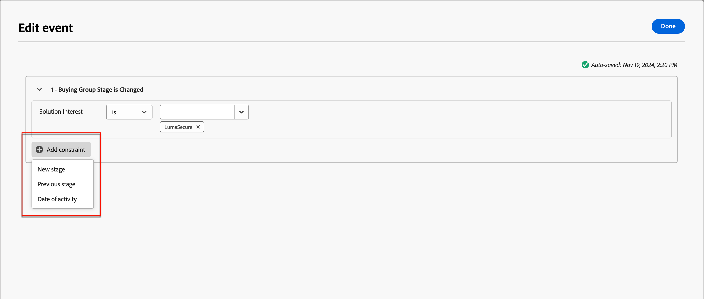

# Käufergruppenphasen

Die Stadien der Einkaufsgruppen verfolgen den Fortschritt der Einkaufsgruppen bei der Konvertierung von Opportunities in Kunden. Verwenden Sie diese Funktion, um den Fortschritt der Einkaufsgruppe zu verfolgen und die nächsten besten Aktionen für Mitglieder der Einkaufsgruppe zu identifizieren.

Definieren Sie die Phasen innerhalb eines einzelnen Staging-Modells, indem Sie mehrere Phasen und den Übergangsfluss zwischen ihnen definieren. Eine oder mehrere Phasen sind für den Eintritt in den Lebenszyklus vorgesehen. Das Modell ermöglicht auch eine nichtlineare Progression, bei der Sie Übergänge von einem Stadium zu einem anderen angeben können, z. B. von Stadium A zu Stadium B, C oder D. Es ist erforderlich, dass ein Schritt als Erfolgsschritt gekennzeichnet wird, z. B. ein Kauf oder ein unterzeichneter Vertrag. Es ist optional, dass eine weitere Phase als Ausfallphase eingestuft wird, z. B. ein abgelehnter Vertrag oder der Kauf einer konkurrierenden Lösung von einem anderen Anbieter. Erreicht wird dies durch [intelligente Dashboards](../dashboards/intelligent-dashboard.md) die zeigen, wie Einkaufsgruppen in Bezug auf den Abschluss einer Verkaufschance oder die Umwandlung einer Opportunity in einen Kunden vorankommen.

{width="800" zoomable="yes"}

{width="30"} [Videoüberblick ansehen](#overview-video)

## Definieren des Modells für Einkaufsgruppenstufen

Sie erstellen und konfigurieren ein Einkaufsgruppenstufenmodell, indem Sie:

* Hinzufügen der Lebenszyklusphasen
* Transitionsflüsse definieren
* Bestimmung der Eingangs- und Zielstadien

Es wird nur ein Modell unterstützt. Daher ist es wichtig, dass Sie in allen Marketing- und Vertriebsteams an der Planung des optimalen Modells für Ihr Unternehmen arbeiten, bevor Sie es in Journey Optimizer B2B edition erstellen und veröffentlichen.<!-- Initially, only one stage model can be created, but future releases will support multiple stage models, allowing users to select which model to use in a journey. -->

Wenn Sie das Einkaufsgruppenstufenmodell erstellen, befindet es sich automatisch im Status _Entwurf_ und kann nicht gelöscht oder umbenannt werden. Er verbleibt in diesem Status, wenn Sie die Phasen definieren und den Übergangsfluss zwischen den Phasen konfigurieren. Wenn sich das Modell im Status Veröffentlicht _Live_ befindet, kann es nicht geändert werden.

### Modell erstellen

1. Navigieren Sie in der linken Navigation zu **[!UICONTROL Konten]** > **[!UICONTROL Einkaufsgruppen]**.

1. Wählen Sie auf der Seite Einkaufsgruppen die Registerkarte **[!UICONTROL Phasen]** aus.

   {width="800" zoomable="yes"}

   Diese _[!UICONTROL Schritte]_ befindet sich in einem _leeren_ Status, bis Sie das Modell erstellen.

1. Klicken Sie **[!UICONTROL Modell erstellen]** in der Mitte der Seite.

1. Geben Sie im Dialogfeld „Name **[!UICONTROL (]**) und &quot;**[!UICONTROL &quot; (optional]** für das Modell ein.

   {width="700" zoomable="yes"}

   Wenn Sie in _[!UICONTROL Dialogfeld auf]_&#x200B;_[!UICONTROL Abbrechen“ klicken, kehren Sie in einem]_ leeren _zur Registerkarte_ Phasen“ zurück.

1. Klicken Sie auf **[!UICONTROL Erstellen]**.

### Stadien definieren

Nachdem Sie das Modell erstellt haben, wird es im Arbeitsbereich geöffnet, und Sie werden aufgefordert, die Stadien für das Modell zu erstellen.

1. Klicken Sie **[!UICONTROL Stadien bearbeiten]**.

   {width="700" zoomable="yes"}

1. Definieren Sie den ersten Schritt, indem Sie **[!UICONTROL Name]** (erforderlich) und **[!UICONTROL Beschreibung]** (optional) eingeben.

   {width="700" zoomable="yes"}

   Die Stadien müssen nicht in einer bestimmten Reihenfolge hinzugefügt werden, aber es bestimmt, wie die Stadien auf der Seite mit den Modelldetails aufgeführt werden. Beim Definieren der Übergangsregeln bestimmen Sie die Einstiegsphase und den Fluss zwischen den Phasen.

1. Klicken Sie **[!UICONTROL Phase hinzufügen]** und wiederholen Sie Schritt 2, um einen weiteren Schritt zu definieren.

   Wiederholen Sie diesen Schritt, bis Sie die für das Modell erforderlichen Schritte festgelegt haben.

   {width="700" zoomable="yes"}

1. Wenn Sie mit den von Ihnen definierten Phasen zufrieden sind, klicken Sie auf **[!UICONTROL Speichern]**.

   >[!IMPORTANT]
   >
   >**Nach dem Speichern der Einkaufsgruppenphasen können diese nicht mehr entfernt werden.** Sie können jedoch den Namen und die Beschreibung für jede der Phasen ändern, solange das Modell im Status _Entwurf_ bleibt.

### Konfigurieren des Workflows und der Übergangsregeln

Nachdem Sie die Stadien gespeichert haben, werden Sie zum Modellarbeitsbereich zurückgeleitet. Die Spalte _[!UICONTROL Zulässiger Transit an]_ ist leer. Dies bedeutet, dass die Übergangsregeln für die Modellphasen noch nicht definiert sind.

{width="700" zoomable="yes"}

Übergangsregeln bestimmen, wie eine Einkaufsgruppe von einem Stadium zu einem anderen wechseln kann. Sie kann beispielsweise von einer Einstiegsphase in eine Mittelphase und von einer Mittelphase in verschiedene andere Phasen übergehen. Eine Einstiegsphase ist eine Anfangsphase, in die eine Einkaufsgruppe aus einem leeren Status eintreten kann. Zielphasen werden als Erfolgs- oder Fehlerphasen klassifiziert.

1. Klicken **[!UICONTROL oben]** auf „Übergangsregeln bearbeiten“.

   Diese Aktion öffnet das _[!UICONTROL Stufenregeln bearbeiten]_ Dialogfeld, in dem Sie die Logik für den Fluss definieren.

   Wenn Sie die Optionen festlegen, gibt es einige integrierte Leitplanken und Messaging, mit denen Sie vermeiden können, dass im Fluss Logikfehler auftreten. Sie können auf _[!UICONTROL Abbrechen]_ klicken, um das Dialogfeld zu schließen und zur Registerkarte _[!UICONTROL Phasen]_ ohne Änderungen zurückzukehren.

1. Definieren _[!UICONTROL im Abschnitt „Phase]_&quot; die Anfangs- und Endphasen für den Fluss:

   * **[!UICONTROL Einstiegspunkt-Phase]** (erforderlich) - Bestimmen Sie eine oder mehrere Einstiegsphasen für die Einkaufsgruppen-Opportunity.

   * **[!UICONTROL Erfolgsstufe]** (erforderlich) - Bestimmt den Schritt, der anzeigt, dass die Einkaufsgruppenchance erfolgreich ist (Ziel).

   * **[!UICONTROL Fehlerstufe]** (optional) - Bestimmen Sie eine oder mehrere Phasen, die anzeigen, dass die Kaufgruppenchance einen Fehlerpunkt (Ziel) erreicht hat.

   {width="700" zoomable="yes"}

1. Definieren Sie für jede Nicht-Ziel-Phase eine oder mehrere Phasen, die im Fluss (Übergang) als Nächstes kommen.

   Für alle Nicht-Zielphasen muss mindestens eine Phase **[!UICONTROL Zulässiger Transit zu]** ausgewählt sein. Andernfalls ist die Modelllogik nicht gültig und Konten können in diesem Stadium _stecken_ ohne Möglichkeit, zu Erfolg oder Misserfolg zu gelangen.

   {width="700" zoomable="yes"}

   Sie können optional eine Transition aus einer Fehlerphase angeben. Beispielsweise können Sie eine Phase mit dem Namen _Keine Antwort_ als Fehlerphase festlegen. Bestimmen Sie jedoch auch eine Phase mit dem Namen _Resurgence_ als möglichen Übergang, um Fälle zu identifizieren, in denen ein inaktives Konto reaktiviert wird.

1. Klicken Sie auf **[!UICONTROL Speichern]**.

   Mit der Rückkehr zur Seite mit Modelldetails werden die Phasen in einer Tabelle mit den zulässigen Transitionen sowie den Ziel- und Eingabeeigenschaften aufgeführt.

| Spalte | Beschreibung |
| ------ | ---------- |
| **[!UICONTROL Name des Stadiums]** | Name der Phase. Klicken Sie auf das Informationssymbol, um die Beschreibung für die Phase anzuzeigen. |
| **[!UICONTROL Transit zugelassen für]** | Listet die Stadien auf, die für eine _Verschieben nach_-Aktion im Modell gültig sind. |
| **[!UICONTROL Einstiegspunkt-Stadium]** | Gibt an, ob die Phase als Einstiegspunktphase gültig ist ([!UICONTROL Ja] oder [!UICONTROL Nein]). |
| **[!UICONTROL Ziel]** | Gibt an, ob die Phase als Zielphase gekennzeichnet ist ([!UICONTROL Erfolg] oder [!UICONTROL Fehler]). |

{width="700" zoomable="yes"}

## Bearbeiten eines Entwurfsmodells

Solange das Modell der kaufenden Gruppenphasen im Status _Entwurf_ bleibt, können Sie die Stadien und Übergangsregeln bearbeiten.

_Anzeigen des Entwurfsmodells :_

1. Navigieren Sie in der linken Navigation zu **[!UICONTROL Konten]** > **[!UICONTROL Einkaufsgruppen]**.

1. Wählen Sie auf _Seite_ die Registerkarte **[!UICONTROL Phasen]** aus.

1. Klicken Sie auf den Modellnamen, um die Modelldetails zu öffnen.

### Stadien im Modell ändern

1. Klicken Sie **[!UICONTROL Stadien bearbeiten]**.

   Im Dialogfeld _[!UICONTROL Stadien bearbeiten]_ können Sie neue Stadien hinzufügen oder den Namen und die Beschreibung für vorhandene Stadien ändern.

   * Ändern Sie **[!UICONTROL Name]** oder **[!UICONTROL Beschreibung]** eines beliebigen Schritts nach Bedarf.

   * Scrollen Sie nach unten und klicken Sie auf **[!UICONTROL Phase hinzufügen]**, um bei Bedarf einen neuen Schritt für das Modell zu definieren.

1. Wenn Sie mit den von Ihnen definierten Phasen zufrieden sind, klicken Sie auf **[!UICONTROL Speichern]**.

   Sie können auch auf _[!UICONTROL Abbrechen]_ klicken, um das Dialogfeld zu schließen und ohne Änderungen zur Modelldetailseite zurückzukehren.

### Übergangsregeln für das Modell bearbeiten

1. Klicken Sie **[!UICONTROL Übergangsregeln bearbeiten]**.

1. Ändern Sie _Dialogfeld &quot;_ bearbeiten“ die Flussoptionen nach Bedarf.

   Weitere [ zu diesen Optionen und deren Auswirkungen auf den Modellfluss finden ](#configure-the-workflow-and-transition-rules) unter „Konfigurieren des Workflows und der Übergangsregeln“.

1. Wenn Sie mit den definierten Übergangsregeln zufrieden sind, klicken Sie auf **[!UICONTROL Speichern]**.

   Sie können auch auf _[!UICONTROL Abbrechen]_ klicken, um das Dialogfeld zu schließen und ohne Änderungen zur Modelldetailseite zurückzukehren.

## Veröffentlichen des Modells für Einkaufsgruppenstufen

Wenn keine Validierungsfehler vorliegen, kann das Modell veröffentlicht werden. Wenn er veröffentlicht wird, wechselt er in einen _Live_-Status und kann verwendet werden, um den Kauf von Gruppenphasen in Account Journey voranzutreiben.

>[!IMPORTANT]
>
>**Nachdem das Modell veröffentlicht wurde, kann es weder aktualisiert noch gelöscht werden.** Vergewissern Sie sich vor der Veröffentlichung des Modells, dass Sie über die richtigen Informationen verfügen.

1. Überprüfen Sie die definierten Stadien und Transitionen sorgfältig.

   Wenn Überarbeitungen erforderlich sind, bearbeiten Sie die Modellphasen.

1. Klicken Sie auf **[!UICONTROL Veröffentlichen]**.

1. Klicken Sie im Bestätigungsdialogfeld auf **[!UICONTROL Veröffentlichen]**.

   Wenn Sie zur Seite mit Modelldetails zurückkehren, wird das Modell als _[!UICONTROL Live]_ gekennzeichnet. Klicken Sie oben links auf _Zurück_-Pfeil, um zur Registerkarte _[!UICONTROL Phasen]_ zurückzukehren.

{width="700" zoomable="yes"}
<!-- list these later when the Published columns are working correctly

Columns - Name, Status, Created by, Created date, Last updated by, Last update, Published by, Published on.
Name - Name of the stage model, hyperlinked. Clicking on it will navigate to the stage inventory page. 
Info icon beside the name - display the description on click.
Status - Live, Draft. If a draft stage model is Published, then its status is updated to Live. -->

## Löschen des Modells der Einkaufsgruppenstufen

Sie können das Modell der Käufergruppenphasen löschen, wenn es sich im Status „Entwurf“ oder „Veröffentlicht“ befindet. Wenn sie veröffentlicht (live) ist, können Sie sie nur löschen, wenn sie nicht mit einer Interessenslösung verbunden ist.

1. Navigieren Sie in der linken Navigation zu **[!UICONTROL Konten]** > **[!UICONTROL Einkaufsgruppen]**.

1. Wählen Sie auf _Seite_ die Registerkarte **[!UICONTROL Phasen]** aus.

1. Klicken Sie auf das _Mehr_-Menüsymbol (**…**) neben dem Namen des Stadien-Modells und wählen Sie **[!UICONTROL Löschen]**.

   {width="700"}

1. Klicken Sie im Dialogfeld zur Bestätigung **[!UICONTROL Löschen]**.

## Modell in Account-Journey verwenden

Wenn sich das Modell der Kaufphase im Status _Live_ (veröffentlicht) befindet, fügen Sie das Modell zu den Lösungsinteressen hinzu, in denen Sie es zur Verfolgung des Kaufgruppenfortschritts verwenden möchten. In Ihren Account-Journey können Sie Aktionen einbeziehen, um Accounts in ein bestimmtes Stadium zu überführen und Stadienübergänge als hinzuzufügen, die bestimmen, wie Accounts das Journey durchlaufen.

### Interessenverband der Lösung

Öffnen Sie für jedes vorhandene Lösungsinteresse, dem Sie das Modell der Einkaufsgruppenstufen zuordnen möchten, die Lösungsinteressendetails und fügen Sie das Modell hinzu. Sie können das Modell auch zu den Eigenschaften hinzufügen, wenn Sie [Interesse an einer Lösung erstellen](./solution-interests.md#create-a-solution-interest).

1. Wählen Sie die Registerkarte _[!UICONTROL Lösungsinteresse]_ aus.

1. Öffnen Sie die Interessenslösung mit einer der folgenden Methoden, um die Eigenschaften für die Interessenslösung zu öffnen, die Sie bearbeiten möchten:

   * Klicken Sie auf den Namen des Lösungsinteresses.
   * Klicken Sie auf das Auslassungszeichen (**…**) daneben und wählen Sie **[!UICONTROL Bearbeiten]**.

   {width="500" zoomable="no"}

1. Wählen Sie das **[!UICONTROL Modell „Gruppenphase kaufen]**, um die Progression für den Gruppenschritt des Kaufs zu verwenden (optional).

   {width="700" zoomable="yes"}

1. Ändern Sie bei Bedarf die Einstellung **[!UICONTROL Vorhandene Einkaufsgruppen aktualisieren]**.

   Wenn diese Option aktiviert ist, werden alle vorhandenen Einkaufsgruppen, die mit dem Lösungsinteresse gepaart sind, über den 24-stündigen Synchronisierungszyklus aktualisiert.

1. Klicken Sie auf **[!UICONTROL Speichern]**.

### Pfade aufteilen

Mit einem [Split-Pfadknoten](../journeys/journey-nodes.md#split-paths) können Sie nach Kaufgruppenschritten auf Konto- oder Personenebene filtern. Fügen Sie beispielsweise eine Einkaufsgruppenstufe als Pfadbedingung hinzu, wenn Sie Pfade durch ein gekauftes Gruppenmitglied aufteilen.

>[!BEGINTABS]

>[!TAB Kontoebene]

1. Öffnen Sie die Konto-Journey im Editor.

1. Klicken Sie auf das Pluszeichen ( **+** ) auf einem Pfad und wählen Sie **[!UICONTROL Pfade aufteilen]**.

   {width="300"}

1. Wählen Sie in den Knoteneigenschaften auf der rechten Seite **[!UICONTROL Konten]** für die Aufspaltung aus.

1. Um eine Bedingung zu definieren, die für _[!UICONTROL Pfad 1]_ gilt, klicken Sie auf **[!UICONTROL Bedingung anwenden]**.

   {width="500"}

1. Fügen Sie im Bedingungseditor den Filter Einkaufsgruppe hinzu, um den Aufspaltungspfad zu definieren.

   * Erweitern Sie auf der linken Seite unten **[!UICONTROL Sonderfilter]** und ziehen Sie das Attribut **[!UICONTROL Hat Einkaufsgruppe]** in den Filterarbeitsbereich.

   * Legen Sie **[!UICONTROL Interesse an der Lösung]** auf einen Wert fest, der mit dem Modell der Einkaufsgruppenstufen verknüpft ist.

   * Klicken Sie **[!UICONTROL Begrenzung hinzufügen]** und wählen Sie **[!UICONTROL Gruppenphase kaufen]**.

     {width="700" zoomable="yes"}

   * Klicken Sie auf **[!UICONTROL Fertig]**.

   Der Aufspaltungspfad wird in den Knoteneigenschaften auf der rechten Seite definiert.

   {width="600" zoomable="yes"}

1. Fahren Sie mit dem Definieren anderer Pfade für den Aufspaltungsknoten fort und speichern Sie die Journey.

>[!TAB Personen-Ebene]

1. Öffnen Sie die Konto-Journey im Editor.

1. Klicken Sie auf das Pluszeichen ( **+** ) auf einem Pfad und wählen Sie **[!UICONTROL Pfade aufteilen]**.

   {width="300"}

1. Wählen Sie in den Knoteneigenschaften auf der rechten Seite **[!UICONTROL Personen]** für die Teilung aus.

   Belassen Sie den Standardwert für _[!UICONTROL Attribut für Bedingungen]_ auf **[!UICONTROL Nur Personenattribute]**.

1. Um eine Bedingung zu definieren, die für _[!UICONTROL Pfad 1]_ gilt, klicken Sie auf **[!UICONTROL Bedingung anwenden]**.

   {width="500"}

1. Fügen Sie im Bedingungseditor den Filter Einkaufsgruppe hinzu, um den Aufspaltungspfad zu definieren.

   * Erweitern Sie auf der linken Seite unten **[!UICONTROL Sonderfilter]** und ziehen Sie das **[!UICONTROL Mitglied der Kaufgruppe]** auf den Filterarbeitsbereich.

   * Legen Sie **[!UICONTROL Interesse an der Lösung]** auf einen Wert fest, der mit dem Modell der Einkaufsgruppenstufen verknüpft ist.

   * Klicken Sie **[!UICONTROL Begrenzung hinzufügen]** und wählen Sie **[!UICONTROL Gruppenphase kaufen]**.

     {width="700" zoomable="yes"}

   * Klicken Sie auf **[!UICONTROL Fertig]**.

   Der Aufspaltungspfad wird in den Knoteneigenschaften auf der rechten Seite definiert.

   {width="600" zoomable="yes"}

1. Fahren Sie mit dem Definieren anderer Pfade für den Aufspaltungsknoten fort und speichern Sie die Journey.

>[!ENDTABS]

### Aktion für Einkaufsgruppen-Staging-Konto aktualisieren

Mit einem [Kontoaktionsknoten](../journeys/journey-nodes.md#add-an-account-action) können Sie die Phase der Einkaufsgruppe aktualisieren. Die Definition dieses Knotens umfasst die Auswahl des Lösungsinteresses und die Definition der neuen Phase für die Einkaufsgruppe.

>[!NOTE]
>
>Wenn die neue Phase keine gültige Transition (wie im Modell definiert) ist, wird die Aktion nicht auf das Konto angewendet.

1. Öffnen Sie die Konto-Journey im Editor.

1. Klicken Sie auf das Pluszeichen ( **+** ) auf einem Pfad und wählen Sie **[!UICONTROL Aktion ausführen]**.

   {width="400"}

1. Wählen Sie in den Knoteneigenschaften auf der rechten Seite **[!UICONTROL Konten]** für die Aktion aus.

1. Definieren Sie die Aktion, um die Einkaufsgruppenphase zu aktualisieren.

   * Wählen Sie **[!UICONTROL Aktion für Konten]** die Option **[!UICONTROL Einkaufsgruppenstufe aktualisieren]**.

   * Wählen **[!UICONTROL unter „Interesse an Lösung]**&quot; eine Option aus, die mit dem Modell der Einkaufsgruppenstufen verknüpft ist.

   * Wählen **[!UICONTROL unter „Neues]**&quot; das Stadium aus, in das das Konto übergegangen werden soll.

   Die Aktion wird in den Knoteneigenschaften auf der rechten Seite definiert.

   {width="600" zoomable="yes"}

1. Nehmen Sie weitere Änderungen vor und speichern Sie die Journey.

### Kontoereignis

Verwenden Sie den Eintritt einer Kaufgruppen-Stadienänderung, um das Konto mit dem nächsten Schritt im Journey fortzufahren. Die Definition dieses Knotens umfasst die Auswahl des Lösungsinteresses und zusätzliche Einschränkungen, um den Ereignis-Trigger zu erfüllen.

1. Öffnen Sie die Konto-Journey im Editor.

1. Klicken Sie auf das Pluszeichen ( **+** ) in einem Pfad und wählen Sie **[!UICONTROL Auf ein Ereignis überwachen]**.

   {width="400"}

1. Wählen Sie in den Knoteneigenschaften auf der rechten Seite **[!UICONTROL Ereignistyp]** Konten“ aus.

1. Wählen **[!UICONTROL für &quot;]** auswählen“ die Option **[!UICONTROL Änderung in Einkaufsgruppenstufe]**.

1. Klicken Sie **[!UICONTROL Ereignis bearbeiten]** und definieren Sie Details für das Ereignis.

   * Für **[!UICONTROL Lösungsinteresse]** müssen Sie die Bedingung für ein Lösungsinteresse abgleichen, das mit dem Kaufgruppen-Stufenmodell verknüpft ist.

   * Klicken Sie **[!UICONTROL Begrenzung hinzufügen]** und wählen Sie die Änderung der Einkaufsgruppenphase aus, die Sie zum Auslösen des Ereignisses verwenden möchten.

     {width="700" zoomable="yes"}

   * Klicken Sie auf **[!UICONTROL Fertig]**.

   Das Ereignis wird in den Knoteneigenschaften auf der rechten Seite definiert.

   {width="700" zoomable="yes"}

1. Nehmen Sie weitere Änderungen vor und speichern Sie die Journey.

## Übersichtsvideo

>[!VIDEO](https://video.tv.adobe.com/v/3448634/?learn=on)
