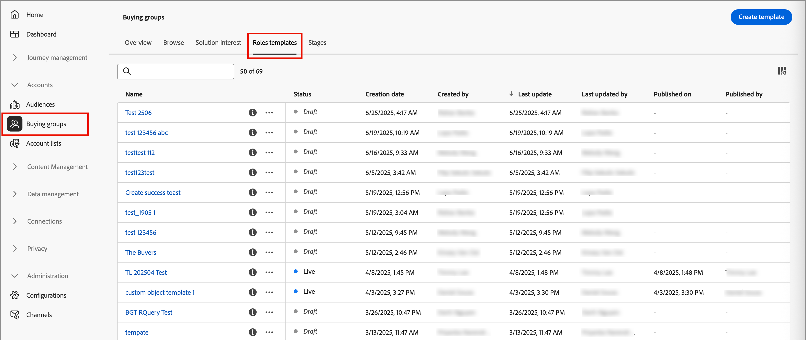

# Kaufen von Gruppenrollenvorlagen

Auf einem B2B-Markt werden Kaufentscheidungen in der Regel von mehreren Einzelpersonen getroffen. Diese Personen nehmen entsprechend ihrer Rolle innerhalb der Organisation am Entscheidungsprozess teil. Erstellen Sie Benutzerrollenvorlagen aus der Gruppe &quot;Buying Group&quot;, die diese Rollendefinitionen entsprechend dem jeweiligen Produktangebot oder Anwendungsfall für Konten enthalten.

## Rollenvorlagen aufrufen und durchsuchen

1. Klicken Sie auf Ihrer Adobe Experience Platform-Startseite auf Adobe Journey Optimizer B2B Edition.

1. Klicken Sie im linken Navigationsbereich auf **[!UICONTROL Gruppen kaufen]**.

1. Wählen Sie auf der Seite _[!UICONTROL Gruppen kaufen]_ die Registerkarte **[!UICONTROL Benutzerrollen-Vorlagen]** aus.

   {width="700" zoomable="yes"}

   Der Tab enthält eine Bestandsliste aller vorhandenen Benutzervorlagen mit den folgenden Spalten:

   * [!UICONTROL Name]
   * [!UICONTROL Status]
   * [!UICONTROL Erstellungsdatum]
   * [!UICONTROL Erstellt von ]
   * [!UICONTROL Letzte Aktualisierung]
   * [!UICONTROL Letzte Aktualisierung durch ]
   * [!UICONTROL Veröffentlicht am]
   * [!UICONTROL Veröffentlicht von ]

   Die Liste wird standardmäßig nach der Spalte _[!UICONTROL Letzte Aktualisierung]_ sortiert.

   Die Anzahl der (veröffentlichten) _Live_-Benutzervorlagen wird oben rechts auf der Seite angezeigt. Alle Benutzervorlagen haben den Status &quot;`Draft`&quot; oder &quot;`Live`&quot;.

1. Um die Liste nach Namen zu filtern, verwenden Sie das Suchfeld oben in der Liste.

   Geben Sie die ersten Zeichen des Namens ein, um die angezeigte Liste auf die entsprechenden Elemente zu reduzieren.

   {width="700" zoomable="yes"}

## Erstellen einer Rollenvorlage

1. Klicken Sie auf der Registerkarte _[!UICONTROL Benutzerrollen-Vorlagen]_ oben rechts auf **[!UICONTROL Vorlage erstellen]** .

1. Geben Sie im Dialogfeld einen eindeutigen **[!UICONTROL Namen]** (erforderlich) und **[!UICONTROL Beschreibung]** (optional) für die Vorlage ein.

   {width="400"}

1. Fügen Sie für jede Rolle, die Sie für die Vorlage definieren möchten, eine Regel hinzu.

   Für die aktuelle Version gibt es sechs Rollen: `Decision Maker`, `Influencer`, `Practitioner`, `Executive Steering Committee`, `Champion` und `Other`.

   {width="700" zoomable="yes"}

   * Wählen Sie eine Rolle aus der Liste aus.

   * Klicken Sie auf **[!UICONTROL Bedingung hinzufügen]**.

   * Erweitern Sie im Dialogfeld &quot;Bedingung&quot;die Liste der **[!UICONTROL Personenattribute]** und suchen Sie nach einem Attribut, das Sie verwenden möchten, um der Rolle zu entsprechen. Ziehen Sie es nach rechts und legen Sie es im Filterbereich ab.

     {width="700" zoomable="yes"}

   * Verwenden Sie das -Attribut, um einen passenden Filter mit einem oder mehreren Werten zu erstellen.

     Im folgenden Beispiel wird das Attribut Auftragstitel verwendet, um eine Übereinstimmung für den Entscheidungsträger zu identifizieren. Jeder Wert für den Titel, der mit `Director` oder `Sr Director` beginnt, wird für die Bedingung als &quot;true&quot;ausgewertet.

     Beispiel für eine Rollout-Vorlagenbedingung mit Auftragstitel](assets/roles-template-condition-example-job-title.png){width="700" zoomable="yes"}![

   * Fügen Sie bei Bedarf ein weiteres Attribut und eine weitere Bedingung hinzu, um die Kriterien für eine Übereinstimmung mit der Rolle weiter zu verfeinern.

   * Klicken Sie auf **[!UICONTROL Fertig]**.

   Klicken Sie für jede zusätzliche Rolle, die Sie für die Vorlage einbeziehen möchten, auf **[!UICONTROL Hinzufügen einer weiteren Rolle]** und definieren Sie eine oder mehrere Bedingungen, die für die Rolle erfüllt werden sollen.

   {width="700" zoomable="yes"}

1. Wenn die Vorlage einsatzbereit ist, klicken Sie oben rechts auf **[!UICONTROL Publish]** .

   Durch das Veröffentlichen der Vorlage wird sie auf den Status _Live_ gesetzt und für die Zuordnung zu einem Lösungspotenzial bereitgestellt. Es muss mindestens eine definierte Rolle geben, um die Benutzervorlage zu veröffentlichen.

   Ihre Änderungen werden automatisch im Status _Entwurf_ gespeichert. Wenn Sie noch nicht bereit sind, die Rollenvorlage zu veröffentlichen, klicken Sie oben auf der Seite auf den Pfeil nach links (zurück) und kehren Sie zur Liste Benutzerrollen-Vorlagen zurück.
<!-- 
< PM -- the Required for completion checkbox is not available to clear. Is this functional for Beta? >

Required for completion checkbox - select this for a role if it is required to calculate the completeness score. -->

## Vorlage für Entwürfe von Rollen bearbeiten

Wenn eine Rollenvorlage den Status _Entwurf_ aufweist, können Sie die definierten Rollen weiter bearbeiten. Alle von Ihnen vorgenommenen Änderungen werden automatisch gespeichert.

Ändern Sie alle Einstellungen in der Kopfzeile der Rollenkarte, einschließlich der Rolle der Einkaufsgruppe, der Gewichtung, der automatischen Zuweisung und der Anforderungen an die Bewertung der Vollständigkeit.

{width="600"}

### Filter für eine Rolle ändern

Um die Filterlogik für eine der Rollen zu ändern, klicken Sie oben rechts auf der Rollenkarte auf das Symbol _Bearbeiten_ (Stift). Diese Aktion öffnet den Arbeitsbereich _[!UICONTROL Bedingungen]_ , in dem Sie einen vorhandenen Filter ändern, einen weiteren Filter hinzufügen, einen Filter entfernen oder die Filterlogik ändern können.

### Löschen von Rollenkarten

Wenn Sie eine Rolle aus der Vorlage entfernen möchten, klicken Sie auf das Symbol _Löschen_ (Papierkorb) in der Rollenkarte.

### Festlegen der Priorität für Rollen

Sie können die Rollen in der Vorlage neu anordnen, wodurch die Priorität für die Zuweisung von Leads zu einer Rolle festgelegt wird. Rechts neben jeder Rollenkarte wird ein Controller für die **[!UICONTROL Priorität]** angezeigt. Klicken Sie auf den Pfeil _Nach oben_ oder _Nach unten_ rechts, um die Rollenkarte mit der Priorität nach oben oder unten zu verschieben.

{width="700"}

## Löschen einer Rollenvorlage

Sie können eine Rollenvorlage löschen, wenn sie sich im Status _Entwurf_ befindet.

1. Wählen Sie in der Liste die Benutzervorlage aus, um sie zu öffnen.

1. Klicken Sie oben rechts auf **[!UICONTROL Löschen]** .

   {width="700"}

1. Klicken Sie im Dialogfeld zur Bestätigung auf **[!UICONTROL Löschen]** .
