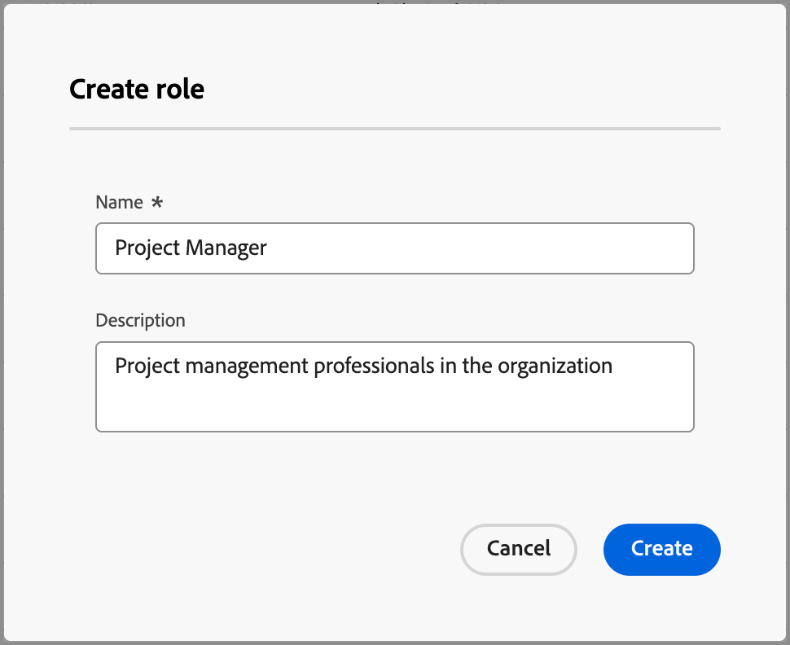

# Standard- und benutzerdefinierte Rollen

Journey Optimizer B2B edition enthält eine Reihe von Standardrollen, die in Rollenvorlagen für den Kauf von Gruppen verwendet werden. Viele Unternehmen benötigen jedoch benutzerdefinierte Rollen, die sie entsprechend ihren Geschäftszielen und -strategien definieren können. Sie können die Liste _[!UICONTROL Rollen]_ verwenden, um Ihre eigenen Rollendefinitionen zu erstellen, die Ihre Einkaufsgruppen unterstützen.

## Zugriff auf Rollen

1. Klicken Sie in der linken Navigation auf **[!UICONTROL Gruppen kaufen]**.

1. Wählen Sie auf der _[!UICONTROL Einkaufsgruppen]_ die Registerkarte **[!UICONTROL Rollen]** aus.

   {width="700" zoomable="yes"}

   Die Registerkarte bietet eine Bestandsliste aller vorhandenen Rollen und zeigt die folgenden Informationen im Spaltenformat an:

   * [!UICONTROL Name] - Der Rollenname.
   * [!UICONTROL Typ] - Alle Rollen haben den Typ `Default` oder `Custom`.
   * [!UICONTROL Erstellt am] - Für eine benutzerdefinierte Rolle das Datum und die Uhrzeit, zu der die Rolle erstellt wurde.
   * [!UICONTROL Erstellt von] - Für eine benutzerdefinierte Rolle der Benutzer, der die Rolle erstellt hat.
   * [!UICONTROL Zuletzt aktualisiert am] - Für eine benutzerdefinierte Rolle das Datum und die Uhrzeit der letzten Aktualisierung der Rolle.
   * [!UICONTROL Aktualisiert von] - Für eine benutzerdefinierte Rolle der Benutzer, der die Rolle zuletzt aktualisiert hat.

   Die Liste zeigt oben die Standardrollen an:

   * Entscheidungsträger
   * Influencer
   * Praktizierende
   * Lenkungsausschuss
   * Champion
   * Andere

   >[!NOTE]
   >
   >Sie können die Standardrollen nicht ändern oder löschen. Es gibt eine Obergrenze von 20 Rollen, einschließlich standardmäßiger und benutzerdefinierter Rollen.

## Erstellen einer benutzerdefinierten Rolle

1. Klicken Sie auf _[!UICONTROL Registerkarte]_ Rollen **[!UICONTROL oben rechts auf]** Rolle erstellen“.

1. Geben Sie in das Dialogfeld einen eindeutigen **[!UICONTROL Namen]** (erforderlich) und **[!UICONTROL Beschreibung]** (optional) für die Rolle ein.

   {width="400"}

1. Klicken Sie auf **[!UICONTROL Erstellen]**.

## Benutzerdefinierte Rollen verwalten

Sie können Ihre benutzerdefinierten Rollen auf der Registerkarte _[!UICONTROL Rollen]_ verwalten, die das Bearbeiten des Rollennamens und der Beschreibung sowie das Entfernen einer Rolle aus der Rollenliste umfasst. Klicken Sie auf das _Mehr_-Menüsymbol (**…**) neben dem Namen des Stadien-Modells und wählen Sie **[!UICONTROL Bearbeiten]** oder **[!UICONTROL Löschen]**.

{width="600"}
