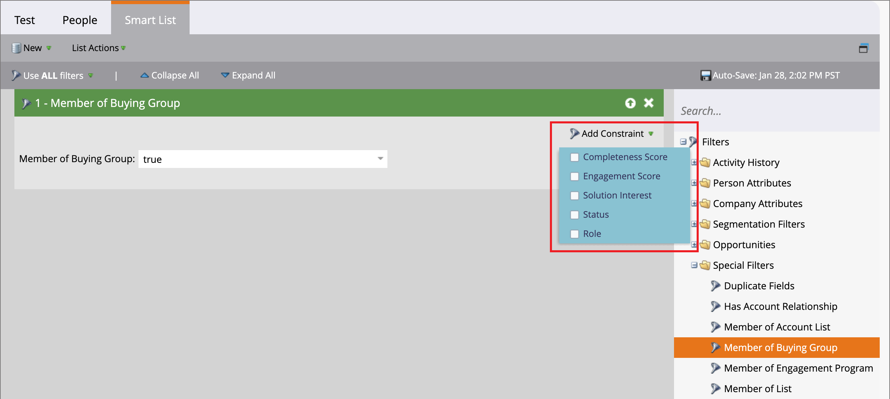

# Käufergruppenfilter in Marketo Engage

Als Marketing-Experte können Sie Kampagnen in Marketo Engage für Personen unterdrücken, die Teil von Einkaufsgruppen in Journey Optimizer B2B edition sind. Sie können die Lead-Scoring-Workflows in Marketo Engage auch anhand von Informationen zu den Leads informieren, die mit Einkaufsgruppen verbunden sind. Beispiel:

* Ist dieser Lead Teil einer Einkaufsgruppe?
* Ist die Einkaufsgruppe vollständig und engagiert?

Wenn diese Bedingungen erfüllt sind, können Sie den Lead höher bewerten. Andernfalls können Sie ihn nicht als Marketing-qualifizierten Lead (MQL) markieren.

In Ihrer Marketo Engage-Instanz, die mit Journey Optimizer B2B edition verbunden ist, können Sie den Filter _[!UICONTROL Mitglied der Kaufgruppe]_ in Ihren Smart Lists verwenden, um diese Leads entsprechend Ihrer Kampagnenstrategie zu identifizieren.

1. Nachdem Sie [Smart-Liste in Marketo Engage erstellen](https://experienceleague.adobe.com/de/docs/marketo/using/product-docs/core-marketo-concepts/smart-lists-and-static-lists/creating-a-smart-list/create-a-smart-list){target="_blank"} wählen Sie die Registerkarte **[!UICONTROL Smart-Liste]** aus, um den Filter-Editor zu öffnen.

1. Scrollen Sie in der Filterliste auf der rechten Seite in der Liste nach unten und erweitern Sie den Ordner **[!UICONTROL Spezielle Filter]**.

1. Klicken Sie auf den **[!UICONTROL Mitglied der Einkaufsgruppe]** und ziehen Sie ihn in den Bereich für die Filterdefinition.

   {width="700" zoomable="yes"}

1. Setzen Sie die Option _[!UICONTROL Mitglied der Einkaufsgruppe]_ auf **[!UICONTROL true]** oder **[!UICONTROL false]**.

   Diese Einschränkung ist für die Definition erforderlich.

1. (Optional) Fügen Sie dem Filter weitere Einkaufsgruppeneinschränkungen hinzu, je nachdem, wie Sie Leads für die Smart-Liste identifizieren möchten.

   * Klicken **[!UICONTROL oben rechts]** der Filterkarte auf „Beschränkung hinzufügen“.

     {width="700" zoomable="yes"}

   * Wählen Sie die Begrenzung aus, die Sie hinzufügen möchten, z. B _„Vollständigkeitswert_ oder _Lösungsinteresse_.

   * Legen Sie die Auswertung fest, die Sie für eine Übereinstimmung verwenden möchten. Für einen Score können Sie eine exakte Übereinstimmung oder einen Bereich oberhalb oder unterhalb der eingegebenen Zahl verwenden.

     Für ein diskretes Element, z. B. die in Journey Optimizer B2B edition definierten Lösungsinteressen, können Sie ein oder mehrere Elemente für die Liste auswählen.

     {width="600" zoomable="yes"}

     Wählen Sie die erste Option aus und klicken Sie erneut auf die Auswahl, um das Dialogfeld _[!UICONTROL Auswahl mehrerer Werte]_ zu öffnen.

     {width="500" zoomable="yes"}

     Verschieben Sie die verbleibenden Elemente nach rechts und klicken Sie auf **[!UICONTROL OK]**, wenn Sie eine Liste der Elemente haben, die Sie für die Begrenzung verwenden möchten.

   * Wiederholen Sie diese Aktionen, um beliebig viele Einschränkungen hinzuzufügen.

   {width="600" zoomable="yes"}
