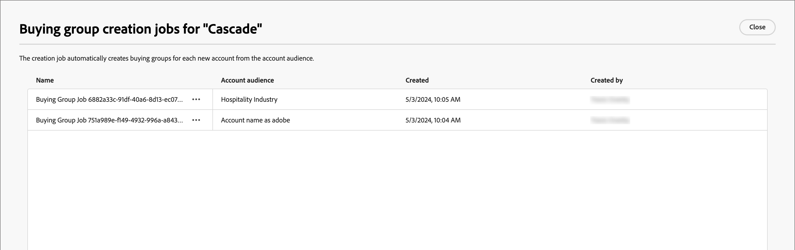

# Lösungsinteressen

Bevor Sie Gruppen kaufen, sollten Sie wissen, was Sie verkaufen und wen Sie auswählen möchten. Ihre Marketing- und Verkaufsstrategie sollte so ausgerichtet sein, dass Sie das Lösungsinteresse für die Einkaufsgruppen hinzufügen können.

{width="30"} [Übersichtsvideo ansehen](#overview-video)

## Lösungsinteressen aufrufen und durchsuchen

1. Klicken Sie auf Ihrer Adobe Experience Platform-Startseite auf Adobe Journey Optimizer B2B Edition.

1. Klicken Sie im linken Navigationsbereich auf **[!UICONTROL Gruppen kaufen]**.

1. Wählen Sie auf der Seite &quot;Buying Groups&quot;die Registerkarte **[!UICONTROL Solution Interest]**.

   {width="700" zoomable="yes"}

   Der Tab enthält eine Bestandsliste aller bestehenden Lösungsinteressen. Sie enthält Informationen in den Spaltenformaten _[!UICONTROL Name]_, _[!UICONTROL Benutzerrollen-Vorlage]_, _[!UICONTROL Erstellung von Gruppenaufträgen]_, _[!UICONTROL Letzte Aktualisierung am]_, _[!UICONTROL Aktualisiert von]_, _[!UICONTROL am]_ erstellt und _[!UICONTROL von]_ erstellt.

   Die Liste wird standardmäßig nach der Spalte _[!UICONTROL Zuletzt aktualisiert am]_ sortiert. Klicken Sie auf den Spaltentitel in der Kopfzeile, um die Sortierung zwischen absteigender und aufsteigender Sortierung umzuschalten.

## Kaufgruppenaufträge anzeigen und löschen

Auf der Registerkarte _[!UICONTROL Lösungsinteressen]_ zeigt die Spalte **[!UICONTROL Erstellen von Gruppenaufträgen für Kauf]** die Anzahl der Aufträge an, die für die einzelnen Lösungsinteressen erstellt wurden. Die Zahl ist ein Link. Wenn Sie darauf klicken, wird ein Dialogfeld geöffnet, in dem die Liste der für die Lösung erstellten Aufträge angezeigt wird.

{width="700" zoomable="yes"}

Sie können einen Auftrag für eine Gruppe löschen, indem Sie auf das Auslassungszeichen (...) neben dem Auftragsnamen klicken und **[!UICONTROL Löschen]** auswählen.

## Lösungsinteresse erstellen

Bevor Sie ein Lösungsinteresse erstellen, müssen Sie über eine Vorlage für Live-Rollen (veröffentlicht) verfügen, die die Rollen definiert, die Sie als Ziel auswählen möchten. Weitere Informationen zum Erstellen einer Rollenvorlage und Veröffentlichen einer Rollenvorlage finden Sie unter [Kaufen von Rollenvorlagen für Gruppen](./buying-groups-role-templates.md) .

1. Klicken Sie auf der Registerkarte _[!UICONTROL Lösungsinteresse]_ oben rechts auf **[!UICONTROL Lösungsinteresse erstellen]** .

1. Geben Sie einen eindeutigen **[!UICONTROL Namen]** (erforderlich) und eine **[!UICONTROL Beschreibung]** (optional) ein.

1. Wählen Sie eine **[!UICONTROL Benutzerrollen-Vorlage]** (erforderlich).

   Klicken Sie auf die Auswahl und wählen Sie eine Live-Rollenvorlage aus der angezeigten Liste aus. Sie können nur eine Live-Roles-Vorlage mit einem Lösungsinteresse verknüpfen.

   {width="700" zoomable="yes"}

1. Klicken Sie oben rechts auf **[!UICONTROL Erstellen]** .

   Ihre neuen Lösungsinteressen werden in den Lösungsinteressen angezeigt

## Lösungsinteresse bearbeiten

Sie können jederzeit den Namen und die Beschreibung für ein Lösungsinteresse ändern. Die Benutzervorlage kann aufgrund der Abhängigkeit vom Kauf von Gruppen aufgrund des Lösungsinteresses und der Rollenvorlagenpaarung nicht geändert werden. In diesem Fall müssen Sie mithilfe einer anderen Benutzerrollenvorlage ein neues Lösungsinteresse erstellen.

1. Verwenden Sie auf der Registerkarte _[!UICONTROL Lösungsinteresse]_ eine der folgenden Methoden, um die Eigenschaften für das Lösungsinteresse zu öffnen, das Sie bearbeiten möchten:

   * Klicken Sie auf den Namen des Lösungsinteresses.
   * Klicken Sie auf die Auslassungspunkte (**...**) daneben und wählen Sie **[!UICONTROL Bearbeiten]**.

   {width="500" zoomable="no"}

1. Aktualisieren Sie bei Bedarf den Namen (erforderlich und eindeutig) und die Beschreibung (optional).

1. Ändern Sie bei Bedarf die Einstellung **[!UICONTROL Vorhandene Einkaufsgruppen aktualisieren]** .

   Wenn diese Option aktiviert ist, werden alle vorhandenen Einkaufsgruppen, die mit dem Lösungsinteresse verknüpft sind, über den 24-Stunden-Synchronisierungszyklus aktualisiert.

1. Klicken Sie auf **[!UICONTROL Speichern]**.

## Lösungs-Interesse löschen

Lösungsinteressen, die derzeit von einem Einkaufsgruppenauftrag oder einer Journey verwendet werden, können nicht gelöscht werden. Außerdem kann kein Interesse an einer gelöschten Lösung abgerufen werden.

1. Klicken Sie auf der Registerkarte _[!UICONTROL Lösungsinteresse]_ auf das Auslassungszeichen (**...**) neben dem Lösungsinteresse und wählen Sie **[!UICONTROL Löschen]**.

   Durch diese Aktion wird ein Bestätigungsdialogfeld geöffnet.

   Wenn das Lösungsinteresse derzeit von einer Journey oder einem Gruppenauftrag verwendet wird, öffnet die Aktion ein Informationsdialogfeld, das Sie darauf hinweist, dass sie nicht gelöscht werden kann. Klicken Sie auf [!UICONTROL OK] , wodurch der Löschvorgang abgebrochen wird.

1. Klicken Sie auf **[!UICONTROL Löschen]** , um den Löschvorgang zu bestätigen, oder Sie können den Vorgang abbrechen, indem Sie auf _[!UICONTROL Abbrechen]_ klicken.

## Übersichtsvideo

>[!VIDEO](https://video.tv.adobe.com/v/3433080/?learn=on)
