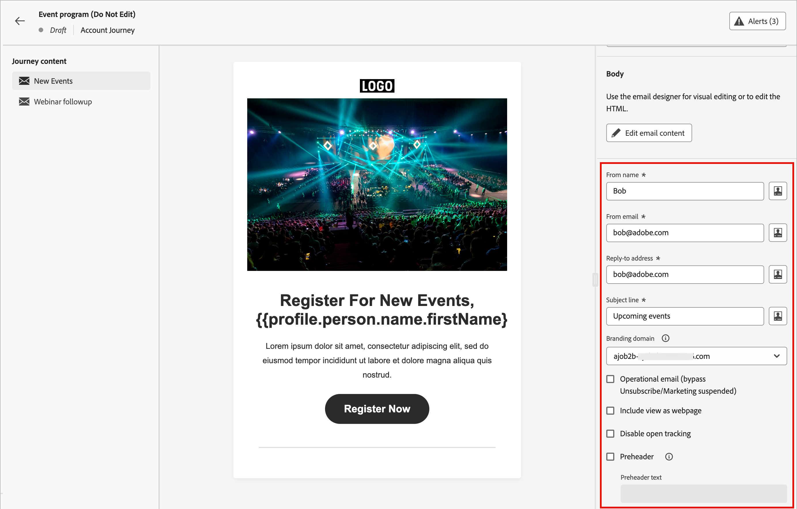

# Hinzufügen einer E-Mail zu Ihrem Journey

Verwenden Sie Adobe Journey Optimizer B2B edition, um E-Mail-Nachrichten über Account Journey an Ihre Kunden zu senden. Sie können im E-Mail-Design-Bereich Nachrichten erstellen, personalisieren und in der Vorschau anzeigen. Sobald E-Mails in Journey verfügbar sind, überwachen Sie den Versand, die Zustellung und die Interaktion im [E-Mail-Leistungsbericht](../dashboards/email-performance-dashboard.md).

>[!NOTE]
>
>Wenn Sie zum ersten Mal eine E-Mail senden, stellen Sie sicher, dass der E-Mail-Kanal konfiguriert ist. Weitere Informationen finden Sie unter [Protokolle für Tracking und E-Mail-Versand](../start/email-protocols.md).
>
>Einzelheiten dazu, wie die Voreinstellungen für E-Mail-Einverständnisse zum Zeitpunkt des Versands bewertet werden, finden Sie unter [Voreinstellungen für das Einverständnis](./channels-consent-preferences.md).

## Hinzufügen eines Aktionsknotens „E-Mail senden“ {#send-email-node}

Sie können den E-Mail-Versand auf einer Journey einrichten, wenn Sie [einen Knoten _[!UICONTROL Aktion durchführen]_ hinzufügen &#x200B;](../journeys/action-nodes.md) Folgendes tun:

1. _(Nur Konto-Journey_)Wählen Sie für das _[!UICONTROL Aktion-]_-Ziel **[!UICONTROL Personen]**.

1. Wählen Sie für die Aktion **[!UICONTROL E-Mail senden]** aus.

1. Klicken Sie **[!UICONTROL E-Mail erstellen]**.

   {width="500"}

1. Wählen Sie _Dialogfeld „Neue E_ Mail erstellen“, ein neues E-Mail-Inhalts-Asset zu erstellen oder ein vorhandenes E-Mail-Inhalts-Asset zu duplizieren.

   * Wählen Sie die Option **[!UICONTROL Neue E]** Mail) aus, wenn Sie eine E-Mail mit einer leeren Arbeitsfläche oder einer E-Mail-Vorlage erstellen möchten.

     {width="400"}

     * Geben Sie einen eindeutigen **[!UICONTROL Namen]** für die E-Mail und eine **[!UICONTROL Betreffzeile]** ein.

     * Klicken Sie auf **[!UICONTROL Erstellen]**.

   * Wählen Sie die Option **[!UICONTROL E-Mail duplizieren]**, wenn Sie eine E-Mail mit einer bestehenden E-Mail von der aktuellen Journey oder einer anderen Journey erstellen möchten.

     Sie können die duplizierte E-Mail entsprechend Ihrem Ziel für den Journey-Knoten ändern.

     * Klicken Sie zum **[!UICONTROL Duplizieren vorhandener E-Mails]** auf das Symbol _Auswahl_ (  ) und wählen Sie die E-Mail aus, die Sie duplizieren und für den Journey-Knoten verwenden möchten.

       Sie können die Liste der E-Mails filtern, indem Sie eine Textzeichenfolge in das Suchfeld eingeben, die dem E-Mail-Namen entspricht. Aktivieren Sie das Kontrollkästchen für die zu duplizierende E-Mail und klicken Sie auf **[!UICONTROL Auswählen]**.

       {width="600" zoomable="yes"}

     * Geben Sie einen eindeutigen **[!UICONTROL Namen]** für die E-Mail und eine **[!UICONTROL Betreffzeile]** ein.

       {width="400"}

     * Klicken Sie auf **[!UICONTROL Erstellen]**.

1. Klicken Sie **[!UICONTROL E-Mail bearbeiten]**, um die E-Mail [Einstellungen](#email-settings) und [Inhalt](./email-authoring.md) zu definieren.

   {width="500"}

## E-Mail-Einstellungen definieren {#email-settings}

Wenn die Registerkarte **[!UICONTROL Details]** im Bedienfeld _Zusammenfassung_ auf der rechten Seite ausgewählt ist, scrollen Sie nach unten, um die E-Mail-Einstellungen anzuzeigen und zu definieren.

{width="700" zoomable="yes"}

| Option | Beschreibung |
| ------ | ----------- |
| [!UICONTROL Absendername] | Der in der E-Mail-Kopfzeile verwendete Absendername. Geben Sie den Absendernamen so ein, wie er dem Empfänger angezeigt werden soll. Klicken Sie auf das _Personalisieren_-Symbol (  ), um ein Personalisierungs-Token in diesem Feld zu verwenden. |
| [!UICONTROL Von E-Mail] | Die in der E-Mail-Kopfzeile verwendete Absenderadresse. Der Standardwert wird aus den [E-Mail-Kanal-Versandeinstellungen](../admin/configure-channels-emails.md#delivery-settings) übernommen. Klicken Sie auf das _Personalisieren_-Symbol (  ), um ein Personalisierungs-Token in diesem Feld zu verwenden. |
| [!UICONTROL Antwortadresse] | Die in der E-Mail-Kopfzeile verwendete Absenderadresse. Der Standardwert wird aus den [E-Mail-Kanal-Versandeinstellungen](../admin/configure-channels-emails.md#delivery-settings) ([!UICONTROL From Label]) gefüllt. Geben Sie die E-Mail-Adresse ein, die Sie ausfüllen möchten, wenn der Empfänger die Antwortfunktion verwendet (sie kann anders oder mit der Absenderadresse identisch sein). Klicken Sie auf das _Personalisieren_-Symbol (  ), um ein Personalisierungs-Token in diesem Feld zu verwenden. |
| [!UICONTROL Betreffzeile] | Der Text, der im Feld Betreff für die E-Mail angezeigt wird. Der Standardwert wird aus dem Text gefüllt, den Sie im Dialogfeld _[!UICONTROL Neue E-Mail erstellen]_ eingegeben haben. Sie können den Text bei Bedarf ändern. Klicken Sie auf das _Personalisieren_-Symbol (  ), um ein Personalisierungs-Token im Feld zu verwenden.<!-- Click the AI Assistant button ( {width="30" zoomable="no"} ) to generate the subject line based on the current email content.--> |
| [!UICONTROL Branding-Domain] | Wenn im System mehr als eine [Branding-Domain](../admin/configure-channels-emails.md#branding-domains) definiert ist, wählen Sie die Branding-Domain aus, die für den E-Mail-Versand verwendet werden soll. Verwenden Sie eine bestimmte Branding-Domain, um E-Mails zu senden, die anscheinend von Ihrer Marke und nicht vom Unternehmen als Ganzem stammen. Es baut Vertrauen in die Marke auf, personalisiert das E-Mail-Erlebnis und erhöht die Öffnungs- und Reaktionsraten. |
| [!UICONTROL Operative E-Mail] | Aktivieren Sie das Kontrollkästchen, wenn Sie die E-Mail als betriebsbereit kennzeichnen möchten. Operative E-Mails sind von Opt-out-/Abmeldelisten und von Kommunikationsbeschränkungen ausgeschlossen. Wählen Sie diese Option nur aus, wenn der Empfänger die E-Mail-Nachricht nicht als unerwünschte Werbenachricht (SPAM) betrachten kann. |
| [!UICONTROL Als Webseite anzeigen] | Aktivieren Sie das Kontrollkästchen, um einen Link zu einer Web-Seite einzufügen, die aus dem Inhalt der E-Mail-Nachricht generiert wird. E-Mail-Nachrichten verfügen über eingeschränktere Funktionen als Web-Seiten. Daher ist sie für JavaScript, erweitertes CSS und Formulare nützlich. Der Text, der zum Generieren des Links verwendet wird, wird in den [Versandeinstellungen des E-Mail-Kanals](../admin/configure-channels-emails.md#delivery-settings) konfiguriert ([!UICONTROL Als Webseite anzeigen, HTML] und [!UICONTROL Als Webseite anzeigen, Text &#x200B;]). |
| [!UICONTROL Öffnungs-Tracking deaktivieren] | Aktivieren Sie das Kontrollkästchen, wenn Sie die Aktivität zum Öffnen von E-Mails nicht verfolgen möchten. Wenn die Funktion deaktiviert ist, wird die Anzahl der Öffnungen von E-Mails nur dann erhöht, wenn eine eindeutige Person die E-Mail öffnet. Sie können [Linktracking für E-Mail-Inhalte verwalten](./email-authoring.md#edit-linked-url-tracking) wenn Sie den Inhalt des E-Mail-Textkörpers entwerfen. |
| [!UICONTROL Preheader] | Aktivieren Sie das Kontrollkästchen, um einen Preheader einzuschließen. Ein Preheader ist der kurze Zusammenfassungstext, der in einigen E-Mail-Clients nach der Betreffzeile angezeigt wird. Sie bietet in der Regel eine kurze Zusammenfassung der E-Mail und besteht normalerweise aus einem einzigen Satz. Geben Sie den Zusammenfassungstext in das Feld <!-- , or click the AI Assistant button ( {width="30" zoomable="no"} ) to generate summary text based on the current email content -->. |

<!-- 
Removed, but may reappear elsewhere
| [!UICONTROL Dedicated IP] | If you have more than one dedicated IP addresses defined, select a dedicated IP address to use for sending the email. When you use a specific dedicated IP for your programs, you can track and monitor deliverability more closely and respond quickly to any changes in your delivery metrics. For more information about adding a dedicated IP for the connected Marketo Engage instance, refer to the [Marketo Engage documentation](https://experienceleague.adobe.com/de/docs/marketo/using/product-docs/email-marketing/deliverability/use-your-dedicated-ip-addresses-to-send-emails){target="_blank"}.|
| [!UICONTROL Fields used as CC addresses] | If available, select up to 25 Lead or Company fields that are set up in Marketo Engage using the `Email` type.  |
-->

## Prüfen von Warnhinweisen {#check-alerts}

Während Sie Ihre E-Mail-Einstellungen und den Inhalt definieren, werden Warnhinweise in der Benutzeroberfläche (oben rechts auf der Seite) angezeigt, wenn wichtige Einstellungen fehlen. Wenn diese Schaltfläche nicht angezeigt wird, treten keine Probleme auf.

{width="600" zoomable="yes"}

Es gibt zwei Arten von Warnhinweisen:

* **_Warnhinweise_** die auf Empfehlungen und Best Practices verweisen, z. B.:

  * `The opt-out link is not present in the email body`: Es wird empfohlen, einen Abmelde-Link zu Ihrem E-Mail-Textkörper hinzuzufügen.

    >[!NOTE]
    >
    >E-Mail-Nachrichten im Marketing-Stil müssen einen Ausschluss-Link enthalten, der für Transaktionsnachrichten nicht erforderlich ist.

  * `Text version of HTML is empty`: Definieren Sie eine Textversion Ihres E-Mail-Textkörpers, die verwendet wird, wenn HTML-Inhalte nicht angezeigt werden können.

  * `Empty link is present in email body`: Vergewissern Sie sich, dass alle Links in Ihrer E-Mail korrekt sind.

  * `Email size has exceeded the limit of 100KB`: Stellen Sie sicher, dass die Größe Ihrer E-Mail 100 KB nicht überschreitet, um einen optimalen Versand zu erzielen.

* **_Fehler_** die verhindern, dass Sie die Journey/Kampagne testen oder aktivieren, solange nicht alle Fehler behoben sind, z. B.:

  * `From name is empty`: Das Feld _E-Mail_ Absender“ (erforderlich) ist nicht definiert.

  * `The subject line is missing`: Die Betreffzeile der E-Mail (erforderlich) wurde nicht definiert.

  * `The email version of the message is empty`: Der E-Mail-Inhalt wurde nicht definiert.
