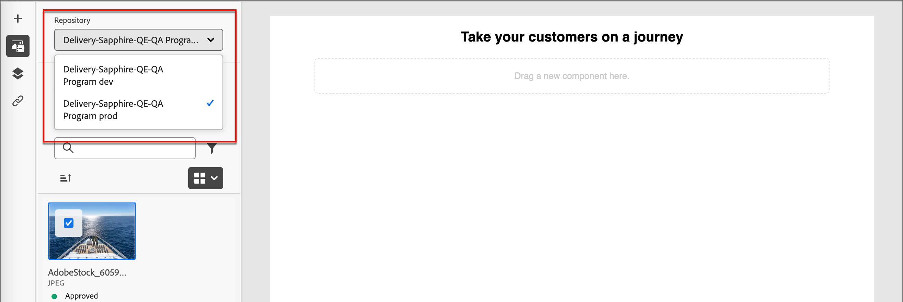
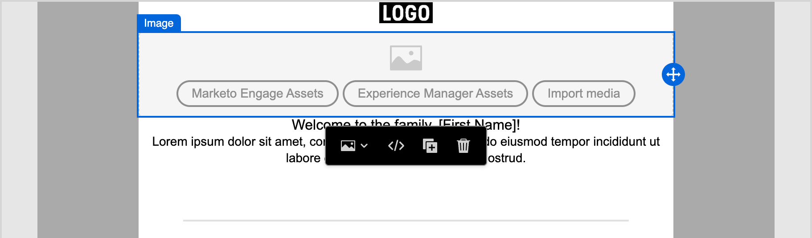
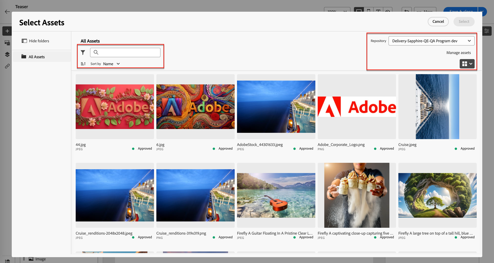

# Arbeiten mit Experience Manager-Assets

Wenn [!DNL Adobe Experience Manager Assets as a Cloud Service] mit [!DNL Adobe Journey Optimizer B2B Edition] integriert ist, können Sie auf einfache Weise digitale Assets für die Verwendung in Ihren Marketing-Inhalten entdecken und darauf zugreifen. Während Sie Ihre Inhalte erstellen, können Sie über das Element _[!UICONTROL Experience Manager Assets]_ im linken Navigationsbereich und beim Erstellen von E-Mail-Inhalten für eine Konto-Journey auf die Assets zugreifen.

{{aem-assets-licensing-note}}

Wenn Sie diese digitalen Assets verwenden, werden die neuesten Änderungen in [!DNL Assets as a Cloud Service] über verknüpfte Verweise automatisch an Live-E-Mail-Kampagnen weitergegeben. Wenn Bilder in [!DNL Adobe Experience Manager Assets as a Cloud Service] gelöscht werden, werden sie in den E-Mails mit einem beschädigten Verweis angezeigt. Wenn Assets, die derzeit in Account Journey verwendet werden, geändert oder gelöscht werden, werden die Journey-Autoren über die Bildänderungen und die Liste der Journey, die das Image verwenden, benachrichtigt. Alle Änderungen an den Assets müssen im zentralen [!DNL Adobe Experience Manager Assets]-Repository vorgenommen werden.

Wenn Ihre Umgebung über mindestens eine [Assets-Repository-Verbindung](../admin/configure-aem-repositories.md) verfügt, können Inhaltsautoren [!DNL Experience Manager Assets] als Quelle für Assets beim Erstellen einer E-Mail, E-Mail-Vorlage oder eines visuellen Fragments verwenden.

>[!IMPORTANT]
>
>Ein Administrator muss Benutzende, die Zugriff auf Assets benötigen, zu den Produktprofilen &quot;Assets Consumer Users“ oder/und &quot;Assets Users“ hinzufügen. [Weitere Informationen](https://experienceleague.adobe.com/en/docs/experience-manager-cloud-service/content/security/ims-support#managing-products-and-user-access-in-admin-console){target="_blank"}

## Zugreifen auf AEM Assets-Bilder

Klicken Sie im Bereich „Inhaltsdesign“ auf das Symbol _[!UICONTROL Experience Manager Assets]_ (  ) in der linken Seitenleiste. Dadurch wird das Bedienfeld „Tools“ in eine Liste der verfügbaren Assets im ausgewählten Repository geändert.

{width="700" zoomable="yes"}

>[!NOTE]
>
>Derzeit werden in [!DNL Adobe Journey Optimizer B2B Edition] nur Bild-Assets aus [!DNL Adobe Experience Manager Assets] unterstützt. Änderungen an den Assets müssen über das zentrale [!DNL Adobe Experience Manager Assets]-Repository vorgenommen werden. [Weitere Informationen](https://experienceleague.adobe.com/en/docs/experience-manager-cloud-service/content/assets/manage/manage-digital-assets){target="_blank"}

### Ändern des angezeigten Repositorys

Wenn Sie über mehr als ein verbundenes AEM-Repository verfügen, klicken Sie auf den Menüpfeil für **[!UICONTROL Repository]**, um das Repository auszuwählen, das Sie im linken Bereich anzeigen möchten.

{width="700" zoomable="yes"}

Es gibt mehrere Methoden zum Hinzufügen eines Bild-Assets zur visuellen Arbeitsfläche.

### Bild per Drag-and-Drop ablegen

1. Durchsuchen Sie die im linken Bereich angezeigten Miniaturansichten.

1. Ziehen Sie die Miniaturansicht des Bildes und legen Sie sie auf der Arbeitsfläche ab, wo Sie die neue Bildkomponente hinzufügen möchten.

   {width="700" zoomable="yes"}

## Bild suchen und auswählen

1. Fügen Sie der Arbeitsfläche eine Bildkomponente hinzu und klicken Sie auf **[!UICONTROL Experience Manager Assets]**, um das Dialogfeld _[!UICONTROL Assets auswählen]_ zu öffnen.

   {width="600" zoomable="yes"}

1. Wählen Sie im Dialogfeld mithilfe der verfügbaren Tools ein Bild aus, um das benötigte Asset zu finden:

   * Ändern Sie **[!UICONTROL Repository]** oben rechts.

   * Klicken Sie **[!UICONTROL oben rechts auf]** Assets verwalten“, um das Assets-Repository in einer anderen Browser-Registerkarte zu öffnen und AEM Assets-Verwaltungstools zu verwenden.

   * Klicken Sie oben rechts auf _Ansichtstyp_, um die Anzeige in **[!UICONTROL Listenansicht]**, **[!UICONTROL Rasteransicht]**, **[!UICONTROL Galerieansicht]** oder **[!UICONTROL Wasserfallansicht]** zu ändern.

   * Klicken Sie auf _Symbol „Sortierreihenfolge_, um die Sortierreihenfolge zwischen aufsteigender und absteigender Reihenfolge zu ändern.

     {width="700" zoomable="yes"}

   * Klicken Sie auf **[!UICONTROL Menüpfeil]** Sortieren nach“, um die Sortierkriterien in **[!UICONTROL Name]**, **[!UICONTROL Size]** oder **[!UICONTROL Modified]** zu ändern.

   * Klicken Sie _oben links auf_ Filter), um die angezeigten Elemente nach Ihren Kriterien zu filtern.

   * Geben Sie im Suchfeld Text ein, um die angezeigten Elemente nach einer Übereinstimmung mit dem Asset-Namen zu filtern.

   {width="700" zoomable="yes"}

1. Klicken Sie auf **[!UICONTROL Auswählen]**.
<!--

## Upload assets

To import files to Assets as a Cloud Service, you first need to browse or create the folder to be used for storage. You can then import an asset and add it to your email content. After assets are uploaded, you can [use the image assets as you author content](./assets-overview.md#add-assets-to-your-content).

1. While authoring your content in the email design space, drag an image element into the canvas. 

   The properties on the right reflect the image element selection. 

1. Click **[!UICONTROL Import media]** to open the _[!UICONTROL Upload image]_ dialog.

1. If your file system is open to your image file, drag and drop the file on the box in the dialog.

   {width="700" zoomable="yes"}

   You can also click the **[!UICONTROL Select a file from your computer]** link and use your file system to locate and select the image file. Click Open and the image file is displayed in the box.

1. Click **[!UICONTROL Import]**.
-->
