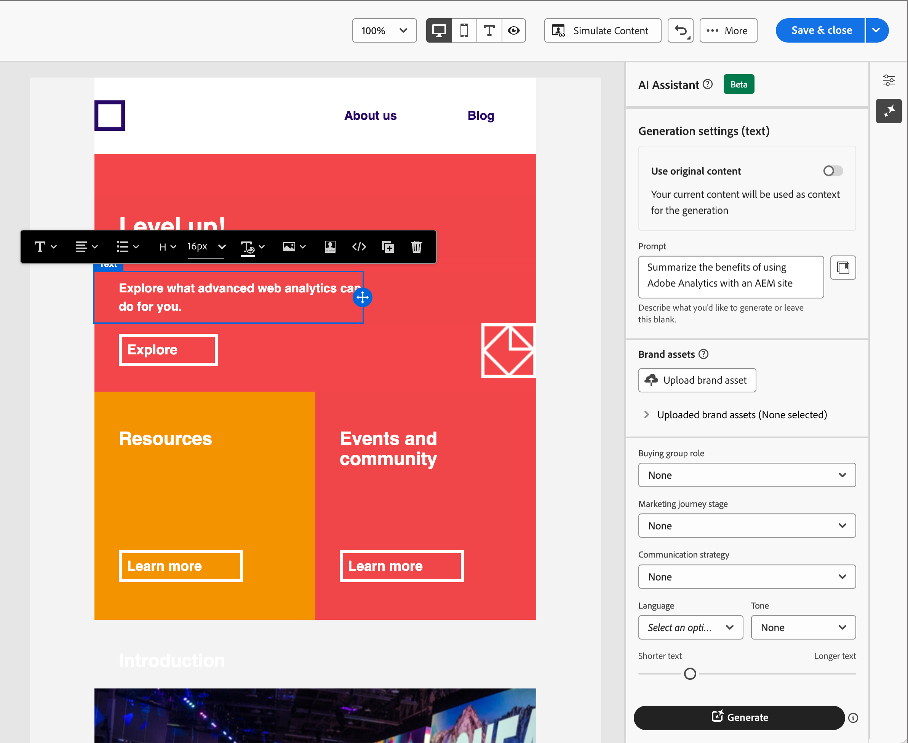

# KI-Assistent für E-Mail-Erstellung

Da die Marketing-Branche wettbewerbsfähiger wird, suchen Marken nach effizienten Möglichkeiten, schnell und effizient wirkungsvolle Inhalte zu generieren. Der KI-Assistent für die E-Mail-Erstellung in Adobe Journey Optimizer B2B edition ist die KI-gestützte Inhaltsgenerierungsfunktion von Adobe, die die Art und Weise revolutioniert, wie Marketing-Experten professionelle und markenkonsistente E-Mail-Inhalte erstellen. Mit erweiterten GenAI-Modellen und einem tiefen Verständnis der Markenrichtlinien generiert der KI-Assistent automatisch personalisierte, ansprechende und effektive Inhalte basierend auf dem Marketing-Ziel mit Inhalten, die für Markenstile, -layouts, -töne und mehr optimiert sind. Der KI-Assistent macht die Erstellung und Ausführung von E-Mail-Marketing-Kampagnen intuitiv, einfach und unkompliziert. Durch das Hinzufügen dieser Funktion zu Ihren Workflows können Sie Zeit sparen, die Effizienz verbessern und bessere Ergebnisse erzielen.

Diese neue Funktion bietet eine sofortige -basierte Textgenerierung, vollständige E-Mail-Generierung und Inhaltserstellung innerhalb von E-Mail-Strukturen. Bilder werden nicht generiert, aber aus dem Bildkatalog im Eingabe-Marken-Asset für das Modell empfohlen. Mit dieser Funktion können Sie auch optimale Betreffzeilen und Preheader generieren, um die Öffnungsrate zu beeinflussen.

>[!NOTE]
>
>Diese Funktion ist in der Beta-Version verfügbar und kann ohne vorherige Ankündigung geändert werden.

## Richtlinien und Einschränkungen

Bevor Sie mit dem KI-Assistenten in Adobe Journey Optimizer B2B edition für die Erstellung von E-Mail-Inhalten beginnen, lesen Sie die folgenden Richtlinien:

* Das von Ihnen definierte Marketing-Ziel/die von Ihnen definierte Eingabeaufforderung ist eine wichtige Determinante für die Qualität des generierten Inhalts. Verwenden Sie eine klar definierte Eingabeaufforderung für das GenAI-Modell, um genau zu interpretieren.
* Laden Sie Marken-Assets hoch, um präzise Markeninhalte zu erhalten. Ohne diese Assets basieren Inhalte auf öffentlich verfügbaren Informationen.
   * Die hochgeladenen Assets können die folgenden Formate aufweisen: PDF-, JPEG-, PNG- oder ZIP-Dateien (mit unterstützten Dateiformaten).
   * Die maximale Größe für ein hochgeladenes Marken-Asset beträgt 50 MB. Größere Dateien oder große Mengen an Bildern können zwar funktionieren, aber die Verarbeitungszeit wird verlängert.
* Verwenden Sie von Adobe Journey Optimizer B2B edition erstellte E-Mail-Vorlagen, vorzugsweise die integrierten Vorlagen oder Beispielvorlagen, eine markenspezifische Vorlage oder eine benutzerdefinierte Vorlage, um Ihre E-Mail-Inhalte zu erstellen. E-Mail-Vorlagen mit bis zu acht bis zehn Bildern werden empfohlen.
* Stellen Sie sicher, dass Sie jede problematische Ausgabe mit den Miniatur- oder Flag-Symbolen für eine generierte Variante melden.
* Ihre Verwendung des KI-Assistenten unterliegt den [Adobe Generative AI-Benutzerrichtlinien](https://www.adobe.com/de/legal/licenses-terms/adobe-gen-ai-user-guidelines.html).

Die folgenden Einschränkungen gelten für den KI-Assistenten in Adobe Journey Optimizer B2B edition für die Erstellung von E-Mail-Inhalten:

* Englisch ist die einzige unterstützte Sprache.
* Sie ist nur für den E-Mail-Kanal verfügbar.
* GenAI-Inhalte sind möglicherweise nicht korrekt - geben Sie Ihr Feedback, damit Adobe-Techniker die Modelle verfeinern können.
* Sie können mehrere Marken-Assets hochladen, aber nur eines für eine bestimmte Generation nutzen.

>[!BEGINSHADEBOX]

## Bibliothek der Eingabeaufforderung

Eine effektive Eingabeaufforderung ist für die Erstellung des bestmöglichen Inhalts unerlässlich. Wenn Sie Hilfe bei der Erstellung Ihrer Eingabeaufforderung benötigen, rufen Sie die _Eingabeaufforderungsbibliothek_ auf. Diese Bibliothek bietet eine Vielzahl von Ideen, um die Inhaltserstellung zu verbessern.

{width="500" zoomable="no"}

Wählen Sie die Eingabeaufforderung aus, die Ihre beabsichtigten Ziele am besten widerspiegelt, und fügen Sie die erforderlichen Werte hinzu, die Ihre Marke, Ihr Angebot, Ihre Kampagne und Ihre Anwendungsfälle angeben.

>[!ENDSHADEBOX]

## Käufergruppenrollen

Adobe Journey Optimizer B2B edition bietet standardmäßig fünf Standard-Rollen für B2B-Einkaufsgruppen. Jede Einkaufsgruppenrolle hat einen eigenen Messaging-Fokus:

| Rolle | Messaging-Fokus |
| ---- | --------------- |
| Lenkungsausschuss | Produktinformationen  Preise  Details zur technischen Integration  Produktfunktionen und -funktionen |
| Influencer | Qualitätsnachweis (  Implementierung  Fachwissen  Wettbewerbsvorteile |
| Entscheidungsträger | Return on Investment  Financial Value (ROI)  Kundengeschichten |
| Praktizierende | Benutzerfreundlichkeit  Produktfunktionen und -funktionalität  Produktkompatibilität  Einfache Produktintegration |
| Champion | Bildungsinhalte  Vordenkerinhalte (Kundengeschichten  |

Durch die Auswahl einer dieser Einkaufsgruppenrollen wird die Ausgabe automatisch auf der Grundlage der für jede dieser Rollen relevanten Merkmale und Themen angepasst.

## Generieren von E-Mail-Eigenschaften mit dem KI-Assistenten

Wenn Sie [ Konto-Journey ](./add-email.md#add-an-email-action-node-in-a-journey)Aktion „E-Mail hinzufügen“ hinzufügen, definieren Sie eine Reihe von E-Mail-Eigenschaften, die zum Senden der E-Mail verwendet werden. Der KI-Assistent kann dazu beitragen, die E-Mail-Interaktion zu verbessern, indem er empfohlene Inhalte für die E-Mail **Betreffzeile** und den **Preheader** generiert.

1. Erstellen Sie eine E-Mail von einer Konto-Journey oder öffnen Sie eine bestehende E-Mail von einem Journey-Knoten aus.

   Die Seite E-Mail-Vorschau wird mit den _[!UICONTROL E-Mail-Eigenschaften]_ rechts angezeigt.

1. Wählen Sie eine der folgenden Registerkarten aus, um zu erfahren, wie Sie den KI-Assistenten beim Erstellen von E-Mail-Eigenschaften verwenden.

>[!BEGINTABS]

>[!TAB Erzeugung der Betreffzeile]

Die folgenden Schritte beschreiben die Aufgabensequenz für die Verwendung des KI-Assistenten zum Generieren einer optimierten Betreffzeile für Ihre E-Mail:

1. Klicken Sie in _[!UICONTROL E]_ Mail-Eigenschaften) rechts neben dem Feld ![Betreffzeile ]&#x200B;**auf das Symbol KI(./assets/email-properties-ai-assistant-button.png){width="30" zoomable="no"}Assistent ((Zugriffssymbol KI** ).

   {width="600" zoomable="yes"}

   Das Popup-Fenster des KI-Assistenten wird mit den Generierungseinstellungen für die E-Mail-Betreffzeile geöffnet.

   Je nachdem, welcher E-Mail-Inhalt mit der E-Mail verknüpft ist oder wie Sie die Betreffzeile verwenden möchten, um Ihren Zweck zu erfüllen, gibt es mehrere Optionen zum Generieren des Betreffzeilentextes:

   * Sie können sofort auf **[!UICONTROL Generieren]** klicken, ohne eine Eingabeaufforderung oder ein Marken-Asset anzuzeigen, um den vorhandenen E-Mail-Textkörper als Kontext für die Erstellung der Betreffzeile zu verwenden.

   * (Empfohlen) Sie können eine Eingabeaufforderung, ein Marken-Asset und andere Einstellungswerte angeben, um einen Kontext für die Generierung des für Ihre Anforderungen optimalen Betreffzeilentextes bereitzustellen. (Schritte 2 bis 7)

1. Geben **[!UICONTROL im Feld &quot;]**&quot; eine Beschreibung dessen ein, was generiert werden soll.

   Verwenden Sie die [Eingabeaufforderungsbibliothek](#prompt-library), wenn Sie Hilfe bei der Erstellung einer effektiven Eingabeaufforderung benötigen.

1. Geben Sie ein Marken-Asset an, das Inhalte enthält, die als Quelle für die Texterstellung dienen sollen.

   * Wählen Sie das Asset aus dem Katalog aus.

   * Klicken Sie auf **[!UICONTROL Marken-Asset hochladen]**, um die Asset-Datei für die Marke hinzuzufügen.

   {width="600" zoomable="yes"}

1. Scrollen Sie bei Bedarf und wählen Sie die **[!UICONTROL Einkaufsgruppenrolle]** aus, die als Zielgruppe für den generierten Text verwendet werden soll.

1. Verwenden Sie bei Bedarf die Messaging-Optionen, um Ihre Inhalte anzupassen:

   * **[!UICONTROL Kommunikationsstrategie]** - Wählen Sie den am besten geeigneten Kommunikationsstil für Ihren generierten Text.
   * **[!UICONTROL Language]** - Wählen Sie die Sprache aus, in der Ihre Inhalte generiert werden sollen.
   * **[!UICONTROL Tone]** - Wählen Sie einen Ton, der bei Ihrer Audience Anklang findet. Wenn Sie angeben, dass Sie informativ, spielerisch oder überzeugend klingen möchten, kann der KI-Assistent die Nachricht entsprechend anpassen.

1. Stellen Sie bei Bedarf mit dem Schieberegler die gewünschte Länge des zu generierenden Textes ein.

1. Ändern Sie **[!UICONTROL Option „Emojis verwenden]** (ein oder aus) nach Ihren Wünschen.

1. Wenn Ihre Eingabeaufforderung und die Einstellungen fertig sind, klicken Sie auf **[!UICONTROL Generieren]**.

1. Scrollen Sie im Bedienfeld KI-Assistent durch die generierten Varianten, um festzustellen, welche am besten geeignet ist.

   * Klicken Sie **[!UICONTROL Vorschau]**, um eine Vollbildversion einer ausgewählten Variante anzuzeigen.

   * Geben Sie Feedback für die generierten Varianten, indem Sie auf das Symbol _Daumen hoch_, _Daumen runter_ oder _Flag_ klicken und den Grund auswählen, der Ihr Feedback am besten zusammenfasst.

1. Navigieren Sie im Vorschaufenster zu _Verfeinern_, um auf zusätzliche Anpassungsfunktionen zuzugreifen:

   * **[!UICONTROL Als Referenzinhalt verwenden]** - Wählen Sie diese Option, um die Variante als Referenzinhalt zum Generieren anderer Ergebnisse zu verwenden.

   * **[!UICONTROL Umformulieren]** - Der KI-Assistent kann Ihre Nachricht auf unterschiedliche Weise umformulieren, sodass Sie frisch schreiben und für unterschiedliche Zielgruppen interessant sind.

   * **[!UICONTROL Einfachere Sprache verwenden]** - Nutzen Sie den KI-Assistenten, um Ihre Sprache zu vereinfachen und einer breiteren Zielgruppe Klarheit und Barrierefreiheit zu bieten.

   {width="600" zoomable="yes"}

1. Klicken Sie **[!UICONTROL Auswählen]**, um den Betreffzeilentext durch die ausgewählte Variante zu ersetzen und zu den E-Mail-Eigenschaften zurückzukehren.

>[!TAB Preheader-Generierung]

Ein E-Mail-Preheader ist der kurze Zusammenfassungstext, der auf die Betreffzeile folgt, wenn eine E-Mail im Posteingang angezeigt wird. Dies ist ein optionales Element für eine E-Mail, aber eine großartige Möglichkeit, die Interaktion zu verbessern. Die folgenden Schritte beschreiben die Aufgabensequenz für die Verwendung des KI-Assistenten zum Generieren eines optimierten Preheaders für Ihre E-Mail:

1. Aktivieren Sie in den E-Mail **[!UICONTROL Eigenschaften das Kontrollkästchen]** Preheader) und klicken Sie auf das Symbol KI-Assistent {width="30" zoomable="no"} ) auf der rechten Seite.

   {width="600" zoomable="yes"}

   Das Popup-Fenster des KI-Assistenten wird mit den Erzeugungseinstellungen für den E-Mail-Preheader geöffnet.

   Je nach E-Mail-Inhalt, der mit der E-Mail verknüpft ist, oder nach dem, wie Sie die E-Mail ansprechen möchten, gibt es mehrere Optionen zum Generieren des Preheaders:

   * Sie können sofort auf **[!UICONTROL Generieren]** ohne Eingabeaufforderung oder ein Marken-Asset klicken, um den vorhandenen E-Mail-Textkörper als Kontext für die Preheader-Generierung zu verwenden.

   * (Empfohlen) Sie können eine Eingabeaufforderung, ein Marken-Asset und andere Einstellungswerte angeben, um einen Kontext für die Generierung des optimalen Preheaders für Ihre Anforderungen bereitzustellen. (Schritte 2 bis 7)

1. Geben **[!UICONTROL im Feld &quot;]**&quot; eine Beschreibung dessen ein, was generiert werden soll.

   Verwenden Sie die [Eingabeaufforderungsbibliothek](#prompt-library), wenn Sie Hilfe bei der Erstellung einer effektiven Eingabeaufforderung benötigen.

1. Geben Sie ein Marken-Asset an, das Inhalte enthält, die als Quelle für die Texterstellung dienen sollen.

   * Wählen Sie das Asset aus dem Katalog aus.

   * Klicken Sie auf **[!UICONTROL Marken-Asset hochladen]**, um die Asset-Datei für die Marke hinzuzufügen.

   {width="600" zoomable="yes"}

1. Scrollen Sie bei Bedarf und wählen Sie die **[!UICONTROL Einkaufsgruppenrolle]** aus, die als Zielgruppe für den generierten Text verwendet werden soll.

1. Verwenden Sie bei Bedarf die Messaging-Optionen, um Ihre Inhalte anzupassen:

   * **[!UICONTROL Kommunikationsstrategie]** - Wählen Sie den am besten geeigneten Kommunikationsstil für Ihren generierten Text.
   * **[!UICONTROL Language]** - Wählen Sie die Sprache aus, in der Ihre Inhalte generiert werden sollen.
   * **[!UICONTROL Tone]** - Wählen Sie einen Ton, der bei Ihrer Audience Anklang findet. Wenn Sie angeben, dass Sie informativ, spielerisch oder überzeugend klingen möchten, kann der KI-Assistent die Nachricht entsprechend anpassen.

1. Stellen Sie bei Bedarf mit dem Schieberegler die gewünschte Länge des zu generierenden Textes ein.

1. Ändern Sie **[!UICONTROL Option „Emojis verwenden]** (ein oder aus) nach Ihren Wünschen.

1. Wenn Ihre Eingabeaufforderung und die Einstellungen fertig sind, klicken Sie auf **[!UICONTROL Generieren]**.

1. Scrollen Sie im Bedienfeld KI-Assistent durch die generierten Varianten, um festzustellen, welche am besten geeignet ist.

   * Klicken Sie **[!UICONTROL Vorschau]**, um eine Vollbildversion einer ausgewählten Variante anzuzeigen.

   * Geben Sie Feedback für die generierten Varianten, indem Sie auf das Symbol _Daumen hoch_, _Daumen runter_ oder _Flag_ klicken und den Grund auswählen, der Ihr Feedback am besten zusammenfasst.

1. Navigieren Sie im Vorschaufenster zu _Verfeinern_, um auf zusätzliche Anpassungsfunktionen zuzugreifen:

   * **[!UICONTROL Als Referenzinhalt verwenden]** - Wählen Sie diese Option, um die Variante als Referenzinhalt zum Generieren anderer Ergebnisse zu verwenden.

   * **[!UICONTROL Umformulieren]** - Der KI-Assistent kann Ihre Nachricht auf unterschiedliche Weise umformulieren, sodass Sie frisch schreiben und für unterschiedliche Zielgruppen interessant sind.

   * **[!UICONTROL Einfachere Sprache verwenden]** - Nutzen Sie den KI-Assistenten, um Ihre Sprache zu vereinfachen und einer breiteren Zielgruppe Klarheit und Barrierefreiheit zu bieten.

   {width="600" zoomable="yes"}

1. Klicken Sie **[!UICONTROL Auswählen]**, um den Preheader durch die ausgewählte Variante zu ersetzen und zu den E-Mail-Eigenschaften zurückzukehren.

>[!ENDTABS]

## Generieren von E-Mail-Textinhalten mit dem KI-Assistenten

Nachdem Sie [E-Mail erstellt und personalisiert haben](./email-authoring.md) verwenden Sie den KI-Assistenten in Adobe Journey Optimizer B2B edition auf der Basis von generativer KI, um den Inhalt Ihres E-Mail-Textkörpers auf die nächste Stufe zu heben.

Im E-Mail-Designer kann Ihnen der KI-Assistent dabei helfen, die Wirkung Ihrer Sendungen zu optimieren, indem er den vollständigen E-Mail-Textkörper, zielgerichtete Textinhalte und Empfehlungen für Bilder generiert, die bei Ihrer Audience Anklang finden. Diese Optimierung Ihrer E-Mail-Kampagnen sorgt für eine bessere Interaktion.

1. Erstellen Sie eine E-Mail von einer Konto-Journey und klicken Sie auf **[!UICONTROL E-Mail-Designer öffnen]** oder **[!UICONTROL E-Mail-Inhalt hinzufügen]**.

1. Wählen Sie eine E-Mail-Vorlage im visuellen E-Mail-Designer aus und öffnen Sie sie.

1. Personalisieren Sie die E-Mail nach Bedarf für den Journey-Knoten.

1. Wählen Sie eine der folgenden Registerkarten aus, um zu erfahren, wie Sie den KI-Assistenten bei der Inhaltserstellung in Ihrem E-Mail-Textkörper verwenden.

>[!BEGINTABS]

>[!TAB Vollständige E-Mail-Generierung]

Die folgenden Schritte beschreiben die Aufgabensequenz für die Verwendung des KI-Assistenten zum Verfeinern einer vorhandenen E-Mail-Vorlage:

1. Rufen Sie in Email Designer das Menü des KI-Assistenten auf, indem Sie auf das Symbol ({width="30" zoomable="no"}) auf der rechten Seite klicken.

   {width="600" zoomable="yes"}

   Die Einstellungen des KI-Assistenten auf der rechten Seite spiegeln _Erzeugungseinstellungen (vollständige E-Mail)_ wider.

1. Geben **[!UICONTROL im Feld &quot;]**&quot; eine Beschreibung dessen ein, was generiert werden soll.

   Verwenden Sie die [Eingabeaufforderungsbibliothek](#prompt-library), wenn Sie Hilfe bei der Erstellung einer effektiven Eingabeaufforderung benötigen.

   {width="600" zoomable="yes"}

1. Geben Sie ein Marken-Asset an, das Inhalt enthält, der zusätzlichen Kontext für den KI-Assistenten bereitstellen kann.

   * Wählen Sie das Asset aus dem Katalog aus.

   * Klicken Sie auf **[!UICONTROL Marken-Asset hochladen]**, um die Asset-Datei für die Marke hinzuzufügen.

   Dieses Eingabe-Asset dient als Quelle für die Inhaltserstellung und Bildempfehlung innerhalb der E-Mail.

1. Wählen Sie die **[!UICONTROL Einkaufsgruppenrolle]** aus, die als Zielgruppe für die E-Mail-Kommunikation verwendet werden soll.

1. Verwenden Sie bei Bedarf die Messaging-Optionen, um Ihre Inhalte anzupassen:

   * **[!UICONTROL Kommunikationsstrategie]** - Wählen Sie den am besten geeigneten Kommunikationsstil für Ihren generierten Text.
   * **[!UICONTROL Language]** - Wählen Sie die Sprache aus, in der Ihre Inhalte generiert werden sollen.
   * **[!UICONTROL Tone]** - Wählen Sie einen Ton, der bei Ihrer Audience Anklang findet. Wenn Sie angeben, dass Sie informativ, spielerisch oder überzeugend klingen möchten, kann der KI-Assistent die Nachricht entsprechend anpassen.
   * **Inhaltstyp** - Wählen Sie eine Option aus, die die Art der visuellen Elemente widerspiegelt. Diese Einstellung unterscheidet zwischen verschiedenen Formen der visuellen Darstellung wie Fotos, Grafiken oder Kunst.

1. Wenn Ihre Eingabeaufforderung fertig ist, klicken Sie auf **[!UICONTROL Generieren]**.

1. Scrollen Sie im Bedienfeld KI-Assistent durch die generierten Varianten, um festzustellen, welche am besten geeignet ist.

   * Klicken Sie **[!UICONTROL Vorschau]**, um eine Vollbildversion einer ausgewählten Variante anzuzeigen.

   * Geben Sie Feedback für die generierten Varianten, indem Sie auf das Symbol _Daumen hoch_, _Daumen runter_ oder _Flag_ klicken und den Grund auswählen, der Ihr Feedback am besten zusammenfasst.

     {width="600" zoomable="yes"}

1. Klicken Sie **[!UICONTROL Auswählen]**, um den Vorlageninhalt durch die ausgewählte Variante zu ersetzen und zum E-Mail-Designer zurückzukehren.

   In Email Designer können Sie die Bearbeitungs- und Formatierungswerkzeuge auf der Arbeitsfläche verwenden, um den Inhalt sowie die Optionen _[!UICONTROL Einstellungen]_ und _[!UICONTROL Stil]_ auf der rechten Seite zu ändern.

>[!TAB Textgenerierung]

Die folgenden Schritte beschreiben die Aufgabensequenz für die Verwendung des KI-Assistenten zur Verfeinerung oder Verbesserung des Textinhalts für eine vorhandene E-Mail:

1. Rufen Sie in Email Designer das Menü des KI-Assistenten auf, indem Sie auf das Symbol ({width="30" zoomable="no"}) auf der rechten Seite klicken.

   {width="600" zoomable="yes"}

1. Wählen Sie eine _Text_-Komponente aus, um den spezifischen Inhalt anzusprechen.

   Die Einstellungen des KI-Assistenten auf der rechten Seite _„Erzeugungseinstellungen (Text)_.

1. Geben **[!UICONTROL im Feld &quot;]**&quot; eine Beschreibung dessen ein, was generiert werden soll.

   {width="600" zoomable="yes"}

   Verwenden Sie die [Eingabeaufforderungsbibliothek](#prompt-library), wenn Sie Hilfe bei der Erstellung einer effektiven Eingabeaufforderung benötigen.

1. Geben Sie ein Marken-Asset an, das Inhalte enthält, die als Quelle für die Texterstellung dienen sollen.

   * Wählen Sie das Asset aus dem Katalog aus.

   * Klicken Sie auf **[!UICONTROL Marken-Asset hochladen]**, um die Asset-Datei für die Marke hinzuzufügen.

1. Wählen Sie die **[!UICONTROL Einkaufsgruppenrolle]** aus, die als Zielgruppe für den generierten Text verwendet werden soll.

1. Verwenden Sie bei Bedarf die Sprach- und Messaging-Optionen, um Ihre Inhalte anzupassen:

   * **[!UICONTROL Kommunikationsstrategie]** - Wählen Sie den am besten geeigneten Kommunikationsstil für Ihren generierten Text.
   * **[!UICONTROL Language]** - Wählen Sie die Sprache aus, in der Ihre Inhalte generiert werden sollen.
   * **[!UICONTROL Tone]** - Wählen Sie einen Ton, der bei Ihrer Audience Anklang findet. Wenn Sie angeben, dass Sie informativ, spielerisch oder überzeugend klingen möchten, kann der KI-Assistent die Nachricht entsprechend anpassen.

1. Stellen Sie bei Bedarf mit dem Schieberegler die gewünschte Länge des zu generierenden Textes ein.

1. Wenn Ihre Eingabeaufforderung fertig ist, klicken Sie auf **[!UICONTROL Generieren]**.

1. Durchsuchen Sie die generierten _Varianten_ und klicken Sie auf **[!UICONTROL Vorschau]**, um eine Vollbildversion der ausgewählten Variante anzuzeigen.

1. Navigieren Sie im Vorschaufenster zu _Verfeinern_, um auf zusätzliche Anpassungsfunktionen zuzugreifen:

   * **[!UICONTROL Als Referenzinhalt verwenden]** - Wählen Sie diese Option, um die Variante als Referenzinhalt zum Generieren anderer Ergebnisse zu verwenden.

   * **[!UICONTROL Entwickeln]** - Der KI-Assistent kann Ihnen dabei helfen, bestimmte Themen zu vertiefen und zusätzliche Details bereitzustellen, um das Verständnis und die Interaktion zu verbessern.

   * **[!UICONTROL Zusammenfassen]** - Lange Informationen können E-Mail-Empfänger überlasten. Verwenden Sie den KI-Assistenten, um wichtige Punkte in klaren, knappen Zusammenfassungen zu verdichten, die Aufmerksamkeit erregen und sie zum weiteren Lesen ermutigen.

   * **[!UICONTROL Umformulieren]** - Der KI-Assistent kann Ihre Nachricht auf unterschiedliche Weise umformulieren, sodass Sie frisch schreiben und für unterschiedliche Zielgruppen interessant sind.

   * **[!UICONTROL Einfachere Sprache verwenden]** - Nutzen Sie den KI-Assistenten, um Ihre Sprache zu vereinfachen und einer breiteren Zielgruppe Klarheit und Barrierefreiheit zu bieten.

   {width="700" zoomable="yes"}

1. Wenn Sie den gewünschten Inhalt haben, klicken Sie auf **[!UICONTROL Auswählen]**, um den Text durch die ausgewählte Variante zu ersetzen und zum E-Mail-Designer zurückzukehren.

   In Email Designer können Sie die Bearbeitungs- und Formatierungswerkzeuge auf der Arbeitsfläche verwenden, um den Text sowie die Optionen _[!UICONTROL Einstellungen]_ und _[!UICONTROL Stil]_ auf der rechten Seite zu ändern.

>[!TAB Bildempfehlungen]

Sie können den KI-Assistenten verwenden, um Ihre Assets zu optimieren und zu verbessern und ein benutzerfreundlicheres Erlebnis zu gewährleisten. Die folgenden Schritte beschreiben die Aufgabensequenz für die Verwendung des KI-Assistenten zur Verbesserung des Bildinhalts der E-Mail:

1. Rufen Sie das Menü des KI-Assistenten auf, indem Sie auf das Symbol {width="30" zoomable="no"} rechts klicken.

   {width="600" zoomable="yes"}

1. Wählen Sie eine _Bild_-Komponente aus, um den spezifischen Inhalt anzusprechen und auf das Menü des KI-Assistenten zuzugreifen.

   Die Einstellungen auf der rechten Seite spiegeln _[!UICONTROL Erzeugungseinstellungen (Bild)]_ wider.

1. Um das Asset zu optimieren, geben Sie im Feld „Eingabeaufforderung“ eine Beschreibung **[!UICONTROL gewünschten]** ein.

   {width="600" zoomable="yes"}

   Verwenden Sie die [Eingabeaufforderungsbibliothek](#prompt-library), wenn Sie Hilfe bei der Erstellung einer effektiven Eingabeaufforderung benötigen.

1. Klicken Sie **[!UICONTROL Marken-Asset hochladen]**, um alle Marken-Assets hinzuzufügen, die Inhalte enthalten, die zusätzlichen Kontext für den KI-Assistenten bieten können.

   Wenn das benötigte Asset bereits verfügbar ist, erweitern Sie **[!UICONTROL Hochgeladene Marken-Assets]** und wählen Sie das Asset aus.

   Die Eingabeaufforderung muss immer mit einem vorhandenen Asset verknüpft sein.

1. Verfeinern Sie die Eingabeaufforderung mit den Bildeinstellungen:

   * **[!UICONTROL Seitenverhältnis]** - Diese Einstellung bestimmt die Breite und Höhe des Assets. Sie haben die Möglichkeit, aus gängigen Verhältnissen wie 16:9, 4:3, 3:2 oder 1:1 zu wählen, oder Sie können eine benutzerdefinierte Größe eingeben.
   * **[!UICONTROL Farbe und Ton]** - Diese Einstellung beeinflusst das allgemeine Erscheinungsbild der Farben in einem Bild und die Stimmung oder Atmosphäre, die es vermittelt.
   * **[!UICONTROL Inhaltstyp]** - Diese Einstellung kategorisiert die Art des visuellen Elements, wobei zwischen verschiedenen Formen visueller Darstellung wie Fotos, Grafiken oder Kunst unterschieden wird.
   * **[!UICONTROL Beleuchtung]** - Mit dieser Einstellung wird der Blitz in einem Bild angepasst, wodurch die Atmosphäre geformt und bestimmte Elemente hervorgehoben werden.
   * **[!UICONTROL Komposition]** - Diese Einstellung bestimmt die Anordnung von Elementen innerhalb des Rahmens eines Bildes.

1. Wenn Sie mit der Eingabeaufforderungskonfiguration zufrieden sind, klicken Sie auf **[!UICONTROL Generieren]**.

   Der KI-Assistent verarbeitet die Anfrage und empfiehlt die am besten geeigneten Bilder aus dem Eingabe-Marken-Asset basierend auf der Eingabeaufforderung und anderen Eingaben.

   >[!IMPORTANT]
   >
   >Wenn im Eingabe-Marken-Asset keine Bilder vorhanden sind oder für die Eingabeaufforderung keine Bilder relevant sind, ist die Ausgabe leer.

1. Durchsuchen Sie die _[!UICONTROL Varianten]_ und wählen Sie die aus, die für die E-Mail am besten geeignet ist.

   Um eine Vollbildversion der ausgewählten Variante anzuzeigen, klicken Sie auf **[!UICONTROL Vorschau]**.

1. Markieren Sie das gewünschte Bild und klicken Sie auf **[!UICONTROL Auswählen]**, um das Bild oder den Platzhalter durch das ausgewählte Element zu ersetzen und zum E-Mail-Designer zurückzukehren.

   In Email Designer können Sie die Bearbeitungs- und Formatierungswerkzeuge auf der Arbeitsfläche verwenden, um den Inhalt sowie die Optionen _[!UICONTROL Einstellungen]_ und _[!UICONTROL Stil]_ auf der rechten Seite zu ändern.

>[!ENDTABS]
