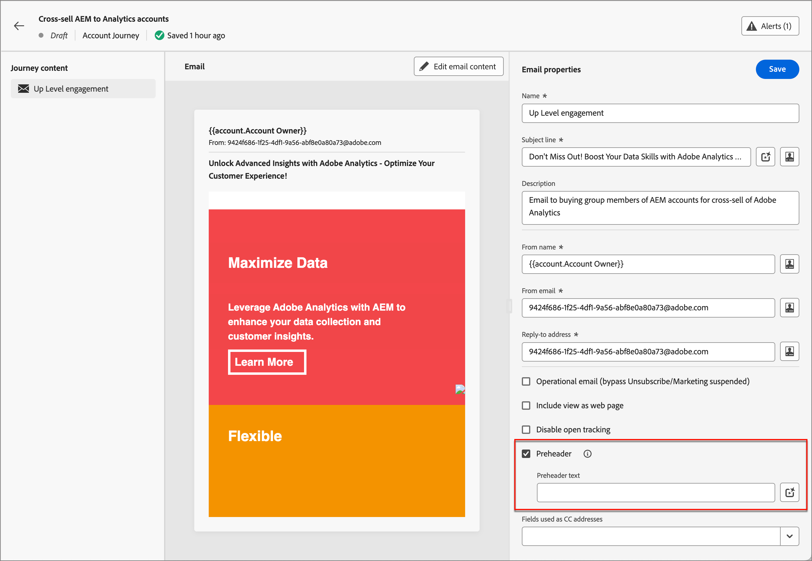
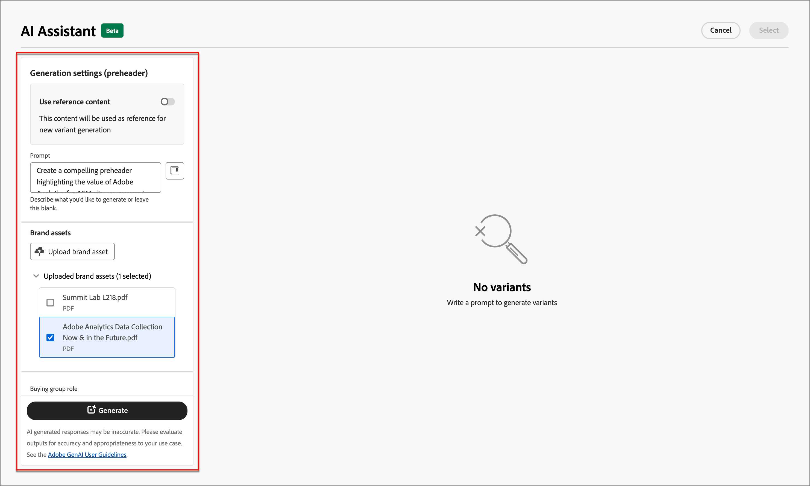

# KI-Assistent für die E-Mail-Bearbeitung

Da die Marketing-Branche wettbewerbsfähiger wird, suchen Marken nach effizienten Methoden, um schnell und effizient wirkungsvolle Inhalte zu generieren. AI Assistant für E-Mail-Authoring in Adobe Journey Optimizer B2B Edition ist die Adobe AI-gestützte Funktion zur Inhaltserstellung, die die Art und Weise revolutioniert, wie Marketingexperten professionelle und markenkonsistente E-Mail-Inhalte erstellen. Mit fortschrittlichen GenAI-Modellen und einem tiefen Verständnis der Markenrichtlinien generiert der KI-Assistent automatisch personalisierte, ansprechende und effektive Inhalte, die auf dem Marketingziel basieren und für markenumrissene Stile, Layouts, Ton und mehr optimiert sind. Der KI-Assistent ermöglicht die Erstellung und Ausführung von E-Mail-Marketingkampagnen intuitiv, einfach und unkompliziert. Durch das Hinzufügen dieser Funktion zu Ihren Workflows können Sie Zeit sparen, die Effizienz steigern und bessere Ergebnisse erzielen.

Diese neue Funktion ermöglicht die schnelle Erstellung von Text, die Erstellung von E-Mails und die Erstellung von Inhalten innerhalb von E-Mail-Strukturen. Bilder werden nicht generiert, werden jedoch aus dem Bildkatalog im Eingabe-Marken-Asset zum Modell empfohlen. Sie können diese Funktion auch verwenden, um optimale Betreffzeilen und Preheader zu generieren, um die Öffnungsrate zu beeinflussen.

>[!NOTE]
>
>Diese Funktion ist in der Beta-Version verfügbar und kann ohne vorherige Ankündigung geändert werden.

## Richtlinien und Einschränkungen

Bevor Sie mit AI Assistant in Adobe Journey Optimizer B2B Edition zur Erstellung von E-Mail-Inhalten beginnen, lesen Sie diese Richtlinien:

* Das von Ihnen definierte Marketingziel/die von Ihnen definierte Aufforderung ist ein Schlüsselfaktor für die Qualität des generierten Inhalts. Verwenden Sie eine klar definierte Eingabeaufforderung für eine korrekte Interpretation des GenAI-Modells.
* Laden Sie Marken-Assets hoch, um genaue Informationen über Markeninhalte zu erhalten. Ohne diese Assets basieren Inhalte auf öffentlich verfügbaren Informationen.
   * Die hochgeladenen Assets können die folgenden Formate aufweisen: PDF-, JPEG-, PNG- oder ZIP-Dateien (mit unterstützten Dateiformaten).
   * Die maximale Größe eines hochgeladenen Marken-Assets beträgt 50 MB. Größere Dateien oder große Mengen von Bildern können funktionieren, aber die Verarbeitungszeit wird verlängert.
* Verwenden Sie Adobe Journey Optimizer B2B Edition erstellte E-Mail-Vorlagen, vorzugsweise die integrierten oder Beispielvorlagen, eine markenspezifische Vorlage oder eine benutzerdefinierte Vorlage, um E-Mail-Inhalte zu erstellen. Es werden E-Mail-Vorlagen mit bis zu acht bis zehn Bildern empfohlen.
* Stellen Sie sicher, dass Sie alle problematischen Ausgaben mit den Miniaturansichten oder Kennzeichnungs-Symbolen für eine generierte Variante melden.
* Ihre Verwendung des KI-Assistenten unterliegt den [Adobe Generative AI-Benutzerrichtlinien](https://www.adobe.com/de/legal/licenses-terms/adobe-gen-ai-user-guidelines.html).

Die folgenden Einschränkungen gelten für den AI-Assistenten in Adobe Journey Optimizer B2B Edition zur Erstellung von E-Mail-Inhalten:

* Englisch ist die einzige unterstützte Sprache.
* Sie ist nur für den E-Mail-Kanal verfügbar.
* GenAI-Inhalte sind möglicherweise nicht genau - teilen Sie Ihr Feedback mit, damit Adobe-Ingenieure die Modelle verfeinern können.
* Sie können mehrere Marken-Assets hochladen, jedoch nur eines für eine bestimmte Generation nutzen.

>[!BEGINSHADEBOX]

## Eingabebibliothek

Eine effektive Eingabeaufforderung ist für die Generierung bestmöglicher Inhalte unerlässlich. Wenn Sie Hilfe beim Erstellen Ihrer Eingabeaufforderung benötigen, rufen Sie die _Eingabeaufforderungsbibliothek_ auf. Diese Bibliothek bietet eine Vielzahl an eindringlichen Ideen zur Verbesserung der Inhaltserstellung.

{width="500" zoomable="no"}

Wählen Sie die Eingabeaufforderung aus, die Ihren beabsichtigten Zielen am besten entspricht, und fügen Sie die erforderlichen Werte hinzu, um Ihre Marke, Ihr Angebot, Ihre Kampagne und Ihre Anwendungsfälle zu spezifizieren.

>[!ENDSHADEBOX]

## Gruppenrollen kaufen

Adobe Journey Optimizer B2B Edition bietet fünf standardmäßige B2B-Einkaufsgruppenrollen. Jede Rolle einer Einkaufsgruppe hat einen eigenen Botschaftsschwerpunkt:

| Role | Messaging-Fokus |
| ---- | --------------- |
| Exekutivausschuss | Produktinformationen  Preise  Details der technischen Integration  Produktfunktionen und -funktionen |
| Beeinflusser | Qualitätsnachweis  Einfachere Implementierung  Sachfachwissen  Wettbewerbsvorteile |
| Entscheidungsträger | ROI  Finanzwert (RoI)  Kundengeschichten |
| Praktitioner | Einfachere Verwendung von  Produktfunktionen und -funktionalität  Produktkompatibilität   Einfachere Produktintegration |
| Champion | Pädagogischer Inhalt  Gedanken, Inhalt der Führungsebene  Kundengeschichten |

Bei Auswahl einer dieser Rollen für die Gruppe wird die Ausgabe automatisch auf der Grundlage der für jede dieser Rollen relevanten Eigenschaften und Themen angepasst.

## E-Mail-Eigenschaften mit dem AI-Assistenten generieren

Wenn Sie [eine E-Mail-Aktion ](./email-authoring.md#add-an-email-action-in-an-account-journey) zu einer Konto-Journey hinzufügen, definieren Sie eine Reihe von E-Mail-Eigenschaften, die zum Senden der E-Mail verwendet werden. Der KI-Assistent kann zu einer besseren E-Mail-Interaktion beitragen, indem er empfohlene Inhalte für die E-Mail-Betreffzeile **und den** Preheader **generiert.**

1. Erstellen Sie eine E-Mail von einer Konto-Journey oder öffnen Sie eine bestehende E-Mail von einem Journey-Knoten aus.

   Die E-Mail-Vorschauseite wird mit den _[!UICONTROL E-Mail-Eigenschaften]_ auf der rechten Seite angezeigt.

1. Wählen Sie eine der folgenden Registerkarten aus, um zu erfahren, wie Sie den KI-Assistenten beim Authoring Ihrer E-Mail-Eigenschaften verwenden.

>[!BEGINTABS]

>[!TAB Betreffzeilengenerierung]

Die folgenden Schritte beschreiben die Aufgabensequenz für die Verwendung des AI-Assistenten zum Generieren einer optimierten Betreffzeile für Ihre E-Mail:

1. Klicken Sie in den _[!UICONTROL E-Mail-Eigenschaften]_ rechts neben dem Feld **[!UICONTROL Betreff]** auf das Symbol für den AI-Assistenten ( {width="30" zoomable="no"} ).

   {width="600" zoomable="yes"}

   Das Popup-Fenster &quot;KI-Assistent&quot;mit den Generierungseinstellungen für die Betreffzeile der E-Mail wird geöffnet.

   Je nach dem E-Mail-Inhalt, der mit der E-Mail verknüpft ist, oder wie Sie die Betreffzeile verwenden möchten, um Ihren Zweck zu erfüllen, gibt es verschiedene Optionen zum Generieren von Betreffzeilentext:

   * Sie können sofort ohne Eingabeaufforderung oder eines Marken-Assets auf **[!UICONTROL Erzeugen]** klicken, um den vorhandenen E-Mail-Textkörper als Kontext für die Erstellung der Betreffzeile zu verwenden.

   * (Empfohlen) Sie können eine Eingabeaufforderung, ein Marken-Asset und andere Einstellungswerte bereitstellen, um einen Kontext für die Generierung des optimalen Betreffzeilentextes für Ihre Anforderungen bereitzustellen. (Schritte 2 bis 7)

1. Geben Sie im Feld **[!UICONTROL Eingabeaufforderung]** eine Beschreibung dessen ein, was Sie generieren möchten.

   Verwenden Sie die &quot;[Eingabebibliothek](#prompt-library)&quot;, wenn Sie Hilfe beim Erstellen einer effektiven Eingabeaufforderung benötigen.

1. Geben Sie ein Marken-Asset an, das Inhalte enthält, die als Quelle für die Texterzeugung dienen sollen.

   * Wählen Sie das Asset aus dem Katalog aus.

   * Klicken Sie auf **[!UICONTROL Marken-Asset hochladen]** , um die Marken-Asset-Datei hinzuzufügen.

   {width="600" zoomable="yes"}

1. Führen Sie bei Bedarf einen Bildlauf durch und wählen Sie die Rolle **[!UICONTROL Gruppe kaufen]** aus, die als Zielgruppe für den generierten Text verwendet werden soll.

1. Verwenden Sie bei Bedarf die Messaging-Optionen, um Ihren Inhalt anzupassen:

   * **[!UICONTROL Kommunikationsstrategie]** - Wählen Sie den für Ihren generierten Text am besten geeigneten Kommunikationsstil aus.
   * **[!UICONTROL Sprache]** - Wählen Sie die Sprache aus, in der Ihr Inhalt generiert werden soll.
   * **[!UICONTROL Tone]** - Wählen Sie einen Ton aus, der bei Ihrer Zielgruppe Resonanz findet. Wenn Sie festlegen, dass Sie informativ, spielerisch oder überzeugend klingen möchten, kann der KI-Assistent die Nachricht entsprechend anpassen.

1. Verwenden Sie bei Bedarf den Regler, um die gewünschte Länge des zu generierenden Textes festzulegen.

1. Ändern Sie die Option **[!UICONTROL Emojis verwenden]** (ein- oder aus) entsprechend Ihrer Voreinstellung.

1. Wenn die Eingabeaufforderung und die Einstellungen fertig sind, klicken Sie auf **[!UICONTROL Erzeugen]**.

1. Scrollen Sie im Bedienfeld &quot;AI Assistant&quot;durch und durchsuchen Sie die generierten Varianten, um festzustellen, welche am besten geeignet ist.

   * Klicken Sie auf **[!UICONTROL Vorschau]** , um eine Vollbildversion einer ausgewählten Variante anzuzeigen.

   * Stellen Sie Feedback zu den generierten Varianten bereit, indem Sie auf das Symbol _Aufstocken_, _Abklappen_ oder _Flag_ klicken und den Grund auswählen, aus dem Ihr Feedback am besten zusammengefasst wird.

1. Navigieren Sie im Vorschaufenster zu den Optionen _Verfeinern_ , um auf weitere Anpassungsfunktionen zuzugreifen:

   * **[!UICONTROL Als Referenzinhalt verwenden]** - Wählen Sie diese Option, um die Variante als Referenzinhalt für die Generierung anderer Ergebnisse zu verwenden.

   * **[!UICONTROL Umschreiben]** - Der KI-Assistent kann Ihre Nachricht auf unterschiedliche Weise umformulieren, sodass Sie für verschiedene Zielgruppen immer frisch schreiben und ansprechend sind.

   * **[!UICONTROL Einfachere Sprache verwenden]** - Nutzen Sie den AI-Assistenten, um Ihre Sprache zu vereinfachen und für eine größere Zielgruppe Klarheit und Barrierefreiheit zu gewährleisten.

   {width="600" zoomable="yes"}

1. Klicken Sie auf **[!UICONTROL Auswählen]** , um den Betreffzeilentext durch die ausgewählte Variante zu ersetzen und zu den E-Mail-Eigenschaften zurückzukehren.

>[!TAB Preheader generation]

Ein E-Mail-Preheader ist der kurze Zusammenfassungstext, der auf die Betreffzeile folgt, wenn eine E-Mail im Posteingang angezeigt wird. Es ist ein optionales Element für eine E-Mail, aber eine großartige Möglichkeit, die Interaktion zu verbessern. Die folgenden Schritte beschreiben die Aufgabensequenz für die Verwendung des AI-Assistenten zum Generieren eines optimierten Preheaders für Ihre E-Mail:

1. Aktivieren Sie in den E-Mail-Eigenschaften das Kontrollkästchen **[!UICONTROL Preheader]** und klicken Sie rechts auf das Symbol &quot;AI Assistant&quot;( {width="30" zoomable="no"} ).

   {width="600" zoomable="yes"}

   Das Popup &quot;KI-Assistent&quot;mit den Generierungseinstellungen für den E-Mail-Preheader wird geöffnet.

   Je nach dem E-Mail-Inhalt, der mit der E-Mail verknüpft ist, oder der Zielgruppe der E-Mail gibt es verschiedene Möglichkeiten, den Preheader zu generieren:

   * Sie können sofort ohne Eingabeaufforderung oder eines Marken-Assets auf **[!UICONTROL Erzeugen]** klicken, um den vorhandenen E-Mail-Textkörper als Kontext für die Preheader-Generierung zu verwenden.

   * (Empfohlen) Sie können eine Eingabeaufforderung, ein Marken-Asset und andere Einstellungswerte bereitstellen, um einen Kontext für die Generierung des optimalen Preheader für Ihre Anforderungen bereitzustellen. (Schritte 2 bis 7)

1. Geben Sie im Feld **[!UICONTROL Eingabeaufforderung]** eine Beschreibung dessen ein, was Sie generieren möchten.

   Verwenden Sie die &quot;[Eingabebibliothek](#prompt-library)&quot;, wenn Sie Hilfe beim Erstellen einer effektiven Eingabeaufforderung benötigen.

1. Geben Sie ein Marken-Asset an, das Inhalte enthält, die als Quelle für die Texterzeugung dienen sollen.

   * Wählen Sie das Asset aus dem Katalog aus.

   * Klicken Sie auf **[!UICONTROL Marken-Asset hochladen]** , um die Marken-Asset-Datei hinzuzufügen.

   {width="600" zoomable="yes"}

1. Führen Sie bei Bedarf einen Bildlauf durch und wählen Sie die Rolle **[!UICONTROL Gruppe kaufen]** aus, die als Zielgruppe für den generierten Text verwendet werden soll.

1. Verwenden Sie bei Bedarf die Messaging-Optionen, um Ihren Inhalt anzupassen:

   * **[!UICONTROL Kommunikationsstrategie]** - Wählen Sie den für Ihren generierten Text am besten geeigneten Kommunikationsstil aus.
   * **[!UICONTROL Sprache]** - Wählen Sie die Sprache aus, in der Ihr Inhalt generiert werden soll.
   * **[!UICONTROL Tone]** - Wählen Sie einen Ton aus, der bei Ihrer Zielgruppe Resonanz findet. Wenn Sie festlegen, dass Sie informativ, spielerisch oder überzeugend klingen möchten, kann der KI-Assistent die Nachricht entsprechend anpassen.

1. Verwenden Sie bei Bedarf den Regler, um die gewünschte Länge des zu generierenden Textes festzulegen.

1. Ändern Sie die Option **[!UICONTROL Emojis verwenden]** (ein- oder aus) entsprechend Ihrer Voreinstellung.

1. Wenn die Eingabeaufforderung und die Einstellungen fertig sind, klicken Sie auf **[!UICONTROL Erzeugen]**.

1. Scrollen Sie im Bedienfeld &quot;AI Assistant&quot;durch und durchsuchen Sie die generierten Varianten, um festzustellen, welche am besten geeignet ist.

   * Klicken Sie auf **[!UICONTROL Vorschau]** , um eine Vollbildversion einer ausgewählten Variante anzuzeigen.

   * Stellen Sie Feedback zu den generierten Varianten bereit, indem Sie auf das Symbol _Aufstocken_, _Abklappen_ oder _Flag_ klicken und den Grund auswählen, aus dem Ihr Feedback am besten zusammengefasst wird.

1. Navigieren Sie im Vorschaufenster zu den Optionen _Verfeinern_ , um auf weitere Anpassungsfunktionen zuzugreifen:

   * **[!UICONTROL Als Referenzinhalt verwenden]** - Wählen Sie diese Option, um die Variante als Referenzinhalt für die Generierung anderer Ergebnisse zu verwenden.

   * **[!UICONTROL Umschreiben]** - Der KI-Assistent kann Ihre Nachricht auf unterschiedliche Weise umformulieren, sodass Sie für verschiedene Zielgruppen immer frisch schreiben und ansprechend sind.

   * **[!UICONTROL Einfachere Sprache verwenden]** - Nutzen Sie den AI-Assistenten, um Ihre Sprache zu vereinfachen und für eine größere Zielgruppe Klarheit und Barrierefreiheit zu gewährleisten.

   {width="600" zoomable="yes"}

1. Klicken Sie auf **[!UICONTROL Auswählen]** , um den Preheader durch die ausgewählte Variante zu ersetzen und zu den E-Mail-Eigenschaften zurückzukehren.

>[!ENDTABS]

## E-Mail-Textinhalt mit dem AI-Assistenten generieren

Nachdem Sie [Ihre E-Mail erstellt und personalisiert haben](./email-authoring.md#create-the-email-content), verwenden Sie den AI-Assistenten in Adobe Journey Optimizer B2B Edition, der auf generativer KI basiert, um den Inhalt Ihres E-Mail-Hauptinhalts auf die nächste Ebene zu erhöhen.

Im E-Mail-Designer kann AI Assistant Ihnen dabei helfen, die Wirkung Ihrer Sendungen zu optimieren, indem er den vollständigen E-Mail-Textkörper, zielgerichtete Textinhalte und Empfehlungen für Bilder generiert, die bei Ihrer Zielgruppe ankommen. Diese Optimierung Ihrer E-Mail-Kampagnen soll zu einer besseren Interaktion führen.

1. Erstellen Sie eine E-Mail von einer Konto-Journey und klicken Sie auf **[!UICONTROL E-Mail-Designer öffnen]** oder **[!UICONTROL E-Mail-Inhalt hinzufügen]**.

1. Wählen Sie eine E-Mail-Vorlage aus und öffnen Sie sie im visuellen E-Mail-Designer.

1. Personalisieren Sie die E-Mail nach Bedarf für den Journey-Knoten.

1. Wählen Sie einen der folgenden Registerkarten aus, um zu erfahren, wie Sie den KI-Assistenten bei der Inhaltserstellung für E-Mails verwenden können.

>[!BEGINTABS]

>[!TAB Vollständige E-Mail-Generierung]

Die folgenden Schritte beschreiben die Aufgabensequenz für die Verwendung des AI-Assistenten zur Feinabstimmung einer vorhandenen E-Mail-Vorlage:

1. Greifen Sie im E-Mail-Designer auf das Menü &quot;KI-Assistent&quot;zu, indem Sie rechts auf das Symbol ( {width="30" zoomable="no"} ) klicken.

   {width="600" zoomable="yes"}

   Die Einstellungen des AI-Assistenten auf der rechten Seite spiegeln die _Erstellungseinstellungen (vollständige E-Mail)_ wider.

1. Geben Sie im Feld **[!UICONTROL Eingabeaufforderung]** eine Beschreibung dessen ein, was Sie generieren möchten.

   Verwenden Sie die &quot;[Eingabebibliothek](#prompt-library)&quot;, wenn Sie Hilfe beim Erstellen einer effektiven Eingabeaufforderung benötigen.

   {width="600" zoomable="yes"}

1. Geben Sie ein Marken-Asset an, das Inhalte enthält, die zusätzlichen Kontext für den AI-Assistenten bieten können.

   * Wählen Sie das Asset aus dem Katalog aus.

   * Klicken Sie auf **[!UICONTROL Marken-Asset hochladen]** , um die Marken-Asset-Datei hinzuzufügen.

   Dieses Eingabe-Asset dient als Quelle für die Inhaltserstellung und Bildempfehlung in der E-Mail.

1. Wählen Sie die **[!UICONTROL Käufergruppenrolle]** aus, die als Zielgruppe für die E-Mail-Kommunikation verwendet werden soll.

1. Verwenden Sie bei Bedarf die Messaging-Optionen, um Ihren Inhalt anzupassen:

   * **[!UICONTROL Kommunikationsstrategie]** - Wählen Sie den für Ihren generierten Text am besten geeigneten Kommunikationsstil aus.
   * **[!UICONTROL Sprache]** - Wählen Sie die Sprache aus, in der Ihr Inhalt generiert werden soll.
   * **[!UICONTROL Tone]** - Wählen Sie einen Ton aus, der bei Ihrer Zielgruppe Resonanz findet. Wenn Sie festlegen, dass Sie informativ, spielerisch oder überzeugend klingen möchten, kann der KI-Assistent die Nachricht entsprechend anpassen.
   * **Inhaltstyp** - Wählen Sie eine Option, die die Art der visuellen Elemente widerspiegelt. Diese Einstellung unterscheidet zwischen verschiedenen Formen der visuellen Darstellung wie Fotos, Grafiken oder Kunst.

1. Wenn Ihre Eingabeaufforderung fertig ist, klicken Sie auf **[!UICONTROL Erzeugen]**.

1. Scrollen Sie im Bedienfeld &quot;AI Assistant&quot;durch und durchsuchen Sie die generierten Varianten, um festzustellen, welche am besten geeignet ist.

   * Klicken Sie auf **[!UICONTROL Vorschau]** , um eine Vollbildversion einer ausgewählten Variante anzuzeigen.

   * Stellen Sie Feedback zu den generierten Varianten bereit, indem Sie auf das Symbol _Aufstocken_, _Abklappen_ oder _Flag_ klicken und den Grund auswählen, aus dem Ihr Feedback am besten zusammengefasst wird.

     {width="600" zoomable="yes"}

1. Klicken Sie auf **[!UICONTROL Auswählen]** , um den Vorlageninhalt durch die ausgewählte Variante zu ersetzen und zum E-Mail-Designer zurückzukehren.

   Im E-Mail-Designer können Sie die Bearbeitungs- und Formatierungswerkzeuge auf der Arbeitsfläche verwenden, um den Inhalt zu ändern, sowie die Optionen _[!UICONTROL Einstellungen]_ und _[!UICONTROL Stil]_ auf der rechten Seite.

>[!TAB Texterstellung]

Die folgenden Schritte beschreiben die Aufgabensequenz für die Verwendung des AI-Assistenten zur Verfeinerung oder Verbesserung des Textinhalts für eine vorhandene E-Mail:

1. Greifen Sie im E-Mail-Designer auf das Menü &quot;KI-Assistent&quot;zu, indem Sie rechts auf das Symbol ( {width="30" zoomable="no"} ) klicken.

   {width="600" zoomable="yes"}

1. Wählen Sie eine _Text_ -Komponente aus, um den spezifischen Inhalt als Ziel festzulegen.

   Die Einstellungen des AI-Assistenten auf der rechten Seite spiegeln _Erstellungseinstellungen (Text)_ wider.

1. Geben Sie im Feld **[!UICONTROL Eingabeaufforderung]** eine Beschreibung dessen ein, was Sie generieren möchten.

   {width="600" zoomable="yes"}

   Verwenden Sie die &quot;[Eingabebibliothek](#prompt-library)&quot;, wenn Sie Hilfe beim Erstellen einer effektiven Eingabeaufforderung benötigen.

1. Geben Sie ein Marken-Asset an, das Inhalte enthält, die als Quelle für die Texterzeugung dienen sollen.

   * Wählen Sie das Asset aus dem Katalog aus.

   * Klicken Sie auf **[!UICONTROL Marken-Asset hochladen]** , um die Marken-Asset-Datei hinzuzufügen.

1. Wählen Sie die **[!UICONTROL Buying group role]** aus, die als Zielgruppe für den generierten Text verwendet werden soll.

1. Verwenden Sie bei Bedarf die Sprach- und Messaging-Optionen, um Ihren Inhalt anzupassen:

   * **[!UICONTROL Kommunikationsstrategie]** - Wählen Sie den für Ihren generierten Text am besten geeigneten Kommunikationsstil aus.
   * **[!UICONTROL Sprache]** - Wählen Sie die Sprache aus, in der Ihr Inhalt generiert werden soll.
   * **[!UICONTROL Tone]** - Wählen Sie einen Ton aus, der bei Ihrer Zielgruppe Resonanz findet. Wenn Sie festlegen, dass Sie informativ, spielerisch oder überzeugend klingen möchten, kann der KI-Assistent die Nachricht entsprechend anpassen.

1. Verwenden Sie bei Bedarf den Regler, um die gewünschte Länge des zu generierenden Textes festzulegen.

1. Wenn Ihre Eingabeaufforderung fertig ist, klicken Sie auf **[!UICONTROL Erzeugen]**.

1. Durchsuchen Sie die generierten _Varianten_ und klicken Sie auf **[!UICONTROL Vorschau]** , um eine Vollbildversion der ausgewählten Variante anzuzeigen.

1. Navigieren Sie im Vorschaufenster zu den Optionen _Verfeinern_ , um auf weitere Anpassungsfunktionen zuzugreifen:

   * **[!UICONTROL Als Referenzinhalt verwenden]** - Wählen Sie diese Option, um die Variante als Referenzinhalt für die Generierung anderer Ergebnisse zu verwenden.

   * **[!UICONTROL Entwickeln]** - Der KI-Assistent kann Ihnen dabei helfen, bestimmte Themen anzusprechen und zusätzliche Details für ein besseres Verständnis und eine bessere Interaktion bereitzustellen.

   * **[!UICONTROL Zusammenfassung]** - Lange Informationen können E-Mail-Empfänger überlasten. Verwenden Sie den KI-Assistenten, um wichtige Punkte in klaren, präzisen Zusammenfassungen zusammenzufassen, die Aufmerksamkeit erregen und sie dazu ermutigen, mehr zu lesen.

   * **[!UICONTROL Umschreiben]** - Der KI-Assistent kann Ihre Nachricht auf unterschiedliche Weise umformulieren, sodass Sie für verschiedene Zielgruppen immer frisch schreiben und ansprechend sind.

   * **[!UICONTROL Einfachere Sprache verwenden]** - Nutzen Sie den AI-Assistenten, um Ihre Sprache zu vereinfachen und für eine größere Zielgruppe Klarheit und Barrierefreiheit zu gewährleisten.

   {width="700" zoomable="yes"}

1. Wenn Sie den gewünschten Inhalt haben, klicken Sie auf **[!UICONTROL Auswählen]** , um den Text durch die ausgewählte Variante zu ersetzen und zum E-Mail-Designer zurückzukehren.

   Im E-Mail-Designer können Sie die Bearbeitungs- und Formatierungswerkzeuge auf der Arbeitsfläche verwenden, um den Text sowie die Optionen _[!UICONTROL Einstellungen]_ und _[!UICONTROL Stil]_ auf der rechten Seite zu ändern.

>[!TAB Bildempfehlungen]

Sie können den KI-Assistenten verwenden, um Ihre Assets zu optimieren und zu verbessern und ein benutzerfreundlicheres Erlebnis zu gewährleisten. In den folgenden Schritten wird die Aufgabensequenz für die Verwendung des AI-Assistenten zur Verbesserung des Bildinhalts der E-Mail beschrieben:

1. Öffnen Sie das Menü des KI-Assistenten , indem Sie auf das Symbol ( {width="30" zoomable="no"} ) rechts klicken.

   {width="600" zoomable="yes"}

1. Wählen Sie eine Komponente vom Typ _Bild_ aus, um den spezifischen Inhalt anzusprechen und auf das Menü &quot;KI-Assistent&quot;zuzugreifen.

   Die Einstellungen auf der rechten Seite beziehen sich auf _[!UICONTROL Erstellungseinstellungen (Bild)]_.

1. Geben Sie zum Optimieren des Assets im Feld **[!UICONTROL Eingabeaufforderung]** eine Beschreibung dessen ein, was Sie möchten.

   {width="600" zoomable="yes"}

   Verwenden Sie die &quot;[Eingabebibliothek](#prompt-library)&quot;, wenn Sie Hilfe beim Erstellen einer effektiven Eingabeaufforderung benötigen.

1. Klicken Sie auf **[!UICONTROL Marken-Asset hochladen]** , um ein Marken-Asset mit Inhalten hinzuzufügen, die zusätzlichen Kontext für den AI-Assistenten bieten können.

   Wenn das benötigte Asset bereits verfügbar ist, erweitern Sie **[!UICONTROL Hochgeladene Marken-Assets]** und wählen Sie das Asset aus.

   Ihre Eingabeaufforderung muss immer mit einem vorhandenen Asset verknüpft sein.

1. Verwenden Sie die Bildeinstellungen, um Ihre Eingabeaufforderung zu verfeinern:

   * **[!UICONTROL Seitenverhältnis]** - Diese Einstellung bestimmt die Breite und Höhe des Assets. Sie können aus gängigen Verhältnissen wie 16:9, 4:3, 3:2 oder 1:1 wählen oder eine benutzerdefinierte Größe eingeben.
   * **[!UICONTROL Farbe und Ton]** - Diese Einstellung beeinflusst das Gesamterscheinungsbild der Farben innerhalb eines Bildes sowie die Stimmung oder Atmosphäre, die es vermittelt.
   * **[!UICONTROL Content-Typ]** - Diese Einstellung kategorisiert die Art des visuellen Elements und unterscheidet zwischen verschiedenen Formen der visuellen Darstellung, z. B. Fotos, Grafiken oder Kunst.
   * **[!UICONTROL Beleuchtung]** - Mit dieser Einstellung wird der in einem Bild vorhandene Blitz angepasst, der seine Atmosphäre formen und bestimmte Elemente hervorhebt.
   * **[!UICONTROL Komposition]** - Diese Einstellung bestimmt die Anordnung der Elemente innerhalb des Rahmens eines Bildes.

1. Wenn Sie mit der Konfiguration der Eingabeaufforderung zufrieden sind, klicken Sie auf **[!UICONTROL Erzeugen]**.

   AI Assistant verarbeitet die Anforderung und empfiehlt die am besten geeigneten Bilder aus dem Eingabemarken-Asset und basierend auf der Eingabeaufforderung und anderen Eingaben.

   >[!IMPORTANT]
   >
   >Wenn das Asset der Eingabemarke keine Bilder enthält oder es keine Bilder gibt, die für die Eingabeaufforderung relevant sind, ist die Ausgabe leer.

1. Durchsuchen Sie die _[!UICONTROL Varianten]_ und wählen Sie die aus, die für die E-Mail am besten geeignet ist.

   Um eine Vollbildversion der ausgewählten Variante anzuzeigen, klicken Sie auf **[!UICONTROL Vorschau]**.

1. Markieren Sie das gewünschte Bild und klicken Sie auf **[!UICONTROL Auswählen]** , um das Bild oder den Platzhalter durch das ausgewählte Element zu ersetzen und zum E-Mail-Designer zurückzukehren.

   Im E-Mail-Designer können Sie die Bearbeitungs- und Formatierungswerkzeuge auf der Arbeitsfläche verwenden, um den Inhalt zu ändern, sowie die Optionen _[!UICONTROL Einstellungen]_ und _[!UICONTROL Stil]_ auf der rechten Seite.

>[!ENDTABS]
