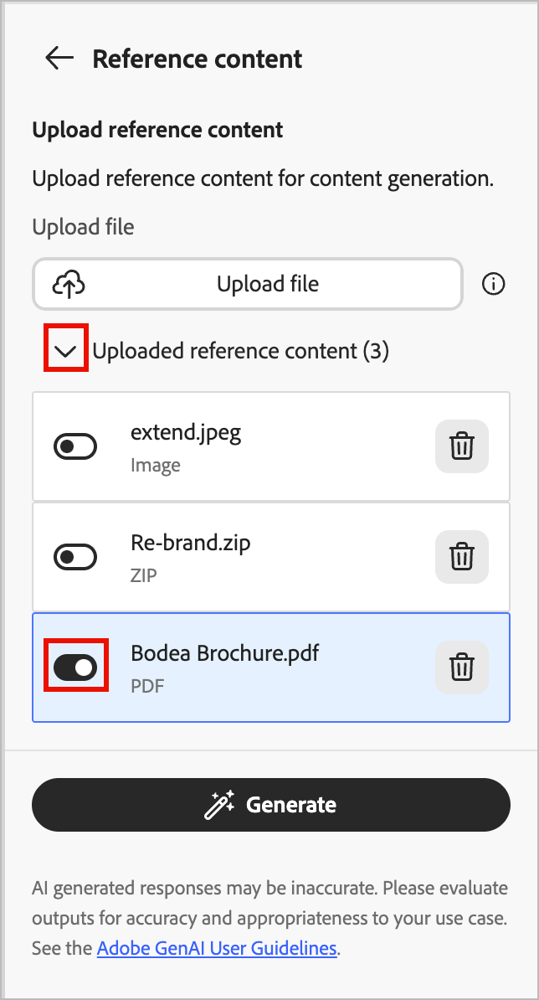
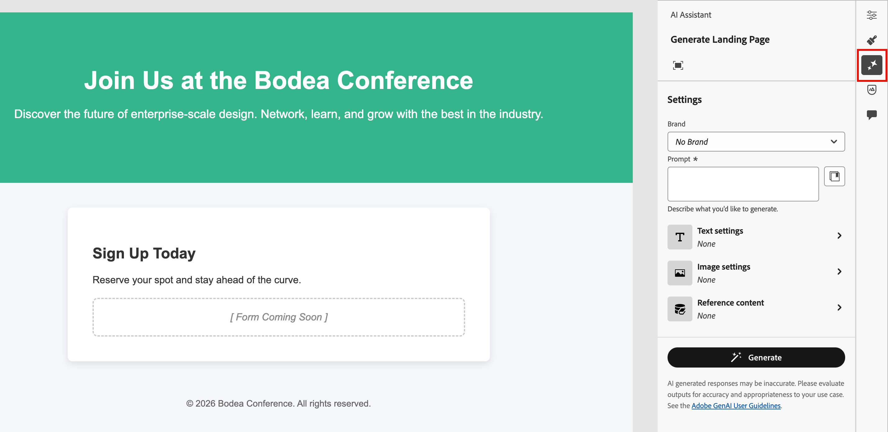

# KI-Assistent für Landingpage-Inhalte {#generative-full-content}

Der KI-Assistent für Landingpage-Inhalte in [!DNL Adobe Journey Optimizer B2B Edition] verwendet die KI-gestützten Inhaltsgenerierungsfunktionen von Adobe und revolutioniert die Art und Weise, wie Marketing-Experten professionelle und markenkonsistente Landingpage-Inhalte erstellen. Mit fortschrittlichen generativen KI-Modellen und einem tiefen Verständnis der Markenrichtlinien generiert der KI-Assistent automatisch personalisierte, ansprechende und effektive Inhalte. Es verwendet Ihr Marketing-Ziel und optimiert den Inhalt für Markenstile, Layouts, Ton und mehr. Der KI-Assistent macht die Erstellung und Ausführung von Kampagnen und Programmen intuitiver, einfacher und unkomplizierter. Durch das Hinzufügen dieser Funktion zu Ihren Workflows können Sie Zeit sparen, die Effizienz verbessern und bessere Ergebnisse erzielen.

Sie können vollständige Inhaltserlebnisse für Ihre Landingpages generieren, einschließlich Text und Bildern. Mit dieser robusten Funktion können Sie ansprechende, markeninterne Inhalte erstellen, die mit Ihrer Audience verbunden sind.

>[!NOTE]
>
>Diese Funktion ist in der Beta-Version verfügbar und kann ohne vorherige Ankündigung geändert werden.

>[!IMPORTANT]
>
>Um auf diese Funktionen in [!DNL Journey Optimizer B2B Edition] zugreifen zu können, benötigen Sie die Berechtigung _[!UICONTROL KI-Assistent]_ > _[!UICONTROL Inhalt generieren]_. Weitere Informationen dazu, wie ein Produktadministrator Funktionsberechtigungen erteilen kann, finden Sie unter [Rollen für Produktberechtigungen bearbeiten](../admin/user-management.md#edit-roles-for-product-permissions).

## Richtlinien und Einschränkungen

Bevor Sie mit der Verwendung dieser Funktion beginnen, lesen Sie die [Richtlinien und Einschränkungen](../ai-assistant/generative-ai-content.md#general-guidelines-and-limitations). [Die Benutzerzustimmung &#x200B;](https://www.adobe.com/legal/licenses-terms/adobe-dx-gen-ai-user-guidelines.html){target="_blank"} auch akzeptiert werden, bevor Sie KI-Funktionen in [!DNL Journey Optimizer B2B Edition] verwenden können. Weitere Informationen erhalten Sie beim Adobe-Support.

Da sich Adobe verpflichtet hat, die Verwendung generativer KI-Tools bei der Medienerstellung transparenter zu gestalten, wendet Adobe [Inhaltsanmeldeinformationen](https://helpx.adobe.com/firefly/web/get-started/learn-the-basics/content-credentials-overview.html){target="_blank"} für alle Inhalte oder Projekte an, die ein Firefly-generiertes Asset enthalten, wenn es heruntergeladen oder exportiert wird.

Die folgenden Einschränkungen und Richtlinien gelten für KI-Assistenten-Funktionen, die für die Erstellung von Landingpage-Inhalten in [!DNL Journey Optimizer B2B Edition] verwendet werden:

* Englisch ist die einzige unterstützte Sprache.
* Der generierte Inhalt ist möglicherweise nicht korrekt. Geben Sie Ihr Feedback, damit Adobe-Techniker die Modelle verfeinern können.
* Sie können mehrere Inhaltsreferenz-Assets hochladen, aber nur eines für eine bestimmte Generation nutzen.
* Verwenden Sie eine markenspezifische oder benutzerdefinierte Vorlage, um Inhalte für eine vollständige Landingpage zu generieren. Es werden Landingpage-Vorlagen mit bis zu 8-10 Bildern empfohlen.
* Achten Sie bei der Auswahl generierter Varianten darauf, problematische Ausgaben mit den Symbolen „Daumen hoch“, „Daumen runter“ oder „Flag“ zu melden.

## Eingabe und Einstellungen für die Inhaltserstellung

Sie können vollständige Inhalte für eine Landingpage oder für ausgewählte Komponenten auf der Seite generieren. Wenn Sie die Tools des KI-Assistenten verwenden, um die benötigten Inhalte zu generieren, geben Sie die Eingabe einschließlich der Eingabeaufforderungen und Referenzinhalte sowie die Einstellungen für Text und Bilder an.

### Eingabeaufforderungen

Verwenden Sie klar definierte Eingabeaufforderungen für das generative KI-Modell, um die Interpretation präzise durchzuführen. Das von Ihnen angegebene Marketing-Ziel bzw. die von Ihnen angegebene Eingabeaufforderung wirkt sich stark auf die Qualität des generierten Inhalts aus.

{width="320"}

Weitere Informationen zum Erstellen effektiver Eingabeaufforderungen finden Sie unter _[Best Practices für Eingabeaufforderungen](../ai-assistant/generative-ai-content.md#generative-ai-prompting-guide)_.

>[!BEGINSHADEBOX]

**Eingabeaufforderungsbibliothek**

Eine effektive Eingabeaufforderung ist für die Erstellung des bestmöglichen Inhalts unerlässlich. Wenn Sie Hilfe bei der Erstellung Ihrer Eingabeaufforderung benötigen, klicken Sie auf das Symbol _Bibliothek auffordern_ , um auf eine Bibliothek mit Eingabeaufforderungsideen zuzugreifen, die nach Zielen organisiert sind. Geben Sie Text in das Suchfeld ein, um eine Eingabeaufforderung basierend auf einer Keyword-Zeichenfolge zu finden.

{width="600" zoomable="no"}

Wählen Sie die Eingabeaufforderung aus, die Ihren Zielen am besten entspricht, und klicken Sie auf **[!UICONTROL Diese Eingabeaufforderung ausprobieren]**. Ersetzen Sie im _[!UICONTROL Eingabeaufforderung]_ alle Platzhalter (z. B. `[Key Feature/Information]`) durch die erforderlichen Werte, die Ihre Marke, Ihr Angebot, Ihre Kampagne und Ihre Anwendungsfälle angeben.

>[!ENDSHADEBOX]

### Texteinstellungen

Erweitern Sie die **[!UICONTROL Texteinstellungen]** im rechten Bereich und legen Sie die Optionen für den generierten Text fest.

* **[!UICONTROL Einkaufsgruppe]** - Wählen Sie die [Einkaufsgruppenrolle](../buying-groups/buying-groups-role-templates.md) aus, die für das Targeting Ihrer Nachrichten verwendet werden soll.
* **[!UICONTROL Marketing-Journey]**-Schritt: Wählen Sie den [Gruppen-](../buying-groups/buying-group-stages.md)) aus, der für das Targeting der Nachricht verwendet werden soll.
* **[!UICONTROL Kommunikationsstrategie]** - Wählen Sie den am besten geeigneten Kommunikationsstil für Ihren generierten Text.
* **[!UICONTROL Language]** - Wählen Sie die Sprache Ihrer generierten Inhalte aus.
* **[!UICONTROL Tone]** - Der Ton sollte bei Ihrer Zielgruppe Anklang finden. Sie können die Nachricht zum Beispiel so anpassen, dass sie informativ, verspielt oder überzeugend klingt.

{width="350" zoomable="yes"}

Klicken Sie auf den Pfeil nach links, um zur Hauptseite (_[!UICONTROL )]_.

### Bildeinstellungen

Um Bilder in Ihren generierten Inhalt aufzunehmen, erweitern Sie **[!UICONTROL Bereich „Bildeinstellungen]** und legen Sie die Optionen fest.

Die **[!UICONTROL Generieren von Bildern mit KI]** ist standardmäßig deaktiviert. Aktivieren Sie diese Funktion und legen Sie die folgenden Optionen fest, um generierte Bilder in die vorgeschlagenen Inhaltsvarianten aufzunehmen:

<!-- * **[!UICONTROL Generative model]**: Select from available built-in models, custom Firefly models trained on your brand assets, or third-party image generation providers to create images that align with your specific needs and brand requirements. -->
* **[!UICONTROL Seitenverhältnis]**: Wenn eine Bildkomponente ausgewählt wird, bestimmt diese Einstellung die Breite und Höhe des Assets. Sie können aus gängigen Verhältnissen wie 16:9, 4:3, 3:2 oder 1:1 wählen oder eine benutzerdefinierte Größe eingeben.
* **[!UICONTROL Inhaltstyp]**: Der Typ kategorisiert die Art des visuellen Elements, wobei zwischen verschiedenen Formen visueller Darstellung wie Fotos, Grafiken oder Kunst unterschieden wird.
* **[!UICONTROL Visuelle Intensität]**: Kontrollieren Sie die Wirkung des Bildes, indem Sie seine Intensität anpassen. Eine niedrigere Einstellung (z. B. 2) erzeugt ein weicheres, zurückhaltenderes Erscheinungsbild, während eine höhere Einstellung (z. B. 10) das Bild lebendiger und visuell leistungsfähiger macht.
* **[!UICONTROL Farbe und Ton]**: Das Gesamtbild der Farben innerhalb eines Bildes und die Stimmung oder Atmosphäre, die es vermittelt.
* **[!UICONTROL Beleuchtung]**: Der für das Bild verwendete Beleuchtungsstil, der seine Atmosphäre formt und bestimmte Elemente hervorhebt.
* **[!UICONTROL Komposition]**: Die Anordnung der Elemente innerhalb des Rahmens eines Bildes.

{width="350" zoomable="yes"}

Klicken Sie auf den Pfeil nach links, um zur Hauptseite (_[!UICONTROL )]_.

### Referenzinhalt

Laden Sie Referenz-Content-Assets hoch, um genaue, markeninterne Inhalte zu generieren. Andernfalls basiert der generierte Inhalt auf öffentlich verfügbaren Informationen. Referenzinhalte dienen als Quelle für die Inhaltserstellung und Bildempfehlungen. Richtlinien und Best Practices finden Sie unter _[Optimierte Referenzinhalte](../ai-assistant/generative-ai-content.md#reference-content)_.

Klicken Sie in den **[!UICONTROL Referenzinhalt]** auf **[!UICONTROL Datei hochladen]**, um jedes Asset hinzuzufügen, das Inhalte enthält, die Sie für zusätzlichen Kontext verwenden möchten.

{width="350" zoomable="yes"}

Die hochzuladende Datei kann die folgenden Formate aufweisen: PDF-, JPEG-, PNG- oder ZIP-Dateien (mit unterstützten Dateiformaten). Die maximale Größe für ein hochgeladenes Marken-Asset beträgt 50 MB. Größere Dateien oder eine große Anzahl von Bildern können funktionieren, aber das erhöht die Verarbeitungszeit.

Wenn Sie eine zuvor hochgeladene Datei auswählen möchten, erweitern Sie die Liste **[!UICONTROL Hochgeladener Referenzinhalt]** und aktivieren Sie das Asset, das Sie für die Inhaltserstellung verwenden möchten.

{width="350" zoomable="yes"}

## Verwenden der generativen KI-Tools {#gen-ai-tools}

Um mit der Erstellung Ihres Inhalts zu beginnen, öffnen Sie den Inhaltseditor für die Landingpage und rufen Sie die Tools für generative KI in der äußeren Leiste des rechten Bedienfelds auf. Wählen Sie den _KI_ Assistenten ( {width="25" zoomable="no"} ) aus, um die Tools zur Inhaltserstellung anzuzeigen, die für die aktuelle Inhaltsauswahl verfügbar sind.

Führen Sie die folgenden Schritte entsprechend dem Typ der Inhaltserstellung für Landingpages aus, die Sie verwenden möchten:

>[!BEGINTABS]

>[!TAB Vollständige Seite]

Führen Sie die folgenden Schritte aus, um den KI-Assistenten für die vollständige Generierung von Landingpages zu verwenden, indem Sie eine vorhandene Landingpage-Vorlage verfeinern:

1. Klicken [&#x200B; nach dem Erstellen der &#x200B;](./landing-pages.md#create-a-landing-page) auf **[!UICONTROL Landingpage bearbeiten]**.

1. Wählen Sie eine Vorlage.

   Die vollständige Inhaltserstellung erfordert eine Vorlage. Dabei kann es sich um eine von Adobe bereitgestellte Standardvorlage oder um eine gespeicherte Vorlage handeln. Sie können auch die Option _[!UICONTROL HTML importieren]_ zum Importieren einer Vorlage verwenden.

   Weitere Informationen zur Verwendung einer Landingpage-Vorlage finden Sie unter _[Auswählen einer gespeicherten oder Beispielvorlage](./landing-pages.md#select-a-saved-or-sample-template)_.

1. Wählen Sie in der äußeren Leiste des rechten Bedienfelds das Symbol _KI-Assistent_ aus ({width="25" zoomable="no"}).

   {width="600" zoomable="yes"}

   Die Einstellungen des KI-Assistenten auf der rechten Seite spiegeln die Erzeugungseinstellungen für die gesamte Landingpage wider.

1. (Beta) Wählen Sie Ihre **[!UICONTROL Marke]**, um sicherzustellen, dass die von KI generierten Inhalte mit Ihren Markenspezifikationen übereinstimmen.

   Wenn keine veröffentlichten Marken vorhanden sind, klicken Sie auf **[!UICONTROL Marke erstellen]**, um Ihre [wiederverwendbaren Markenrichtlinien“ &#x200B;](./brands-overview.md) definieren.

1. Geben **[!UICONTROL im Feld &quot;]**&quot; eine Beschreibung dessen ein, was generiert werden soll.

   Verwenden Sie die [Eingabeaufforderungsbibliothek](#prompt-library), wenn Sie Hilfe bei der Erstellung einer effektiven Eingabeaufforderung benötigen.

   {width="600" zoomable="yes"}

   >[!TIP]
   >
   >Wenn Sie mit der Einholung von generierten Inhalten noch nicht vertraut sind, lesen Sie den Abschnitt _[Best Practices zur Einholung von](../ai-assistant/generative-ai-content.md#generative-ai-prompting-guide)_&quot;.

1. Füllen Sie die Einstellungen für Inhaltsanleitungen aus, um den generierten Inhalt anzupassen:

   * [**[!UICONTROL Texteinstellungen]**](#text-settings) - Anleitung für den generierten Textinhalt.
   * [**[!UICONTROL Bildeinstellungen]**](#image-settings) - Wenn Sie Bilder in den generierten Inhalt aufnehmen möchten, aktivieren Sie die Bildgenerierung und geben Sie eine Anleitung an.
   * [**[!UICONTROL Referenzinhalt]**](#reference-content) - Stellen Sie das Inhalts-Asset bereit, das als Quelle für die Inhaltserstellung dient.

1. Wenn Ihre Eingabeaufforderung und die Einstellungen fertig sind, klicken Sie auf **[!UICONTROL Generieren]**.

1. Scrollen Sie im Bedienfeld KI-Assistent nach unten und durchsuchen Sie die generierten Varianten, um zu bestimmen, welche am besten geeignet ist.

   * Klicken Sie auf _Symbol_ Vollbild“ (  ), um das Dialogfeld _[!UICONTROL Landingpage generieren]_ zu öffnen

   * Verwenden Sie bei Bedarf die [Verfeinerungsaktionen](#refine-a-variation) um die Varianz so anzupassen, dass sie genau Ihren Anforderungen entspricht.

   * [Feedback senden](#submit-variation-feedback) für die generierten Varianten, indem Sie auf das Symbol _Daumen hoch_, _Daumen runter_ oder _Flag_ klicken und den Grund auswählen, der Ihr Feedback am besten zusammenfasst.

1. Klicken Sie **[!UICONTROL Auswählen]**, um die Vorlageninhalte durch die ausgewählte Variante zu ersetzen und zum Design-Bereich der Landingpage zurückzukehren.

   Sie können die Bearbeitungs- und Formatierungswerkzeuge auf der Arbeitsfläche verwenden, um den generierten Inhalt sowie die Optionen _[!UICONTROL Einstellungen]_ und _[!UICONTROL Stil]_ auf der rechten Seite zu ändern.

>[!TAB Nur Text]

Führen Sie die folgenden Schritte aus, um den KI-Assistenten zur Verfeinerung oder Verbesserung des Textinhalts für eine vorhandene Landingpage zu verwenden:

1. Wählen Sie im Design-Bereich der Landingpage eine _Text_-Komponente aus, um auf die spezifischen Inhalte zuzugreifen.

1. Wählen Sie in der äußeren Leiste des rechten Bedienfelds das Symbol _KI-Assistent_ aus ({width="25" zoomable="no"}).

   {width="600" zoomable="yes"}

   Die Einstellungen auf der rechten Seite spiegeln die Einstellungen zur Inhaltserstellung für die Textkomponente wider.

1. (Beta) Wählen Sie Ihre **[!UICONTROL Marke]**, um sicherzustellen, dass die von KI generierten Inhalte mit Ihren Markenspezifikationen übereinstimmen.

   Wenn keine veröffentlichten Marken vorhanden sind, klicken Sie auf **[!UICONTROL Marke erstellen]**, um [Ihre wiederverwendbaren Markenrichtlinien zu definieren](./brands-overview.md).

1. Geben **[!UICONTROL im Feld &quot;]**&quot; eine Beschreibung dessen ein, was generiert werden soll.

   {width="600" zoomable="yes"}

   Verwenden Sie die [Eingabeaufforderungsbibliothek](#prompt-library), wenn Sie Hilfe bei der Erstellung einer effektiven Eingabeaufforderung benötigen.

1. Füllen Sie die Einstellungen für Inhaltsanleitungen aus, um den generierten Inhalt anzupassen:

   * [**[!UICONTROL Texteinstellungen]**](#text-settings) - Anleitung für den generierten Textinhalt.

   * [**[!UICONTROL Referenzinhalt]**](#reference-content) - Bereitstellung der Inhalts-Assets, die als Quelle für die Inhaltserstellung dienen.

1. Wenn Ihre Eingabeaufforderung und die Einstellungen fertig sind, klicken Sie auf **[!UICONTROL Generieren]**.

1. Scrollen Sie im Bedienfeld KI-Assistent nach unten und durchsuchen Sie die generierten Varianten, um zu bestimmen, welche am besten geeignet ist.

   * Klicken Sie auf das _Vollbild_-Symbol  ), um das Dialogfeld _[!UICONTROL Text generieren]_ zu öffnen

   * Verwenden Sie bei Bedarf die [Verfeinerungsaktionen](#refine-a-variation) um die Varianz so anzupassen, dass sie genau Ihren Anforderungen entspricht.

   * [Feedback senden](#submit-variation-feedback) für die generierten Varianten, indem Sie auf das Symbol _Daumen hoch_, _Daumen runter_ oder _Flag_ klicken und den Grund auswählen, der Ihr Feedback am besten zusammenfasst.

1. Wenn Sie über die gewünschten Inhalte verfügen, klicken Sie auf **[!UICONTROL Auswählen]**, um den Text durch die ausgewählte Variante zu ersetzen und zum Design-Bereich der Landingpage zurückzukehren.

   Sie können die Bearbeitungs- und Formatierungswerkzeuge auf der Arbeitsfläche verwenden, um den Text sowie die Optionen _[!UICONTROL Einstellungen]_ und _[!UICONTROL Stil]_ auf der rechten Seite zu ändern.

>[!TAB Nur Bild]

Führen Sie die folgenden Schritte aus, um den KI-Assistenten zu verwenden und den Bildinhalt für eine vorhandene Landingpage zu verfeinern oder zu verbessern:

1. Wählen Sie im Design-Bereich der Landingpage eine Komponente _Bild_ aus, um auf die spezifischen Inhalte zuzugreifen.

1. Wählen Sie in der äußeren Leiste des rechten Bedienfelds das Symbol _KI-Assistent_ aus ({width="25" zoomable="no"}).

   {width="600" zoomable="yes"}

   Die Einstellungen des KI-Assistenten auf der rechten Seite spiegeln die Erzeugungseinstellungen für die Bildkomponente wider.

1. (Beta) Wählen Sie Ihre **[!UICONTROL Marke]**, um sicherzustellen, dass die von KI generierten Inhalte mit Ihren Markenspezifikationen übereinstimmen.

   Wenn keine veröffentlichten Marken vorhanden sind, klicken Sie auf **[!UICONTROL Marke erstellen]**, um [Ihre wiederverwendbaren Markenrichtlinien zu definieren](./brands-overview.md).

1. Geben Sie im Feld „Eingabeaufforderung“ eine Beschreibung **[!UICONTROL gewünschten]** ein.

   {width="600" zoomable="yes"}

   Verwenden Sie die [Eingabeaufforderungsbibliothek](#prompt-library), wenn Sie Hilfe bei der Erstellung einer effektiven Eingabeaufforderung benötigen.

1. Füllen Sie die Einstellungen für Inhaltsanleitungen aus, um den generierten Inhalt anzupassen:

   * [**[!UICONTROL Bildeinstellungen]**](#image-settings) - Wenn Sie Bilder in den generierten Inhalt aufnehmen möchten, aktivieren Sie die Bildgenerierung und geben Sie eine Anleitung an.

   * [**[!UICONTROL Referenzinhalt]**](#reference-content) - Bereitstellung der Inhalts-Assets, die als Quelle für die Inhaltserstellung dienen.

1. Wenn Sie mit Ihrer Eingabeaufforderung und den Einstellungen zufrieden sind, klicken Sie auf **[!UICONTROL Generieren]**.

   Der KI-Assistent verarbeitet die Anfrage und generiert basierend auf der Eingabeaufforderung und anderen Eingaben die am besten geeigneten Bilder.

   >[!IMPORTANT]
   >
   >Wenn der Referenzinhalt keine Bilder enthält oder für die Eingabeaufforderung keine Bilder relevant sind, ist die Ausgabe leer.

1. Durchsuchen Sie die generierten Varianten oder klicken Sie auf das Symbol _Vollbild_ (  ), um das Dialogfeld _[!UICONTROL Bild generieren]_ zu öffnen.

   Das Dialogfeld bietet zusätzlichen Platz zum Vergleichen der Varianten, Anpassen der Einstellungen für Bilder und Referenzinhalte (falls erforderlich) und zum Neugenerieren der Varianten.

   Sie können eine Variante auswählen und auf **[!UICONTROL Ähnlich generieren]** klicken, um zusätzliche Bilder zu generieren, die der ausgewählten Variante ähnlich sind. Oder klicken Sie auf **[!UICONTROL In Adobe Express bearbeiten]**, um Ihre eigenen Änderungen am Bild vorzunehmen. Weitere [&#x200B; zur Verwendung von Adobe Express zum Verfeinern &#x200B;](./image-edit-adobe-express.md#quick-actions-in-adobe-express) Bildern finden Sie unter „Schnellaktionen in Adobe Express&quot;.

   {width="700" zoomable="yes"}

   Sie können auch [Feedback senden](#submit-variation-feedback) für die generierten Varianten einreichen.

1. Markieren Sie das gewünschte Bild und klicken Sie auf **[!UICONTROL Auswählen]**, um das Bild oder den Platzhalter durch das ausgewählte Element zu ersetzen und zum Design-Bereich der Landingpage zurückzukehren.

   Sie können die Bearbeitungs- und Formatierungswerkzeuge auf der Arbeitsfläche verwenden, um das Bild sowie die Optionen _[!UICONTROL Einstellungen]_ und _[!UICONTROL Stil]_ auf der rechten Seite zu ändern.

>[!ENDTABS]

## Vorschau und Inhaltsverfeinerung {#refine-finalize}

Nachdem Sie Inhaltsvarianten generiert haben, können Sie die Ergebnisse optimieren, um sicherzustellen, dass sie genau Ihren Anforderungen entsprechen. Überprüfen Sie die Markenausrichtung, passen Sie Ton und Sprache an und bereiten Sie den Inhalt für einen überprüfbaren Entwurf vor. Sie können auch Feedback für eine Variante senden, um den KI-Assistenten zu trainieren und die zukünftige Ausgabe zu verbessern.

### Vollbildansicht öffnen

1. Navigieren Sie nach der ersten Inhaltserstellung durch die **[!UICONTROL Varianten]**.

1. Ermitteln Sie die Variante, die Ihren Zielen am besten entspricht, und klicken Sie auf das Symbol _Vollbild_ (  ), um das Dialogfeld zu öffnen.

   {width="700" zoomable="yes"}

1. Wenn Sie mit der ausgewählten Variante zufrieden sind, klicken Sie auf **[!UICONTROL Auswählen]**, um sie auf die Arbeitsfläche anzuwenden.

### Verfeinern einer Variante

Klicken Sie auf die **[!UICONTROL Verfeinern]**, um auf zusätzliche Anpassungsfunktionen für Landingpage- und Textvarianten zuzugreifen:

* **[!UICONTROL Entwickeln]** - Der KI-Assistent kann Ihnen dabei helfen, bestimmte Themen zu vertiefen und zusätzliche Details bereitzustellen, um das Verständnis und die Interaktion zu verbessern.

* **[!UICONTROL Zusammenfassen]** - Lange Informationen können Seitenbetrachter überlasten. Nutzen Sie den KI-Assistenten, um die wichtigsten Punkte in klaren, prägnanten Aussagen zusammenzufassen, die die Aufmerksamkeit der Leserinnen und Leser wecken und sie zum Weiterlesen anregen.

* **[!UICONTROL Umformulieren]** - Die Nachricht wird neu geschrieben, wobei ihre Bedeutung erhalten bleibt. Mit dieser Option können Sie alternative Formulierungen generieren, den Lesefluss verbessern oder die Ausdrucksweise anpassen, ohne die Kernbotschaft zu ändern.

* **[!UICONTROL Einfachere Sprache verwenden]** - Vereinfachen Sie die Sprache, indem Sie für ein breiteres Publikum Klarheit und Barrierefreiheit gewährleisten.

* **[!UICONTROL Übersetzen]** - Übersetzen Sie den Text in eine andere Sprache. (Derzeit wird nur Englisch unterstützt.)

* **[!UICONTROL Ton ändern]** - Passen Sie den Ton der Nachricht an Ihren Kommunikationsstil an, z. B. freundlicher, professioneller, dringender oder inspirierender.

* **[!UICONTROL Kommunikationsstrategie ändern]** - Ändern Sie den Messaging-Ansatz basierend auf Ihren Zielen, z. B. der Schaffung von Dringlichkeit oder der Betonung aufregender Attraktivität.

<!-- * **[!UICONTROL Use as reference content]** - Select this option to use the variant as the reference content for generating other results. -->

{width="700" zoomable="yes"}

### Feedback zu Varianten senden

Geben Sie Feedback für die generierten Varianten, indem Sie auf das Symbol _Daumen hoch_, _Daumen runter_ oder _Flag_ klicken und den Grund auswählen, der Ihr Feedback am besten zusammenfasst.

{width="700" zoomable="yes"}

### Überprüfen der Markenausrichtung (Beta)

<!-- Are we surfacing scoring here in the future, or will it be a separate post-creation task? 1. Click the percentage icon to view your **[!UICONTROL Brand Alignment Score]** and identify any misalignments with your brand. -->

Die Bewertung und Bewertung der Markenausrichtung helfen Ihnen, die Konsistenz in Ton, Botschaft und visueller Identität in Ihren Kampagnen sicherzustellen und gleichzeitig eine Qualitätsprüfung vor der Live-Schaltung Ihres Inhalts durchzuführen. Wenn der Inhalt der Einstiegsseite fertig ist, klicken Sie auf das Symbol _Markenausrichtung_ (  ) auf der rechten Seite, um das rechte Bedienfeld _Markenausrichtung_ im Design-Bereich der Einstiegsseite zu öffnen.

{width="600" zoomable="yes"}

Ausführliche Informationen finden Sie unter [Validieren der Markenausrichtung](./brand-alignment.md#validate-your-brand-alignment)
