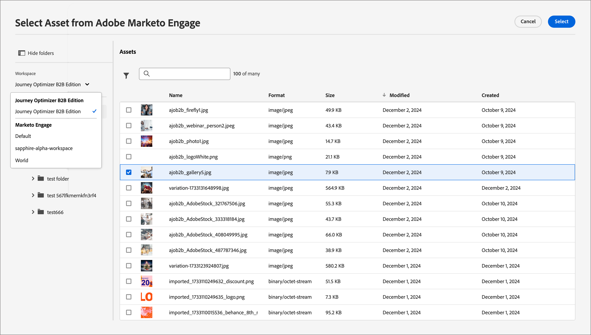

# Assets

In Adobe Journey Optimizer B2B edition sind Assets normalerweise die Bilder, die beim Entwerfen von Inhalten zur Unterstützung von Account-Journey verwendet werden. Sie können diese Bilder in E-Mails, E-Mail-Vorlagen und Fragmenten über einen Asset-Selektor oder eine einfache Drag-and-Drop-Oberfläche im visuellen Inhaltseditor verwenden.

Adobe Journey Optimizer B2B edition bietet Marketing-Experten Zugriff auf zwei Arten von Asset-Bibliotheken: Adobe Marketo Engage Design Studio und Adobe Experience Manager Assets as a Cloud Service. Sie können nur Adobe Marketo Engage Design Studio verwenden oder beide Bibliotheken gleichzeitig konfigurieren (basierend auf der von Ihnen verwendeten AEM Assets-Lizenz).

## Asset-Management

Wenn Sie Adobe Experience Manager als Cloud Service erhalten haben, haben Sie Zugriff auf die Repositorys für Marketo Engage Design Studio und Adobe Experience Manager Assets as a Cloud Service, wenn Ihr Benutzerkonto über die erforderlichen Berechtigungen verfügt. Diese Repositorys sind getrennt und nicht synchronisiert. Sie können Bilder aus beiden Quellen verwenden.

### Adobe Marketo Engage-Assets

Das Adobe Marketo Engage Design Studio Assets-Repository wird standardmäßig mit jedem Journey Optimizer B2B edition-Abonnement bereitgestellt. Das bedeutet, dass Sie Zugriff auf alle in Adobe Marketo Engage gespeicherten Bild-Assets haben ([!UICONTROL Design Studio] > [!UICONTROL Images &amp; Files]). Sie können dieses Repository als lokale Asset-Bibliothek verwenden, einschließlich der Funktionen zum Hochladen und Herunterladen von Assets. Sie können diese Assets auch in Ihrem Journey-Inhalt verwenden.

Es gibt integrierte Leitplanken, die Bearbeitungen am Marketo Engage-Asset von Journey Optimizer B2B edition sowie Löschen- und Verschiebungsvorgänge verhindern. Diese Schutzmaßnahmen stellen sicher, dass die Quell-Assets (Marketo Engage Design Studio) beibehalten werden und gleichzeitig das nahtlose Lesen und Wiederverwenden in Journey Optimizer B2B edition ermöglicht wird.

Unterstützte Dateiformate: JPG, JPEG, GIF, PNG, EPS, SVG und RGB

### Adobe Experience Manager Assets as a Cloud Service

Zusammenführen von Marketing- und Kreativ-Workflows mithilfe von Adobe Experience Manager Assets. Sie ist nativ in Adobe Journey Optimizer B2B edition integriert, sodass Sie einfach auf Assets as a Cloud Service zugreifen können, um digitale Assets zu entdecken und zu verwenden. Es bietet Zugriff auf Ihr Assets-Repository für Assets, die Sie zum Ausfüllen Ihrer Nachrichten verwenden können.

Adobe Journey Optimizer B2B edition kann eine Verbindung zu Adobe Experience Manager Assets as a Cloud Service herstellen, um ein zentralisiertes Asset-Management zu ermöglichen, das Ihr Kreativsystem erweitert und digitale Assets für die Bereitstellung von Erlebnissen zusammenfasst. Adobe Experience Manager Assets as a Cloud Service bietet eine benutzerfreundliche Cloud-Lösung für effizientes Digital Asset Management und Dynamic Media-Betrieb. Es integriert nahtlos fortschrittliche Funktionen, darunter künstliche Intelligenz und maschinelles Lernen.

Weitere Informationen finden Sie in der Dokumentation zu [Adobe Experience Manager as a Cloud Service](https://experienceleague.adobe.com/de/docs/experience-manager-cloud-service/content/assets/overview).

{{aem-assets-licensing-note}}

Greifen Sie über das Element **[!UICONTROL Adobe Experience Manager Assets]** im linken Navigationsbereich des Inhaltsdesigns direkt in Journey Optimizer B2B edition auf Experience Manager Assets zu. Sie können beim Entwerfen Ihrer E-Mail, E-Mail-Vorlage und visueller Fragmentinhalte auch auf Assets und Ordner zugreifen.

Derzeit können Sie in Adobe Journey Optimizer B2B edition nur Bilder aus Adobe Experience Manager Assets verwenden.

## Verwenden von Assets für die Inhaltserstellung

Verwenden Sie Assets beim Erstellen von E-Mails, E-Mail-Vorlagen und visuellen Fragmenten. Der Visual Content Editor bietet Zugriff auf die Bilder in Ihren verbundenen Asset-Repositorys. Wenn Sie über ein Abonnement für Experience Manager Assets as a Cloud Service und das standardmäßige Adobe Marketo Engage Design Studio verfügen, können Sie Bild-Assets aus beiden Quellen auswählen. Sie können auch ein Bild-Asset hochladen, wodurch es im Journey Optimizer B2B edition-Arbeitsbereich des verbundenen Marketo Engage Design Studio-Repositorys platziert wird.

Sie können die Bildquelle auswählen, wenn Sie die Einstellungen für eine Bildkomponente oder direkt auf der Arbeitsfläche bearbeiten.

* **_Einstellungen der Bildkomponente_** - Wenn Sie eine Bildkomponente im visuellen Designer ausgewählt haben, können Sie die Einstellungen im rechten Bedienfeld anzeigen und bearbeiten. Um die in der Komponente angezeigte Bilddatei hinzuzufügen oder zu ändern, wählen Sie den Quelltyp und dann eine Bilddatei aus.

  {width="350"}

* **_Leere Komponente_** - Wenn Sie eine Bildkomponente in Visual Designer hinzufügen, ist sie leer und bietet einfachen Zugriff, um eine Quelle auszuwählen und eine Bilddatei auszuwählen.

  {width="500"}

* **_Bildkomponenten-Symbolleiste_** - Wenn Sie eine Bildkomponente im visuellen Designer ausgewählt haben, bietet die Symbolleiste einfachen Zugriff, um eine Quelle und die Bilddatei auszuwählen.

  {width="500"}

Sie können ein Bild-Asset hinzufügen, während Sie Ihre Inhalte erstellen, je nach Quelle des Bild-Assets.

>[!BEGINTABS]

>[!TAB Marketo Engage Assets]

Klicken Sie auf **[!UICONTROL Marketo Engage Assets]**, um den Asset-Wähler zu öffnen, in dem Sie ein Bild aus einem Marketo Engage-Arbeitsbereich oder dem Journey Optimizer B2B edition-Arbeitsbereich auswählen können.

{width="700" zoomable="yes"}

Sie können Suchen und Filter verwenden, um das gewünschte Bild-Asset zu finden. Wählen Sie das Asset aus und klicken Sie **[!UICONTROL Auswählen]**, um es für die Bildkomponente zu verwenden.

Weitere Informationen zur Verwendung von Marketo Engage-Bild-Assets finden Sie unter [Verwenden von Assets in Ihrem Inhalt](./marketo-engage-design-studio.md#use-assets-in-your-content).

>[!TAB Experience Manager Assets]

Klicken Sie auf **[!UICONTROL Experience Manager Assets]**, um den Asset-Wähler zu öffnen, in dem Sie ein Bild aus dem Experience Manager Assets-Repository auswählen können.

{width="700" zoomable="yes"}

Sie können Suchen und Filter verwenden, um das gewünschte Bild-Asset zu finden. Wählen Sie das Asset aus und klicken Sie **[!UICONTROL Auswählen]**, um es für die Bildkomponente zu verwenden.

Weitere Informationen zur Verwendung von Bilddateien aus Experience Manager Assets finden Sie unter [Zugriff auf AEM Assets-Bilder](./aem-assets.md#access-aem-assets-images).

>[!TAB Medien importieren]

Klicken Sie **[!UICONTROL Medien importieren]**, um eine Bilddatei auszuwählen und sie als Asset zu importieren, das für Journey Optimizer B2B edition-Inhalte verwendet werden kann.

{width="500" zoomable="yes"}

Nachdem Sie die Datei per Drag-and-Drop verschoben oder aus Ihrem Dateisystem ausgewählt haben, klicken Sie auf **[!UICONTROL Importieren]**. Das importierte Asset wird im Journey Optimizer B2B edition-Arbeitsbereich des Adobe Marketo Engage Design Studio-Repositorys gespeichert.

>[!ENDTABS]
