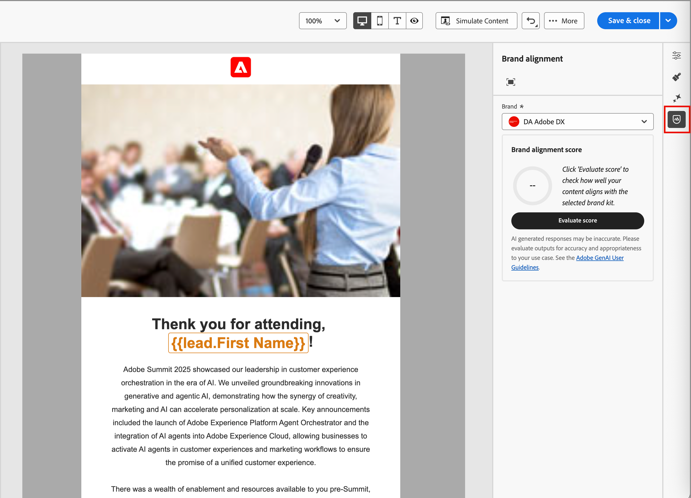

# Markenausrichtungsbewertung {#brand-score}

>[!CONTEXTUALHELP]
>id="ajo-b2b_brand_score_overview"
>title="Markenauswahl"
>abstract="Wählen Sie Ihre Marke aus, um sicherzustellen, dass Ihre Inhalte in Übereinstimmung mit den spezifischen Richtlinien, Standards und der Markenidentität erstellt werden und die Konsistenz und Markenintegrität gewahrt bleiben."

>[!CONTEXTUALHELP]
>id="ajo-b2b_brand_score"
>title="Markenausrichtungswert"
>abstract="Der Markenausrichtungswert misst, inwieweit Ihr Inhalt den Richtlinien Ihrer Marke entspricht, um Konsistenz bezüglich Farben, Schriftarten, Logo, Bildern und Schreibstil sicherzustellen."

>[!CONTEXTUALHELP]
>id="ajo-b2b_brand_colors"
>title="Farbwert"
>abstract="Farbwert"

>[!CONTEXTUALHELP]
>id="ajo-b2b_brand_fonts"
>title="Schriftartenwert"
>abstract="Schriftartenwert"

>[!CONTEXTUALHELP]
>id="ajo-b2b_brand_logos"
>title="Logowert"
>abstract="Logowert"

Die Bewertung und Bewertungen der Markenausrichtung helfen Ihnen bei der Erstellung, Überprüfung und Verwaltung von Inhalten, die den Richtlinien entsprechen [in der ausgewählten Marke definiert](./brands-manage-create.md#brand-definitions). Sie sorgt für Konsistenz bei Ton, Messaging und visueller Identität in all Ihren E-Mail-Kampagnen und dient gleichzeitig zur Qualitätsprüfung vor der Live-Schaltung Ihres Inhalts.

>[!AVAILABILITY]
>
>Diese Funktion ist derzeit als private Beta-Version verfügbar, wobei eine progressive Verfügbarkeit für alle Kundinnen und Kunden in zukünftigen Versionen geplant ist.
>
>Eine [Benutzervereinbarung](https://www.adobe.com/legal/licenses-terms/adobe-dx-gen-ai-user-guidelines.html){target="_blank"} ist erforderlich, bevor Sie KI-gestützte Funktionen in Adobe Journey Optimizer B2B edition verwenden können. Weitere Informationen erhalten Sie beim Adobe-Support.
>
>Unter [Markenbezogene Berechtigungen](./brands-overview.md#brand-related-permissions) finden Sie Informationen darüber, wie Produktadministratoren diese Funktionen aktivieren können.

## Validieren der Markenausrichtung

Wenn Ihre Marke klar definiert und veröffentlicht ist, bewerten Sie Ihre Markenausrichtung direkt im E-Mail-Design-Bereich, um sicherzustellen, dass der Inhalt mit Ihren Markenrichtlinien übereinstimmt:

1. Nachdem Sie den E-Mail-Inhalt erstellt haben, klicken Sie auf das Symbol _Markenausrichtung_ (  ) auf der rechten Seite, um das rechte Bedienfeld _Markenausrichtung_ im E-Mail-Design zu öffnen.

   Die [Standardmarke](./brands-manage-create.md#default-brand) wird automatisch ausgewählt.

   {width="600" zoomable="yes"}

   Sie können auf das Symbol _Vollbild_ (  ) oben im Bedienfeld klicken, um die Tools für die Markenausrichtung im Vollbildmodus anzuzeigen.

1. Klicken Sie bei Bedarf auf den Menüpfeil **[!UICONTROL Marke]** (  ), um eine andere veröffentlichte Marke auszuwählen.

1. Klicken Sie **[!UICONTROL Bewertung auswerten]**, um die Ausrichtung des Inhalts an der ausgewählten Marke zu bewerten.

   Das System bewertet den Inhalt anhand der Richtlinien für die ausgewählte Marke und zeigt die daraus resultierende Bewertung an.

   {width="600" zoomable="yes"}

## Bewertung überprüfen

Die Punktzahl wird anhand der festgestellten Verstöße im ausgewerteten E-Mail-Inhalt berechnet:

* 100 = Perfekt - Keine Verstöße gefunden
* 80-99 = Gut - nur geringfügige Verstöße
* 60-79 = Fair - Einige bedeutende Verstöße
* Unter 60 = Schlecht - Schwere Verletzungen erfordern Aufmerksamkeit

Sie können die Auswertungsergebnisse detaillierter überprüfen, um Verstöße zu identifizieren und Ihre Kategorieausrichtungswerte (_Hoch_, _Medium_ und _Niedrig_) zu verbessern und die Details zu überprüfen. Klicken Sie für **[!UICONTROL Schreibstil]** oder **[!UICONTROL visueller Inhalt]** auf den _Erweitern_ (  ), um die Details für die Auswertung anzuzeigen.

{width="600" zoomable="yes"}

Wählen Sie eine gekennzeichnete Richtlinie aus, um spezifisches Feedback und Vorschläge anzuzeigen.

Sie können Änderungen am Inhalt vornehmen und auf **[!UICONTROL Punktzahl neu auswerten]** klicken, um eine weitere Auswertung durchzuführen und nach einem verbesserten Ergebnis zu suchen.
