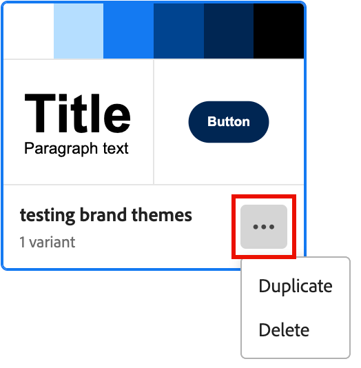
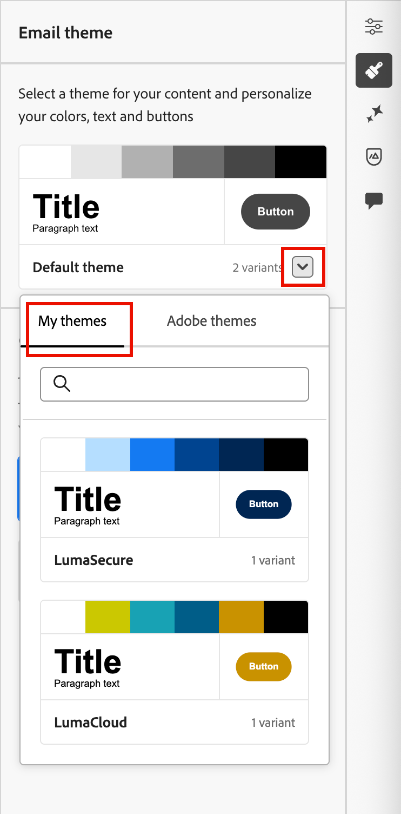

# Verwenden von Marken-Designs für E-Mail-Inhalte {#email-brand-themes}

>[!CONTEXTUALHELP]
>id="ajo-b2b_email_brand_theme"
>title="Anwenden eines Marken-Designs auf Ihre E-Mail oder E-Mail-Vorlage"
>abstract="Wählen Sie ein Design für Ihre E-Mail oder E-Mail-Vorlage aus, um einen bestimmten Stil anzuwenden, der zu Ihrer Marke und Ihrem Design passt."

Mit Designs können nicht-technische Designer wiederverwendbare Richtlinien für das Design von E-Mail-Inhalten erstellen, die an eine bestimmte Marke und ein bestimmtes Styling angepasst sind. Designs ermöglichen es Marketing-Experten, visuell ansprechende, markenkonsistente E-Mails schneller und mit weniger Aufwand zu nutzen und erweiterte Anpassungsoptionen für individuelle Design-Anforderungen bereitzustellen.

## Richtlinien und Einschränkungen für Designs {#themes-guidelines}

Beachten Sie bei der Arbeit mit Designs die folgenden Richtlinien und Einschränkungen:

* Wenn Sie eine E-Mail- oder E-Mail-Vorlage auf einer leeren Arbeitsfläche erstellen (_Design von Grund auf_), können Sie _Design-Modus_ auswählen, um Ihren Inhalt mithilfe eines Designs zu erstellen und einen bestimmten Stil anzuwenden, der zu Ihrer Marke und Ihrem Design passt. Wenn Sie _Manueller Modus_ auswählen, können Sie ein Design nur anwenden, wenn Sie das Design für die E-Mail- oder E-Mail-Vorlage zurücksetzen.

* [Fragmente](./fragments.md) sind nicht kreuzkompatibel zwischen dem _Design-Modus_ und dem _Manueller Modus_ im E-Mail-Inhalt. Um ein Fragment in E-Mail-Inhalten zu verwenden, auf die ein Design angewendet wird, muss das Fragment auch im _Design-Modus_ erstellt werden.

* Änderungen an einem benutzerdefinierten Design werden nicht automatisch an alle E-Mails oder E-Mail-Vorlagen weitergegeben, die es bereits verwenden. Bearbeiten Sie den Inhalt für jede Komponente, um das Design zu aktualisieren.

* Wenn Sie ein Design löschen, wirkt sich dies nicht auf E-Mail- oder E-Mail-Vorlagen aus, auf die es bereits angewendet wurde.
<!-- 
* If using a content created in HTML, you will be in [compatibility mode](existing-content.md) and you cannot apply themes to this content.
-->

## Erstellen eines Markendesigns {#create-theme}

Definieren Sie Ihr eigenes Markendesign, das Sie auf den Inhalt Ihrer E-Mail und E-Mail-Vorlage in Ihrem zukünftigen E-Mail-Inhalt anwenden können.

1. Greifen Sie mit einer der folgenden Methoden auf die Design-Tools zu:

   * [Erstellen Sie eine neue E](./email-templates.md#create-an-email-template)Mail-Vorlage und klicken Sie auf **[!UICONTROL E-Mail-Vorlage bearbeiten]**, um die Seite _[!UICONTROL Vorlage entwerfen]_ zu starten.

   * Klicken Sie auf **[!UICONTROL … Mehr]** oben rechts im Design-Bereich für E-Mail-Inhalte und wählen Sie **[!UICONTROL Design ändern]**.

     {width="700" zoomable="yes"}

     Klicken Sie im Bestätigungsdialog auf **[!UICONTROL Vorlage ändern]**, um die Design-Seite zu öffnen.

1. Wählen Sie auf der Design-Seite **[!UICONTROL Erstellen oder Bearbeiten von Designs]** aus.

   {width="800" zoomable="yes"}

1. Wählen Sie das Standarddesign aus oder verwenden Sie eines der Adobe-Designs, die als Ausgangspunkt verwendet werden sollen.

   >[!NOTE]
   >
   >Wenn Sie eines Ihrer benutzerdefinierten Designs (_[!UICONTROL Meine Designs]_) als Ausgangspunkt verwenden möchten, können Sie es [duplizieren](#delete-or-duplicate-a-theme) und den Designnamen ändern, wenn Sie [Design bearbeiten](#edit-a-theme).

1. Klicken Sie auf **[!UICONTROL Erstellen]**.

   {width="750" zoomable="yes"}

   Die _[!UICONTROL Design erstellen]_ bietet eine Arbeitsfläche mit den vorhandenen Elementen aller Arten von Text, Schaltflächen und Containern aus dem Startdesign.

1. Verwenden Sie die rechte Navigation, um auf die verschiedenen Registerkarten des Design-Stils zuzugreifen und die Design-Einstellungen zu ändern:

   * [Allgemeine Einstellungen](#general-settings)
   * [Farben](#colors)
   * [Texteinstellungen](#text-settings)
   * [Abstand und Rahmen](#spacing-and-border)
   * [Schaltfläche](#button)
   * [Trennlinie](#divider)
   * [Raster](#grid)

   Die visuellen Elemente ändern sich auf der Arbeitsfläche, wenn Sie die neuen Design-Einstellungen definieren. Wenn das Ergebnis nicht das gewünschte Ergebnis ist, können Sie auf das Symbol _Rückgängig_ ( {width="16"} ) unten im rechten Bedienfeld klicken. Klicken Sie auf _Wiederholen_ ( {width="16"} ), um die Änderung erneut vorzunehmen.

1. Wenn Ihre Designdefinition abgeschlossen ist, klicken Sie auf **[!UICONTROL Speichern]**.

1. Klicken Sie auf **[!UICONTROL Schließen]**, um zur Seite _[!UICONTROL Design erstellen]_ zurückzukehren, und dann auf **[!UICONTROL Abbrechen]**, um zur Seite Design zurückzukehren.

   Sie können dann **[!UICONTROL Von Grund auf gestalten]** wählen, um den visuellen Design-Bereich zu öffnen und [Design zu verwenden](#use-your-theme-for-email-content-authoring) für die E-Mail oder Vorlage.

### Allgemeine Einstellungen

Definieren Sie auf **[!UICONTROL Registerkarte]** die grundlegenden Parameter für Ihr Design:

* Geben Sie einen eindeutigen **[!UICONTROL Designnamen]** ein.

* Passen Sie die **[!UICONTROL Viewport-Breite]** für den E-Mail-Inhalt (Textkörper) an. Verwenden Sie die Pfeile nach oben und unten, um die Breite zu erhöhen oder zu verringern, oder geben Sie den Wert (in Pixel) ein.

{width="450"}
<!--  and also export the current theme to [share it across sandboxes](../configuration/copy-objects-to-sandbox.md).-->

### Farben

Wählen Sie die Registerkarte **[!UICONTROL Farben]** und verwenden Sie die Einstellungen, um die Design-Farbpalette zu definieren.

{width="450"}

* Klicken Sie **[!UICONTROL Bearbeiten]**, um die Farbpalette anzuzeigen, die die Farben für Ihr Design enthält.

  Wählen Sie **[!UICONTROL Vorgabe]**, um ein Farbschema für das Design zu verwenden, oder passen Sie jede Farbe im Set an. Sie können auch eine Kombination aus beidem verwenden.

  {width="350"}

  Für das ausgewählte Farbfeld oben können Sie die Farbe festlegen, indem Sie einen bekannten RGB-, HSL-, HSB- oder Hexadezimalwert eingeben. Sie können auch den Farbregler und das Farbfeld verwenden, um die Farbe auszuwählen.

  Klicken Sie auf den _Zurück_-Pfeil, um die Farbpalettenwerkzeuge zu schließen.

* Klicken Sie auf **[!UICONTROL Variante hinzufügen]**, um mehrere Farbvarianten zu erstellen, z. B. einen _Hell_- und _Dunkel_-Modus, in dem jede Variante über eine eigene Farbpalette und Nuance-Steuerelemente verfügt. Sie können bis zu sechs Varianten haben.

  Klicken Sie für jede Variante auf das Symbol _Bearbeiten_ (  ). Sie können die Standardpalette oder beliebige benutzerdefinierte Farben verwenden.

  {width="450"}

  Verschieben Sie für jede Farbe, die Sie für die Variante ändern möchten, den Umschalter nach links oder rechts, um sie zu deaktivieren oder zu aktivieren. Für eine aktivierte Farbeinstellung klicken Sie auf das Farbfeld, um die Farbe auszuwählen.

  {width="450"}

  +++Variantenfarbeinstellungen

  Die Einstellungen sind nach Typ gruppiert:

  | Typ | Einstellungen | Beschreibung |
  | ---- | -------- | ----------- |
  | [!UICONTROL Allgemein] | {width="300"} | Mit diesen Einstellungen können Sie Farben für den Textkörper, Strukturen, Container, Hintergründe, Links, Raster und Rahmen festlegen. |
  | [!UICONTROL Überschriften] | {width="300"} | Diese Einstellungen gelten für `Heading` Elemente, bei denen Sie Text- und Rahmenfarben für jede der sechs Überschriftenebenen festlegen können. Erweitern Sie jede Überschriftenebene, für die Sie die Farbe für die Variante festlegen möchten. |
  | [!UICONTROL Absätze] | {width="300"} | Diese Einstellungen gelten für `Paragraph`, bei denen Sie Text- und Rahmenfarben für jeden der drei Absatztypen festlegen können. Erweitern Sie jeden Absatztyp, für den Sie die Farbe für die Variante festlegen möchten. |
  | [!UICONTROL Schaltflächen] | {width="300"} | Die Einstellungen gelten für Schaltflächenelemente, in denen Sie die Füllfarbe, Rahmenfarbe und Textfarbe für jede der drei Schaltflächenvorgaben festlegen können: _Primär_, _Sekundär_ und _Tertiär_. |

  +++

### Texteinstellungen

Auf der Registerkarte **[!UICONTROL Texteinstellungen]** können Sie die globalen Schriftarten, -stile und -größen festlegen, die Sie für Ihr Design verwenden möchten. Für eine detailliertere Steuerung können Sie diese Parameter auch für Überschriften- und Absatztypen bearbeiten.

{width="450"}

+++Texteinstellungen nach Typ

| Typ | Einstellungen | Beschreibung |
| ---- | -------- | ----------- |
| [!UICONTROL Global] | {width="300"} | Legen Sie die **[!UICONTROL Schriftbibliothek]** auf _[!UICONTROL Standard]_ oder _[!UICONTROL Google Fonts]_ fest. Wählen Sie dann die Schriftfamilie aus, die Sie verwenden möchten. Diese globalen Texteinstellungen werden überall angewendet, es sei denn, Sie legen unterschiedliche Textstile für die Überschriftenebenen und Absatztypen fest. |
| [!UICONTROL Überschriften] | {width="300"} | Wählen Sie für die einzustellende Überschriftenebene **[!UICONTROL H1]**, **[!UICONTROL H2]** usw. Legen Sie die **[!UICONTROL Schriftbibliothek]** auf _[!UICONTROL Standard]_ oder _[!UICONTROL Google Fonts]_ fest. Wählen Sie dann Schriftfamilie, Größe und Stil aus. Wählen Sie **[!UICONTROL Textausrichtung]** aus: _Links_, _Zentriert_, _Rechts_ oder _Blocksatz_. |
| [!UICONTROL Absätze] | {width="300"} | Wählen Sie für die einzustellende Überschriftenebene **[!UICONTROL P1]**, **[!UICONTROL HP]** usw. Legen Sie die **[!UICONTROL Schriftbibliothek]** auf _[!UICONTROL Standard]_ oder _[!UICONTROL Google Fonts]_ fest. Wählen Sie dann Schriftfamilie, Größe und Stil aus. Passen Sie die **[!UICONTROL Zeilenhöhe]** nach Bedarf an. Wählen Sie **[!UICONTROL Textausrichtung]** aus: _Links_, _Zentriert_, _Rechts_ oder _Blocksatz_. |

+++

### Abstand und Rahmen

Auf der Registerkarte **[!UICONTROL Abstand]** können Sie den Abstand und den Rand für die verschiedenen Elementtypen festlegen. Wählen **[!UICONTROL unter &quot;]**&quot; den Inhaltstyp aus. Legen Sie dann den Abstand, die Ränder, die Ecken und die Rahmen fest, die für diesen Elementtyp gelten.

{width="450"}

+++Abstandseinstellungen

| Typ | Einstellungen | Beschreibung |
| ---- | -------- | ----------- |
| [!UICONTROL Ränder] | {width="300"} | Wählen Sie das Symbol _Rand_, um Einstellungen anzuzeigen, die den CSS-`margin` replizieren. Dieser steuert den Raum außerhalb eines Komponentenrahmens und trennt ihn von anderen Komponenten/Elementen. Dadurch wird eine Lücke um die Komponente geschaffen, um ihre Positionierung und das Layout des umgebenden Inhalts zu beeinflussen. Legen Sie die Randwerte in Pixeln entsprechend Ihren Design-Anforderungen fest. Sie können den Rand für alle Seiten, die obere Schaltfläche, die linke oder die rechte Seite der Komponente unabhängig voneinander festlegen. Klicken Sie auf _Sperren_ und _Entsperren_, um die Randwerte am oberen unteren und linken rechten Rand zu synchronisieren oder zu deaktivieren. |
| [!UICONTROL Auffüllung] | {width="300"} | Wählen Sie das Symbol _Abstand_ aus, um Einstellungen anzuzeigen, die den CSS-`padding` replizieren. Dies ist der Abstand zwischen dem Inhalt einer Komponente/eines Elements und seinem Rahmen. Der Abstand sorgt für einen internen Abstand, mit dem Sie den Abstand zwischen Inhalt und Rahmen der Komponente steuern können. Legen Sie die Abstandswerte entsprechend Ihren Design-Anforderungen in Pixel fest. Sie können den Abstand für alle Seiten, die obere Schaltfläche, die linke rechte Seite oder jede Seite der Komponente unabhängig festlegen. Klicken Sie auf _Sperren_ und _Entsperren_, um die Abstandswerte oben unten und links/rechts zu synchronisieren oder zu deaktivieren. |
| [!UICONTROL Ecken] | {width="300"} | Wählen Sie das _Ecken_, um Einstellungen anzuzeigen, die den CSS-`border-radius` replizieren, der den Radius der Komponenten-/Elementecken definiert. Legen Sie den numerischen Wert entsprechend der Kurve für die Ecken fest. Ein Wert von 0 (Standard) ergibt eine quadratische Ecke. |

+++

+++Rahmeneinstellungen

Schieben Sie den **[!UICONTROL Rahmen]** nach rechts, um die Anzeigeoptionen für den Rahmen zu aktivieren und sie entsprechend Ihren Designkriterien festzulegen:

* Zum Festlegen der **[!UICONTROL Rahmengröße]** (Linienbreite) klicken Sie auf die Pfeilsymbole nach oben und unten, um die Anzahl der Pixel zu erhöhen oder zu verringern.

* Um den **[!UICONTROL Rahmenstil]** festzulegen, wählen Sie einen Wert aus der Liste der standardmäßigen CSS-`border-style` aus, z _B. Durchgehend_, _Punkte_ und _Gestrichelt_.

* Um zu bestimmen, wo der Rahmen angezeigt wird, aktivieren Sie jedes Kontrollkästchen **[!UICONTROL Rahmenposition]**.

{width="250"}

+++

### Schaltflächen

Auf der Registerkarte **[!UICONTROL Schaltflächen]** können Sie verschiedene Attribute (außer Farbe) für Schaltflächenelemente festlegen, z. B. Rahmenradius (Form), Text und Größe. Sie können die Einstellungen für jede der drei Schaltflächenvorgaben ändern: _[!UICONTROL Primär]_, _[!UICONTROL Sekundär]_ und _[!UICONTROL Tertiär]_.

{width="450"}

+++Schaltflächen-Einstellungen

| Typ | Einstellungen | Beschreibung |
| ---- | -------- | ----------- |
| [!UICONTROL Text] | {width="300"} | Legen Sie die **[!UICONTROL Schriftbibliothek]** auf _[!UICONTROL Standard]_ oder _[!UICONTROL Google Fonts]_ fest. Wählen Sie dann Schriftfamilie, Größe und Stil aus. Wählen Sie **[!UICONTROL Textausrichtung]** aus: _Links_, _Zentriert_, _Rechts_ oder _Blocksatz_. |
| [!UICONTROL Rahmen] | {width="300"} | Schieben Sie den **[!UICONTROL Rahmen]** nach rechts, um die Anzeigeoptionen für den Schaltflächenrahmen zu aktivieren und entsprechend Ihren Designkriterien festzulegen. Legen Sie die **[!UICONTROL Rahmengröße]** (Zeilenbreite) fest, indem Sie die Anzahl der Pixel erhöhen oder verringern. Legen Sie den **[!UICONTROL Rahmenstil]** fest, indem Sie einen Wert aus der Liste der standardmäßigen CSS-`border-style` auswählen, z _B. Durchgehend_, _Punkte_ und _Gestrichelt_. |
| [!UICONTROL size] | {width="300"} | Klicken Sie bei **[!UICONTROL Option]** Höhe“ auf die Pfeilsymbole nach oben und unten, um die Anzahl der Pixel zu erhöhen oder zu verringern. Ein leerer Wert (Auto) ist der Standardwert. Die Größe der Schaltfläche entspricht ihrem Inhalt. Verwenden Sie für **[!UICONTROL Breite]** den Umschalter, um die Breite nach Pixel oder Prozentsatz festzulegen. Legen Sie für eine prozentuale Breite mithilfe des Schiebereglers den prozentualen Wert fest. Der Prozentsatz bestimmt die Schaltflächengröße anhand des Inhaltsfelds des enthaltenden Blocks, wobei Auffüllung und Rahmen ausgeschlossen sind. Bei einem Wert von 50 wird beispielsweise die Breite der Schaltfläche auf 50 % der Breite festgelegt, die den Block enthält. Klicken Sie bei einer pixelbasierten Breite auf die Pfeilsymbole nach oben und unten, um die Anzahl der Pixel zu erhöhen oder zu verringern. Ein leerer Wert (_Auto_) ist der Standardwert und skaliert die Breite der Schaltfläche entsprechend ihrem Inhalt. |

+++

### Trennlinie

Auf der Registerkarte **[!UICONTROL Trennzeichen]** können Sie die Linienstile und Container-Einstellungen für eine Trennzeichenkomponente festlegen.

{width="450"}

+++Divider-Einstellungen

| Typ | Einstellungen | Beschreibung |
| ---- | -------- | ----------- |
| [!UICONTROL Line] | {width="300"} | Legen Sie den **[!UICONTROL Rahmenstil]** fest, indem Sie einen Wert aus der Liste der standardmäßigen CSS-`border-style` auswählen, z _B. Durchgehend_, _Punkte_ und _Gestrichelt_. |
| [!UICONTROL Container-Größe] | {width="300"} | Klicken Sie bei **[!UICONTROL Option]** Höhe“ auf die Pfeilsymbole nach oben und unten, um die Anzahl der Pixel für die Komponente/das Element zu erhöhen oder zu verringern. Ein leerer Wert (Auto) ist der Standardwert und passt die Höhe entsprechend dem Inhalt an (Zeilenstil). Verwenden Sie für **[!UICONTROL Breite]** den Umschalter, um die Breite nach Pixel oder Prozentsatz festzulegen. Legen Sie für eine prozentuale Breite mithilfe des Schiebereglers den prozentualen Wert fest. Der Prozentsatz bestimmt die Elementbreite basierend auf dem Inhaltsfeld des enthaltenden Blocks. Bei einem Wert von 50 wird beispielsweise die Breite der Unterteilung auf 50 % der Breite des enthaltenden Blocks festgelegt. Klicken Sie bei einer pixelbasierten Breite auf die Pfeilsymbole nach oben und unten, um die Anzahl der Pixel zu erhöhen oder zu verringern. Ein leerer Wert (_Auto_) ist der Standardwert und skaliert die Breite der Trennlinie entsprechend ihrem Inhalt. |
| [!UICONTROL Ausrichtung] | {width="300"} | Wählen Sie die horizontale Ausrichtung innerhalb des enthaltenden Blocks aus: __, _Zentriert_ oder _Rechts_. |

+++

### Raster

Auf der Registerkarte **[!UICONTROL Raster]** können Sie Spalten- und Zeilenlücken für ein Rasterelement steuern:

* **[!UICONTROL Spaltenabstand]** - Klicken Sie auf die Pfeilsymbole nach oben und unten, um die Anzahl der Pixel für den Abstand zwischen den Rasterspalten zu erhöhen oder zu verringern. Sie können auch eine Zahl in das Feld eingeben.

* **[!UICONTROL Zeilenabstand]** - Klicken Sie auf die Pfeilsymbole nach oben und unten, um die Anzahl der Pixel für den Abstand zwischen den Rasterzeilen zu erhöhen oder zu verringern. Sie können auch eine Zahl in das Feld eingeben.

{width="700" zoomable="yes"}

## Bearbeiten eines Designs

Sie können ein Design mit demselben Workflow und denselben Tools bearbeiten, die Sie beim Erstellen eines Designs verwenden. Der Unterschied besteht darin, dass Sie auf der Registerkarte **[!UICONTROL Meine Designs]** das benutzerdefinierte Design auswählen, das Sie ändern möchten.

{width="750" zoomable="yes"}

Verwenden Sie die Leiste auf der rechten Seite, um durch die verschiedenen Registerkarten zu navigieren und die Design-Einstellungen zu ändern:

* [Allgemeine Einstellungen](#general-settings)
* [Farben](#colors)
* [Texteinstellungen](#text-settings)
* [Abstand und Rahmen](#spacing-and-border)
* [Schaltfläche](#button)
* [Trennlinie](#divider)
* [Raster](#grid)

{width="800" zoomable="yes"}

Die angezeigten visuellen Elemente ändern sich, wenn Sie die Einstellungen ändern. Wenn das Ergebnis auf der Arbeitsfläche nicht das gewünschte ist, können Sie auf das Symbol _Rückgängig_ ( {width="16"} ) unten im rechten Bedienfeld klicken. Klicken Sie auf _Wiederholen_ ( {width="16"} ), um die Änderung erneut vorzunehmen.

Wenn Ihre Design-Änderungen abgeschlossen sind, klicken Sie auf **[!UICONTROL Speichern]**.

>[!NOTE]
>
>Die gespeicherten Änderungen werden nicht automatisch an alle E-Mails oder E-Mail-Vorlagen weitergeleitet, die derzeit das Design verwenden. Bearbeiten Sie die Inhalte für jedes Design, um es zu aktualisieren und den aktualisierten Stilen anzupassen.

## Verwalten benutzerdefinierter Designs

Sie können Ihre benutzerdefinierten Designs mit demselben Workflow und denselben Tools verwalten, die Sie beim Erstellen eines Designs verwenden. Der Unterschied besteht darin, dass Sie die Registerkarte **[!UICONTROL Meine Designs]** auswählen und Ihre Designs in der angezeigten Liste verwalten.

Wenn Sie über eine große Liste mit benutzerdefinierten Designs verfügen, verwenden Sie das Feld _Suche_ und andere Filter, um die angezeigte Liste zu reduzieren. Wenn Sie Ihre Liste der verfügbaren Designs verwalten, können Sie ein benutzerdefiniertes Design jederzeit bearbeiten, löschen oder duplizieren.

{width="750" zoomable="yes"}

### Bearbeiten eines Designs

1. Wählen Sie das Design aus, das Sie ändern möchten, und klicken **[!UICONTROL oben]** auf „Bearbeiten“.

   {width="750" zoomable="yes"}

1. Verwenden Sie die Navigation auf der rechten Seite, um die verschiedenen Stilregisterkarten zu verwenden und die Design-Einstellungen zu ändern:

   * [Allgemeine Einstellungen](#general-settings)
   * [Farben](#colors)
   * [Texteinstellungen](#text-settings)
   * [Abstand und Rahmen](#spacing-and-border)
   * [Schaltfläche](#button)
   * [Trennlinie](#divider)
   * [Raster](#grid)

   {width="800" zoomable="yes"}

   Die angezeigten visuellen Elemente ändern sich, wenn Sie die Einstellungen ändern. Wenn das Ergebnis auf der Arbeitsfläche nicht das gewünschte ist, können Sie auf das _Rückgängig_-Symbol unten in der rechten Leiste klicken. Klicken Sie auf _Wiederholen_, um die Änderung erneut vorzunehmen.

1. Wenn Ihre Design-Änderungen abgeschlossen sind, klicken Sie auf **[!UICONTROL Speichern]**.

>[!NOTE]
>
>Die gespeicherten Design-Änderungen werden nicht automatisch an alle E-Mails oder E-Mail-Vorlagen weitergeleitet, die derzeit das Design verwenden. Bearbeiten Sie die Inhalte für jedes Design, um es zu aktualisieren und den aktualisierten Stilen anzupassen.

### Löschen oder Duplizieren eines Designs

Wenn Sie das Design gefunden haben, klicken Sie auf das _Mehr Menü_ (**…**) unten rechts auf der Designkarte und wählen Sie die gewünschte Aktion aus:

{width="220"}

* **[!UICONTROL Duplizieren]** - Wählen Sie diese Aktion, um das Design zu duplizieren. Das neue Design ist identisch mit _Kopie von_, das an den Namen des Originals angehängt wird. Sie können den Namen ändern, wenn Sie [Design bearbeiten](#edit-a-theme).

* **[!UICONTROL Löschen]** - Wählen Sie diese Aktion, um das benutzerdefinierte Design zu entfernen. Klicken Sie im Bestätigungsdialog auf **[!UICONTROL Löschen]**.

  >[!NOTE]
  >
  >Das Löschen des Designs hat keine Auswirkungen auf E-Mail- oder E-Mail-Vorlagen, auf die es bereits angewendet wurde.

## Design für die Inhaltserstellung in E-Mails verwenden {#use-email-theme}

Wenn Sie eine neue E-Mail- oder E-Mail-Vorlage erstellen, können Sie ein Markendesign verwenden, das den Inhaltserstellungsprozess optimiert und sicherstellt, dass das Design den definierten Standards entspricht. Für ein neues Fragment können Sie vor dem Speichern des Fragments auch ein Design anwenden. Das Fragment verbleibt von diesem Zeitpunkt an _Design-Modus_ und ist kompatibel, um es zu E-Mails und E-Mail-Vorlagen hinzuzufügen, die sich auch im _Design-Modus_ befinden.

1. Eine der folgenden Aktionen auswählen:

   * Wählen Sie eine E-Mail-Vorlage aus, die ein Design enthält (erstellt im _Design-Modus_). Das für jede Vorlage spezifische Design wird automatisch angewendet.

   * Verwenden Sie die _[!UICONTROL Von Grund auf gestalten]_ und wählen Sie **[!UICONTROL Designs verwenden]**, um mit einem vordefinierten Stildesign zu beginnen.

     {width="450"}

     >[!IMPORTANT]
     >
     >Wenn Sie den Modus _[!UICONTROL Manuelle Formatierung]_ wählen, müssen Sie das E-Mail-Design zurücksetzen, um ein Design anzuwenden.
     >
     >Wenn Sie den Modus _[!UICONTROL Designs]_ wählen, sind nur [Fragmente](./fragments.md) verfügbar, die auch im Modus _Designs_ erstellt wurden und dem E-Mail-Inhalt hinzugefügt werden können.

1. Klicken Sie im E-Mail-Design auf das Symbol _Designs_ (  ) auf der rechten Seite.

   {width="600" zoomable="yes"}

   Das Standarddesign oder das auf die Vorlage angewendete Design wird angezeigt. Sie können zwischen den Farbvarianten für dieses Design wechseln.

1. Klicken Sie auf den Pfeil neben dem angezeigten Design, um die Liste der verfügbaren benutzerdefinierten und Adobe-Designs anzuzeigen.

1. Klicken Sie auf **[!UICONTROL Meine Designs]** und wählen Sie Ihr benutzerdefiniertes Design aus.

   {width="325"}

1. Klicken Sie außerhalb der Liste.

   Das neu ausgewählte benutzerdefinierte Design wendet die Stile auf alle E-Mail-Komponenten auf der Arbeitsfläche an. Sie können zwischen den Farbvarianten wechseln.

1. Wenn Sie die Designstile für eine ausgewählte Komponente überschreiben müssen, klicken Sie auf das Symbol _Komponentenstile entsperren_ (Symbol  ).

   {width="600" zoomable="yes"}

   Klicken Sie im Bestätigungsdialogfeld auf **[!UICONTROL Entsperren]**.

   Wählen Sie die **[!UICONTROL Stile]** im rechten Bedienfeld aus, um die Einstellungen für die Komponente zu ändern.

   {width="600" zoomable="yes"}

## Ändern des Designs für Ihren E-Mail-Inhalt

Bei E-Mail- oder E-Mail _Vorlagen, die im_ Design-Modus“ erstellt wurden, können Sie das Design jederzeit ändern. Der E-Mail-Inhalt bleibt unverändert, aber die Stile werden aktualisiert, um das neue Design widerzuspiegeln.

1. Öffnen Sie die E-Mail- oder E-Mail-Vorlage im Design-Bereich.

1. Klicken Sie auf _Designs_ (  ) auf der rechten Seite.

   Das angewendete Design wird im rechten Bereich angezeigt.

1. Klicken Sie auf den Pfeil neben dem angezeigten Design, um die Liste der verfügbaren benutzerdefinierten und Adobe-Designs anzuzeigen.

1. Ein anderes Design auswählen.

1. Klicken Sie außerhalb der Liste.

   Das ausgewählte Design wendet die Stile auf alle E-Mail-Komponenten auf der Arbeitsfläche an. Sie können zwischen den Farbvarianten wechseln.

<!--
>[!NOTE]
> - Themes apply styles globally. Ensure your theme is finalized before applying it to multiple emails.
> - Switching themes may override custom styles applied to individual components.

>[!CAUTION]
> - When using fragments, the email's theme will override the fragment's styles. A warning will be displayed in the editor if there is a conflict.

## Example Use Cases {#example-use-cases}

### 1. Creating a New Theme
- A designer creates a theme with their brand's colors, fonts, and button styles.
- The theme is saved and reused by marketers to author multiple emails.

### 2. Switching Themes
- A marketer applies a holiday-themed design to an existing email by switching to a pre-designed holiday theme.-->
