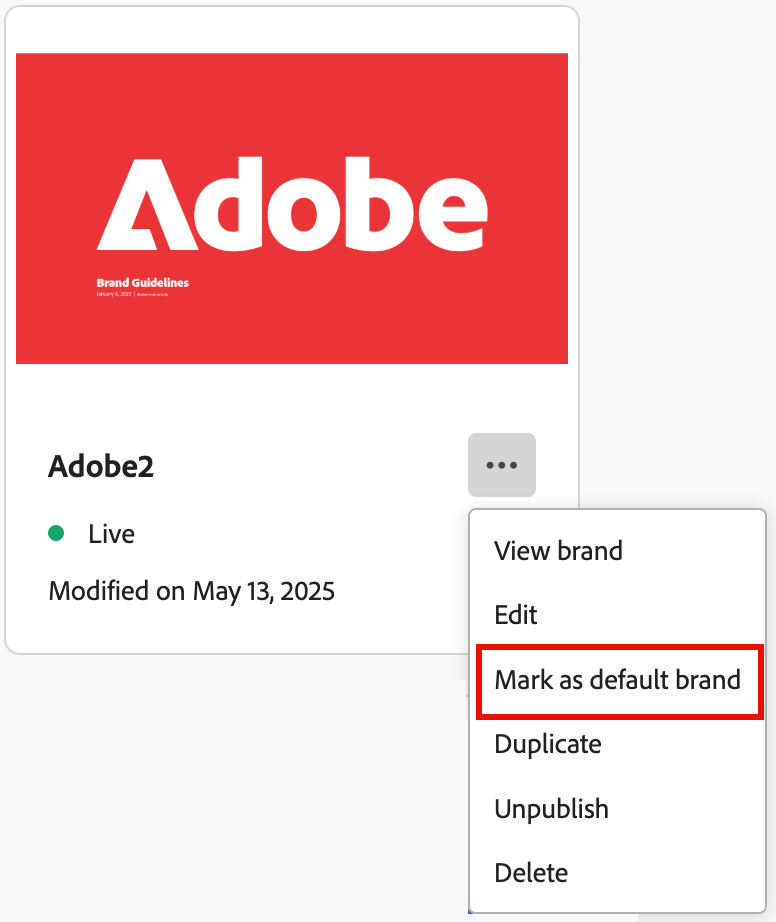

# Marken erstellen und verwalten {#brand-library}

Definieren Sie eine Marke, um einen detaillierten Satz von Regeln und Standards bereitzustellen, die eine visuelle und verbale Identität festlegen. Diese Richtlinien bieten eine Referenz zur Aufrechterhaltung einer konsistenten Markendarstellung auf allen Marketing- und Kommunikationsplattformen. Mithilfe klar definierter Markenrichtlinien können Unternehmen sicherstellen, dass alle Maßnahmen zur Inhaltserstellung mit den strategischen Zielen und der allgemeinen Markenidentität im Einklang stehen. Diese Konsistenz verbessert nicht nur die Erkennung und das Vertrauen der Marke, sondern trägt auch zu einem kohärenteren und wirkungsvolleren Kundenerlebnis über alle Touchpoints hinweg bei.

In Journey Optimizer B2B edition können Sie Ihre Markendefinitionen und Assets manuell definieren und organisieren oder Markenrichtliniendokumente hochladen, um automatische Informationen und die visuelle Asset-Extraktion zu ermöglichen.

>[!AVAILABILITY]
>
>Diese Funktion ist derzeit als private Beta-Version verfügbar, wobei eine progressive Verfügbarkeit für alle Kundinnen und Kunden in zukünftigen Versionen geplant ist.
>
> 
>
>Eine [Benutzervereinbarung](https://www.adobe.com/legal/licenses-terms/adobe-dx-gen-ai-user-guidelines.html){target="_blank"} ist erforderlich, bevor Sie KI-gestützte Funktionen in Adobe Journey Optimizer B2B edition verwenden können. Weitere Informationen erhalten Sie beim Adobe-Support.
>
> 
>
>Unter [Markenbezogene Berechtigungen](./brands-overview.md#brand-related-permissions) finden Sie Informationen darüber, wie Produktadministratoren diese Funktionen aktivieren können.

## Zugriff auf die Markenbibliothek

Greifen Sie auf die Marken-Kits in Adobe Journey Optimizer B2B edition zu, indem Sie im linken Navigationsbereich auf **[!UICONTROL Content-Management]** > **[!UICONTROL Marken]** klicken. Diese Aktion öffnet eine Seite, auf der die erstellten Marken als Karten angezeigt werden.

{width="800" zoomable="yes"}

Wenn noch keine Marken erstellt wurden, wird eine einzelne Grafik mit einer Schaltfläche angezeigt, um [Ihre erste Marke zu erstellen](#create-and-define-a-brand).

### Markenverwaltungsaktionen

Klicken Sie für jede Karte auf das Symbol _Mehr Menü_ (  ) und wählen Sie eine Aktion für die Marke aus:

* **[!UICONTROL Marke anzeigen]** - Öffnen Sie die Seite Marke und zeigen Sie die Definitionen an.
* **[!UICONTROL Als Standardmarke markieren]** (nur Live) - [Markieren Sie die Marke als Standard](#default-brand) für die Ausrichtung und Erstellung von Inhalten.
* **[!UICONTROL Bearbeiten]** - Öffnen Sie die Seite „Marke“ und bearbeiten Sie die Markenrichtlinien, Ausschlüsse und Beispiele.
* **[!UICONTROL Duplizieren]** - Eine Kopie als neuen Markenentwurf erstellen.
* **[!UICONTROL Veröffentlichen]** (nur Entwurf) - [Veröffentlichen Sie die Marke](#publish-the-brand) um sie für die Verwendung mit der Ausrichtung und Erstellung von Inhalten verfügbar zu machen.
* **[!UICONTROL Veröffentlichung aufheben]** (nur Live) - Heben Sie die Veröffentlichung der Marke auf, um sie aus der Verwendung für die Ausrichtung und Erstellung von Inhalten zu entfernen.
* **[!UICONTROL Löschen]** - Entfernen der Marke aus der Markenbibliothek.

{width="440"}

### Standardmarke

Sie können eine Standardmarke festlegen, die bei der Inhaltserstellung und der Berechnung der Alignment-Bewertungen automatisch angewendet wird. Standardmäßig kann nur eine veröffentlichte _Live_-Marke verwendet werden.

In der Markenbibliothek wird die Standardmarkenkarte mit einem Flag angezeigt.

{width="200"}

Sie können jede veröffentlichte (_Live_) Marke als Standardmarke festlegen. Klicken Sie auf der Karte Marke auf das Symbol _Mehr Menü_ (  ) und wählen Sie **[!UICONTROL Als Standardmarke markieren]**.

{width="350"}

## Erstellen und Definieren einer Marke {#create-brand}

>[!CONTEXTUALHELP]
>id="ajo-b2b_brands_create"
>title="Erstellen Ihrer Marke"
>abstract="Geben Sie Ihren Markennamen ein und laden Sie die Datei mit Ihren Markenrichtlinien hoch. Das Tool extrahiert automatisch wichtige Details und erleichtert so das Aufrechterhalten Ihrer Markenidentität."

Um Ihre Markenrichtlinien zu erstellen und zu definieren, können Sie entweder die Details eingeben oder Ihre Markenrichtlinien-Dokumente hochladen, um sie für die automatische Extraktion zu verwenden.

### Marke hinzufügen

1. Klicken Sie oben rechts auf der Seite _[!UICONTROL Marken]_ auf **[!UICONTROL Marke erstellen]**.

1. Geben Sie einen **[!UICONTROL Namen]** für Ihre Marke ein.

1. Datei per Drag-and-Drop ziehen oder auswählen, um Ihre Markenrichtlinien hochzuladen und automatisch relevante Markeninformationen zu extrahieren.

   {width="500"}

   >[!NOTE]
   >
   >Wenn Sie kein Dokument im PDF-Format gespeichert haben, können Sie die Richtlinien manuell hinzufügen und einzelne visuelle Assets nach der Markenerstellung hochladen.

1. Klicken Sie auf **[!UICONTROL Marke erstellen]**.

   Wenn Sie eine oder mehrere Dateien zur Erstellung der Marke hinzufügen, beginnt der Extraktionsprozess der Informationen. Es kann mehrere Minuten dauern, bis der Vorgang abgeschlossen ist.

   Nach Abschluss des Extraktionsprozesses werden Ihre Inhalte und visuellen Erstellungsstandards automatisch ausgefüllt.

   {width="700" zoomable="yes"}

### Verfeinern und Aktualisieren der Markenrichtlinien

1. Durchsuchen Sie die verschiedenen Registerkarten, um die Informationen nach Bedarf anzupassen und detaillierter zu definieren.

   * [!UICONTROL Übersicht]

   * [[!UICONTROL Über die Marke]](#about-the-brand)

   * [[!UICONTROL Schreibstil]](#writing-style)

   * [[!UICONTROL Visueller Inhalt]](#visual-content)

   Wenn Sie bei der Erstellung der Marke ein oder mehrere Dokumente einbezogen haben, wurden im Zuge des Informationsextraktionsprozesses Definitionen für die Registerkarten und Abschnitte erstellt. Die Vollständigkeit hängt vom Umfang und von den Details ab, die in allen Dokumenten enthalten sind. Bei der Überprüfung des Ergebnisses können Sie beliebige Informationen ändern oder entfernen.

   Über das Menü _Mehr_ (  ) für jede Registerkarte oder Kategorie können Sie Dokumente hinzufügen, um relevante Markeninformationen automatisch zu extrahieren. Sie können auch den vorhandenen Inhalt löschen.

   {width="500" zoomable="yes"}

   Wenn Sie die Quelle für die extrahierten Informationen in einem Unterabschnitt überprüfen möchten, klicken Sie auf den Link **[!UICONTROL Quelle anzeigen]**.

   {width="700" zoomable="yes"}

1. Überprüfen Sie auf jeder Detailregisterkarte die Kategorien und verbessern Sie die Marke, indem Sie Ihre Definitionen hinzufügen, entfernen und ändern.

   In einem Unterabschnitt mit **[!UICONTROL Aufgaben]** werden die Richtlinien für die Kategorie beschrieben. In diesem Bereich können Sie Richtlinienbeschreibungen und Beispiele für Richtlinien hinzufügen.

   {width="500" zoomable="yes"}

   In einem Unterabschnitt mit der Beschriftung **[!UICONTROL Nicht]** werden die Ausschlüsse beschrieben. In diesem Bereich können Sie Ausschlussbeschreibungen und Beispiele für die Ausschlüsse hinzufügen.

   {width="500" zoomable="yes"}

   * **Richtlinie oder Ausschluss hinzufügen**.

     Klicken Sie in dem Abschnitt, in dem Sie eine Richtlinie hinzufügen möchten, auf das Symbol _Hinzufügen_ (  ) auf der rechten Seite. Geben Sie im Popup-Dialogfeld die Richtlinie ein und aktivieren Sie die Kontrollkästchen, um die Kanäle und Elemente festzulegen, für die die Richtlinie gilt. Klicken Sie dann auf **[!UICONTROL Hinzufügen]**.

     {width="600" zoomable="yes"}

   * **Ändern einer Richtlinie oder eines Ausschlusses**.

     Klicken Sie in dem Abschnitt, in dem Sie eine Richtlinie entfernen möchten, auf das Richtlinien-Widget. Ändern Sie im Popup-Dialogfeld den Inhalt für die Richtlinie und die ausgewählten Kontrollkästchen nach Bedarf. Klicken Sie dann auf **[!UICONTROL Aktualisieren]**.

     {width="600" zoomable="yes"}

   * **Entfernen einer Richtlinie oder eines Ausschlusses**.

     Klicken Sie in dem Abschnitt, in dem Sie eine Richtlinie entfernen möchten, auf das Richtlinien-Widget. Klicken Sie im Popup-Dialogfeld auf das Symbol _Löschen_ (  ) oben.

   * **Beispiele für Richtlinien und Ausschlüsse hinzufügen oder**.

     Klicken Sie auf der angezeigten Beispielkachel auf das Symbol _Bearbeiten_ (  ), um das Beispiel zu ändern, oder klicken Sie auf das Symbol _Löschen_ (  ), um es zu entfernen.

1. Wenn Sie alles definiert haben, klicken Sie auf **[!UICONTROL Speichern]**.

   Sie können mit den Änderungen am Markenentwurf fortfahren, bis Sie ihn für die Veröffentlichung bereit halten.

### Veröffentlichen der Marke

Wenn Ihre Marke einen vollständigen Satz von Definitionen enthält und Ihre Anforderungen erfüllt, klicken Sie auf **[!UICONTROL Veröffentlichen]**, um Ihre Markenrichtlinien für die Ausrichtung und Erstellung von Inhalten verfügbar zu machen.

Veröffentlichte Marken sind über die Option **[!UICONTROL Marke]** in den KI-Tools [Markenausrichtung](./brand-alignment.md) und Inhaltserstellung verfügbar. <!-- [Learn more about content generation](gs-generative.md) -->

{width="300"}

## Markendefinitionen

Die Markendefinitionen sind in drei Kategorien unterteilt und werden als Registerkarten angezeigt. Wählen Sie jede Registerkarte aus, um die Markenrichtlinien abzuschließen und zu aktualisieren.

### Informationen zur Marke {#about-brand}

Verwenden Sie die **[!UICONTROL Über die Marke]**, um die zentrale Identität Ihrer Marke festzulegen. Diese Informationen beschreiben ihren Zweck, ihre Persönlichkeit, ihren Slogan und andere Attribute auf hoher Ebene.

1. Fügen Sie die grundlegenden Informationen für Ihre Marke in der Kategorie **[!UICONTROL Schlüsseldetails]** hinzu:

   * **[!UICONTROL Name des Brand Kits]** - Aktualisieren Sie den Markennamen.

   * **[!UICONTROL Verwendungszweck]** - Geben Sie Szenarien oder Kontexte an, in denen diese Marke verwendet werden soll.

   * **[!UICONTROL Markenname]** - Geben Sie den offiziellen Namen der Marke ein.

   * **[!UICONTROL Beschreibung dieser Marke]** - Bieten Sie einen Überblick darüber, was diese Marke darstellt.

   * **[!UICONTROL Slogan (Standard)]** Fügen Sie den primären Slogan hinzu, der mit der Marke verknüpft ist.

   {width="600" zoomable="yes"}

1. Spezifizieren Sie in der Kategorie **[!UICONTROL Leitprinzipien]** die Kernausrichtung und -philosophie Ihrer Marke:

   * **[!UICONTROL Mission]** - Beschreiben Sie den Zweck der Marke.

   * **[!UICONTROL Vision]** - Beschreiben Sie das langfristige Ziel oder den gewünschten zukünftigen Status.

   * **[!UICONTROL Marktpositionierung]** - Erklären Sie, wie die Marke im Markt positioniert ist.

   {width="600" zoomable="yes"}

   Überprüfen Sie in der Kategorie **[!UICONTROL Markenwerte]** die definierten Markenwerte und passen Sie sie nach Bedarf an.

   * Um einen neuen Kernwert zu definieren, klicken Sie auf das Symbol _Hinzufügen_ (  ) auf der rechten Seite und füllen Sie die Details aus:

     {width="500" zoomable="yes"}

      * **[!UICONTROL Wert]** - Geben Sie den Namen für den Kern-Markenwert ein.

      * **[!UICONTROL Beschreibung]** - Erklären Sie, was dieser Wert für Ihre Marke bedeutet.

      * **[!UICONTROL Verhaltensweisen]** - Beschreiben Sie die Aktionen oder Einstellungen, die diesen Wert in der Praxis widerspiegeln.

      * **[!UICONTROL Manifestationen]** - Geben Sie Beispiele, wie dieser Wert in der realen Markendarstellung ausgedrückt wird.

   * Um einen Kernwert zu ändern oder zu löschen, klicken Sie auf das Symbol _Bearbeiten_ (  ), um einen Kernmarkenwert zu aktualisieren oder zu löschen.

     {width="500" zoomable="yes"}

     Ändern Sie die Details und klicken Sie auf **[!UICONTROL Aktualisieren]**. Oder klicken Sie auf das _Löschen_ (  ) oben, um den Kernwert zu entfernen.

1. Überprüfen Sie in der Kategorie **[!UICONTROL Markenrichtlinien]** die Dokumente, die zum Erstellen der Markenrichtlinien verwendet wurden.

   Klicken Sie auf das Menüsymbol Mehr und wählen Sie eine Option aus, um die Markenrichtlinien mithilfe hochgeladener Referenzdokumente zu aktualisieren:

   * **[!UICONTROL Richtlinien erneut extrahieren]** - Wählen Sie diese Aktion, um einen Extraktionsvorgang mit den aktuellen Dokumenten auszuführen.
   * **[!UICONTROL Referenz für Extraktion hinzufügen]** - Wählen Sie diese Aktion, um ein anderes Dokument hochzuladen und einen Extraktionsvorgang auszuführen.

   {width="600" zoomable="yes"}

Sie können mit der Verfeinerung der [Schreibstil](#writing-style) oder [visueller Inhalt](#visual-content) Richtlinien, Ausschlüsse und Beispiele fortfahren oder [Ihre Marke veröffentlichen](#publish-the-brand).

### Schreibstil {#writing-style}

>[!CONTEXTUALHELP]
>id="ajo_brand_writing_style"
>title="Ausrichtungswert für den Schreibstil"
>abstract="Im Abschnitt „Schreibstil“ werden Standards für Sprache, Formatierung und Struktur definiert, um klare, konsistente Inhalte sicherzustellen. Der Ausrichtungswert (von hoch bis niedrig) zeigt, inwieweit Ihr Inhalt diesen Richtlinien entspricht, und hebt Bereiche hervor, die verbessert werden müssen."

Die _[!UICONTROL Schreibstil]_-Definitionen beschreiben die Standards für das Schreiben von Inhalten und beschreiben, wie Sprache, Formatierung und Struktur verwendet werden sollten, um Klarheit, Kohärenz und Konsistenz über alle Materialien hinweg zu gewährleisten.

Wählen Sie die Registerkarte **[!UICONTROL Schreibstil]** und überprüfen Sie jede Kategorie.

{width="600" zoomable="yes"}

| Kategorie | Unterkategorie | Beispiel für Richtlinien | Beispiel für Ausschlüsse |
|----------------------------|----------------|-----------------------|-----------------------|
| [!UICONTROL Markenkommunikationsstil] | [!UICONTROL Persönlichkeitsmerkmale der Marke] | Freundlich und zugänglich. | Seien Sie nicht pessimistisch. |
|                            | [!UICONTROL Schreibmechanik] | Formulieren Sie kurze und prägnante Sätze. | Verwenden Sie nicht übermäßig viel Jargon. |
|                            | [!UICONTROL situativer Ton] | Behalten Sie einen professionellen Tonfall in der Kommunikation in Krisensituationen bei. | Seien Sie bei Support-Interaktionen nicht herablassend. |
|                            | [!UICONTROL Word-Auswahlrichtlinien] | Verwende Wörter wie _innovativ_ und _smart_. | Vermeide Wörter wie _billig_ oder _hack_. |
|                            | [!UICONTROL Sprachstandards] | Befolgen Sie die Konventionen von amerikanischem Englisch. | Vermischen Sie britische und amerikanische Rechtschreibung nicht. |
| [!UICONTROL Markenbotschaftsstandards] | [!UICONTROL Markenbotschaftsstandards] | Heben Sie Innovation und die Bedeutung der Kundinnen und Kunden hervor. | Versprechen Sie nicht zu viel in Bezug auf Produktfunktionen. |
|                            | [!UICONTROL Verwendung von Taglines] | Platzieren Sie die Tagline unter dem Logo auf allen Digital-Marketing-Assets. | Verändern oder übersetzen Sie die Tagline nicht. |
|                            | [!UICONTROL Kernbotschaft] | Betonen Sie die wichtigsten Vorteile, wie z. B. eine höhere Produktivität. | Verwenden Sie keine Werteversprechen ohne Bezug. |
|                            | [!UICONTROL Benennungsstandards] | Verwenden Sie einfache, beschreibende Namen wie _ProScheduler_. | Verwenden Sie keine komplexen Begriffe und Sonderzeichen. |
| [!UICONTROL Standards für die Einhaltung von Rechtsvorschriften] | [!UICONTROL Markenstandards] | Verwenden Sie die Symbole ™ oder ® immer. | Lassen Sie rechtliche Symbole nicht weg, wenn sie erforderlich sind. |
|                            | [!UICONTROL Urheberrechtsnormen] | Geben Sie Urheberrechtsvermerke auf Marketing-Materialen an. | Verwenden Sie Inhalte von Dritten nicht ohne Berechtigung. |
|                            | [!UICONTROL Haftungsausschluss-Standards] | Zeigen Sie Haftungsausschlüsse deutlich lesbar auf digitalen Assets an. | Verstecken Sie Haftungsausschlüsse nicht in nicht sichtbaren Bereichen. |

<!-- #### Preferred and avoided terms

Supplement your work choice guidelines by adding preferred and avoided terms. 

#### Primary tagline and variations

#### Brand names and variations

#### Approved and restricted statements
-->

### Visueller Inhalt {#visual-content}

>[!CONTEXTUALHELP]
>id="ajo-b2b_brand_imagery"
>title="Ausrichtungswert für den visuellen Inhalt"
>abstract="Der Ausrichtungswert für den visuellen Inhalt gibt an, inwieweit Ihr Inhalt Ihren konfigurierten Markenrichtlinien entspricht. Anhand dieses Werts (von hoch bis niedrig) können Sie die Ausrichtung auf einen Blick beurteilen. Sehen Sie sich die verschiedenen Kategorien an, um Bereiche mit Verbesserungspotenzial zu ermitteln und Elemente zu identifizieren, die möglicherweise nicht markenkonform sind."

Die _[!UICONTROL Visual Content]_-Definitionen beschreiben die Standards für Bild und Design und erläutern die Spezifikationen, die für die Aufrechterhaltung eines einheitlichen und konsistenten Markenlooks erforderlich sind.

Wählen Sie die Registerkarte **[!UICONTROL Visueller Inhalt]** aus und überprüfen Sie jede Kategorie.

{width="600" zoomable="yes"}

| Kategorie | Beispiel für Richtlinien | Beispiel für Ausschlüsse |
|------------------------|---------------------|---------------------|
| [!UICONTROL Fotografiestandards] | Verwenden Sie natürliches Licht für Außenaufnahmen. | Vermeiden Sie stark bearbeitete oder verpixelte Bilder. |
| [!UICONTROL Illustrationsstandards] | Verwenden Sie klare und minimalistische Stile. | Vermeiden Sie zu komplexe Veranschaulichungen. |
| [!UICONTROL Symbolstandards] | Verwenden Sie ein konsistentes 24-px-Rastersystem. | Vermischen Sie keine Symbolabmessungen, verwenden Sie keine inkonsistenten Strichstärken und weichen Sie nicht von Rasterregeln ab. |
| [!UICONTROL Nutzungsrichtlinien] | Wählen Sie Lifestyle-Bilder, die reale Kundinnen und Kunden widerspiegeln, die das Produkt in professionellen Umgebungen verwenden. | Verwendne Sie keine Bilder, die dem Ton der Marke widersprechen oder anscheinend aus dem Zusammenhang gerissen sind. |

<!-- #### Styles

To define the overall style for the category, click **[!UICONTROL Add style]**. In the popup dialog, enter the style type and description. 

{width="500" zoomable="yes"}

#### Specifications

-->

#### Beispielbilder

Um ein Bild hinzuzufügen, das die richtige oder falsche Verwendung anzeigt, wählen Sie **[!UICONTROL Beispiel]** im Popup-Dialogfeld _[!UICONTROL Richtlinie hinzufügen]_ oder _[!UICONTROL Ausschluss hinzufügen]_ aus. Klicken Sie **[!UICONTROL Bild auswählen]**, um eine Bilddatei aus Ihrem System auszuwählen. Klicken Sie **[!UICONTROL Hinzufügen]**, um das Bild hochzuladen und die Miniaturansicht für den Bereich anzuzeigen.

{width="500" zoomable="yes"}

## Veröffentlichte Marke bearbeiten

Sie können keine Änderungen an einer veröffentlichten (Live-)Marke vornehmen, aber Sie können einen Entwurf erstellen, um ihn zu bearbeiten. Wenn Sie den Entwurf mit Ihren Bearbeitungen veröffentlichen, ersetzt diese Version die Live-Version.

1. Öffnen Sie die Seite „Marke“ und klicken **[!UICONTROL oben]** auf „Marke bearbeiten“.

1. Klicken Sie im Bestätigungsdialogfeld auf **[!UICONTROL Marke bearbeiten]**.

   Diese Aktion erstellt einen Entwurf der Marke.

1. Durchsuchen Sie die verschiedenen Registerkarten, um die Markeninformationen nach Bedarf zu aktualisieren.

   * Überblick

   * [Informationen zur Marke](#about-the-brand)

   * [Schreibstil](#writing-style)

   * [Visueller Inhalt](#visual-content)

1. Klicken Sie **[!UICONTROL Speichern]** während Sie mit den Entwurfsaktualisierungen arbeiten, und klicken Sie dann auf **[!UICONTROL Veröffentlichen]**, wenn Sie bereit sind, die _Live_-Version zu ersetzen.
