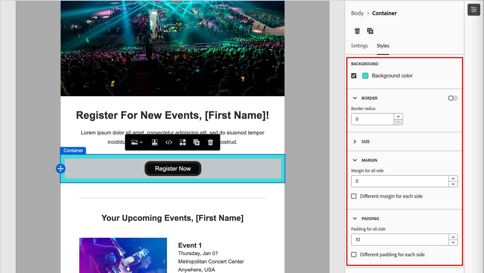

# Inhaltskomponenten {#content-components}

>[!CONTEXTUALHELP]
>id="ajo-b2b_content_components_email"
>title="Informationen zu Inhaltskomponenten"
>abstract="Inhaltskomponenten sind leere Platzhalter für Inhalte, mit denen Sie eine E-Mail gestalten können."

>[!CONTEXTUALHELP]
>id="ajo-b2b_content_components_landing_page"
>title="Informationen zu Inhaltskomponenten"
>abstract="Inhaltskomponenten sind leere Platzhalter für Inhalte, mit denen Sie eine Landingpage gestalten können. "

>[!CONTEXTUALHELP]
>id="ajo-b2b_content_components_fragment"
>title="Informationen zu Inhaltskomponenten"
>abstract="Inhaltskomponenten sind leere Platzhalter für Inhalte, mit denen Sie ein Fragment gestalten können."

>[!CONTEXTUALHELP]
>id="ajo-b2b_content_components_template"
>title="Informationen zu Inhaltskomponenten"
>abstract="Inhaltskomponenten sind leere Platzhalter für Inhalte, mit denen Sie eine Vorlage gestalten können."

Verwenden Sie beim Entwerfen von Inhalten für E-Mails, Landingpages, Vorlagen und visuelle Fragmente die [!UICONTROL Inhaltskomponenten], um visuelle Design-Elemente hinzuzufügen. Sie können beliebig viele Inhaltskomponenten zu einer oder mehreren Strukturkomponenten hinzufügen, die das Layout definieren.

## Inhaltsbibliothek

Im **[!UICONTROL Inhalt]** unten in der Komponentenbibliothek werden die verfügbaren Inhaltskomponenten angezeigt:

| Symbol | Komponente | Beschreibung |
| --------- | ---- | ----------- |
|  | [Container](#container) | Fügen Sie diese Komponente zu Ihrem Design hinzu, um einen rechteckigen Container einzuschließen, mit dem Sie Komponenten gruppieren oder Hintergrund- oder Rahmenstile auf einen Bereich anwenden können. |
|  | [button](#button) | Fügen Sie diese Komponente zu Ihrem Design hinzu, um ein anklickbares Schaltflächenelement einzuschließen. |
|  | [Text](#text) | Fügen Sie diese Komponente zu Ihrem Design hinzu, um einen Textkörper einzuschließen. |
|  | [Teiler](#divider) | Fügen Sie diese Komponente zu Ihrem Design hinzu, um separate Inhaltsbereiche mit einer horizontalen Linie zu versehen. |
|  | [HTML](#html) | Fügen Sie diese Komponente zu Ihrem Design hinzu, um die verschiedenen Teile Ihrer bestehenden HTML zu kopieren und einzufügen. Verwenden Sie diese Komponente, um einen kostenlosen modularen HTML-Block zur Wiederverwendung von externem Inhalt zu erstellen. |
|  | [Bild](#image) | Fügen Sie diese Komponente zu Ihrem Design hinzu, um eine Bilddatei einzufügen. |
|  | [Social](#social) | Fügen Sie diese Komponente zu Ihrem Design hinzu, um Links zu Social-Media-Seiten einzufügen. |
|  | [Formular](#form) | **_Nur für Landingpages verfügbar._** Fügen Sie diese Komponente zu Ihrem Design hinzu, um ein erstelltes Formular einzufügen. |

## Inhaltskomponenten-Symbolleisten

Jeder Inhaltskomponententyp zeigt eine Symbolleiste an, wenn Sie ihn auf der Arbeitsfläche auswählen. Die verfügbaren Tools, die je nach Komponententyp variieren, bieten eine einfache Möglichkeit, mit der Komponente direkt im gerenderten Inhalt zu arbeiten. Es enthält Formatierungs- und Funktionsfunktionen, die für den Komponententyp gelten.

{width="450"}

### Formatierungswerkzeuge

+++Textstil ändern

<table>
    <tr>
        <th style="width: 30%;">Tool</th>
        <th style="width: 50%;">Nutzung</th>
        <th style="width: 20%;">Komponenten</th>
    </tr>
    <tr>
        <td></td>
        <td>Anwenden von fett, kursiv, unterstrichen oder Durchgestrichen, hochgestellt oder tiefgestellt auf die ausgewählte Textzeichenfolge.</td>
        <td><li>Schaltfläche <li>Text</td>
    </tr>
</table>

+++

+++Horizontale Ausrichtung

<table>
    <tr>
        <th style="width: 30%;">Tool</th>
        <th style="width: 50%;">Nutzung</th>
        <th style="width: 20%;">Komponenten</th>
    </tr>
    <tr>
        <td></td>
        <td>Wenden Sie einen horizontalen Ausrichtungstyp auf den Komponenteninhalt an. Wählen Sie links, zentriert, rechts oder Blocksatz. </td>
        <td><li>Schaltfläche <li>Text</td>
    </tr>
</table>

+++

+++Liste erstellen

<table>
    <tr>
        <th style="width: 30%;">Tool</th>
        <th style="width: 50%;">Nutzung</th>
        <th style="width: 20%;">Komponenten</th>
    </tr>
    <tr>
        <td></td>
        <td>Anwenden einer geordneten oder ungeordneten Listenformatierung auf den Komponententext.</td>
        <td><li>Text</td>
    </tr>
</table>

+++

+++Überschrift festlegen

<table>
    <tr>
        <th style="width: 20%;">Tool</th>
        <th style="width: 60%;">Nutzung</th>
        <th style="width: 20%;">Komponenten</th>
    </tr>
    <tr>
        <td></td>
        <td>Anwenden der Formatierung auf Überschriftenebene auf den Absatz für die Cursorposition.</td>
        <td><li>Schaltfläche <li>Text</td>
    </tr>
</table>

+++

+++Schriftgröße

<table>
    <tr>
        <th style="width: 20%;">Tool</th>
        <th style="width: 60%;">Nutzung</th>
        <th style="width: 20%;">Komponenten</th>
    </tr>
    <tr>
        <td></td>
        <td>Anwenden der Schriftgröße auf einen ausgewählten Text Klicken Sie auf das Tool, und wählen Sie die Größe aus, oder geben Sie den px-Wert ein.</td>
        <td><li>Schaltfläche <li>Text</td>
    </tr>
</table>

+++

+++Schriftfarbe

<table>
    <tr>
        <th style="width: 40%;">Tool</th>
        <th style="width: 40%;">Nutzung</th>
        <th style="width: 20%;">Komponenten</th>
    </tr>
    <tr>
        <td></td>
        <td>Anwenden der Schriftfarbe auf den ausgewählten Text. Wählen Sie eine Farbe aus der Auswahl und verwenden Sie den Farbregler und das Farbfeld, um die Farbe auszuwählen. Sie können auch einen bekannten RGB-, HSL-, HSB- oder Hexadezimalwert eingeben. </td>
        <td><li>Schaltfläche <li>Text</td>
    </tr>
</table>

+++

+++Link einfügen

<table>
    <tr>
        <th style="width: 40%;">Tool</th>
        <th style="width: 40%;">Nutzung</th>
        <th style="width: 20%;">Komponenten</th>
    </tr>
    <tr>
        <td></td>
        <td>Erstellen Sie einen anklickbaren Link (externe URL oder Landingpage) für den ausgewählten Text oder das ausgewählte Element.</td>
        <td><li>Schaltfläche <li>Text <li>Bild </td>
    </tr>
</table>

+++

+++Link entfernen

<table>
    <tr>
        <th style="width: 15%;">Tool</th>
        <th style="width: 60%;">Nutzung</th>
        <th style="width: 25%;">Komponenten</th>
    </tr>
    <tr>
        <td></td>
        <td> Entfernen Sie den anklickbaren Link (externe URL oder Landingpage) für den ausgewählten Text oder das ausgewählte Element.</td>
        <td><li>Schaltfläche <li>Text <li>Bild </td>
    </tr>
</table>

+++

### Funktionale Tools

| Tool | Name | Nutzung |
| ---- | ---- | ----- |
| {width="40"} | Hinzufügen von Personalisierung | Verwenden Sie den Personalisierungseditor, um Personalisierungs-Token in den Komponenteninhalt einzufügen. [Weitere Informationen](./email-authoring.md#personalize-content) |
| {width="40"} | Quellcode anzeigen | Den HTML-Quell-Code für die Komponente in einem schreibgeschützten Popup anzeigen.  {width="200"} |
| {width="40"} | Bedingten Inhalt aktivieren | Aktivieren von bedingten Varianten für die Komponente. [Weitere Informationen](./conditional-content.md) |
| {width="40"} | Duplizieren | Erstellen Sie eine Kopie der Komponente und fügen Sie sie direkt unten hinzu. |
| {width="40"} | Löschen | Entfernen Sie die Komponente. |

## Hinzufügen einer Inhaltskomponente zu einem Design

1. Verwenden Sie im visuellen Design eine vorhandene Vorlage oder fügen Sie die erforderlichen Strukturkomponenten zu einer leeren Arbeitsfläche hinzu, um das Layout zu definieren.

1. Greifen Sie in der **[!UICONTROL Komponenten]**-Bibliothek _Ziehgriff_  für die Inhaltskomponente Ihrer Wahl und ziehen Sie sie dann auf die Strukturkomponenten.

   Sie können zu einer einzelnen Strukturkomponente und zu jeder Spalte einer Strukturkomponente mehrere Komponenten hinzufügen.

   {width="600" zoomable="yes"}

1. Passen Sie die Komponentenanzeige mit den Registerkarten **[!UICONTROL Einstellungen]** und **[!UICONTROL Stil]** auf der rechten Seite oder der auf der Arbeitsfläche angezeigten Kontextsymbolleiste an.

   Sie können beispielsweise den Textstil, den Abstand oder den Rand der Komponente ändern.

   {width="600" zoomable="yes"}

Während Sie mit Ihrem Design arbeiten, können Sie eine Komponente auch [entfernen](#remove-a-content-component) oder [duplizieren](#duplicate-a-content-component).

## Einstellungen und Stile der Inhaltskomponenten

Nachdem Sie eine Komponente hinzugefügt haben, wird sie im visuellen Design-Bereich ausgewählt und ihre Eigenschaften werden im rechten Bedienfeld angezeigt. Sie können auch jederzeit eine Komponente auswählen, um die Einstellungen und Stile zu ändern. Viele Einstellungen und Stile sind komponentenspezifisch, es gibt jedoch einige Standardeinstellungen und -stile, die Sie auf ausgewählte Inhaltskomponenten anwenden können.

### Anzeigeoptionen

Wenn Sie die Komponente von der Desktop- oder Mobilgeräteanzeige ausschließen möchten, ändern Sie die Einstellung **[!UICONTROL Anzeigeoptionen]**. Die Standardeinstellung (_[!UICONTROL auf allen Geräten anzeigen]_ aktiviert die Anzeige auf allen Geräten. Wählen Sie eine andere Einstellung aus, um die Komponente nach Gerätetyp auszuschließen:

* _[!UICONTROL Nur auf Desktop-Geräten anzeigen]_ - Wählen Sie diese Einstellung, wenn Sie die Komponente auf Desktop-Geräten anzeigen und für Mobilgeräte ausschließen möchten.
* _[!UICONTROL Nur auf Mobilgeräten anzeigen]_ - Wählen Sie diese Einstellung, wenn Sie die Komponente auf Mobilgeräten (wie Smartphones und Tablets) anzeigen und von Desktop-Geräten ausschließen möchten.

{width="400" zoomable="yes"}

### Container

Verwenden Sie einen Container, um bestimmte Stile auf eine Gruppe von Inhaltskomponenten anzuwenden. Fügen Sie [!UICONTROL &#x200B; Komponente &quot;]&quot; hinzu und fügen Sie dann darin weitere Inhaltskomponenten hinzu. Diese Komponente ähnelt der Verwendung eines `div` in HTML. Sie können einen eigenen Stil auf den Container anwenden, der sich von dem Stil unterscheidet, der auf die darin enthaltenen Inhaltskomponenten angewendet wurde.

Fügen Sie beispielsweise die Komponente _[!UICONTROL Container]_ hinzu, und fügen Sie anschließend die Komponente _[!UICONTROL Schaltfläche]_ innerhalb dieses Containers hinzu. Sie können einen bestimmten Bereichsstil für den Container verwenden und die Schaltfläche und ihren Hintergrund nach Bedarf gestalten.

{width="600" zoomable="yes"}

+++Hintergrund

{{styles-background}}

+++

+++Rahmen

{{styles-border}}

+++

+++Größe

{{styles-size}}

+++

+++Spanne

{{styles-margin}}

+++

+++Ränder

{{styles-padding}}

+++

### Schaltfläche

Verwenden Sie die [!UICONTROL Button]-Komponente, um eine oder mehrere anklickbare Schaltflächen in Ihren Inhalt einzufügen. Verwenden Sie Schaltflächen, um Seitenbetrachter oder E-Mail-Empfänger zu unterstützenden Inhalten weiterzuleiten (veröffentlichte Landingpage oder externer Link).

#### Schaltflächentext hinzufügen

Wenn die Schaltflächenkomponente auf der Arbeitsfläche angezeigt wird, enthält die Symbolleiste Optionen für die Textformatierung sowie Personalisierung und bedingte Varianten. Weitere Informationen zu den Optionen der Editor-Symbolleiste finden Sie unter #.

Wenn Sie den Text der Schaltflächenbeschriftung eingeben und die Formatierung festlegen, wird die Größe der Schaltfläche geändert, um den Inhalt aufzunehmen.

{width="500" zoomable="yes"}

#### Festlegen von Link-Optionen

Verwenden Sie auf _[!UICONTROL Registerkarte]_ die Optionen **[!UICONTROL Link]**, um den Schaltflächentext, das Link-Ziel und das Browser-Verhalten zum Laden der Zielseite zu definieren.

1. Legen Sie den **[!UICONTROL Typ]** für den Link fest:

   * **[!UICONTROL Externer Link]** - Wählen Sie diesen Typ aus, um eine Standard-URL als Link-Ziel zu verwenden.

     Geben **[!UICONTROL unter]** die URL für das Link-Ziel ein. Klicken Sie auf _Personalisieren_-Symbol (  ), um ein Personalisierungs-Token als Parameter in der URL zu verwenden.

     {width="200"}

   * **Landingpage** - Wählen Sie diesen Typ, um eine veröffentlichte Landingpage in der <!-- Journey Optimizer B2B Edition (_Beta_) or --> Marketo Engage-Instanz auszuwählen.

     Wählen Sie für **[!UICONTROL Option]** die veröffentlichte Landingpage aus. Klicken Sie auf das _Seite auswählen_-Symbol (  ) und [wählen Sie die veröffentlichte Landingpage aus](./landing-pages.md#link-to-a-landing-page).

     {width="200"}

1. Geben **[!UICONTROL unter]** den Text ein, der in der Schaltfläche angezeigt werden soll.

   Die Größe der Schaltfläche wird entsprechend dem Text und dem Stil angepasst, der festgelegt ist.

1. Wählen Sie für **[!UICONTROL Target**] aus, wie das verknüpfte Ziel von der E-Mail oder Seite umgeleitet werden soll:

   * _[!UICONTROL None]_ - Öffnet den Link mit dem Standard-Browser oder dem Client-Verhalten (Standard).
   * _[!UICONTROL Leer]_ - Öffnet den Link in einem neuen Fenster oder in einer neuen Registerkarte.
   * _[!UICONTROL Self]_ - Öffnet den Link im selben Frame.
   * _[!UICONTROL Parent]_ - Öffnet den Link im übergeordneten Frame.
   * _[!UICONTROL Oben]_ - Öffnet den Link im gesamten Fenster.

#### Stile festlegen

Passen Sie den Schaltflächenstil auf der Registerkarte **[!UICONTROL Stile]** an.

+++Hintergrund

{{styles-background}}

+++

+++Text

{{styles-text}}

+++

+++Rahmen

{{styles-border}}

+++

+++Größe

{{styles-size}}

+++

+++Ausrichtung

+++

+++Rand der Schaltfläche

+++

+++Container-Rand

{{styles-margin}}

+++

+++Ränder

{{styles-padding}}

+++

+++Erweitert

{{styles-advanced}}

+++

### Text

Verwenden Sie die Komponente Text , um einen Textblock in Ihren Inhalt einzufügen. Wenn die Textkomponente auf der Arbeitsfläche ausgewählt ist, geben Sie den Text ein und verwenden Sie die Symbolleistenoptionen, um Inline-Formatierung und Optionen hinzuzufügen, einschließlich Personalisierungs-Token und bedingter Varianten. Detaillierte Informationen zum Erstellen von Text, einschließlich Inline-Stilen und Optionen, im Design-Bereich finden Sie unter Texterstellung.

Passen Sie den Stil der Textkomponente auf der Registerkarte **[!UICONTROL Stile]** an.

+++Hintergrund

{{styles-background}}

+++

+++Text

Diese Stile werden auf den gesamten Textblock angewendet. Sie können Inline-Stile auf eine ausgewählte Textzeichenfolge anwenden.

{{styles-text}}

+++

+++Rahmen

{{styles-border}}

+++

+++Größe

{{styles-size}}

+++

+++Spanne

{{styles-margin}}

+++

+++Ränder

{{styles-padding}}

+++

+++Erweitert

{{styles-advanced}}

+++

### Trennlinie

Fügen Sie _Komponente_ Trennzeichen“ hinzu, um eine lineare Aufteilung zwischen Inhaltsabschnitten zu ermöglichen.

+++Hintergrund

{{styles-background}}

+++

+++Linie

+++

+++Größe

{{styles-size}}

+++

+++Ausrichtung

{{styles-alignment-h}}

+++

+++Spanne

{{styles-margin}}

+++

+++Ränder

{{styles-padding}}

+++

+++Erweitert

{{styles-advanced}}

+++

### HTML

Verwenden Sie die HTML-Komponente, um Teile Ihrer bestehenden HTML hinzuzufügen. Diese Komponente bietet eine einfache Möglichkeit, modulare HTML-Elemente zu erstellen, die Ihre externen Inhalte wiederverwenden.

1. Wählen Sie die Komponente auf der Arbeitsfläche aus und klicken Sie auf _Symbolleiste auf das Symbol_ Quellcode anzeigen“.

   [Öffnen Sie den Code-Editor, um die HTML hinzuzufügen](./assets/content-components-html-show-code.png){width="450"}

1. Fügen Sie die HTML in das Textfeld ein und klicken Sie auf **[!UICONTROL Speichern]**.

   [Dialogfeld &quot;HTML bearbeiten“](./assets/content-components-html-edit-dialog.png){width="600" zoomable="yes"}

   Wenn die HTML gültig ist, wird das Element auf der Arbeitsfläche gerendert. Wenn es sich um ein Element handelt, das einer der anderen Inhaltskomponenten zugeordnet ist, können Sie die Einstellungen und Stile im rechten Bedienfeld je nach Komponententyp ändern. Ist dies nicht der Fall, bleibt sie als HTML-Komponente erhalten.

Für eine HTML-Komponente können Sie die folgenden Stile für die gesamte HTML-Komponente im rechten Bedienfeld festlegen:

+++Hintergrund

{{styles-background}}

+++

+++Rahmen

{{styles-border}}

+++

+++Größe

{{styles-size}}

+++

+++Ausrichtung

{{styles-alignment-h-v}}

+++

+++Spanne

{{styles-margin}}

+++

+++Ränder

{{styles-padding}}

+++

+++Erweitert

{{styles-advanced}}

+++

### Bild

Verwenden Sie die [!UICONTROL Bild]-Komponente, um ein Bild-Asset in Ihren Inhalt einzufügen. Wenn die _Bild_-Komponente auf der Arbeitsfläche ausgewählt ist, können Sie die angezeigte Bild-Asset-Datei hinzufügen oder ändern.

{width="400" zoomable="yes"}

#### Bild-Asset hinzufügen

Wählen Sie den [Asset-Quelltyp](./assets-overview.md) und wählen Sie eine Bilddatei aus:

* **[!UICONTROL Marketo Engage Assets]** - Wählen Sie diesen Typ, um ein Bild-Asset aus der Journey Optimizer B2B edition-Bibliothek oder der verbundenen Market Engage-Instanz zu durchsuchen und auszuwählen.

  {width="700" zoomable="yes"}

  Im Dialogfeld können Sie ein Bild aus dem ausgewählten Repository und Arbeitsbereich auswählen. Klicken Sie auf **[!UICONTROL Auswählen]**, um das Asset hinzuzufügen.

  Es stehen Tools zur Verfügung, mit denen Sie das benötigte Asset finden können:

   * Klicken Sie _oben links auf_ Filter), um die angezeigten Elemente nach Ihren Kriterien zu filtern.

   * Geben Sie Text in das _Suchen_-Feld ein, um die angezeigten Elemente nach einer Übereinstimmung mit dem Asset-Namen zu filtern.

     {width="700" zoomable="yes"}

* **[!UICONTROL Experience Manager Assets]** - Wählen Sie diesen Typ aus, um ein Bild-Asset aus einem [konfigurierten Experience Manager Assets-Repository“ zu ](../admin/configure-aem-repositories.md) und auszuwählen.

  Wählen Sie im Dialogfeld _[!UICONTROL Assets auswählen]_ ein Bild mit den verfügbaren Tools aus, um das benötigte Asset zu finden, und klicken Sie auf **[!UICONTROL Auswählen]**.:

   * Ändern Sie **[!UICONTROL Repository]** oben rechts.

   * Klicken Sie **[!UICONTROL oben rechts auf]** Assets verwalten“, um das Assets-Repository in einer anderen Browser-Registerkarte zu öffnen und AEM Assets-Verwaltungstools zu verwenden.

   * Klicken Sie oben rechts auf _Ansichtstyp_, um die Anzeige in **[!UICONTROL Listenansicht]**, **[!UICONTROL Rasteransicht]**, **[!UICONTROL Galerieansicht]** oder **[!UICONTROL Wasserfallansicht]** zu ändern.

   * Klicken Sie auf _Symbol „Sortierreihenfolge_, um die Sortierreihenfolge zwischen aufsteigender und absteigender Reihenfolge zu ändern.

     {width="700" zoomable="yes"}

   * Klicken Sie auf **[!UICONTROL Menüpfeil]** Sortieren nach“, um die Sortierkriterien in **[!UICONTROL Name]**, **[!UICONTROL Size]** oder **[!UICONTROL Modified]** zu ändern.

   * Klicken Sie _oben links auf_ Filter), um die angezeigten Elemente nach Ihren Kriterien zu filtern.

   * Geben Sie Text in das _Suchen_-Feld ein, um die angezeigten Elemente nach einer Übereinstimmung mit dem Asset-Namen zu filtern.

  {width="700" zoomable="yes"}

* **[!UICONTROL Medien importieren]** - Wählen Sie diesen Typ aus, um eine Datei aus Ihrem System auszuwählen und in die Journey Optimizer B2B edition Asset-Bibliothek zu importieren.

  Ziehen _[!UICONTROL im Dialogfeld]_ Bild hochladen“ eine Datei aus dem System per Drag-and-Drop in das Feld „Datei“. Die maximale Dateigröße beträgt 100 MB.

  {width="450"}

  Die Dateinamen der ausgewählten Bilder werden im Dialogfeld angezeigt. Asset-Dateinamen müssen eindeutig sein (in allen Ordnern). Wenn bereits eine Datei mit dem Namen vorhanden ist, wird eine Meldung angezeigt. Namen dürfen maximal 100 Zeichen lang sein und keine Sonderzeichen enthalten (beispielsweise `;`, `:`, `\` und `|`).

  Klicken Sie **[!UICONTROL Importieren]**.

Sie können einen Bildtitel und alternativen Text für das Bild im rechten Bereich hinzufügen.

{width="250"}

#### Festlegen von Link-Optionen

Verwenden Sie auf _[!UICONTROL Registerkarte]_ die Optionen **[!UICONTROL Link]**, um das Bild mit einem Ziel und dem Browser-Verhalten zum Laden der Zielseite zu verknüpfen.

1. Legen Sie den **[!UICONTROL Typ]** für den Link fest:

   * **[!UICONTROL Externer Link]** - Wählen Sie diesen Typ aus, um eine Standard-URL als Link-Ziel zu verwenden.

     Geben **[!UICONTROL unter]** die URL für das Link-Ziel ein. Klicken Sie auf _Personalisieren_-Symbol (  ), um ein Personalisierungs-Token als Parameter in der URL zu verwenden.

     {width="250"}

   * **Landingpage** - Wählen Sie diesen Typ, um eine veröffentlichte Landingpage in der <!-- Journey Optimizer B2B Edition (_Beta_) or --> Marketo Engage-Instanz auszuwählen.

     Wählen Sie für **[!UICONTROL Option]** die veröffentlichte Landingpage aus. Klicken Sie auf das _Seite auswählen_-Symbol (  ) und [wählen Sie die veröffentlichte Landingpage aus](./landing-pages.md#link-to-a-landing-page).

     {width="250"}

1. Geben **[!UICONTROL unter]** den Text ein, der in der Schaltfläche angezeigt werden soll.

   Die Größe der Schaltfläche wird entsprechend dem Text und dem Stil angepasst, der festgelegt ist.

1. Wählen Sie für **[!UICONTROL Target**] aus, wie das verknüpfte Ziel von der E-Mail oder Seite umgeleitet werden soll:

   * _[!UICONTROL None]_ - Öffnet den Link mit dem Standard-Browser oder dem Client-Verhalten (Standard).
   * _[!UICONTROL Leer]_ - Öffnet den Link in einem neuen Fenster oder in einer neuen Registerkarte.
   * _[!UICONTROL Self]_ - Öffnet den Link im selben Frame.
   * _[!UICONTROL Parent]_ - Öffnet den Link im übergeordneten Frame.
   * _[!UICONTROL Oben]_ - Öffnet den Link im gesamten Fenster.

#### Festlegen der Stile

Legen Sie die Stile für die Bildkomponente im rechten Bedienfeld fest.

+++Hintergrund

{{styles-background}}

+++

+++Rahmen

{{styles-border}}

+++

+++Größe

{{styles-size}}

+++

+++Ausrichtung

{{styles-alignment-h}}

+++

+++Spanne

{{styles-margin}}

+++

+++Ränder

{{styles-padding}}

+++

+++Erweitert

{{styles-advanced}}

+++

### Social

Verwenden Sie die Komponente _Social_, um Links zu Social-Media-Seiten in Ihre Inhalte einzufügen. Es enthält drei standardmäßige Social-Media-Typen, Sie können die Typen jedoch je nach Bedarf hinzufügen oder entfernen.

{width="600" zoomable="yes"}

* Um einen Social-Media-Typ hinzuzufügen, klicken Sie auf das Symbol _Hinzufügen_ ( **+** ) und wählen Sie einen Social-Media-Typ aus, den Sie hinzufügen möchten.

  {width="250"}

* Um einen Social-Media-Typ zu entfernen, klicken Sie auf das **X** neben dem Social-Media-Symbol.

Wenn Sie einen Social-Media-Typ ausgewählt haben, legen Sie die Optionen für diesen Typ fest:

* **[!UICONTROL URL]** - Geben Sie die Social-Media-URL ein, die Sie mit der Social-Media-Grafik oder dem Symbol verknüpfen möchten.
* **[!UICONTROL Source]** - Wenn Sie Ihr eigenes Bild anstelle des Standardbilds verwenden möchten, wählen Sie und Bild-Asset aus. Sie können ein Bild aus dem verbundenen Marketo Engage Asset-Repository, einem Experience Manager Assets-Repository (falls konfiguriert) auswählen oder eine Bilddatei aus Ihrem System importieren. Weitere Informationen zum Auswählen und Importieren [ Bild-Assets finden ](#add-the-image-asset) unter „Informationen zur Bild-Komponente“.
* **[!UICONTROL ALT-]**: Geben Sie den ALT-Text für das angezeigte Bild ein.

  {width="250"}

Um eine konsistente Anzeigegröße für alle Social-Media-Grafiken zu definieren, legen Sie die **[!UICONTROL Größe von Bildern“]**.

Sie können die folgenden Stiloptionen für die Komponente _Social_ festlegen:

+++Hintergrund

{{styles-background}}

+++

+++Rahmen

{{styles-border}}

+++

+++Größe

{{styles-size}}

+++

+++Ausrichtung

{{styles-alignment-h}}

+++

+++Spanne

{{styles-margin}}

+++

+++Ränder

{{styles-padding}}

+++

+++Erweitert

{{styles-advanced}}

+++

### Formular (Landingpages)

[!BADGE Beta]{type=Informative url="/help/user/content/forms.md" tooltip="Beta-Funktion"}

Verwenden Sie die _Formular_-Komponente, um ein veröffentlichtes Formular zu einer Landingpage oder Landingpage-Vorlage hinzuzufügen. Weitere Informationen zum Erstellen und Veröffentlichen von Formularen finden Sie unter [Forms](./forms.md).

1. Klicken Sie auf das _Formular_-Tool in der Komponenten-Symbolleiste oder verwenden Sie die Eigenschaften **[!UICONTROL Formular einbetten]** auf der rechten Seite, um das veröffentlichte Formular auszuwählen.

   {width="600"}

1. Wenn Sie den standardmäßigen **[!UICONTROL Follow-up-Typ]** für das Formular überschreiben möchten, ändern Sie die Einstellung entsprechend den Anforderungen für Ihre Seite oder Vorlage.

   Diese Seite wird auch als _Dankeseite“ für_ Formular bezeichnet. Diese Einstellung bestimmt, was passiert, wenn ein Besucher das Formular sendet:

   * **[!UICONTROL Auf Seite bleiben]** - Wählen Sie diese Option, um den Besucher beim Senden des Formulars auf der gleichen Seite zu belassen.

   * **[!UICONTROL Landingpage]** - Wählen Sie diese Option, um eine beliebige Journey Optimizer B2B edition- oder Marketo Engage-Landingpage als Folgemaßnahme auszuwählen.

   * **[!UICONTROL Externe URL]** - Wählen Sie diese Option aus, um eine beliebige URL als Folgeseite anzugeben. Nachdem der Besucher das Formular gesendet hat, lädt der Browser die vorgesehene URL.

     >[!TIP]
     >
     >Wenn Sie das Formular zum Herunterladen einer Datei verwenden möchten, können Sie eine URL für die gehostete Datei angeben. Bei dieser Konfiguration fungiert die Senden-Schaltfläche als Download-Schaltfläche.

     {width="280"}

Wählen Sie bei Bedarf die **[!UICONTROL Stile]** im rechten Bereich aus, um die Formularränder innerhalb der Strukturkomponente festzulegen.

{{styles-margin}}
