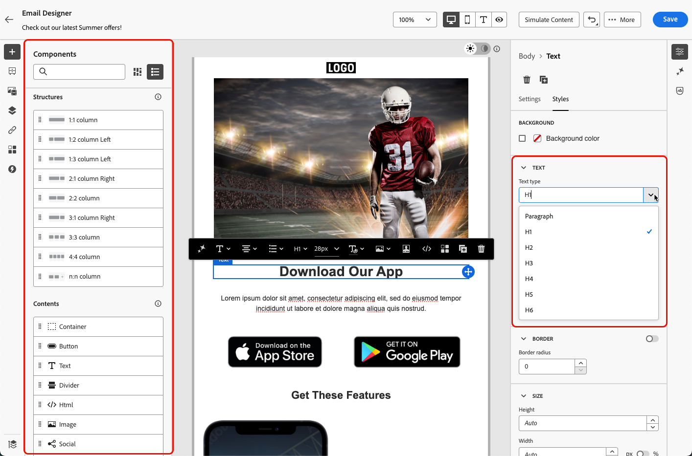
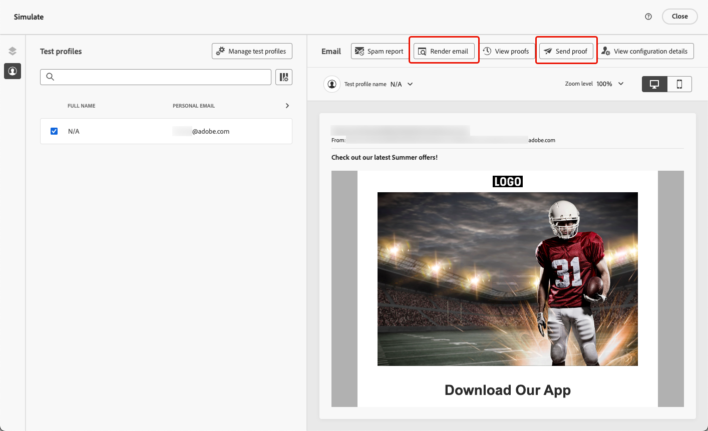

# Gestalten barrierefreier Inhalte {#accessible-content}

Die [EU-Richtlinie zur Barrierefreiheit](https://eur-lex.europa.eu/legal-content/DE/TXT/?uri=CELEX%3A32019L0882){target="_blank"} soll die Beseitigung von Hindernissen, die durch unterschiedliche nationale Vorschriften in den Mitgliedstaaten verursacht werden, den Binnenmarkt für barrierefreie Produkte und Dienstleistungen verbessern.

Diese Richtlinie legt fest, dass alle digitalen Mitteilungen, einschließlich E-Mails, Newslettern, PDFs und herunterladbaren Inhalten, barrierefrei sein sollen. Beim Erstellen von Inhalten für Ihre Empfängerinnen und Empfänger müssen Sie daher bestimmte Leitlinien befolgen (z. B. barrierefreie Schriftarten und lesbare Formate verwenden und alternativen Text für Bilder bereitstellen).

Mit den [!DNL Journey Optimizer B2B Edition] Design-Tools können Marketing-Experten Inhalte sowohl für **E-** als auch für **Landingpages** erstellen. Verwenden Sie diese Tools, um diese Richtlinie einzuhalten, die auf den Web Content Accessibility Guidelines (WCAG) 2.1, Level AA, basiert.

In den folgenden Abschnitten werden die Best Practices zum Entwerfen barrierefreier Inhalte mit [!DNL Journey Optimizer B2B Edition] beschrieben. Diese Informationen konzentrieren sich auf die Gestaltung von Inhalten, die für alle Ihre Empfängerinnen und Empfänger zugänglich sind, sodass Menschen mit Behinderungen Ihre E-Mails und Landingpages lesen, verstehen und mit ihnen interagieren können.
 

## Sicherstellen der Lesbarkeit von Text {#text-readability}

Verwenden Sie die Registerkarte **[!UICONTROL Stile]** der Komponente **[!UICONTROL Text]**, um sicherzustellen, dass Ihr Text lesbar ist, z. B. mit einem ordnungsgemäßen Farbkontrast und einfachen Schriftarten. Weitere Informationen zum Formatieren von Textkomponenten finden Sie unter [Inhaltskomponenten](content-components.md#text)

{width="700" zoomable="yes"}

Befolgen Sie für Schriftarten und Text die folgenden Leitlinien:

### Schriftartenauswahl

* Verwenden Sie serifenlose Schriftarten wie Arial, Verdana, Tahoma, Helvetica oder Open Sans.
* Vermeiden Sie in Textinhalten serifenbetonte, kursive oder dekorative Schriftarten.
* Achten Sie auf einen beschränkten Schriftsatz, um Konsistenz und Fallback zu gewährleisten (z. B. `font-family: Arial, Helvetica, sans-serif;`).

### Schriftgröße

* Achten Sie beim Textkörper auf einen Schriftgrad von mindestens 16 Pixel.
* Verwenden Sie eine geeignete Hierarchie für Überschriften.

### Farbkontrast

* Wahren Sie zwischen Text und Hintergrund ein Kontrastverhältnis von mindestens 4,5 :1.
* Achten Sie bei großem Text (≥24 Pixel oder 18 Pixel fett) auf einen Kontrast von mindestens 3 :1.
* Vermeiden Sie hellgrauen oder pastellfarbenen Text auf weißem Hintergrund.
* Verlassen Sie sich nicht allein auf Farbe, um Bedeutung zu vermitteln, sondern verwenden Sie auch Unterstreichungen, Symbole usw.

### Barrierefreiheit von Text

* Vermeiden Sie Text in Bildern.
* Verwenden Sie im Textkörper nicht ausschließlich Großbuchstaben.
* Stellen Sie sicher, dass Text auf bis zu 200 % gezoomt werden kann, ohne dass das Layout beschädigt wird.

## Sicherstellen der visuellen Barrierefreiheit {#visual-accessibility}

Um dafür zu sorgen, dass Inhalte visuell barrierefrei sind, wenden Sie die folgenden Best Practices an:

* Verwenden Sie für wichtige Informationen keine reinen Farbindikatoren.
* Nutzen Sie Text-Labels oder Symbole, um Klarheit zu schaffen.
* Optimieren Sie Ihr Design für mobile und responsive Layouts und stellen Sie sicher, dass Schaltflächen groß sind und ausreichend Abstand aufweisen.
* Testen Sie regelmäßig für verschiedene Geräte und Bildschirmgrößen, um die Barrierefreiheit zu gewährleisten.

[!DNL Journey Optimizer B2B Edition] können Größe und Abstand der verschiedenen Elemente in Ihrem Inhalt mithilfe der Stilparameter und -attribute im Bereich E-Mail-Designer (Stile **[!UICONTROL weiter]** werden.

Sie können beispielsweise den Hintergrund aktualisieren oder die Ränder, den Abstand und die Ausrichtung ändern, um die visuelle Barrierefreiheit Ihrer Inhalte zu verbessern.

{width="700" zoomable="yes"}

Darüber hinaus können Sie mit dem E-Mail-Designer von [!DNL Journey Optimizer B2B Edition] das Design für verschiedene Geräte und Bildschirmgrößen in der Vorschau anzeigen und optimieren. Sie können jederzeit zur Live **[!UICONTROL Ansicht wechseln,]** zu überprüfen, wie Ihre Inhalte auf verschiedenen Gerätegrößen gerendert werden können.

{width="700" zoomable="yes"}

>[!CAUTION]
>
>Die Live-Ansicht ist eine allgemeine Vorschau, die vergleicht, wie das Rendering über verschiedene Gerätegrößen hinweg aussehen könnte. Das endgültige Rendering kann je nach E-Mail-Client der Empfängerinnen und Empfänger variieren.

## Verwenden von Alternativtext für Bilder {#alt-text}

Verwenden Sie die Komponente **[!UICONTROL Bild]**, um alternativen Text für Bilder bereitzustellen. Weitere Informationen zu den Einstellungen der Bildkomponente finden Sie unter [Inhaltskomponenten](content-components.md#image)

{width="700" zoomable="yes"}

Wenden Sie die folgenden Richtlinien an, um in digitalen Produkten effektiven Alternativtext zu nutzen:

* Beschreiben Sie den Zweck des Bildes kurz und kontextbezogen.
* Vermeiden Sie redundante Ausdrücke wie „Abbildung von …“ und verwenden Sie leeren Alternativtext für dekorative Bilder.
* Geben Sie für Symbole mit Bedeutung aussagekräftige Labels an. Nutzen Sie für komplexe Bilder einen kurzen Alternativtext und an anderer Stelle eine längere Beschreibung.

## Verwenden von lesbarem Format {#readable-format}

Verwenden Sie die für E-Mail-Designer relevante Struktur und [Inhaltskomponenten](content-components.md) sowie die Optionen im Bereich **[!UICONTROL Stile]**, um Ihren Content übersichtlich, logisch und präzise anzuordnen, sodass er für alle zugänglich ist.

{width="800" zoomable="yes"}

* Nutzen Sie strukturierte, semantische HTML mit passenden Überschriften, Absätzen, Listen und Tabellen.
* Stellen Sie sicher, dass der Inhalt einem logischen Fluss von links nach rechts, von oben nach unten folgt.
* Verwenden Sie klare, knappe Formulierungen.
* Stellen Sie alternative Formate für PDF-Dateien und Infografiken bereit.
* Ändern Sie die Textgröße und den Textfluss und stellen Sie sicher, dass die Typografie in allen Formaten mit angemessenem Farbkontrast lesbar ist.

## Sicherstellen der Lesbarkeit von Inhalten {#readability}

Um lesbar zu sein, müssen Ihre Inhalte klar, gut strukturiert und für alle verwendbar sein – auch für Menschen mit visuellen, kognitiven oder Leseschwächen und solche, die Hilfstechnologien verwenden. Einige Punkte, die Sie beim Erstellen barrierefreier Inhalte beachten sollten:

* Bilden Sie Sätze mit höchstens 20 Wörtern.
* Bearbeiten Sie Ihren Text so, dass er direkt ist und alles auf den Punkt bringt.
* Nutzen Sie das Aktiv, um die Satzstruktur einfacher zu halten.
* Vermeiden Sie Slang, Fachsprache oder regionale Wörter, mit denen manche Menschen möglicherweise nicht vertraut sind.

Um Ihre E-Mail-Lesbarkeit zu bewerten, verwenden Sie den beliebten [Flesch Reading Ease Test](https://support.microsoft.com/de-de/office/abrufen-der-lesbarkeit-und-ebenenstatistiken-ihres-dokuments-85b4969e-e80a-4777-8dd3-f7fc3c8b3fd2){target="_blank"} in Microsoft Word. Es berechnet, wie einfach Ihr Inhalt auf einer Skala von 0-100 zu lesen ist.

## Testen Ihrer Inhalte {#test}

Zum Überprüfen der Barrierefreiheit Ihrer Inhalte können Sie die von [!DNL Journey Optimizer B2B Edition] bereitgestellten Testfunktionen verwenden. Sie wurden nicht speziell dafür konzipiert zu überprüfen, ob Ihre Inhalte vollständig barrierefrei sind, können aber einen ersten Prüfungsschritt darstellen.

* Vorschau Ihres Inhalts mithilfe von Testprofilen.

* Verwenden Sie die Option [E-Mail-Rendering](email-test-rendering.md), die Litmus zur Simulation Ihrer Designs in wichtigen E-Mail-Clients (Apple Mail, Gmail, Outlook) nutzt, damit Sie sehen können, ob Text, Farben und Bilder Ihre Inhalte barrierefrei machen. <!--Litmus includes accessibility testing-->

* Führen Sie Testsendungen durch, um das Rendering Ihres Inhalts zu testen, bevor Sie ihn an Ihre echte Zielgruppe senden.

{width="800" zoomable="yes"}

Um konsistenter zu überprüfen, ob Ihre Inhalte zuverlässig barrierefrei sind, nutzen Sie externe Tools wie:

* [WebAim Contrast Checker](https://webaim.org/resources/contrastchecker/){target="_blank"} und [WAVE Web Accessibility Evaluation Tool](https://wave.webaim.org/){target="_blank"} zur Bewertung von Kontrast und Compliance;

* Hilfstechnologien wie Bildschirmlesehilfen (z. B. [NVDA](https://www.nvaccess.org/download/){target="_blank"} oder [VoiceOver](https://support.apple.com/de-de/guide/iphone/iph3e2e415f/ios){target="_blank"} auf iPhone), um E-Mails aus der Perspektive sehbehinderter Benutzender zu erleben.

## Verwenden des dunklen Modus {#dark-mode}


Der dunkle Modus optimiert die visuelle Barrierefreiheit für Benutzende mit Lichtempfindlichkeit oder Sehbehinderungen, um das Anwendererlebnis zu verbessern.

{width="800" zoomable="yes"}

Verwenden Sie beim Entwerfen für den Dunkelmodus transparente PNG- oder SVG-Bilder und legen Sie geeignete Meta-Tags und CSS fest. Wenn der Dunkelmodus nicht unterstützt wird, können barrierefreie Ausweich-Stile bereitgestellt werden. Testen Sie abschließend alle E-Mail-Inhalte und Benutzeroberflächenelemente sowohl im hellen als auch im dunklen Modus.

## Verwenden spezifischer Attribute für Barrierefreiheit {#attributes}

### Sprachattribute {#language}

Fügen Sie beim Gestalten von Designs die Attribute `lang` (Sprache) und `dir` (Textausrichtung) in den Content-Hauptteil ein. Diese Attribute unterstützen Hilfstechnologien wie Bildschirmlesehilfen bei der angemessenen Interpretation und Darstellung Ihrer Inhalte.

* Das Attribut `lang` gibt die Sprache der E-Mail für Hilfstechnologien an und stellt sicher, dass Wörter korrekt ausgesprochen werden.

  +++Beispiele

  Beispiel für Englisch:

  ```
  <body lang="en">
  ```

  Beispiel für Französisch:

  ```
  <body lang="fr">
  ```

  +++

* Das Attribut `dir` gibt die Textausrichtung an. Die meisten Sprachen, einschließlich Englisch und Französisch, werden von links nach rechts (ltr) gelesen, während Sprachen wie Arabisch und Hebräisch von rechts nach links (rtl) gelesen werden.

  +++Beispiele

  Beispiel für Englisch (links nach rechts):

  ```html
  <body lang="en" dir="ltr">
  ```

  Beispiel für Arabisch (rechts nach links):

  ```html
  <body lang="ar" dir="rtl">
  ```

  +++

Bildschirmlesehilfen verwenden das Attribut `lang` , um die richtigen Ausspracheregeln anzuwenden. Die Textrichtung stellt sicher, dass Inhalte für Sprachen mit Rechts-nach-Links- oder Rechts-nach-Links-Schreibrichtung von der Natur aus fließen. Ohne diese Attribute kann es zu einer verwirrenden Leserichtung oder falscher Aussprache kommen. Umschließen Sie daher Ihren E-Mail-Textkörper immer mit dem entsprechenden `lang`- und `dir`-Attribut.

>[!TIP]
>
>Wenn Ihre E-Mail mehrere Sprachen enthält, weisen Sie bestimmten Abschnitten (z. B. `<table>` oder `<td>`) die entsprechenden Sprachattribute zu, um sicherzustellen, dass jeder Teil korrekt gelesen wird.

### Tabellen {#tables}

In HTML-Inhalten werden häufig Tabellen für das Layout verwendet. Standardmäßig behandeln Bildschirmlesehilfen jede `<table>` als Datentabelle und geben Zeilen, Spalten und Struktur aus. Diese Struktur kann verwirrend sein, wenn die Tabelle nur zur Formatierung verwendet wird.

Fügen Sie Layout-Tabellen `role="presentation"` (oder `role="none"`) hinzu, um sicherzustellen, dass Hilfstechnologien ihre Struktur überspringen und sich nur auf den tatsächlichen Inhalt konzentrieren.

+++Beispiel – Layout-Tabelle (mit `role="presentation"`)

```html
<table role="presentation" border="0" cellpadding="0" cellspacing="0" width="100%"> 
  <tr> 
    <td align="center"> 
      <h1>Hello World</h1> 
      <p>Welcome to our newsletter</p> 
    </td> 
  </tr> 
</table>
```

Die Bildschirmlesehilfen lesen:
„Hallo Welt. Willkommen bei diesem Newsletter.“ *(Zeilen, Spalten oder Tabellen werden nicht erwähnt)*

+++

+++Beispiel – Datentabelle (ohne `role="presentation"`)

```html
<table border="1" cellpadding="5" cellspacing="0"> 
  <tr> 
    <th scope="col">Name</th> 
    <th scope="col">Score</th> 
  </tr> 
  <tr> 
    <td>Alice</td> 
    <td>95</td> 
  </tr> 
  <tr> 
    <td>Bob</td> 
    <td>88</td> 
  </tr> 
</table> 
```

Die Bildschirmlesehilfen lesen:
„Tabelle mit 2 Spalten und 3 Zeilen.“

„Name, Alice. Bewertung, 95.“

„Name, Bob. Bewertung, 88.“

+++

>[!TIP]
>
>Verwenden Sie `role="presentation"` ausschließlich für Layout-Tabellen. Behalten Sie bei Datentabellen die semantische `<table>`-Struktur bei, damit Bildschirmlesehilfen Header und Beziehungen korrekt ausgeben können.

### Text für Links {#links}

Bildschirmlesehilfen lesen Links mit ihrem Text vor. Wenn ein Link nur _Hier klicken_ oder _Weitere Informationen_ beschriftet ist, kennen Benutzer von Hilfstechnologien das Ziel nicht. Für Barrierefreiheit benötigen sie beschreibenden Text, der das Ziel oder die Aktion klar angibt.

Verwenden Sie die E-Mail-Designer , um einen Link zu Ihrem Inhalt hinzuzufügen und die Kennzeichnung zu bearbeiten, damit sie erkennbar (sichtbar) und beschreibend (klar zu Ihrem Zweck) ist. Vermeiden Sie vage Bezeichnungen wie _hier_ oder _mehr_.

{width="600" zoomable="yes"}

+++Beispiel – guter Link (beschreibend): 

```
<p>Learn more in the  
<a href="https://adobe.com/release-notes">August release notes</a>. 
</p>
```

Die Bildschirmlesehilfen lesen:
„Link, Versionshinweise August.“

+++

+++Beispiel – schlechter Link (nicht beschreibend):

```
<p>Learn more about our new features.  
  <a href="https://adobe.com/release-notes">Click here</a>. 
</p>
```

Die Bildschirmlesehilfen lesen:
„Link, hier klicken.“ *(bietet keinen Kontext außerhalb der Lesereihenfolge)*

+++

## Bereitstellen von Tastaturnavigation und Fokusunterstützung {#keyboard}

<!--for landing pages-->

Durch die Unterstützung der Tastaturnavigation und des Fokus können Personen, die keine Maus verwenden können, auf Inhalte zugreifen und mit ihnen interagieren. Zudem wird die Anwenderfreundlichkeit verbessert, da alle Benutzenden eine klare und konsistente Möglichkeit haben, durch Informationen zu navigieren.

* Fokus über die Tastatur
   * Sorgen Sie dafür, dass alle interaktiven Elemente (z. B. Schaltflächen, Kontrollkästchen, Links) `tabindex="0"` aufweisen, damit sie in der natürlichen Registerkartenreihenfolge enthalten sind.
   * Ermöglichen Sie Navigation mithilfe der Tabulatortaste und der Pfeiltasten (↑ ↓ ← →), wobei das fokussierte Element sichtbar hervorgehoben werden sollte.
* Benutzerdefinierter Fokusstil
   * Wenden Sie klare und unterscheidbare Stile an, um den Fokus auf umsetzbare Elemente zu lenken:
     +++Beispiel (CSS)

     ```
     [tabindex="0"] : focus { 
     outline: 2px solid #00AEEF;  /* Cyan border */ 
     background-color: #20CEFF;   /* Optional background */ 
     }
     ```

     +++

   * Stellen Sie sicher, dass die Fokusindikatoren den WCAG 2.2-Standards für das Erscheinungsbild des Fokus entsprechen, einschließlich:
      * Mindestfläche: 2 CSS-Pixel dicke Kontur.
      * Kontrastverhältnis: ≥ 3 :1 zwischen fokussiertem und unfokussiertem Status.

* Unterstützung für Tastaturaktivierung
   * Sorgen Sie dafür, dass Kontrollkästchen und Schaltflächen auf die Eingabetaste und Leertaste reagieren.
   * Validieren Sie die Interaktion nur mit der Tastatur:
      * Bei Verwendung der Eingabetaste oder Leertaste sollten Kontrollkästchen aktiviert bzw. deaktiviert werden.
      * Die Schaltflächen sollten mit der Eingabetaste oder Leertaste Trigger werden.
