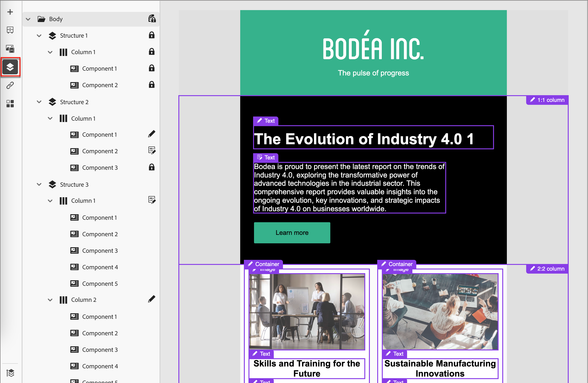

# Aus einer verwalteten Vorlage erstellen

Content-Designer können beim Erstellen von E[Mail _Vorlagen die_ Governance“ ](./template-content-governance.md). Mit Governance-Funktionen können sie die Teile des Designs festlegen, die bei Verwendung auf einer Account-Journey nicht geändert werden können. Wenn Sie [gespeicherte Vorlage auswählen](./email-authoring.md#select-a-template) um eine E-Mail zu erstellen, lädt der visuelle Design-Bereich die Vorlage, damit Sie sie als Grundlage für Ihre E-Mail verwenden können.

Wenn für die Vorlage die Governance aktiviert ist, wird im Bereich Eigenschaften auf der rechten Seite ein Warnhinweis angezeigt. Sie können die Option **[!UICONTROL Bearbeitbare Bereiche hervorheben]** oben auf der Arbeitsfläche aktivieren, um zu sehen, welche Komponenten und Inhaltselemente für die Verwendung auf Ihrem Journey bearbeitbar sind.

{width="800" zoomable="yes"}

Sie können die gesperrten oder bearbeitbaren Elemente auch mithilfe des _Navigationsbaums“_. Klicken Sie auf _Navigationsbaum_-Symbol (  ) links neben der Arbeitsfläche, um die Baumstruktur anzuzeigen.

{width="600" zoomable="yes"}

Die Symbole geben die angewendeten Einstellungen zum Sperren von Inhalten an.

| Symbol | Name | Beschreibung |
|------|------|-------------|
|  | Schreibgeschützt | Die Komponente ist gesperrt und kann nicht bearbeitet werden. Wenn sie auf der Stammebene (_[!UICONTROL body]_) angewendet werden, sind alle untergeordneten Komponenten gesperrt und können nicht bearbeitet werden. |
|  | Inhaltssperre | Die Inhaltssperre wird auf Komponentenebene angewendet. |
|  | Bearbeitbar | Die Komponente kann vollständig bearbeitet werden. Sie können das Element jedoch möglicherweise nicht löschen. |
|  | Bearbeitbar - nur Inhalt | Komponente und Stil sind statisch, aber Sie können den Inhalt (z. B. Text oder Bild) ändern. |
