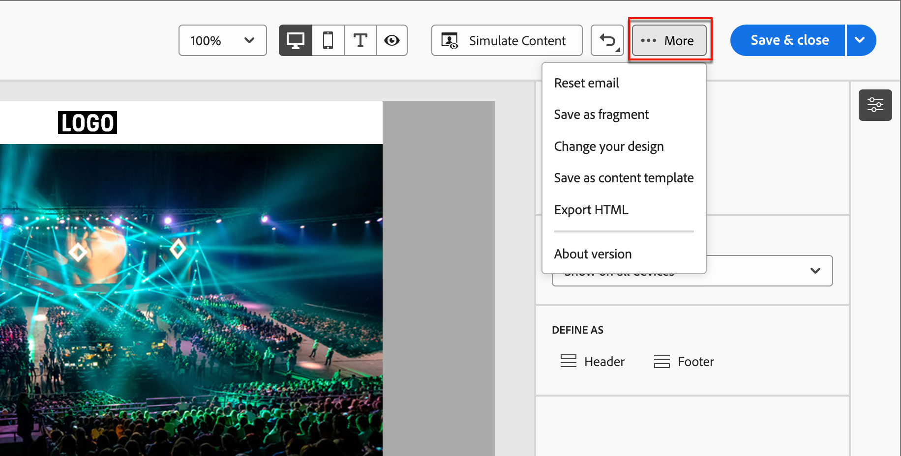

# Verfassen von E-Mail-Nachrichten

Nachdem Sie [ein E-Mail-Asset zu einem Journey-Aktionsknoten hinzugefügt](./add-email.md) können Sie den Inhalt für die E-Mail-Nachricht definieren.

Klicken Sie **[!UICONTROL der Registerkarte]** Details _[!UICONTROL im rechten Bedienfeld auf]_ E-Mail-Inhalt bearbeiten“.

{width="700" zoomable="yes"}

Diese Aktion startet die E-Mail-Design-Tools, in denen Sie aus den folgenden Optionen auswählen können, wie Sie Ihre E-Mail gestalten möchten:

* [Erstellen Sie Ihre E-Mail von Grund auf &#x200B;](#design-your-email-from-scratch) mithilfe der Benutzeroberfläche von E-Mail-Designer.

* [Importieren Sie vorhandene HTML-Inhalte](#import-existing-html-content) aus einer Datei oder einem ZIP-Ordner.

* [Wählen Sie eine vorhandene &#x200B;](#select-a-template) aus einer Liste integrierter oder benutzerdefinierter E-Mail-Vorlagen aus.

Nachdem Sie den E-Mail-Inhalt erstellt und personalisiert haben, können Sie den Inhalt zur Validierung oder zur späteren Verwendung exportieren. Klicken Sie **[!UICONTROL HTML exportieren]**, um den Inhalt als ZIP-Datei zu speichern, die Ihre HTML und Assets enthält.

>[!TIP]
>
>Verwenden Sie den KI-Assistenten in Adobe Journey Optimizer B2B edition, der auf generativer KI basiert, um Ihre Inhalte auf die nächste Ebene zu heben. Der KI-Assistent kann Ihnen dabei helfen, die Wirkung Ihrer Sendungen zu optimieren, indem er ganze E-Mails und zielgerichtete Textinhalte generiert und KI-Assistenten-Empfehlungen für Bilder abgibt, die bei Ihrer Audience Anklang finden. [Weitere Informationen](./ai-assistant-emails.md)

## Gestalten Ihrer E-Mail von Grund auf neu {#design-from-scratch}

Verwenden Sie den visuellen Inhaltsdesignbereich, um die Struktur und den Inhalt der E-Mail zu definieren. Durch das Hinzufügen und Verschieben von Strukturkomponenten mit einfachen Drag-and-Drop-Aktionen können Sie die Form des wiederverwendbaren E-Mail-Inhalts innerhalb von Sekunden entwerfen.

1. Wählen Sie auf _[!UICONTROL Startseite]_ Vorlage entwerfen“ die Option **[!UICONTROL Erstellen von neuen]** aus.

1. Wählen Sie im _[!UICONTROL E-Mail erstellen]_ den Typ des E-Mail-Inhalts aus, den Sie erstellen möchten.

   * **[!UICONTROL Designs verwenden]** - Wählen Sie diese Option, um die E-Mail im _Design-Modus_ zu erstellen. In diesem Modus können Sie ein definiertes Markendesign verwenden, um den Inhaltserstellungsprozess zu optimieren und sicherzustellen, dass das Design den definierten Standards entspricht.

   * **[!UICONTROL Manueller Stil]** - Wählen Sie diese Option, um die E-Mail im _manuellen Modus_ zu erstellen. In diesem Modus legen Sie die Formatierung für alle Struktur- und Inhaltskomponenten, die Sie der leeren Arbeitsfläche hinzufügen, manuell fest.

1. [Struktur und Inhalt hinzufügen](./email-authoring.md#add-structure-and-content) zur Vorlage hinzufügen.

1. [Links überprüfen und &#x200B;](#preview-and-edit-linked-urls).

1. [Testen Sie die E-Mail](#check-and-test-the-email).

<!-- If needed, you can further personalize your email by clicking **[!UICONTROL Switch to code editor]** from the advanced menu. The code editor allows you to edit the email source code, such as adding tracking or custom HTML tags.

>[!CAUTION]
>
>You cannot revert back to the visual design space for this email after switching to the code editor. -->

Wenn Sie mit dem Inhalt zufrieden sind, klicken Sie auf **[!UICONTROL Speichern]**.

## Vorhandenen HTML-Inhalt importieren

{{$include /help/_includes/content-design-import.md}}

{width="500"}

>[!NOTE]
>
>Einen `<table>`-Tag als erste Ebene in einer HTML-Datei zu verwenden kann zum Verlust des Stils führen, einschließlich der Einstellungen für Hintergrund und Breite im Tag der obersten Ebene.

Sie können den importierten Inhalt nach Bedarf mit den visuellen E-Mail-Editor-Tools personalisieren.

## Vorlage auswählen

{{$include /help/_includes/content-design-select-template.md}}

>[!NOTE]
>
> Auf gespeicherte Vorlagen können Governance-Einstellungen (Inhaltssperrung) für eine oder mehrere Komponenten angewendet werden. Der visuelle Design-Bereich bietet Richtlinien zu gesperrten Komponenten, wenn Sie [E-Mail aus einer verwalteten Vorlage erstellen](./email-authoring-governance.md).

## Hinzufügen von Struktur und Inhalten {#structure-content}

{{$include /help/_includes/content-design-components.md}}

### Hinzufügen von benutzerdefiniertem CSS

Sie können Ihr eigenes benutzerdefiniertes CSS direkt im E-Mail-Design-Bereich hinzufügen. Verwenden Sie benutzerdefiniertes CSS, um erweiterte und spezifische Stile anzuwenden, um die Flexibilität und Kontrolle über das Erscheinungsbild Ihrer Inhalte zu erhöhen. Es empfiehlt sich, diese Formatierung auf höchster Ebene hinzuzufügen, bevor Sie Inhaltskomponenten wie Bilder, Schaltflächen und Text einbeziehen.

Wählen Sie bei mindestens einer Inhaltskomponente auf der Arbeitsfläche die Komponente **[!UICONTROL Hauptteil]** in der linken Navigationsstruktur aus, um auf den benutzerdefinierten CSS-Editor zuzugreifen.

>[!NOTE]
>
>Wenn Ihre E-Mail-Nachricht mit einer [Vorlage mit gesperrtem Inhalt](./template-content-governance.md) erstellt wurde, können Sie Ihrem Inhalt kein benutzerdefiniertes CSS hinzufügen. Das Label der Schaltfläche ändert sich in **[!UICONTROL Benutzerdefiniertes CSS anzeigen]** und bereits im Inhalt vorhandene benutzerdefinierte CSS sind schreibgeschützt.

{width="800" zoomable="yes"}

{{$include /help/_includes/content-design-custom-css.md}}

### Hinzufügen von Fragmenten

>[!NOTE]
>
>Fragmente sind nicht kreuzkompatibel zwischen dem _Design-Modus_ und dem _manuellen Modus_ im E-Mail-Inhalt. Um ein Fragment in E-Mail-Inhalten zu verwenden, auf die ein Design angewendet wird, muss das Fragment auch im _Design-Modus_ erstellt werden.

{{$include /help/_includes/content-design-use-fragments.md}}

Nachdem die E-Mail gespeichert wurde, wird sie auf der Seite mit den Fragmentdetails angezeigt, wenn Sie die Registerkarte _[!UICONTROL Verwendet von]_ in der Zusammenfassung auswählen.

### Hinzufügen von Bild-Assets

{{$include /help/_includes/content-design-assets.md}}

### Navigieren in den Ebenen, Einstellungen und Stilen

{{$include /help/_includes/content-design-navigation.md}}

### Personalisieren von Inhalten

{{$include /help/_includes/content-design-personalization-email.md}}

>[!NOTE]
>
>Wenn _[!UICONTROL Meine Token]_ für die Konto-Journey definiert sind, können Sie diese Journey-spezifischen Token auch für Ihren E-Mail-Inhalt verwenden. Weitere Informationen finden [&#x200B; unter „Benutzerdefinierte Token &#x200B;](./personalization-my-tokens.md) E-Mail-Personalisierung“.

### Verknüpftes URL-Tracking bearbeiten

{{$include /help/_includes/content-design-links.md}}

### Anwenden des Dunkelmodus-Stils

Verwenden Sie _Dunkler Modus_, um Ihre E-Mail-Anzeige auf ein dunkles Design in einem E-Mail-Client zu überprüfen. Ein Dunkelmodus oder Design ermöglicht es einem unterstützenden E-Mail-Client oder einer unterstützenden Mobile App, E-Mails mit dunkleren Hintergründen und helleren Farben für Text, Schaltflächen und andere visuelle Elemente anzuzeigen. Ändern Sie oben rechts auf der Design-Arbeitsfläche die Auswahl in _Dunkler Modus_ ( ). Zeigen Sie dann eine Vorschau an und definieren Sie spezifische benutzerdefinierte Einstellungen, die von unterstützenden E-Mail-Clients zur Anzeige verwendet werden, wenn deren dunkles Design aktiviert ist.

{width="700" zoomable="yes"}

Weitere Informationen zu Stilen und Best Practices für den Dunkelmodus finden Sie unter [Dunkelmodus für E-Mail-Inhalte](./email-dark-mode.md).

### Optionen anzeigen

Nutzen Sie die Ansicht- und Inhaltsvalidierungsoptionen, die im visuellen E-Mail-Editor verfügbar sind.

* Vergrößern/Verkleinern des Inhalts in allen vordefinierten Zoom-Optionen.

* Wechseln der Anzeige von Inhalten zwischen Desktop, Mobilgerät oder Nur-Text-/Nur-Text-Ansicht.
   * Klicken Sie auf das _Anzeigen_-Symbol für die geräteübergreifende Inhaltsvorschau.
   * Wählen Sie eines der standardmäßigen Geräte aus oder geben Sie benutzerdefinierte Dimensionen ein, um eine Vorschau des Inhalts anzuzeigen.

## Mehr Optionen

Im Menü _[!UICONTROL Mehr …]_ oben im visuellen Design-Bereich können Sie die folgenden Aktionen ausführen:

{width="500"}

* **[!UICONTROL E-Mail zurücksetzen]** - Klicken Sie auf diese Option, um die Arbeitsfläche des E-Mail-Designs zu leeren und die Erstellung Ihres Inhalts neu zu starten.
* **[!UICONTROL Als Fragment speichern]** - Speichert die E-Mail ganz oder teilweise als Fragment, das für mehrere E-Mails oder E-Mail-Vorlagen wiederverwendet werden soll. Geben Sie einen Namen und eine Beschreibung für das Fragment ein und speichern Sie es in der Liste der verfügbaren Fragmente.
* **[!UICONTROL Design ändern]** - Kehren Sie zur Seite _E-Mail gestalten_ zurück. Dort können Sie eine andere Vorlage auswählen, um den Design-Prozess neu zu starten. Sie können den Inhalt auch mit einer leeren Arbeitsfläche (_Classic-Modus_) oder mit einem [Markendesign](./brand-themes.md) (_Design-Modus_) von Grund auf gestalten.
* **[!UICONTROL Als Inhaltsvorlage speichern]** - Speichern Sie den E-Mail-Textkörper als E-Mail-Vorlage, die für mehrere E-Mails oder E-Mail-Vorlagen wiederverwendet werden kann. Geben Sie einen Namen und eine Beschreibung für die Vorlage ein und speichern Sie sie in der Liste der gespeicherten E-Mail-Vorlagen.
* **[!UICONTROL HTML exportieren]** - Laden Sie den Inhalt auf der visuellen Arbeitsfläche in HTML im Format herunter, das als ZIP-Datei verpackt ist.

## Überprüfen und Testen der E-Mail {#email-testing}

Wenn der Nachrichteninhalt definiert ist, können Sie ihn mithilfe von Testprofilen in der Vorschau anzeigen, einen Testversand durchführen und die Darstellung im Seitenverhältnis für Desktop-Computer und Mobilgeräte überprüfen. Wenn Sie personalisierten Inhalt eingefügt haben, können Sie mithilfe von Testprofildaten eine Vorschau der Anzeige dieses Inhalts in der Nachricht anzeigen.

Um [Vorschau des E-Mail](./email-simulate-content.md)Inhalts anzuzeigen, klicken Sie auf **[!UICONTROL Inhalt simulieren]** und wählen Sie ein Testprofil aus, um Ihre Nachricht mithilfe der Daten des Personenprofils zu überprüfen.

{width="700" zoomable="yes"}

Sie können auf zusätzliche Tools zugreifen, um den E-Mail-Inhalt zu validieren und zu überprüfen:

* [Durchführen eines Testversands](./email-simulate-content.md#send-proofs)
* [Testrendering in E-Mail Clients](./email-test-rendering.md)
<!-- * Generate a spam report -->
