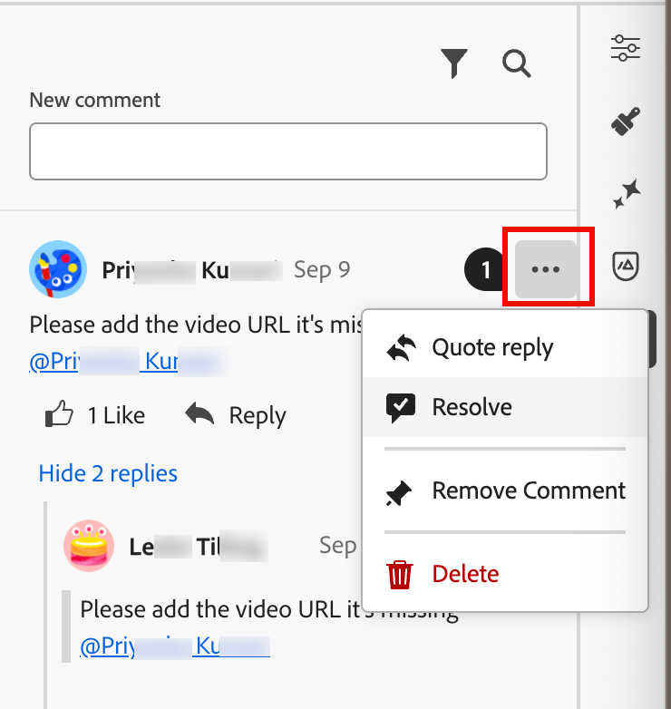

# E-Mail-Kollaborations-Tools

Der [E-Mail-Design-Bereich](./email-authoring.md) enthält Tools für die Zusammenarbeit bei Kommentaren und Lösungen, damit Marketing-Teams E-Mail-Assets direkt in [!DNL Journey Optimizer B2B Edition] nahtlos überprüfen, besprechen und abschließen können. Anstatt Entwürfe über externe Tools (wie Chat, E-Mail-Threads oder Tabellen) freizugeben, können Benutzende im E-Mail-Design-Bereich Kommentare abgeben, Änderungen vorschlagen und Feedback geben. Verwenden Sie diese Tools, um Ihren Workflow zu optimieren, Fehler zu reduzieren und sicherzustellen, dass die Beteiligten abgestimmt sind, bevor Sie Ihre E-Mail-Kampagne auf einer Account-Journey starten:

* **_Zentralisiertes Feedback_** - Sammeln und Verfolgen des gesamten Feedbacks an einem Ort.

* **_Schnellere Überprüfungen_** - Mitwirkende können die E-Mail-Kopie und die Assets in der Authoring-Umgebung überprüfen.

* **_Verbesserte Genauigkeit_** - Verringert das Risiko von Fehlkommunikation, indem alle Bearbeitungen an die E-Mail selbst gebunden bleiben.

* **_Transparenz_** - Alle Kommentare und Entschließungen bleiben protokolliert und verdeutlichen, welche Änderungen vorgeschlagen und umgesetzt wurden.

* **_Collaboration im Kontext_** - Überprüfen Sie die E-Mail-Textkörper, Bilder und call-to-action (CTA)-Elemente innerhalb des Layouts.

<!-- Enable asynchronous collaboration between team members for an email asset
Allow users to attach comments to specific design elements
Provide a unified interface for viewing and managing all comments within a project
Support comment placement, editing, deleting, and navigation
Display visual indicators (badges) for elements with associated comments -->

## E-Mail-Collaboration-Tools für Reviewer aktivieren

Produktadministratoren können den Zugriff auf die Tools für die E-Mail-Zusammenarbeit aktivieren, indem sie die Berechtigung **[!UICONTROL B2B-E]** Mails verwalten) über die Benutzeroberfläche _Berechtigungen_ in Adobe Experience Cloud zuweisen.

+++ E-Mail-Berechtigungen aktivieren

1. Gehen Sie in der Berechtigungs-App zur Registerkarte **[!UICONTROL Rollen]** und wählen Sie die gewünschte [Rolle](https://experienceleague.adobe.com/de/docs/experience-platform/access-control/abac/permissions-ui/roles){target="_blank"} aus.

1. Klicken Sie auf **[!UICONTROL Bearbeiten]**, um die Berechtigungen zu ändern.

1. Fügen Sie die Ressource **[!UICONTROL B2B Assets]** hinzu und wählen Sie dann **[!UICONTROL B2B-E-Mails verwalten]** aus.

   {width="700" zoomable="yes"}

1. Klicken Sie **[!UICONTROL Speichern]**, um die Änderungen anzuwenden.

   Berechtigungen werden automatisch für alle Benutzer aktualisiert, die der Rolle bereits zugewiesen sind.

1. Um diese Rolle neuen Benutzern zuzuweisen, wählen Sie die Registerkarte **[!UICONTROL Benutzer]** im Dashboard _[!UICONTROL Rollen]_ aus und klicken Sie auf **[!UICONTROL Benutzer hinzufügen]**.

   * Geben Sie den Benutzernamen und die E-Mail-Adresse ein oder wählen Sie einen vorhandenen Benutzer aus der Liste aus.

     Wenn der Benutzer noch nicht erstellt wurde, lesen Sie die [Dokumentation zu Experience Platform](https://experienceleague.adobe.com/de/docs/experience-platform/access-control/abac/permissions-ui/users){target="_blank"}.

   * Klicken Sie **[!UICONTROL Speichern]**, um die Änderungen anzuwenden.

+++

## Collaboration-Tools und -Kommentare anzeigen

Beim Erstellen, Bearbeiten oder Überprüfen von Inhalten im E-Mail-Design können Sie auf das Bedienfeld _Collaboration_ zugreifen, um Kommentare für den E-Mail-Inhalt hinzuzufügen oder zu verwalten.

Klicken Sie im rechten Navigationsbereich auf _Symbol_ CollaborationCollaboration-Symbol ).

{width="700" zoomable="yes"}

## Collaboration-Workflow

Sie können die Collaboration-Tools verwenden, um einem standardmäßigen Inhalts-Workflow zu folgen:

1. [Laden Sie &#x200B;](#invite-collaborators-and-reviewers) Mitarbeiter und Prüfer ein.
1. Reviewer [Kommentare hinzufügen](#add-comments).
1. Lesen Sie Kommentare[&#x200B; fügen Sie Antworten &#x200B;](#reply-to-a-comment), um Feedback zu besprechen, und nehmen Sie die erforderlichen Änderungen vor.
1. Reviewer oder Autoren [Kommentare auflösen](#resolve-comments).

>[!BEGINSHADEBOX]

**Best Practices für die Verwendung der Collaboration-Tools**

* Verwenden Sie `@` Tagging, damit das Feedback schnell das richtige Teammitglied erreicht.

* Gruppieren Sie verknüpftes Feedback in einem einzigen Kommentar-Thread anstelle mehrerer verstreuter Notizen.

* Lösen Sie Kommentare immer auf, sobald sie adressiert werden, um einen sauberen Workflow zu gewährleisten.

* Speichern Sie eine endgültig genehmigte Version für Compliance-/Auditzwecke.

>[!ENDSHADEBOX]

### Mitarbeiter und Prüfer einladen

1. Wählen Sie den Textkörper der E-Mail aus.

1. Klicken Sie im rechten Navigationsbereich auf _Symbol_ CollaborationCollaboration-Symbol ).

1. Geben Sie oben im rechten Bedienfeld Ihren Einladungstext ein, damit Benutzer zusammenarbeiten und Feedback geben können.

   Verwenden Sie das `@` Symbol, um Benutzer anzusprechen und zu benachrichtigen. Diese Benutzer erhalten E-Mail- und produktinterne Pulsbenachrichtigungen.

   Wenn Sie die ersten Buchstaben des Namens nach dem Symbol eingeben, wird eine Popup-Liste mit übereinstimmenden Benutzernamen angezeigt. Sie können weitere Buchstaben in den Namen eingeben, um die Ergebnisse zu verbessern.

   {width="550"}

   Namen auswählen, der für die Benachrichtigung hinzugefügt werden soll.

   Fügen Sie so viele Mitarbeiter oder Reviewer hinzu, wie Sie in die Einladung aufnehmen möchten.

   {width="700" zoomable="yes"}

1. Klicken Sie auf **[!UICONTROL Senden]**.

### Kommentare hinzufügen

Öffnen Sie als E-Mail-Mitwirkender oder Prüfer die E-Mail im Design-Bereich und fügen Sie Ihr Feedback hinzu. Sie können allgemeines Feedback in das Bedienfeld _Collaboration_ eingeben oder Komponenten auf der Arbeitsfläche auswählen und einen Kommentar hinzufügen, der speziell für dieses Design-Element gilt. Teammitglieder mit `@` kennzeichnen, z. B. _@John aktualisieren Sie bitte die CTA Copy_.

Jeder neue Kommentar startet einen Thread, in dem Mitwirkende _Antwort_ verwenden können, um die Diskussion fortzusetzen. Jeder Kommentar/Thread, der mit einem Design-Element verknüpft ist, ist nummeriert, sodass Sie das Element, für das es gilt, einfach identifizieren können.

#### Allgemeine Kommentare und Feedback

Geben Sie im Bedienfeld _Collaboration_ im Textfeld oben einen allgemeinen Kommentar zum E-Mail-Inhalt ein. Verwenden Sie das `@` Symbol, um Benutzer anzusprechen und zu benachrichtigen.

{width="400"}

Klicken Sie **[!UICONTROL Senden]**, um den Kommentar zu protokollieren und Benachrichtigungen an getaggte Benutzer zu senden.

#### Komponentenkommentare

1. Wählen Sie eine Struktur- oder Inhaltskomponente.

1. Klicken Sie in der Symbolleiste auf das Tool _Collaboration_.

   {width="600"}

1. Geben Sie den Kommentar in das Textfeld ein.

1. Klicken Sie auf **[!UICONTROL Senden]**.

Mitwirkende können auf das Symbol Nummerierte Nadel auf der E-Mail-Arbeitsfläche klicken, um sie zur Kommentierung anzuzeigen.

{width="450"}

#### Auf einen Kommentar antworten

Für jeden Kommentar können Sie die Funktion _[!UICONTROL Antwort]_ verwenden, um eine Diskussion fortzusetzen oder eine Frage zu beantworten.

Klicken **[!UICONTROL unten]** Kommentar auf „Antworten“ und geben Sie den Text für Ihre Antwort ein. Um ein Zitat des aktuellen Kommentars in Ihre Antwort aufzunehmen, klicken Sie auf das Symbol _Mehr Menü_ ( **…** ) und wählen Sie **[!UICONTROL Antwort zitieren]**.

{width="350"}

### Kommentare auflösen

Bewerten Sie als Autor oder Designer das Feedback von Reviewern und bestimmen Sie, welche Änderungen Sie vornehmen möchten. Wenn die Änderungen abgeschlossen sind und die Anfrage erfüllt ist, klicken Sie auf das Symbol _Mehr Menü_ ( **…** ) und wählen Sie **[!UICONTROL Auflösen]**.

{width="350"}

Klicken Sie im Bestätigungsdialogfeld auf **[!UICONTROL Auflösen]**.

## Kommentare verwalten

Verwalten Sie die Kommentare und Threads, um den Status Ihrer Zusammenarbeit zu bewerten.

### Kommentar abgeben

Wenn ein Kommentar nicht mit einem Element auf der E-Mail-Arbeitsfläche verknüpft ist, können Sie _Kommentar_ Bedarf an ein Element anheften. Klicken Sie auf das Symbol _Mehr_ ( **…** ) und wählen Sie **[!UICONTROL Kommentar platzieren]**. Wählen Sie dann die Design -Komponente auf der Arbeitsfläche aus.

{width="350"}

### Kommentare entfernen oder löschen

Sie können Ihr Kommentar-Protokoll bereinigen, indem Sie ihn entfernen und löschen. Klicken Sie auf das Symbol _Mehr_ ( **…** ) und wählen Sie **[!UICONTROL Kommentar entfernen]** oder **[!UICONTROL Löschen]**.

{width="350"}

* Wenn Sie einen Kommentar entfernen, wird dieser Kommentar durch die Aktion vom Design-Element entkoppelt (das beim Erstellen des Kommentars ausgewählt wurde). Der Kommentar ist weiterhin Teil des Kommentar-Datensatzes für die E-Mail.

* Wenn Sie einen Kommentar löschen, wird er durch die Aktion dauerhaft aus dem Datensatz gelöscht.

### Gelöste Kommentare

Standardmäßig werden aufgelöste Kommentare im Bedienfeld _Collaboration&rbrace;_. Sie können aufgelöste Kommentare jederzeit anzeigen, indem Sie den Filter löschen. Klicken Sie auf _Symbol_ Filtern ) und deaktivieren Sie das **[!UICONTROL Aufgelöste Kommentare ausblenden]**.

{width="350"}

Die aufgelösten Kommentare enthalten ein Symbol _Unresolve_ (  ). Wenn Sie feststellen, dass ein Kommentar/Thread nicht aufgelöst wurde und weitere Änderungen erforderlich sind, klicken Sie auf das Symbol, um die Bezeichnung _[!UICONTROL Aufgelöst]_ zu entfernen.

{width="300"}
