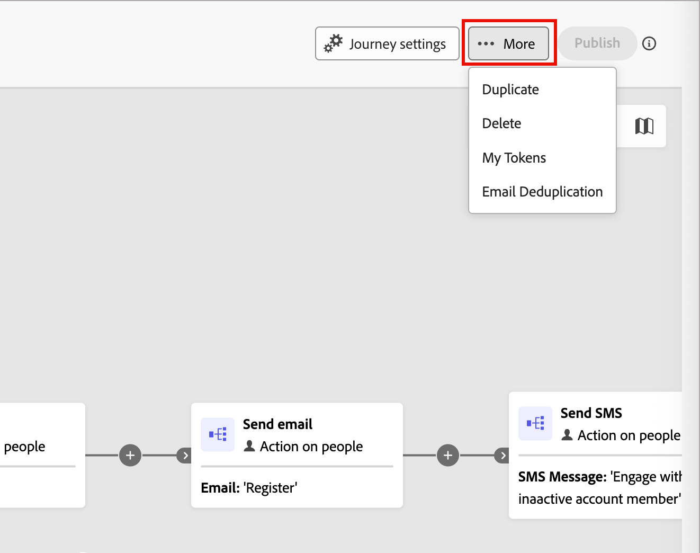

# E-Mail-Deduplizierung

Verwenden Sie die E-Mail-Deduplizierung in den Account-Journeys, um sicherzustellen, dass dieselbe E-Mail nicht mehrmals an dieselbe E-Mail-Adresse innerhalb einer Journey gesendet wird. Wenn Sie diese Funktion aktivieren, werden doppelte E-Mail-Adressen blockiert, bis der erste Eintrag mit dieser E-Mail-Adresse die Journey abgeschlossen hat. Nachdem ein Konto eine Journey abgeschlossen hat, kann eine Person sich erneut für den Empfang von E-Mails qualifizieren, wenn ein neues Konto auf die Journey zugreift.

## Verwendung der E-Mail-Deduplizierung

Es gibt einige wichtige Szenarien, in denen eine Deduplizierung der E-Mail in Betracht gezogen werden sollte:

* **E-Mail wird in Real-Time CDP nicht als Identität verwendet** - Dieselbe E-Mail-Adresse kann in mehreren Personenprofilen angezeigt werden. Wenn diese Profilduplikate für dieselbe Journey qualifiziert sind und Sie verhindern möchten, dass die E-Mail mehrmals gesendet wird, aktivieren Sie diese Funktion.

* **Einzelne Person mit mehreren Konten verknüpft** - Wenn Ihr Real-Time CDP-Datenmodell es ermöglicht, dass eine einzelne Person mehreren Konten zugeordnet werden kann, und Sie vermeiden möchten, dieselbe E-Mail zweimal an diese Person zu senden, wenn mehrere Konten (einschließlich Profilen mit derselben E-Mail-Adresse) für dieselbe Journey qualifiziert sind, aktivieren Sie diese Funktion.

>[!NOTE]
>
>Die Deduplizierung von E-Mails erfolgt auf Journey-Ebene. Wenn sich eine Person mit derselben E-Mail-Adresse für verschiedene Journey qualifiziert, kann sie dennoch E-Mails von jeder Journey erhalten.

## E-Mail-Deduplizierung für einen Journey aktivieren

So aktivieren Sie die E-Mail-Deduplizierung für eine Konto-Journey:

1. Konto-Journey öffnen.

1. Klicken Sie **[!UICONTROL Mehr]** (**…**) In der oberen rechten Ecke des Arbeitsbereichs Journey.

   {width="450"}

1. Wählen Sie **[!UICONTROL E-Mail-Deduplizierung]**.

1. Aktivieren Sie im Dialogfeld das Kontrollkästchen **[!UICONTROL E-Mail-Deduplizierung]**.

   {width="400"}

1. Klicken Sie auf **[!UICONTROL Speichern]**.

Wenn die E-Mail-Deduplizierung aktiviert ist, prüft der Journey jede E-Mail-Adresse, bevor er die E-Mail sendet. Wenn bereits ein Eintrag mit derselben E-Mail-Adresse in diesen Journey-Knoten eingetreten ist, wird der neue Eintrag blockiert, bis der erste Eintrag die Journey abgeschlossen hat.
