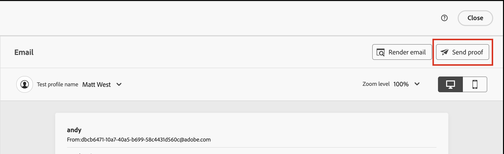

# Anzeigen einer Vorschau und Testen der E-Mail-Inhalte {#preview-simulate}

>[!CONTEXTUALHELP]
>id="ajo-b2b_email_preview_simulate"
>title="Überprüfen des Inhalts-Renderings"
>abstract="Wenn Ihr Inhalt definiert wurde, können Sie ihn in der Vorschau anzeigen und überprüfen, ob das Rendering entsprechend dem verwendeten Kanal korrekt ist."

Verwenden Sie die Funktion _Inhalt simulieren_, um eine Vorschau des E-Mail-Inhalts anzuzeigen und Testsendungen an bestimmte Empfängerinnen und Empfänger zu senden. Die erforderlichen E-Mail-Felder müssen definiert werden, einschließlich _[!UICONTROL Absendername]_, _[!UICONTROL Absenderadresse]_, _[!UICONTROL Antwortadresse]_ und _[!UICONTROL Betreffzeile]_, um auf die Vorschau- und Testfunktionen zuzugreifen.

>[!IMPORTANT]
>
>Bei Fehlern können Sie die E-Mail nicht in der Vorschau anzeigen. Überprüfen Sie die _Warnhinweise_, um sicherzustellen, dass die Vorschaufunktionen nicht durch Fehler blockiert werden. Warnungen blockieren die Vorschau nicht, Sie sollten sie jedoch vor der Veröffentlichung der den E-Mail-Versand Trigger Journey ansprechen.

## E-Mail-Vorschau anzeigen

Sie können auf die Rendering-Vorschau über den [E-Mail-Design-Bereich](./email-authoring.md) oder über die _[!UICONTROL Zusammenfassung]_ zugreifen, wenn Sie [eine E-Mail über die E-Mail-Liste öffnen](./emails-list.md#edit-emails).

1. Klicken **[!UICONTROL oben]** „Inhalt simulieren“.

   {width="800" zoomable="yes"}

   >[!NOTE]
   >
   >Diese Schaltfläche ist nicht verfügbar, wenn Fehler auftreten oder die erforderlichen Felder für die E-Mail nicht definiert sind.

1. Wählen Sie auf _[!UICONTROL Seite &quot;]_&quot; ein Personenprofil in der Liste **[!UICONTROL Personen]** aus, das für die Darstellung der E-Mail verwendet werden soll.

   In der Inhaltsvorschau werden personalisierte Elemente entsprechend dem ausgewählten Personenprofil gefüllt.

   {width="800" zoomable="yes"}

   Wenn die Liste _[!UICONTROL Personen]_ auf der linken Seite leer ist, [ Sie „Personen hinzufügen](#add-people-to-the-profiles-list) mithilfe von Kontakten aus der verbundenen Marketo Engage-Instanz.

   >[!TIP]
   >
   >Sie können auch die [Litmus Test Rendering-Integration](./email-test-rendering.md) verwenden, um das Rendering von E-Mail-Nachrichten in gängigen Desktop-, Mobile- und Web-basierten Clients zu überprüfen.

## Anpassen der Anzeigeoptionen

Verwenden Sie die Anzeigewerkzeuge, um die Vorschau je nach Gerätetyp oder Zoomstufe zu ändern:

* Wählen Sie das Symbol _Desktop_ (  ) aus, um die Vorschau unter Verwendung des Desktop-Stils und des Seitenverhältnisses anzuzeigen.
* Wählen Sie das Symbol _Mobil_ (  ) aus, um die Vorschau mit dem Stil und dem Seitenverhältnis des Mobilgeräts anzuzeigen.
* Klicken Sie auf _Pfeil „Zoomstufe_ und wählen Sie einen Prozentsatz aus, um zu sehen, wie sich der Inhalt je nach Zoomstufe ändert.

{width="600" zoomable="yes"}

## Versenden von Testsendungen

Ein Testversand ist eine gesendete Testnachricht, mit der Sie und Ihre Team-Mitglieder eine E-Mail-Nachricht überprüfen können, bevor sie sie an Mitglieder einer Zielgruppe senden. Die Empfängerinnen und Empfänger des Testversands können das Rendering, den Inhalt, die Personalisierungseinstellungen und die Konfiguration der Nachricht überprüfen. Testsendungen können mit einem ausgewählten Testprofil durchgeführt werden.

1. Klicken **[!UICONTROL oben]** auf „Testversand durchführen“.

   {width="500"}

1. Geben Sie auf _Seite Testversand_ die E-Mail-Adresse des ersten Empfängers ein.

1. Klicken Sie für jeden weiteren Empfänger, den Sie in die Überprüfung einbeziehen möchten, auf **[!UICONTROL Empfänger hinzufügen]** und geben Sie seine E-Mail-Adresse in das Feld **[!UICONTROL Senden an]** ein.

   Sie können bis zu zehn Empfänger für Ihren Testversand hinzufügen.

1. Legen Sie für jeden Empfänger das Feld **[!UICONTROL Simulieren als]** fest, indem Sie ein Testprofil auswählen, das für die Personalisierung des Nachrichteninhalts verwendet werden soll.

   {width="700" zoomable="yes"}

1. Klicken Sie auf **[!UICONTROL Testversand durchführen]**.

## Personen zur Profilliste hinzufügen

1. Klicken Sie oben in der _[!UICONTROL Personen]_-Liste auf **[!UICONTROL Personen hinzufügen]**.

   {width="500"}

1. Geben _[!UICONTROL im Dialogfeld „Personen zum Testen hinzufügen]_ die vollständige E-Mail-Adresse für den Kontakt ein.

   Um mehrere Kontakte hinzuzufügen, geben Sie mehrere Adressen ein, die durch ein Komma getrennt sind.

1. Aktivieren Sie das Kontrollkästchen für jeden passenden Kontakt, den Sie der Liste der Testprofile hinzufügen möchten.

   {width="700" zoomable="yes"}

1. Klicken **[!UICONTROL oben]** auf „Hinzufügen“.
