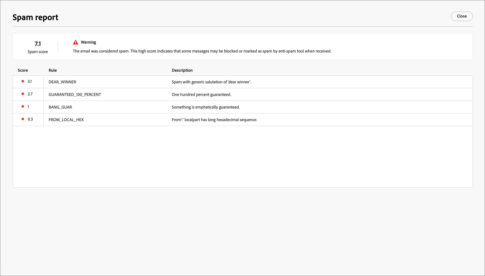

# Spam-Bericht überprüfen

Viele E-Mail-Posteingangsanbieter und die meisten Unternehmenssysteme verwenden einen Spam-Filterprozess. Das Senden von E-Mails, die diese Filter Trigger enthalten, kann die Zustellbarkeit erheblich beeinträchtigen. In Journey Optimizer B2B edition können Sie die Spam-Bewertung von E-Mail-Inhalten überprüfen, indem Sie einen Spam-Bericht erstellen. Dieser Bericht verwendet [[!DNL SpamAssassin]](https://spamassassin.apache.org/) zum Testen der E-Mail und hilft Ihnen dabei festzustellen, ob eine Nachricht von Anti-Spam-Tools als Spam eingestuft werden könnte. Anhand der im Bericht enthaltenen Informationen können Sie Maßnahmen ergreifen, die die E-Mail-Inhaltsbewertung und die Zustellbarkeit verbessern.

Wenn Sie Ihre E-Mail-Einstellungen überprüfen oder den Inhalt bearbeiten, öffnen Sie die Seite _[!UICONTROL Simulieren]_ und generieren Sie einen _Spam-Bericht_, um die Bewertung und markierte Elemente zu überprüfen, die Trigger bei der Anti-Spam-Filterung sein können.

1. Klicken Sie auf _[!UICONTROL Seite]_ Simulieren **[!UICONTROL oben rechts auf]** Spam-Bericht“.

   {width="700" zoomable="yes"}

   Der Reporting-Prozess scannt den E-Mail-Inhalt und generiert eine Bewertung mit einer Liste der ausgelösten Filterregeln, die zum Generieren der Bewertung verwendet werden. Zu den Faktoren gehören das Textlayout, die Struktur, die Bildgröße, Spam-Trigger-Wörter und andere. Eine Liste der Regelauswertungstests für die E-Mail-Elemente finden Sie unter [[!DNL SpamAssassin] Testliste](https://spamassassin.apache.org/old/tests_3_0_x.html).

1. Überprüfen Sie die Bewertungen und Beschreibungen für jedes Element.

   >[!NOTE]
   >
   >Der Spam-Wert wird über SpamAssassin berechnet, und Adobe besitzt keine Regeln oder Bewertungslogik. Weitere Informationen zum [!DNL SpamAssassin] Open-Source-Projekt finden Sie in der [[!DNL SpamAssassin] Dokumentation](https://cwiki.apache.org/confluence/display/SPAMASSASSIN/).

   Je niedriger die Punktzahl ist, desto unwahrscheinlicher ist es, dass die E-Mail als Spam gekennzeichnet wird.

   {width="600" zoomable="yes"}

   Bei einer Punktzahl von mehr als 5 enthält der Bericht eine Warnung, dass einige Nachrichten blockiert oder als Spam gekennzeichnet werden könnten, wenn sie empfangen werden. Es empfiehlt sich sicherzustellen, dass der Wert unter 2 liegt.

   {width="600" zoomable="yes"}

1. Wenn es einige Elemente im E-Mail-Inhalt gibt, die verbessert werden können, bearbeiten Sie Ihren Inhalt, um die erforderlichen Aktualisierungen anzuwenden.

1. Wenn Ihre Änderungen abgeschlossen sind, kehren Sie zur Seite _[!UICONTROL Simulieren]_ zurück und klicken Sie erneut auf **[!UICONTROL Spam-Bericht]**, um die resultierenden Score-Verbesserungen zu überprüfen.
