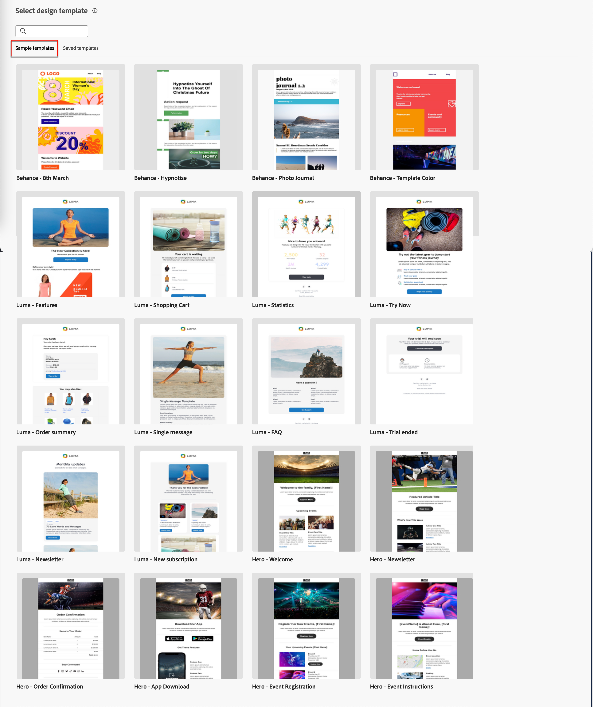

# E-Mail-Vorlagen

Für einen beschleunigten und verbesserten Designprozess können Sie eigenständige E-Mail-Vorlagen erstellen, um benutzerdefinierte Inhalte in den Journey der Adobe Journey Optimizer B2B Edition-Konten wiederzuverwenden. Über Vorlagen können Ihre inhaltsorientierten Teammitglieder außerhalb von Journey an E-Mail-Inhalten arbeiten. Marketing-Strategen können diese eigenständigen Vorlagen dann in ihren Account-Journey wiederverwenden und anpassen. Beispielsweise ist nur ein Team-Mitglied für Inhalte verantwortlich, ohne Zugriff auf Journey-Konten. Sie können jedoch eine E-Mail-Vorlage erstellen, die Marketing-Experten als Ausgangspunkt für E-Mail-Nachrichten auswählen und entsprechend den Anforderungen für die Journey anpassen können.

## Zugriff und Verwaltung von E-Mail-Vorlagen

Um auf E-Mail-Vorlagen in der Adobe Journey Optimizer B2B-Bearbeitung zuzugreifen, navigieren Sie zum linken Navigationsbereich und klicken Sie auf **[!UICONTROL Content Management]** > **[!UICONTROL Vorlagen]**. Durch diese Aktion wird eine Listenseite mit allen E-Mail-Vorlagen geöffnet, die in der in einer Tabelle aufgelisteten Instanz erstellt wurden.

Die Tabelle wird nach der Spalte _[!UICONTROL Geändert]_ sortiert, wobei die zuletzt aktualisierten Vorlagen standardmäßig oben in der Liste stehen. Klicken Sie auf den Spaltentitel, um ihn zwischen auf- und absteigend zu ändern.

Um nach einer Vorlage anhand des Namens zu suchen, geben Sie eine Textzeichenfolge in die Suchleiste ein. Klicken Sie oben links auf das Symbol _Filter_ , um die Liste nach Erstellungs- oder Änderungsdatum und Vorlagen zu filtern, die Sie erstellt oder geändert haben.

{width="700" zoomable="yes"}

Passen Sie die Spalten, die in der Tabelle angezeigt werden sollen, an, indem Sie oben rechts auf das Symbol _Tabelle anpassen_ klicken. Wählen Sie die anzuzeigenden Spalten aus und klicken Sie auf **[!UICONTROL Anwenden]**.

Auf der Listenseite können Sie die in den folgenden Abschnitten beschriebenen Aktionen ausführen.

## E-Mail-Vorlagen erstellen

Sie können eine neue E-Mail-Vorlage auf der Listenseite für E-Mail-Vorlagen erstellen, indem Sie oben rechts auf **[!UICONTROL Vorlage erstellen]** klicken.

1. Geben Sie im Dialogfeld einen nützlichen **[!UICONTROL Namen]** und **[!UICONTROL Beschreibung]** ein (optional).

   {width="400"}

1. Legen Sie die anfängliche **[!UICONTROL Bildquelle]** fest.

   Wenn Sie über ein Abonnement für Experience Manager Assets as a Cloud Service sowie die standardmäßige Adobe Marketo Engage Design Studio verfügen, können Sie Bild-Assets aus beiden Quellen auswählen. Dazu müssen Sie die Bildquelle zum Zeitpunkt der Erstellung für eine E-Mail-Vorlage oder ein visuelles Fragment auswählen. Sie können jedoch auch die Bildquelle auswählen, wenn Sie den Inhalt bearbeiten.

   Weitere Informationen zu Bildquellen finden Sie unter [Assets](./assets-overview.md).

1. Klicken Sie auf **[!UICONTROL Erstellen]**.

Die Seite _[!UICONTROL Design your template]_ wird geöffnet und bietet mehrere Optionen zum Erstellen der Vorlage: _[!UICONTROL Design von Grund auf neu]_, _[!UICONTROL HTML importieren]_ oder _[!UICONTROL Designvorlage auswählen]_.

{width="800" zoomable="yes"}

### Von Grund auf gestalten {#design-from-scratch}

>[!CONTEXTUALHELP]
>id="ajo-b2b_structure_components_template"
>title="Hinzufügen von Strukturkomponenten"
>abstract="Strukturkomponenten definieren das Layout der Vorlage. Ziehen Sie eine **Struktur**-Komponente per Drag-and-Drop auf die Arbeitsfläche, um mit der Gestaltung Ihres Vorlageninhalts zu beginnen."

>[!CONTEXTUALHELP]
>id="ajo-b2b_content_components_template"
>title="Über Inhaltskomponenten"
>abstract="Inhaltskomponenten sind leere Platzhalter für Inhalte, mit denen Sie das Layout einer Vorlage erstellen können."

Definieren Sie mithilfe des E-Mail-Designers die Struktur Ihres E-Mail-Inhalts. Durch das Hinzufügen und Verschieben von Strukturkomponenten mit einfachen Drag &amp; Drop-Aktionen können Sie die Form des wiederverwendbaren E-Mail-Inhalts innerhalb von Sekunden gestalten.

1. Wählen Sie auf der Homepage _[!UICONTROL Vorlage entwerfen]_ die Option **[!UICONTROL Neu entwerfen]** aus.

1. Beginnen Sie mit der Inhaltserstellung, indem Sie Komponenten per Drag-and-Drop in die Arbeitsfläche ziehen, um das strukturelle Layout der E-Mail zu definieren.

   Die verfügbaren Designtools entsprechen den Tools für das [E-Mail-Authoring](./email-authoring.md). Der Unterschied besteht darin, dass dieser Inhalt dann als Vorlage gespeichert wird, die über mehrere Senden-E-Mail-Knoten in Konto-Journey hinweg wiederverwendet werden kann.

### Importieren von HTML

Adobe Journey Optimizer B2B Edition ermöglicht den Import von HTML-Inhalten, um E-Mail-Vorlagen zu erstellen. Der Inhalt kann vorliegen als

* Eine HTML-Datei mit integriertem Stylesheet.
* Eine ZIP-Datei mit einer HTML-Datei, dem Stylesheet (.css) und Bildern.

  >[!NOTE]
  >
  >Die Dateistruktur des komprimierten Ordners ist freigestellt. Verweise müssen jedoch relativ sein und mit der Baumstruktur des ZIP-Ordners übereinstimmen.

_So importieren Sie eine Datei mit HTML-Inhalt:_

1. Wählen Sie auf der Startseite _[!UICONTROL Vorlage entwerfen]_ die Option **[!UICONTROL HTML importieren]** aus.

1. Ziehen Sie die HTML- oder ZIP-Datei mit Ihrem HTML-Inhalt per Drag-and-Drop und klicken Sie auf **[!UICONTROL Importieren]**.

   Nach dem Hochladen des HTML-Inhalts befindet sich Ihr Inhalt im _Kompatibilitätsmodus_. In diesem Modus können Sie nur Ihren Text personalisieren, Links hinzufügen oder Assets zu Ihrem Inhalt hinzufügen.

1. Um die Inhaltskomponenten des E-Mail-Designers zu verwenden, klicken Sie auf die Registerkarte **[!UICONTROL HTML Converter]** und dann auf **[!UICONTROL Convert]**.

>[!NOTE]
>
>Einen `<table>`-Tag als erste Ebene in einer HTML-Datei zu verwenden kann zum Verlust des Stils führen, einschließlich der Einstellungen für Hintergrund und Breite im Tag der obersten Ebene.

Mit den visuellen E-Mail-Editor-Tools können Sie den importierten Inhalt nach Bedarf personalisieren.

### Auswählen einer Designvorlage

Verwenden Sie auf der Startseite von _[!UICONTROL Design your template]_ den Abschnitt Designvorlage auswählen , um mit der Erstellung Ihres Inhalts aus einer Vorlage zu beginnen. Sie können eine Beispielvorlage oder eine gespeicherte E-Mail-Vorlage aus Ihrer Journey Optimizer B2B Edition-Instanz verwenden.

>[!BEGINTABS]

>[!TAB Gespeicherte Vorlagen]

Auf der Startseite _Vorlage erstellen_ ist die Registerkarte _Beispielvorlagen erstellen_ standardmäßig ausgewählt. Um eine benutzerdefinierte Vorlage zu verwenden, wählen Sie die Registerkarte **[!UICONTROL Gespeicherte Vorlagen]** aus.

Die Liste aller E-Mail-Vorlagen, die in der aktuellen Sandbox erstellt wurden, wird angezeigt. Sie können sie nach _[!UICONTROL Name]_, _[!UICONTROL Zuletzt geändert]_ und _[!UICONTROL Zuletzt erstellt]_ sortieren.

{width="800" zoomable="yes"}

Wählen Sie die gewünschte Vorlage aus der Liste aus.

Nach der Auswahl wird eine Vorschau der Vorlage angezeigt. Im Vorschaumodus können Sie mithilfe der Rechts- und Linkspfeile zwischen allen Vorlagen einer Kategorie (Beispiel oder je nach Auswahl gespeichert) navigieren.

{width="800" zoomable="yes"}

Wenn die Anzeige mit dem übereinstimmt, was Sie verwenden möchten, klicken Sie oben rechts im Vorschaufenster auf **[!UICONTROL Diese Vorlage verwenden]** .

Mit dieser Aktion wird der Inhalt in den visuellen Inhaltsentwickler kopiert, wo Sie den Inhalt nach Bedarf bearbeiten können.

>[!TAB Beispielvorlage]

Adobe Journey Optimizer B2B Edition bietet eine Auswahl an vordefinierten E-Mail-Vorlagen _1}, die zur Erstellung von E-Mails und E-Mail-Vorlagen verwendet werden können._

{width="800" zoomable="yes"} bereitgestellte Vorlage aus.

>[!ENDTABS]

## Struktur und Inhalt hinzufügen

Beginnen Sie mit der Erstellung Ihres Inhalts, indem Sie Strukturen aus dem Menü **[!UICONTROL Komponenten]** in die Arbeitsfläche ziehen und dort ablegen, um das Layout Ihrer E-Mail zu definieren.

Fügen Sie beliebig viele Strukturen hinzu und bearbeiten Sie deren Einstellungen in den Elementeigenschaften auf der rechten Seite.

Wählen Sie die Komponente _[!UICONTROL n:n column]_ aus, um die Anzahl der Spalten Ihrer Wahl festzulegen (zwischen drei und 10). Definieren Sie die Breite jeder Spalte, indem Sie die Pfeile unten verschieben.

>[!NOTE]
>
>Die Größe einer Spalte muss immer mindestens 10 % der Gesamtbreite der Strukturkomponente betragen. Leere Spalten können nur entfernt werden.

Erweitern Sie den Abschnitt **[!UICONTROL Inhalt]** und fügen Sie beliebig viele Elemente zu einer oder mehreren Strukturkomponenten hinzu.

Jede Komponente kann mithilfe der Registerkarten _[!UICONTROL Einstellungen]_ oder _[!UICONTROL Stil]_ im rechten Bereich weiter angepasst werden. Sie können beispielsweise den Textstil, den Abstand oder den Rand jeder Komponente ändern.

### Navigieren in Ebenen, Einstellungen und Stil

Im folgenden Beispiel werden die Schritte zum Anpassen des Abstands und der vertikalen Ausrichtung innerhalb einer Strukturkomponente beschrieben, die aus drei Spalten besteht.

1. Wählen Sie die Strukturkomponente direkt in der E-Mail oder mithilfe des Navigationsbaums im linken Menü aus.

1. Klicken Sie in der Symbolleiste auf **[!UICONTROL Spalte auswählen]** und wählen Sie die Spalte aus, die Sie bearbeiten möchten.

   {width="800" zoomable="yes"}

   Sie können sie auch im Strukturbaum auswählen. Die bearbeitbaren Parameter für diese Spalte werden im Menü _[!UICONTROL Stile]_ angezeigt.

1. Wählen Sie unter **[!UICONTROL Ausrichtung]** das Symbol _Oben_, _Mitte_ oder _Unten_ aus.

1. Definieren Sie unter **[!UICONTROL Abstand]** den Abstand für alle Seiten.

   Wählen Sie **[!UICONTROL Unterschiedliche Abstände für jede Seite]** aus, wenn Sie eine Feinabstimmung für den Abstand vornehmen möchten. Klicken Sie auf das Sperrsymbol, um die Synchronisierung aufzuheben.

1. Passen Sie bei Bedarf die Ausrichtung und den Abstand für die anderen Spalten an.

1. Speichern Sie Ihre Änderungen.

### Inhalt personalisieren

Im folgenden Beispiel werden Schritte zum Personalisieren des Vorlageninhalts mit Lead-/Kontoattributen und System-Token beschrieben.

1. Wählen Sie die Textkomponente aus und klicken Sie in der Symbolleiste auf das Symbol _Personalisierung hinzufügen_ .

   {width="500"}

   Dadurch wird das Dialogfeld _Personalization bearbeiten_ geöffnet.

1. Klicken Sie auf **+** oder **...** , um dem leeren Bereich ein Token hinzuzufügen.

   {width="700" zoomable="yes"}

1. Klicken Sie auf **[!UICONTROL Speichern]**.

### Fragmente hinzufügen

Im visuellen Inhaltseditor wird links das Symbol _Fragmente_ angezeigt. Im folgenden Beispiel werden die Schritte zum Hinzufügen von Fragmenten zum Vorlageninhalt beschrieben.

1. Um die Fragmentliste zu öffnen, klicken Sie auf das Symbol _Fragmente_.

   Sie haben folgende Möglichkeiten:

   * Sortieren Sie die Liste.
   * Suchen, Suchen oder Filtern Sie die Liste.
   * Zwischen Miniatur- und Listenansichten wechseln.
   * Aktualisieren Sie die Liste, um eines der kürzlich erstellten Fragmente widerzuspiegeln.

   {width="700" zoomable="yes"}

1. Ziehen Sie eines der Fragmente in den Platzhalter der Strukturkomponente.

   Der Editor rendert das Fragment innerhalb des Bereichs/Elements der E-Mail-Struktur.

Der Inhalt des Fragments wird innerhalb der Struktur dynamisch aktualisiert, um eine visuelle Darstellung des Inhalts in der E-Mail zu erhalten.

Wenn Sie das Fragment so hinzufügen möchten, dass es das gesamte horizontale Layout der E-Mail einnimmt, fügen Sie eine 1:1-Spaltenstruktur hinzu und ziehen Sie das Fragment per Drag-and-Drop in die E-Mail.

Nachdem die E-Mail gespeichert wurde, wird sie auf der Seite mit den Fragmentdetails angezeigt, wenn Sie in der Zusammenfassung die Registerkarte _[!UICONTROL Verwendet von]_ auswählen. Zu einer E-Mail-Vorlage hinzugefügte Fragmente können nicht in der Vorlage bearbeitet werden. Der Inhalt wird durch das Quellfragment definiert.

### Hinzufügen von Assets

Wählen Sie im Visual Content Editor das Symbol _Assets_ aus, das links angezeigt wird.

>[!NOTE]
>
>Wenn Sie über ein Abonnement für Experience Manager Assets as a Cloud Service verfügen, können Sie neben dem standardmäßigen Adobe Marketo Engage Design Studio Bild-Assets aus der Quelle auswählen, die auf der Seite mit den Vorlagendetails ausgewählt ist.

Im folgenden Beispiel werden die Schritte zum Hinzufügen von Assets zum Vorlageninhalt beschrieben:

1. Um die Asset-Bibliothek zu öffnen, klicken Sie auf das Symbol _Assets_ .

   In der Asset-Auswahl können Sie direkt in der Quellbibliothek gespeicherte Assets auswählen.

1. Fügen Sie ein neues Asset hinzu, indem Sie das Bild-Asset per Drag-and-Drop in eine Strukturkomponente ziehen.

1. Ersetzen Sie ein Bild-Asset, indem Sie es auf der Arbeitsfläche auswählen und in den Bildquellen-Tools auf **[!UICONTROL Asset auswählen]** klicken.

   {width="700" zoomable="yes"}

### Vorschau erstellen und URLs bearbeiten

1. Klicken Sie links auf das Symbol _[!UICONTROL Links]_ , um alle URLs Ihres Inhalts anzuzeigen, die verfolgt werden sollen.

1. Klicken Sie bei Bedarf auf das Symbol _Bearbeiten_ (Bleistift), ändern Sie den _Trackingtyp_ oder den _Titel_ und fügen Sie _Tags_ für einen Link hinzu.

{width="500"}

### Anzeigeoptionen

Nutzen Sie die im visuellen E-Mail-Editor verfügbaren Ansicht- und Inhaltsvalidierungsoptionen.

* Vergrößern/Verkleinern Sie den Inhalt über vordefinierte Zoom-Optionen.

* Wechseln Sie zwischen der Anzeige des Inhalts über Desktop, Mobilgeräte oder Nur-Text/Nur-Text.
   * Klicken Sie auf das Symbol _Auge_ für die geräteübergreifende Inhaltsvorschau.
   * Wählen Sie eines der nativen Geräte aus oder geben Sie benutzerdefinierte Dimensionen ein, um die Vorschau des Inhalts anzuzeigen.

### Mehr Optionen

Über den Selektor _Mehr Optionen_ im Visual Content Editor können Sie die folgenden Aktionen ausführen:

{width="500"}

* **Vorlage zurücksetzen** - Klicken Sie auf diese Option, um die Arbeitsfläche des visuellen E-Mail-Designers zu leeren Arbeitsbereich zu leeren Arbeitsbereich zu löschen und die Erstellung von Inhalten neu zu starten.
* **Als Fragment speichern** - Speichern Sie alle oder Teile davon als Fragment, das über mehrere E-Mails oder E-Mail-Vorlagen hinweg wiederverwendet werden soll. Sie geben einen Namen und eine Beschreibung für die Fragmente und sie für die Liste der verfügbaren Fragmente an.
* **Ändern Sie Ihren Entwurf** - Kehren Sie zur Seite _Design Ihrer Vorlage_ zurück. Von hier aus können Sie jede Art von Aktion ausführen, wie im Abschnitt &quot;E-Mail-Vorlagen erstellen&quot;beschrieben.
* **HTML exportieren** - Laden Sie den Inhalt der visuellen Arbeitsfläche in das lokale HTML-Format herunter, das als ZIP-Datei gepackt ist.

## Details der E-Mail-Vorlage anzeigen

Klicken Sie auf der Seite mit der Vorlagenliste auf den Namen einer E-Mail-Vorlage, um die Detailseite der E-Mail-Vorlage zu öffnen. Hier können Sie die grundlegenden Eigenschaften der E-Mail-Vorlage anzeigen und auf den visuellen Inhaltseditor zugreifen, um Änderungen am Vorlageninhalt vorzunehmen.

{width="700" zoomable="yes"}

* Zeigen Sie die Details der E-Mail-Vorlage an, z. B. Name und Beschreibung. Diese Einstellungen können bearbeitet werden. Klicken Sie außerhalb des Beschreibungsfelds auf , um die Änderungen automatisch zu speichern.

* Zeigen Sie die Eigenschaften der E-Mail-Vorlage an, z. B. erstellt am, zuletzt aktualisiert am und geändert durch.

* Klicken Sie oben rechts auf **[!UICONTROL Mehr]** , um Schnellaktionen für die E-Mail-Vorlage durchzuführen, z. B. _Duplizieren_ und _Löschen_.

* Wenn aktive Warnhinweise vorhanden sind (Fehler und Warnhinweise für die E-Mail-Vorlage), klicken Sie oben rechts auf **[!UICONTROL Warnhinweise]** , um die Informationen anzuzeigen.

  Diese Warnhinweise verbieten zwar nicht die Verwendung der E-Mail-Vorlage für die E-Mail-Erstellung, doch bieten diese Informationen Marketing-Experten in Ihrem Team einen Überblick darüber, was möglicherweise nicht funktioniert, und über die erforderlichen Aktualisierungen, bevor sie für den Versand verwendet werden können.

## Von Verweisen verwendete E-Mail-Vorlage anzeigen

Klicken Sie auf der Detailseite für E-Mail-Vorlagen auf den Tab **[!UICONTROL Verwendet von]** , um Details dazu anzuzeigen, wo diese E-Mail-Vorlage in E-Mails über Konto-Journey hinweg verwendet wird.

{width="400"}

E-Mails in Journey Optimizer B2B Edition sind in Journey eingebettet und verfasst, sodass die übergeordnete Journey der E-Mail, die die Vorlage verwendet, in Verweisen angezeigt wird.

* Durch Klicken auf den Link gelangen Sie zur entsprechenden Journey-E-Mail, in der die E-Mail-Vorlage verwendet wird.

* Beenden Sie die Ansicht jederzeit, indem Sie auf den Pfeil &quot;Zurück&quot;klicken, um zur Listenseite zurückzukehren.

## E-Mail-Vorlagen bearbeiten

Diese Aktion kann wie folgt durchgeführt werden:

* Die Detailseite - Klicken Sie auf **[!UICONTROL E-Mail-Vorlage bearbeiten]**.
* Die Listenseite - Klicken Sie auf das Auslassungszeichen (**...**) neben einer E-Mail-Vorlage und wählen Sie **[!UICONTROL Bearbeiten]**.

Durch diese Aktion gelangen Sie zur Seite &quot;_Design Ihrer Vorlage_&quot;oder zur Seite des visuellen Inhaltseditors, die auf dem zuletzt gespeicherten Status der E-Mail-Vorlage basiert. Hier können Sie nach Bedarf den Inhalt Ihrer E-Mail-Vorlage bearbeiten. Informationen zu den Bearbeitungsoptionen finden Sie unter [E-Mail-Vorlagen erstellen](#create-email-templates) .

## E-Mail-Vorlagen duplizieren

Sie können eine E-Mail-Vorlage mit einer der folgenden Methoden duplizieren:

* Erweitern Sie rechts in den E-Mail-Vorlagendetails **[!UICONTROL Mehr]** und klicken Sie auf **[!UICONTROL Duplizieren]** .

  {width="400"}

* Klicken Sie auf der Listenseite _E-Mail-Vorlagen_ auf das Auslassungszeichen (...) neben der Vorlage und wählen Sie **[!UICONTROL Duplizieren]** aus.

Geben Sie im Dialogfeld einen nützlichen Namen (eindeutig) und eine Beschreibung ein. Klicken Sie auf **[!UICONTROL Duplizieren]** , um die Aktion abzuschließen.

Die duplizierte (neue) E-Mail-Vorlage wird dann in der Liste _E-Mail-Vorlagen_ angezeigt.

## E-Mail-Vorlagen löschen

Das Entfernen einer E-Mail-Vorlage kann nicht rückgängig gemacht werden. Überprüfen Sie daher, bevor Sie eine Löschaktion starten. Sie können eine E-Mail-Vorlage mit einer der folgenden Methoden löschen:

* Erweitern Sie rechts in den Vorlagendetails **[!UICONTROL Mehr]** und klicken Sie auf **[!UICONTROL Löschen]**.
* Klicken Sie auf der Listenseite _E-Mail-Vorlagen_ auf das Auslassungszeichen (...) neben der Vorlage und wählen Sie **[!UICONTROL Löschen]**.

  {width="500"}

Durch diese Aktion wird ein Bestätigungsdialogfeld geöffnet. Sie können den Vorgang abbrechen, indem Sie auf **[!UICONTROL Abbrechen]** klicken oder auf **[!UICONTROL Löschen]** klicken, um das Entfernen zu bestätigen.

## Massenaktionen durchführen

Wählen Sie auf der Listenseite für E-Mail-Vorlagen mehrere Vorlagen gleichzeitig aus, indem Sie die Kontrollkästchen links aktivieren. Unten wird ein Banner angezeigt, wenn Sie mehrere Vorlagen auswählen.

{width="600"}

**[!UICONTROL Löschen]** - Sie können bis zu 20 Vorlagen gleichzeitig löschen. In einem Bestätigungsdialogfeld können Sie den Vorgang abbrechen oder das Entfernen der Vorlagen bestätigen.

## E-Mail aus einer gespeicherten Vorlage erstellen

Verwenden Sie auf dem Bildschirm _E-Mail erstellen_ den Abschnitt _Design-Vorlage auswählen_, um Ihren Inhalt aus einer Vorlage zu erstellen.

Gehen Sie wie folgt vor, um Ihren Inhalt mit einer der erstellten E-Mail-Vorlagen zu erstellen:

1. Greifen Sie über die Seite _Inhalt bearbeiten_ auf die E-Mail-Designer zu.

   Auf der Seite _E-Mail erstellen_ ist standardmäßig der Tab _Beispielvorlagen_ ausgewählt.

1. Um eine benutzerdefinierte E-Mail-Vorlage zu verwenden, wählen Sie den Tab **[!UICONTROL Gespeicherte Vorlagen]** aus.

   Auf diesem Tab wird eine Liste aller E-Mail-Vorlagen angezeigt, die in der Sandbox erstellt wurden. Sie können sie _nach Name_, _Zuletzt geändert_ und _Zuletzt erstellt_ sortieren.

1. Wählen Sie aus der Liste die gewünschte Vorlage aus.

   Nach der Auswahl wird eine Vorschau der Vorlage angezeigt. Im Vorschaumodus können Sie mithilfe der Rechts- und Linkspfeile zwischen allen Vorlagen einer Kategorie (Beispiel oder je nach Auswahl gespeichert) navigieren.

1. Klicken Sie oben rechts auf **[!UICONTROL Diese Vorlage verwenden]** .

1. Bearbeiten Sie den Inhalt im visuellen Inhaltsentwickler nach Bedarf.
