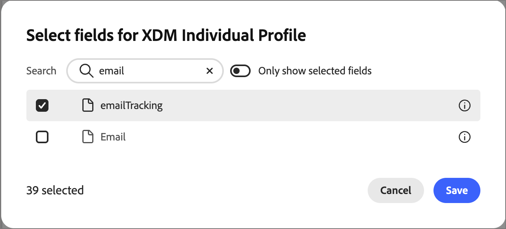
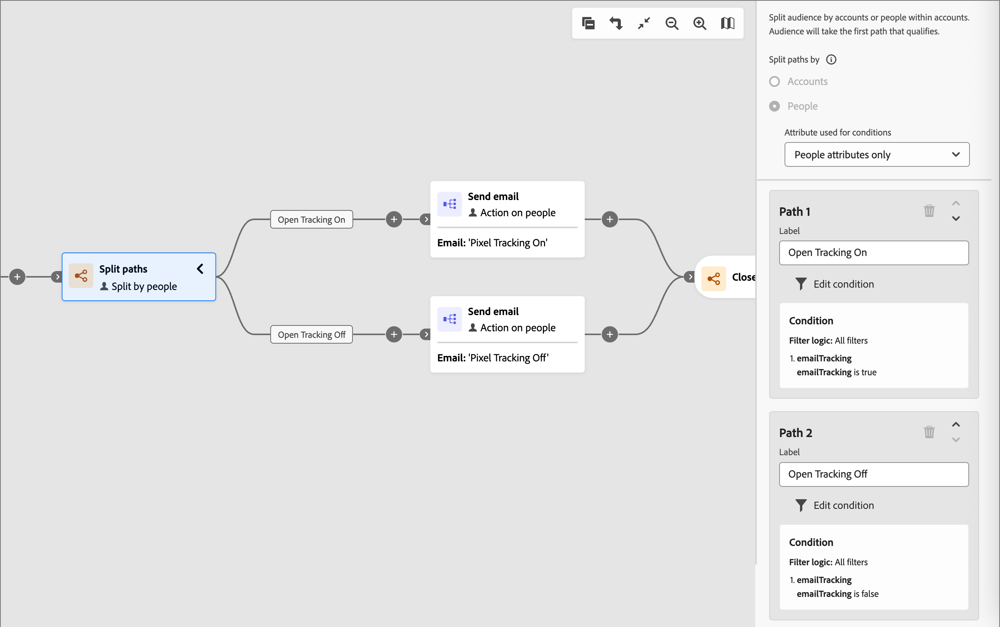

# Öffnungs-Tracking für E-Mails verwalten

Sie können das Öffnungs-Tracking für eine einzelne E-Mail deaktivieren oder die Tracking-Voreinstellungen jeder Person in Adobe Experience Platform erfassen und einen aufgeteilten Pfad verwenden, um Personen zu Tracking- und Nicht-Tracking-E-Mail-Varianten zu leiten.

>[!BEGINSHADEBOX „CNIL Guidance on Email Tracking Pixels“]

Am 14. April 2026 veröffentlichte die *Commission Nationale de l&#39;Informatique et des Libertés* (CNIL) eine [Empfehlung zur Verwendung von Tracking-Pixeln in E-Mails](https://www.cnil.fr/sites/default/files/2026-04/recommandation-pixels_de_suivi.pdf). In der Anleitung wird klargestellt, wann eine Zustimmung erforderlich ist, und die Bedeutung ordnungsgemäßer Zustimmungspraktiken für das E-Mail-Pixel-Tracking hervorgehoben. Diese Richtlinie könnte sich auf die Versandpraktiken von Entitäten auswirken, die E-Mails an Abonnenten mit Sitz in Frankreich versenden.

Ein E-Mail-Tracking-Pixel ist ein 1 x 1 transparentes Bild, das in die HTML einer E-Mail eingebettet ist. Wenn der E-Mail-Client des Empfängers dieses Bild lädt, pingt das Pixel einen Server an, der Daten wie Zeitstempel, Gerätetyp, E-Mail-Client und manchmal eine IP-Adresse als ungefähren Speicherort aufzeichnet. Dieses Protokoll wird dann an den Datensatz eines Empfängers gebunden, sodass Marketer wissen können, ob eine E-Mail geöffnet wurde.

Die hier beschriebenen [!UICONTROL Journey Optimizer B2B edition]-Produktfunktionen sind Bausteine, die entsprechend konfiguriert und betrieben werden und eine konforme Implementierung unterstützen können. Jeder Kunde ist dafür verantwortlich, seine Verpflichtungen nach geltendem Recht zu bestimmen und zu erfüllen.

>[!ENDSHADEBOX]

## Tracking für einzelne E-Mail deaktivieren {#disable-tracking-single-email}

Verwenden Sie diese Option, wenn Sie möchten, dass eine bestimmte E-Mail nie eine offene Aktivität meldet, unabhängig davon, wer sie erhält.

1. Öffnen Sie in den Eigenschaften des Journey-Knotens auf der rechten Seite die E-Mail.

1. Aktivieren Sie in den E-Mail-Eigenschaften das Kontrollkästchen **[!UICONTROL Öffnungs-Tracking deaktivieren]**.

   {width="500" zoomable="yes"}

   Siehe [Definieren der E-Mail](./add-email.md#define-the-email-settings)Einstellungen, um die vollständige Liste der E-Mail-Eigenschaften aufzurufen.

## Personen nach Tracking-Voreinstellungen segmentieren {#segment-people-tracking-preference}

Wenn Sie möchten, dass jede Person auswählen kann, ob ihre E-Mail-Öffnungen verfolgt werden, erfassen Sie diese Voreinstellung als Personenattribut in Adobe Experience Platform (AEP). Sie können dieses Feld in einem [Landingpage-Formular](./forms.md) verwenden, damit Ihre Kontakte das Tracking der E-Mail-Öffnungen deaktivieren können. Anschließend können Sie den Knoten _Split-Pfade_ in Ihren Journey verwenden, um Personen, die das Tracking nicht fortsetzen, zu verschiedenen E-Mail-Varianten weiterzuleiten. Auf diese Weise können Sie ein individuelles Opt-out berücksichtigen, ohne das Öffnungs-Tracking für alle zu deaktivieren.

Der Workflow besteht aus drei Teilen:

1. [Benutzerdefiniertes Feld für die Tracking-Voreinstellung hinzufügen](#add-custom-field-tracking-preference) in AEP und Senden einer Opt-out-Kommunikation mit einem Formular-Link.
1. [Fügen Sie einen Aufspaltungspfad für das Tracking-Opt-out &#x200B;](#add-split-path-tracking) der Journey hinzu.
1. [Konfigurieren Sie Tracking- und Nicht-Tracking-E-](#configure-tracking-and-non-tracking-email-variants) für jeden Pfad.

### Benutzerdefiniertes Feld für Tracking-Voreinstellungen hinzufügen {#add-custom-field-tracking-preference}

>[!NOTE]
>
>Das Hinzufügen und Zuordnen benutzerdefinierter XDM-Felder ist eine Adobe Experience Platform-Verwaltungsaufgabe. Wenden Sie sich an Ihren AEP-Administrator oder Ihr Data Engineering-Team, um diesen Schritt abzuschließen.

1. Öffnen Sie in AEP das Schema, das für Ihr B2B-Personenprofil verwendet wird (z. B. _B2B-Person_).

1. Suchen oder erstellen Sie unter der Mandanten-ID eine Feldergruppe für die Felder der Einverständnisverwaltung Ihres Unternehmens (z. B. `consents`).

1. Fügen Sie der Feldergruppe ein Feld hinzu, z. B. ein boolesches Feld mit dem Namen `emailTracking`, um anzugeben, ob die Person dem Öffnungs-Tracking zugestimmt hat.

1. Geben Sie den Feldnamen und den Anzeigenamen ein, legen Sie den Typ fest, weisen Sie ihn der Feldergruppe zu und klicken Sie auf **[!UICONTROL Anwenden]**.

1. Klicken Sie **[!UICONTROL Speichern]**, um die Schemaänderungen zu speichern.

   {width="800" zoomable="yes"}

1. Stellen Sie das Feld in [!DNL Journey Optimizer B2B Edition] zur Verfügung, indem Sie es als _verwaltetes Feld_ für die Klasse [!UICONTROL XDM Individual Profile] in der [XDM-Feldverwaltung](../admin/xdm-field-management.md#managed-fields).

   {width="450"}

   Dadurch wird das Feld als Bedingung in aufgeteilten Pfadknoten verfügbar.

### Aufspaltungspfad für Tracking-Opt-out hinzufügen {#add-split-path-tracking}

Fügen Sie Ihrem Journey [_Aufspaltungspfade nach Personen_ Knoten](../journeys/split-merge-paths-nodes.md#split-paths-by-people) hinzu und definieren Sie einen Pfad für jeden Tracking-Voreinstellungswert.

1. Fügen Sie den Knoten **[!UICONTROL Pfade aufteilen]** hinzu und wählen Sie **[!UICONTROL Personen]** für die Aufspaltung aus.

1. Wenden Sie für den ersten Pfad eine Bedingung mithilfe Ihres benutzerdefinierten Tracking-Präferenzfelds an (z. B. `emailTracking` ist `true`), um Personen zu identifizieren, die das Öffnungs-Tracking zulassen.

   {width="700" zoomable="yes"}

1. Fügen Sie einen zweiten Pfad hinzu und wenden Sie die umgekehrte Bedingung (`emailTracking` ist `false`) an, um Personen zu identifizieren, die sich gegen das Tracking entschieden haben.

   Allgemeine Schritte zum Hinzufügen von Pfaden, Anwenden von Bedingungen und Neuanordnen von Pfaden finden Sie unter [Hinzufügen eines Pfads, der nach Personen-Knoten aufgeteilt ist](../journeys/split-merge-paths-nodes.md#add-a-split-path-by-people-node).

   {width="500" zoomable="yes"}

### Konfigurieren von Tracking- und Nicht-Tracking-E-Mail-Varianten {#configure-tracking-and-non-tracking-email-variants}

Fügen Sie jedem Pfad [_[!UICONTROL &#x200B; Aktionsknoten &#x200B;]_&#x200B;E-Mail senden](./add-email.md) hinzu, damit jede Person die E-Mail-Variante erhält, die ihrer Tracking-Voreinstellung entspricht.

1. Fügen Sie im Pfad mit aktiviertem Tracking die Aktion **[!UICONTROL E-Mail senden]** hinzu und wählen oder erstellen Sie die E-Mail wie gewohnt, wobei **[!UICONTROL Tracking deaktivieren]** in den E-Mail-Eigenschaften deaktiviert bleibt.

1. Fügen Sie im Abmeldepfad die Aktion **[!UICONTROL E-Mail senden]** mit derselben oder einer duplizierten E-Mail hinzu und aktivieren Sie dann das Kontrollkästchen **[!UICONTROL Öffnungs-Tracking deaktivieren]** in den E-Mail-Eigenschaften auf der rechten Seite.

   {width="600" zoomable="yes"}

1. [Veröffentlichen der Journey](../journeys/create-publish-journey.md#publish-a-journey).

   Personen werden automatisch an die E-Mail-Variante weitergeleitet, die dem Wert ihres Tracking-Präferenzfelds entspricht, und alle Aktualisierungen, die sie an ihren Präferenzen vornehmen, werden widergespiegelt, wenn sie das nächste Mal die Journey betreten.
