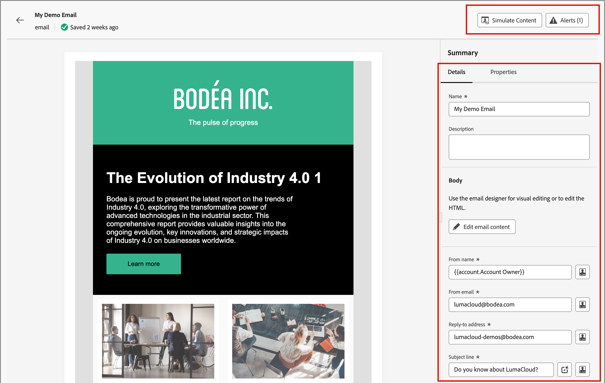

# E-Mails

Wenn Sie [E-Mails erstellen](./add-email.md) fügen Sie sie im Kontext eines Journey-Knotens hinzu. Wenn Sie mit E-Mail-Inhalten außerhalb der Journey-Zuordnung arbeiten möchten, verwenden Sie die Liste _[!UICONTROL E-Mails]_, um die E-Mail zu suchen und zu aktualisieren. Sie können E-Mails überprüfen oder die Einstellungen und Inhalte aktualisieren.

## Zugreifen auf und Verwalten von E-Mails

Um auf E-Mails in Adobe Journey Optimizer B2B edition zuzugreifen, gehen Sie zum linken Navigationsbereich und klicken Sie auf **[!UICONTROL Content-]** > **[!UICONTROL E-Mails]**. Diese Aktion öffnet eine Listenseite mit allen E-Mails, die für die Instanz erstellt wurden, die in einer Tabelle aufgeführt ist.

Die Tabelle wird standardmäßig nach der Spalte _[!UICONTROL Geändert]_ sortiert, wobei die zuletzt aktualisierten E-Mails oben stehen. Klicken Sie auf den Spaltentitel, um zwischen aufsteigender und absteigender Reihenfolge zu wechseln.

Um nach einer E-Mail anhand des Namens zu suchen, geben Sie eine Textzeichenfolge in die Suchleiste ein. Klicken Sie oben links auf _Filter_ (  ), um die angezeigten E-Mails nach Erstellungs- und Änderungsdatum zu filtern. Sie können die Liste auch auf die von Ihnen erstellten oder geänderten E-Mails beschränken.

{width="700" zoomable="yes"}

## E-Mails bearbeiten

Klicken Sie auf den E-Mail-Namen in der Liste, um sie zu öffnen. Sie können die „E-Mail[Einstellungen“ überprüfen und ](./add-email.md#define-the-email-settings). Klicken Sie **[!UICONTROL E-Mail-Inhalt bearbeiten]**, um [Aktualisierungen am Inhalt vorzunehmen](./email-authoring.md).

Wenn [Warnhinweise angezeigt werden](./add-email.md#check-alerts) oben rechts auf der Seite klicken Sie, um die Warnungen oder Fehler zu überprüfen und die Elemente nach Bedarf zu beheben.

{width="700" zoomable="yes"}
