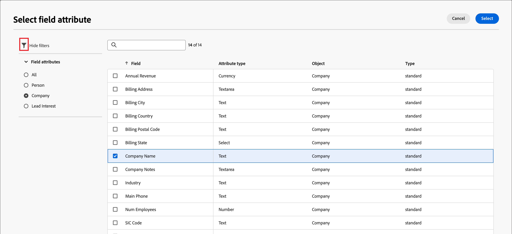
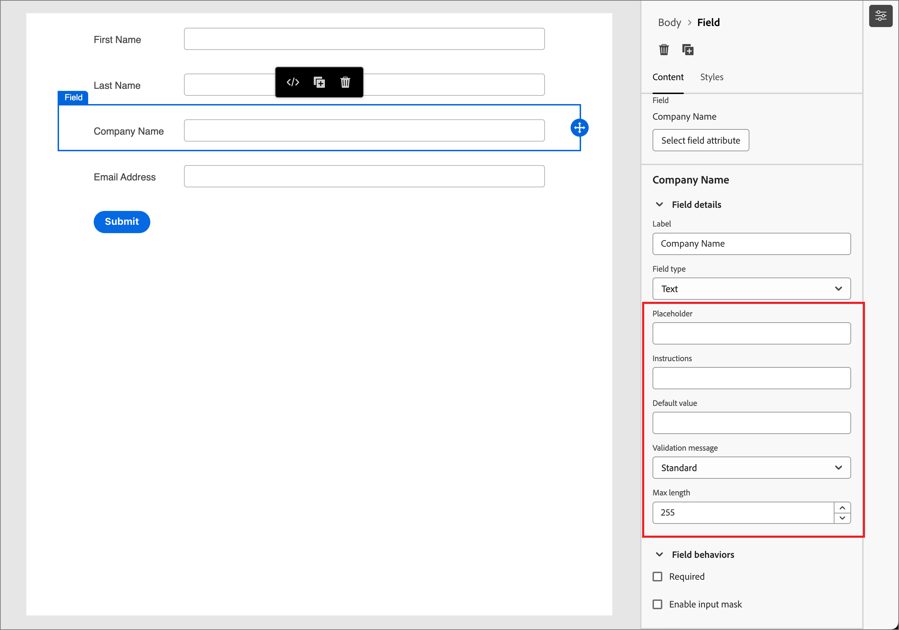
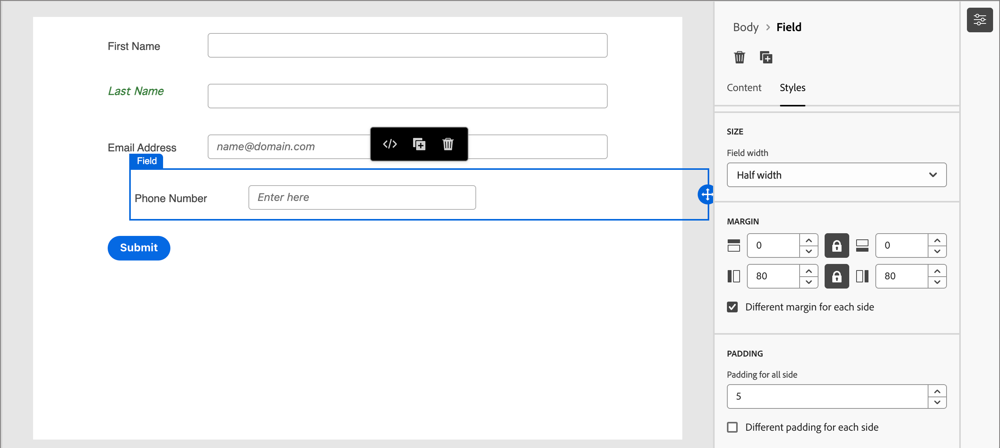

# Formular-Design

Nach dem [Erstellen eines Formulars](./landing-pages.md#create-a-landing-page) wird im visuellen Design-Bereich ein Entwurf mit einer standardmäßigen allgemeinen Formulardefinition geöffnet. Klicken Sie im _[!UICONTROL Zusammenfassungsbereich]_ auf der rechten Seite auf **[!UICONTROL Formular bearbeiten]** und verwenden Sie den visuellen Design-Bereich, um die Formularstile und Feldkomponenten zu definieren.

{width="700" zoomable="yes"}

## Felder

Formularfelder werden verwendet, um Personenprofildaten zu erfassen, mit denen Personen angesprochen und mit Konten und Einkaufsgruppen verknüpft werden können. Alle neuen Formulare beginnen mit den folgenden Feldern in einem einspaltigen Layout:

* Vorname
* Last name
* E-Mail-Adresse

Verwenden Sie die Tools für den Feldentwurf, um die Felder und das Layout zu erstellen, die Sie zum Erfassen der Daten benötigen, die für Ihre Account-basierten Marketing-Aktivitäten erforderlich sind.

### Feld hinzufügen {#add-field}

1. Ziehen Sie _[!UICONTROL Bedienfeld]_ Komponenten“ auf der linken Seite die Inhaltskomponente **[!UICONTROL Feld]** und legen Sie sie auf der Arbeitsfläche ab.

   {width="700" zoomable="yes"}

1. Klicken Sie **[!UICONTROL Feldattribut auswählen]**.

1. Aktivieren _[!UICONTROL im Dialogfeld]_ Feldattribut auswählen“ das Kontrollkästchen für das Personenprofilattribut, das Sie für das Feld verwenden möchten, und klicken Sie auf **[!UICONTROL Auswählen]**.

   Die [XDM-Geschäftsschemata](../data/field-mapping.md#xdm-business-person-attributes) bestimmen die verfügbaren Attribute.  Alle benutzerdefinierten Felder, die für Ihre Journey Optimizer B2B edition-Instanz definiert sind, sind ebenfalls verfügbar. Verwenden Sie das Textfeld Suchen , um die Liste nach Namen zu filtern, oder klicken Sie auf das Symbol Filtern , um die Liste nach Schema/Datentyp zu filtern.

   {width="700" zoomable="yes"}

   Auf der Arbeitsfläche wird die Standardfeldbeschriftung für das ausgewählte Attribut auf der Arbeitsfläche eingefügt. Die **[!UICONTROL Felddetails]** werden im Bedienfeld auf der rechten Seite angezeigt.

1. Ändern Sie bei Bedarf den **[!UICONTROL Titel]**-Text.

   Dieser Text wird neben dem Feld im Formular angezeigt. Der Standardtext wird aus dem Feldattribut gefüllt.

1. Legen Sie **[!UICONTROL Feldtyp]** entsprechend dem Datentyp für das Feld fest:

   | Feldtyp | Nutzung | Beispiel |
   | ---------- | ----- | ------- |
   | **[!UICONTROL checkbox]** | Verwenden Sie diesen Typ, damit Besucher einen Wert _true_ (aktiviert) oder _false_ (deaktiviert) auswählen können. | |
   | **[!UICONTROL Kontrollkästchen-Gruppe]** | Verwenden Sie diesen Typ, damit Besucher einen Wert _true_ (aktiviert) oder _false_ (deaktiviert) für mehrere Elemente auswählen können. | |
   | **[!UICONTROL Währung]** | Verwenden Sie diesen Typ, um ein schwebendes Feld zuzulassen, das den für die Journey Optimizer B2B edition-Instanz ausgewählten Standardwährungstyp darstellt. | |
   | **[!UICONTROL Datum]** | Verwenden Sie diesen Typ, um die Eingabe auf ein Datumsformat zu beschränken und einen Kalenderselektor in das Feld einzugeben. | |
   | **[!UICONTROL Double]** |  | |
   | **[!UICONTROL E-Mail]** | Verwenden Sie diesen Typ, um die Eingabe auf das Format einer E-Mail-Adresse zu beschränken. | |
   | **[!UICONTROL Zahl]** | Verwenden Sie diesen Typ, um das Feld auf einen numerischen Wert zu beschränken. | |
   | **[!UICONTROL Optionsfeldgruppe]** | Verwenden Sie diesen Typ, damit Besucher aus einer Reihe von Optionen auswählen können. | |
   | **[!UICONTROL Auswählen]** | Verwenden Sie diesen Typ, damit Besucher mithilfe einer Dropdown-Liste eine aus einer Reihe von Optionen auswählen können. | |
   | **[!UICONTROL Schieberegler]** | Verwenden Sie diesen Typ, damit Besucher einen numerischen Wert mithilfe eines Schiebereglers festlegen können. | |
   | **[!UICONTROL Telefon]** | Verwenden Sie diesen Typ für ein Telefonnummerneingabefeld. | |
   | **[!UICONTROL Text]** | Verwenden Sie diesen Typ für ein Eingabefeld mit Standardtext (Zeichenfolge). | |
   | **[!UICONTROL Textarea]** | Verwenden Sie diesen Typ, um eine längere Texteingabe zu unterstützen. | |
   | **[!UICONTROL URL]** | Verwenden Sie diesen Typ, um die Texteingabe auf eine URL zu beschränken, einschließlich des standardmäßigen URL-Protokolls. | |

1. Legen Sie je nach ausgewähltem Feldtyp die anderen Optionen für die Feldeingabe und -validierung fest:

   {width="400" zoomable="yes"}

   * **[!UICONTROL Platzhalter]** - Der Platzhalterwert für das Feld, der dem Besucher ein Beispiel dafür gibt, was für das Feld erwartet wird.

   * **[!UICONTROL Anweisungen]** - Anleitender Text, der dem Besucher beim Ausfüllen des Felds hilft. Geben Sie den Text ein, der als _für das Feld angezeigt_ soll.

     >[!TIP]
     >
     >_Anweisungen vs. Platzhaltertext_ 
     >
     >Verwenden Sie diese beiden Eigenschaften, um Besuchende zum Ausfüllen des Felds anzuleiten. Der Anweisungstext wird als QuickInfo/Popup-Text angezeigt, wenn der Mauszeiger über das Feld bewegt wird. Platzhaltertext wird im Feld _abgeblendet_ und verschwindet, wenn der Besucher seinen Text in das Feld eingibt. Sie können beide Methoden oder nur eine verwenden.

   * **[!UICONTROL Standardwert]** - Verwenden Sie diese Option, um einen Standardwert für das Feld anzugeben.

   * **[!UICONTROL Validierungsmeldung]** - Verwenden Sie diese Option, um eine Validierungsmeldung für das Feld anzugeben. Diese Meldung wird angezeigt, wenn der Besucher einen ungültigen Wert für das Feld eingibt. Die _[!UICONTROL Standard]_-Nachricht ist standardmäßig festgelegt. Wählen Sie **[!UICONTROL Benutzerdefiniert]** und geben Sie Ihre eigene Nachricht ein.

   * **Maximale Länge** - Geben Sie die maximale Anzahl von Zeichen ein, die in das Feld eingegeben werden können.

1. Legen Sie **[!UICONTROL Feldverhalten]** nach Bedarf fest:

   * **Erforderlich** - Aktivieren Sie das Kontrollkästchen, um die Feldeingabe durchzuführen, die zum Senden des Formulars erforderlich ist.

   * **Eingabemaske aktivieren** - Aktivieren Sie das Kontrollkästchen, um die Eingabe Ihres Besuchers mithilfe einer Eingabemaske einzuschränken. Beispielsweise können Sie möchten, dass Besuchende Telefonnummern in einem bestimmten Format eingeben. Geben Sie im Dialogfeld die Maske mithilfe von `9` für eine beliebige Zahl, `a` für einen beliebigen Buchstaben und `*` für eine dieser Zahlen ein. Klicken Sie auf Speichern , um die angegebene Eingabemaske zu aktivieren.

     {width="500" zoomable="yes"}

### Feldstile ändern {#field-styling}

Wählen Sie die **[!UICONTROL Stile]** im rechten Bedienfeld aus, um den Stil für das ausgewählte Feld zu ändern.

* **[!UICONTROL Hintergrund]** - Aktivieren Sie das Kontrollkästchen, um eine Hintergrundfarbe auf das Feld anzuwenden. Weiß ist die Standardfarbe. Klicken Sie auf **[!UICONTROL Hintergrundfarbe]**, um das Popup-Farbwähler zu öffnen und eine Farbe für den Feldhintergrund auszuwählen.

  {width="600" zoomable="yes"}

* **[!UICONTROL label]** - Der Stil der Beschriftung bestimmt die visuellen Eigenschaften des neben dem Feld angezeigten Textes. Wählen Sie eine obere oder seitliche Beschriftungsanzeige relativ zum Feld aus. Sie können die Schriftgröße, Zeilenhöhe, den Textstil und die Textausrichtung festlegen. Klicken Sie auf **[!UICONTROL Schriftfarbe]** Quadrat, um das Popup-Farbwähler zu öffnen und eine Farbe für den Titeltext auszuwählen.

  {width="600" zoomable="yes"}

* **[!UICONTROL Rahmen]** - Klicken Sie auf das **[!UICONTROL Rahmenfarbe]** Quadrat, um die Popup-Farbauswahl zu öffnen und eine Farbe für den Rahmen auszuwählen. Sie können einen Rahmen für das Feld definieren, einschließlich der Farbe und der Linienbreite. Deaktivieren Sie das Kontrollkästchen, um den angezeigten Feldrand zu entfernen. Sie können auch die Rahmengröße (Pixelbreite), den Stil und den Radius für die Ecken ändern.

  {width="600" zoomable="yes"}

* **[!UICONTROL Size]** - Wählen Sie eine Größeneinstellung aus, um die Anzeigebreite für das Feld zu bestimmen. Wählen Sie _[!UICONTROL Volle Breite]_, _[!UICONTROL Halbe Breite]_ oder _[!UICONTROL Automatisch]_.

* **[!UICONTROL Spanne]**: Legt Ränder (in Pixeln) um das Feld fest. Sie können denselben Rand auf allen vier Seiten festlegen oder das Kontrollkästchen **[!UICONTROL Unterschiedlicher Rand für jede Seite]** aktivieren, um die horizontalen und vertikalen Ränder separat festzulegen.

* **[!UICONTROL Abstand]**: Abstand (in Pixeln) um das Feld festlegen. Sie können denselben Rand auf allen vier Seiten festlegen oder das Kontrollkästchen **[!UICONTROL Unterschiedlicher Abstand für jede Seite]** aktivieren, um die horizontalen und vertikalen Ränder separat festzulegen.

  {width="600" zoomable="yes"}

### Felder neu anordnen {#field-reorder}

Sie können Formularfelder direkt im visuellen Arbeitsbereich verschieben. Klicken Sie auf _Verschieben_-Tool am rechten Rand des ausgewählten Felds und ziehen Sie es an eine neue Position.

Fügen Sie dem Formular Strukturkomponenten hinzu und verschieben Sie Felder in Spalten, um sie zu gruppieren und das Layout zu ändern. Klicken Sie auf _Verschieben_ am linken Rand der ausgewählten Spaltenkomponente und ziehen Sie sie an eine neue Position im Formular.

{width="500"}

### Löschen oder Duplizieren eines Felds {#field-delete-duplicate}

Klicken Sie auf das _Löschen_-Symbol (  ) in der Symbolleiste oder im rechten Bereich, um ein ausgewähltes Feld zu löschen. Klicken Sie im Bestätigungsdialog auf **[!UICONTROL Löschen]**.

Klicken Sie auf _Duplizieren_-Symbol (  ) in der Symbolleiste oder im rechten Bereich, um ein ausgewähltes Feld zu duplizieren. Das neue Feld wird direkt unter dem ursprünglichen Feld angezeigt. Klicken Sie **[!UICONTROL Feldattribut auswählen]**, um das Attribut für das Feld festzulegen. Legen Sie den Feldtyp, die Details und die Stile nach Bedarf fest.

{width="600" zoomable="yes"}

## Senden-Schaltfläche

Die Senden-Schaltfläche (Fußzeilenfeld) ist standardmäßig Teil des Formulars und kann nicht entfernt werden. Wählen Sie die Schaltflächen-/Fußzeilenkomponente im Formular aus, um Text und Stil für die Schaltfläche zu ändern.

### Inhalt der Schaltfläche bearbeiten {#button-content}

Ändern Sie den Text im Textfeld **[!UICONTROL Schaltfläche &#x200B;]_, während die Registerkarte_[!UICONTROL Inhalt]** im rechten Bereich angezeigt wird. Die Schaltflächengröße wird an die Länge des Textes angepasst.

{width="600" zoomable="yes"}

### Gestalten der Senden-Schaltfläche {#button-styles}

Wählen Sie die **[!UICONTROL Stile]** im rechten Bedienfeld aus, um den Stil für die ausgewählte Schaltflächen-/Fußzeilenkomponente zu ändern.

* **[!UICONTROL Hintergrund]** - Aktivieren Sie das Kontrollkästchen, um eine Hintergrundfarbe auf die Schaltfläche anzuwenden. Blau ist die Standardfarbe. Klicken Sie auf das **[!UICONTROL Hintergrundfarbe]** Quadrat, um die Popup-Farbauswahl zu öffnen und eine Farbe für den Schaltflächenhintergrund auszuwählen.

  {width="600" zoomable="yes"}

* **[!UICONTROL Beschriftung]** - Der Beschriftungsstil steuert die visuellen Eigenschaften für den Text in der Schaltfläche. Sie können die Schriftgröße, Zeilenhöhe, den Textstil und die Textausrichtung festlegen. Klicken Sie auf **[!UICONTROL Schriftfarbe]** Quadrat, um das Popup-Farbwähler zu öffnen und eine Farbe für den Titeltext auszuwählen.

* **[!UICONTROL Rahmen]** - Klicken Sie auf das **[!UICONTROL Rahmenfarbe]** Quadrat, um die Popup-Farbauswahl zu öffnen und eine Farbe für den Rahmen auszuwählen. Sie können einen Rahmen für die Schaltfläche definieren, einschließlich der Farbe und Zeilenbreite. Deaktivieren Sie das Kontrollkästchen, um den angezeigten Rand der Schaltfläche zu entfernen. Sie können auch die Rahmengröße (Pixelbreite), den Stil und den Radius für abgerundete Ecken ändern.

* **[!UICONTROL Size]** - Wählen Sie eine Größeneinstellung aus, um die Anzeigebreite für die Schaltfläche zu bestimmen. Wählen Sie _[!UICONTROL Volle Breite]_, _[!UICONTROL Halbe Breite]_ oder _[!UICONTROL Automatisch]_. Der Abstand wird entsprechend den Größen- und Ausrichtungseinstellungen angepasst.

  {width="600" zoomable="yes"}

* **[!UICONTROL Schaltflächenausrichtung]** - Wenn Sie eine _halbe Breite_ oder _Auto_ für die Schaltfläche auswählen, legen Sie die Ausrichtung auf links, rechts oder zentriert fest. Der Abstand wird entsprechend den Größen- und Ausrichtungseinstellungen angepasst.

* **[!UICONTROL Spanne]**: Legt Ränder (in Pixeln) um das Feld fest. Sie können denselben Rand auf allen vier Seiten festlegen oder das Kontrollkästchen **[!UICONTROL Unterschiedlicher Rand für jede Seite]** aktivieren, um die horizontalen und vertikalen Ränder separat festzulegen.

* **[!UICONTROL Abstand]**: Abstand (in Pixeln) um das Feld festlegen. Sie können denselben Rand auf allen vier Seiten festlegen oder das Kontrollkästchen **[!UICONTROL Unterschiedlicher Abstand für jede Seite]** aktivieren, um die horizontalen und vertikalen Ränder separat festzulegen. Der Abstand wird angepasst, wenn Sie die Größe und die Ausrichtungseinstellungen ändern.

  {width="600" zoomable="yes"}

## Formularstil {#form-styling}

Sie können die Stile für den Formularbereich ändern, wenn Sie außerhalb der Struktur- oder Formularkomponenten klicken. Die Formularkomponenten (Felder und Schaltflächen) übernehmen die _Textkörper_-Stile, die in den Stilen der obersten Ebene definiert sind, es sei denn, andere Stile werden auf Feld- oder Schaltflächen-/Fußzeilenebene definiert.

{width="600" zoomable="yes"}

### CSS-Stile

Für neue Formulare wird das Standard-CSS zum Formatieren verwendet. Wenn Sie die Stile ändern möchten, indem Sie das CSS ändern, können Sie es kopieren und dann verwenden, um ein benutzerdefiniertes CSS für das Formular zu definieren.

_So definieren Sie ein benutzerdefiniertes CSS für das Formular:_

1. Klicken Sie **[!UICONTROL rechten Bedienfeld auf]** CSS anzeigen“, um den CSS-Code zu überprüfen.

   {width="450" zoomable="yes"}

1. Wählen Sie den CSS-Code im Bildlauffenster aus und kopieren Sie ihn in die Zwischenablage.

1. Klicken Sie auf **[!UICONTROL Schließen]**.

1. (Optional) Fügen Sie den kopierten Code in Ihr bevorzugtes CSS-Tool ein und bearbeiten Sie die CSS-Datei so, dass sie den gewünschten Stil widerspiegelt.

1. Klicken **[!UICONTROL im rechten Bedienfeld]** Benutzerdefiniertes CSS hinzufügen“.

1. Fügen Sie den CSS-Code in das Fenster ein.

   {width="450" zoomable="yes"}

   Sie können den eingefügten Text in diesem Fenster bearbeiten.

1. Klicken Sie auf **[!UICONTROL Speichern]**.

### Manuelle Formatierung

Ändern Sie die Einstellungen im rechten Bedienfeld, um die Anzeige für das gesamte Formular zu definieren.

* **[!UICONTROL Hintergrundfarbe]** - Aktivieren Sie das Kontrollkästchen, um eine Hintergrundfarbe um den Formularbereich anzuwenden. Weiß ist die Standardfarbe. Klicken Sie auf das Farbfeld, um das Popup-Farbwähler zu öffnen und eine Farbe für den Formularhintergrund auszuwählen.

* **[!UICONTROL Viewport-]**: Aktivieren Sie das Kontrollkästchen, um eine Hintergrundfarbe auf alle Formularkomponenten anzuwenden. Der Standardwert ist „Keine Farbe“ (vom äußeren Hintergrund übernehmen). Klicken Sie auf das Farbfeld, um das Popup-Farbwähler zu öffnen und eine Farbe für die Formularkomponenten der Struktur auszuwählen.

  {width="600" zoomable="yes"}

* **[!UICONTROL Text]**: Wählen Sie eine **[!UICONTROL Schriftfamilie]** für das Formular aus, was sich auf die Beschriftungen, den Hinweis und den Platzhaltertext für Formularfelder auswirkt. Dies wirkt sich auch auf den Standardtext der Senden-Schaltfläche aus.

* **[!UICONTROL Größe]** - Ändern Sie die Größe (Breite) für das Formular in Pixel.

* **[!UICONTROL Spanne]** - Legt Ränder (in Pixeln) um die Formularkomponenten fest. Sie können denselben Rand auf allen vier Seiten festlegen oder das Kontrollkästchen **[!UICONTROL Unterschiedlicher Rand für jede Seite]** aktivieren, um die horizontalen und vertikalen Ränder separat festzulegen.

  {width="600" zoomable="yes"}
