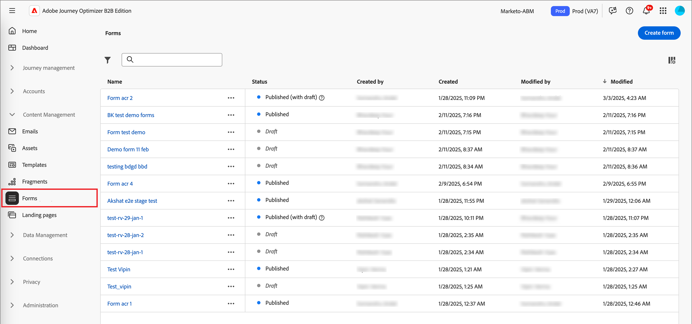
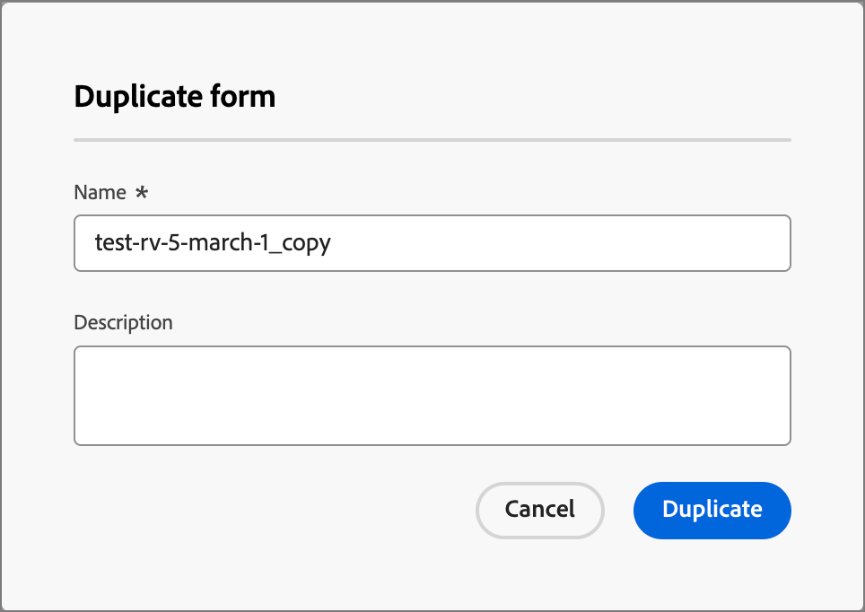

# Formulare

Um Informationen von Web-Seitenbesuchern zu erfassen, erstellen Sie Formulare und fügen Sie sie Ihren Landingpages hinzu. Ein Formular ist ein Satz von Feldern, die Seitenbesucher ausfüllen und senden, um Inhalte oder Angebote abzurufen, z. B. ein Whitepaper, ein On-Demand-Webinar oder eine kostenlose Testversion.

Die Menge an Informationen, die das Formular erfassen soll, hängt vom Wert des Inhalts oder Angebots ab. Wenn Sie etwas Einfaches anbieten, z. B. ein Whitepaper, sollten Sie nur minimale Informationen wie Namen, E-Mail-Adresse und Firma erfassen. Wenn das Angebot einen höheren Wert aufweist, z. B. eine Demo oder eine kostenlose Testversion, können Sie weitere Informationen erfassen. Das Erfordernis eines übermittelten Formulars, um die Anzeige von Inhalten zu ermöglichen, wird als _-Inhalt_. Ihr Unternehmen entscheidet, welche Inhalte gefiltert werden sollen und welche nicht (_frei_). Es empfiehlt sich, einige Inhalte kostenlos zuzulassen und nur Premium- oder High-Demand-Inhalte zu testen.

## Zugriff und Verwaltung von Formularen

Um auf Formulare in Journey Optimizer B2B edition zuzugreifen, gehen Sie zum linken Navigationsbereich und klicken Sie auf **[!UICONTROL Content-Management]** > **[!UICONTROL Forms]**. Diese Aktion öffnet eine Listenseite mit allen in der Instanz erstellten Formularen, die in einer Tabelle aufgeführt sind.

{width="700" zoomable="yes"}

Die Tabelle wird nach der Spalte _[!UICONTROL Geändert]_ sortiert, wobei die zuletzt aktualisierten Formulare standardmäßig oben stehen. Klicken Sie auf den Spaltentitel, um zwischen aufsteigender und absteigender Reihenfolge zu wechseln.

### Formularstatus und -lebenszyklus

Der Formularstatus bestimmt, ob in einer Landingpage- oder Landingpage-Vorlage verfügbar ist und welche Änderungen Sie daran vornehmen können.

| Status | Beschreibung |
| -------------------- | ----------- |
| Entwurf | Wenn Sie ein Formular erstellen, befindet es sich im Entwurfsstatus . Dieser Status bleibt erhalten, während Sie die Felder definieren oder bearbeiten, bis Sie sie zur Verwendung in einer Landingpage oder Landingpage-Vorlage veröffentlichen. Verfügbare Aktionen: <ul><li>Alle Details bearbeiten<li>Bearbeiten im visuellen Design-Bereich<li>Veröffentlichen<li>Duplizieren<li>Löschen |
| Veröffentlicht | Wenn Sie ein Formular veröffentlichen, wird es zur Verwendung in einer Landingpage oder Landingpage-Vorlage verfügbar. Veröffentlichte Formularinhalte können im visuellen Design-Bereich nicht geändert werden. Verfügbare Aktionen: <ul><li>Namen, Beschreibung oder Dankeseite bearbeiten<li>Hinzufügen zu einer Landingpage oder Landingpage-Vorlage<li>Versionsentwurf erstellen<li>Duplizieren<li>Löschen (wenn nicht in Gebrauch)<li>Einbettungs-Code |
| Mit Entwurf veröffentlicht | Wenn Sie einen Entwurf aus einem veröffentlichten Formular erstellen, bleibt die veröffentlichte Version für die Verwendung in einer Landingpage- oder Landingpage-Vorlage verfügbar und der Entwurfsinhalt kann im visuellen Design-Bereich geändert werden. Wenn Sie die Entwurfsversion veröffentlichen, ersetzt sie die aktuell veröffentlichte Version, und der Inhalt wird auf den Landingpages oder Landingpage-Vorlagen aktualisiert, auf denen sie verwendet wird. Verfügbare Aktionen: <ul><li>Namen, Beschreibung oder Dankeseiten bearbeiten<li>Hinzufügen zu einer Landingpage oder Landingpage-Vorlage<li>Bearbeiten der Entwurfsversion im visuellen Entwurfsbereich<li>Entwurfsversion veröffentlichen<li>Duplizieren<li>Löschen (wenn nicht in Gebrauch)<li>Einbettungs-Code |

{zoomable="yes"}

### Filtern der Formularliste

Um nach einem Formular anhand des Namens zu suchen, geben Sie eine Textzeichenfolge in die Suchleiste für eine Übereinstimmung ein. Klicken Sie auf _Filter_-Symbol (  ), um die verfügbaren Filteroptionen anzuzeigen und die Einstellungen zu ändern, um die angezeigten Elemente entsprechend Ihren angegebenen Kriterien zu filtern.

{width="700" zoomable="yes"}

### Spaltenanzeige anpassen

Passen Sie die Spalten an, die Sie in der Tabelle anzeigen möchten, indem Sie oben rechts auf _Tabelle anpassen_ („) klicken.

Wählen Sie im Dialogfeld die anzuzeigenden Spalten aus und klicken Sie auf **[!UICONTROL Anwenden]**.

{width="300"}

## Erstellen von Formularen

Bevor Sie mit dem Erstellen wiederverwendbarer Formulare in Journey Optimizer B2B edition beginnen, sollten Sie mehrere Dinge berücksichtigen:

* Bestimmen Sie, welche Formulare Sie benötigen.

  Möglicherweise können nur vier Standardformulare verwendet werden. Eine für den Zugriff auf herunterladbare Inhalte, eine für den Zugriff auf Premium-Web-Seiten, eine für die Anzeige von Videos und eine für die Registrierung für Dinge wie Webinare. Wenn Sie jemals ein Feld in einem Formular ändern müssen, ist es einfacher, vier Standardformulare zu aktualisieren, die global verwendet werden, anstatt mehrere Formulare zu ändern, die sich über alle Ihre Marketing-Programme verteilen. <!-- Global forms also make progressive profiling much easier to implement. -->

* Legen Sie für jedes Standardformular fest, welche Felder verwendet und wie sie präsentiert werden sollen.

  Erwägen Sie die Verwendung kürzerer Formulare, da sie sich als besser für Konversionen erwiesen haben. Wenn Sie durch jedes Formular nachdenken, entscheiden Sie, welche Felder für seinen Zweck angemessen und erforderlich sind.

  Überlegen Sie, ob Formularfelder vorausgefüllt werden sollen, damit grundlegende Informationen wie Name und E-Mail vorab ausgefüllt werden. Andere Informationen wie die Stellenbezeichnung und die Größe der Organisation jedoch nicht. Auf diese Weise muss der Besucher nur zwei Felder ausfüllen und das Formular senden. Sie können auch ein Social-Media-Formular verwenden, das mit Daten von Facebook oder Twitter ausgefüllt ist.

* Planen Sie, welche Folgeseite angezeigt wird, nachdem ein Besucher ein Formular übermittelt hat (_Dankeseite_.

  Erhalten alle dieselbe Seite oder ist sie dynamisch und basiert auf ihren Daten? Beispielsweise könnte jemand aus der Gesundheitsbranche einen anderen Seiteninhalt sehen als jemand aus der Technologiebranche.

* Erwägen, ein Formular vollständig zu umgehen, wenn Sie bereits über die benötigten Informationen verfügen.

  Wenn Sie einer bekannten Person, die Ihre Landingpage besucht, eine Umgehung der Formulare erlauben, kann diese einfach direkt auf den Inhalt zugreifen. Die Umgehung des Formulars bietet ein optimiertes Besuchererlebnis.

### Neues Formular hinzufügen

Sie können ein Formular in Journey Optimizer B2B edition erstellen, indem Sie **[!UICONTROL Formular erstellen]** oben rechts auf der Listenseite _[!UICONTROL Forms]_ klicken.

1. Geben _[!UICONTROL im Dialogfeld „Formular erstellen]_ einen nützlichen **[!UICONTROL Name]** (erforderlich) und **[!UICONTROL Beschreibung]** (optional) ein.

   Formularanforderungen:

   * Name - Maximal 100 Zeichen, muss eindeutig sein, Groß-/Kleinschreibung wird nicht beachtet

   * Beschreibung - Maximal 300 Zeichen

   * Alpha-, numerische und Sonderzeichen sind zulässig

   * Reservierte Zeichen sind **_nicht zulässig_**: `\ / : * ? " < > |`

   {width="400"}

1. Klicken Sie auf **[!UICONTROL Erstellen]**.

   Die Seite mit den Formulardetails wird mit einer standardmäßigen allgemeinen Formulardefinition geöffnet.

   {width="700" zoomable="yes"}

### Ändern des Standardformularentwurfs

Verwenden Sie die visuellen Design-Tools, um den Formularinhalt nach Bedarf zu ändern:

* [Felder hinzufügen](./form-design.md#add-a-field)
* [Feldstile ändern](./form-design.md#change-field-styling)
* [Felder neu anordnen](./form-design.md#reorder-fields)
* [Ändern des Texts und der Formatierung der Senden-Schaltfläche](./form-design.md#edit-and-style-the-submit-button)
* [Ändern des Formularstils](./form-design.md#change-form-styling)

Klicken Sie **[!UICONTROL Speichern und schließen]** um Ihre Änderungen am Formularinhalt zu speichern und zu den Formulardetails zu gelangen.

### Einrichten der Dankeseite

Scrollen Sie im Bedienfeld _[!UICONTROL Zusammenfassung]_ auf der rechten Seite zum Abschnitt **[!UICONTROL Dankeseite]** und verwenden Sie die Einstellung **[!UICONTROL Folgenachricht]**, um zu definieren, was passiert, wenn ein Besucher das Formular sendet:

* **[!UICONTROL Auf Seite bleiben]** - Wählen Sie diese Option, um den Besucher beim Senden des Formulars auf der gleichen Seite zu belassen.

* **[!UICONTROL Landingpage]** - Wählen Sie diese Option, um eine beliebige Journey Optimizer B2B edition- oder Marketo Engage-Landingpage als Folgemaßnahme auszuwählen.

* **[!UICONTROL Externe URL]** - Wählen Sie diese Option aus, um eine beliebige URL als Folgeseite anzugeben. Nachdem der Besucher das Formular gesendet hat, lädt der Browser die vorgesehene URL.

  >[!TIP]
  >
  >Wenn Sie das Formular zum Herunterladen einer Datei verwenden möchten, können Sie eine URL für die gehostete Datei angeben. Bei dieser Konfiguration fungiert die Senden-Schaltfläche als Download-Schaltfläche.

### Veröffentlichen des Formularentwurfs

Wenn Sie bereit sind, das Formular für eine Landingpage oder Landingpage-Vorlage verfügbar zu machen, klicken Sie auf **[!UICONTROL Veröffentlichen]**.

{width="400"}

Diese Aktion öffnet ein Bestätigungsdialogfeld. Sie können den Veröffentlichungsprozess abbrechen, indem Sie auf **[!UICONTROL Abbrechen]** klicken oder zur Bestätigung auf **[!UICONTROL Veröffentlichen]** klicken.

## Anzeigen von Formulardetails

Klicken Sie auf den Namen eines Formulars auf der Listenseite, um die Seite mit den Fragmentdetails zu öffnen. Sie können das Formular bearbeiten, das Formular umbenennen oder die Formularbeschreibung aktualisieren. Nehmen Sie Aktualisierungen vor und klicken Sie außerhalb des Namens- oder Beschreibungsfelds, um Änderungen automatisch zu speichern.

>[!NOTE]
>
>Wenn ein veröffentlichtes Formular von einer Landingpage- oder Landingpage-Vorlage verwendet wird, können Sie den Inhalt nicht bearbeiten oder die Dankeseite ändern. Sie können eine Entwurfsversion erstellen, wenn Sie Änderungen an den Formularen vornehmen möchten

{width="600" zoomable="yes"}

Klicken Sie **[!UICONTROL Formular bearbeiten]**, um das Fragment im visuellen Design-Bereich zu öffnen.

Sie können die Ansicht jederzeit verlassen, indem Sie oben links auf _Zurück_-Pfeil klicken, der Sie zur Listenseite _[!UICONTROL Forms]_ zurückbringt.

## Anzeigen von durch Verweise verwendeten Formularen

Klicken Sie im Bedienfeld _[!UICONTROL Zusammenfassung]_ auf der rechten Seite auf die Registerkarte **[!UICONTROL Verwendet von]**, um Details zur aktuellen Verwendung des Formulars in Journey Optimizer B2B edition sowie zu Landingpages und Landingpage-Vorlagen anzuzeigen.

>[!IMPORTANT]
>
>Formulare, die derzeit von Landingpages oder Landingpage-Vorlagen verwendet werden, können nicht gelöscht werden.

{width="600" zoomable="yes"}

Verweise werden nach Kategorie angezeigt: _Landingpage_ oder _Landingpage-Vorlage_. Klicken Sie auf den Link, um die entsprechende Seite oder Vorlage zu öffnen, in der das Formular verwendet wird.

## Formulare löschen

Formulare, die derzeit von einer Landingpage oder Landingpage-Vorlage verwendet werden, können nicht gelöscht werden. Sie können die &quot;_-by“-Verweise überprüfen_ bevor Sie mit dem Entfernen eines Formulars beginnen. Außerdem kann eine Entfernung nicht rückgängig gemacht werden. Überprüfen Sie dies, bevor Sie eine Löschaktion starten.

Sie können ein Formular mit einer der folgenden Methoden löschen:

* Klicken Sie oben rechts auf **[!UICONTROL … Weitere]** und wählen Sie **[!UICONTROL Löschen]**.
* Klicken Sie auf der __ Forms **[!UICONTROL auf das Auslassungszeichen neben dem Formularnamen und wählen Sie „Löschen]**.

Diese Aktion öffnet ein Bestätigungsdialogfeld. Sie können den Vorgang abbrechen, indem Sie auf **[!UICONTROL Abbrechen]** klicken oder auf **[!UICONTROL Löschen]** klicken, um den Löschvorgang zu bestätigen.

{width="400"}

Wenn das Formular derzeit verwendet wird, wird durch die Aktion ein Informationsdialogfeld geöffnet, in dem Sie darauf hingewiesen werden, dass es nicht gelöscht werden kann. Klicken Sie auf **[!UICONTROL OK]**, wodurch die Löschaktion abgebrochen wird.

{width="400"}

## Formulare duplizieren

Duplizieren Sie ein Formular, um schnell und einfach ein neues Formular mit einem vorhandenen Formular als Ausgangspunkt für Ihren Formularentwurf zu erstellen.

Sie können ein Formular mit einer der folgenden Methoden duplizieren:

* Klicken Sie oben rechts auf der Seite mit den Formulardetails auf **[!UICONTROL … Mehr]** und wählen Sie **[!UICONTROL Duplizieren]**.
* Klicken Sie auf der __ Forms **[!UICONTROL auf das Auslassungszeichen neben dem Formularnamen und wählen Sie „Duplizieren]**.

{width="450"}

Geben Sie im Dialogfeld einen nützlichen Namen (eindeutig) und eine Beschreibung ein. Klicken Sie **[!UICONTROL Duplizieren]**, um die Aktion abzuschließen.

{width="400"}

Bearbeiten Sie das doppelte Formular, um den Namen nach Bedarf zu ändern und das Formular für den vorgesehenen Zweck zu ändern.

## Formulare bearbeiten

Änderungen an einem Formular hängen von seinem aktuellen Status ab:

* Wenn sich ein Formular im _Entwurf_ befindet, können Sie alle zugehörigen Details und Inhalte (Felder, Schaltflächen und Stile) bearbeiten.
* Wenn sich ein Formular im Status _Veröffentlicht_ befindet, können Sie den Formularnamen oder die Beschreibung bearbeiten. Sie können den Inhalt nicht bearbeiten.
* Wenn sich ein Formular im Status _Veröffentlicht mit Entwurf_ befindet, können Sie den Formularnamen oder die Beschreibung bearbeiten. In der Entwurfsversion können Sie auch den Inhalt und die Dankeseite bearbeiten.

>[!BEGINTABS]

>[!TAB Entwurf]

1. Klicken Sie auf der Listenseite __ Forms&quot; auf den Formularnamen, um es zu öffnen.

   Eine Vorschau des Formularinhalts mit den Formulardetails wird auf der rechten Seite angezeigt.

1. Ändern Sie alle Details, z. B. Namen und Beschreibung.

   {width="600" zoomable="yes"}

1. Um Änderungen am Formular im visuellen Design vorzunehmen, klicken Sie auf **[!UICONTROL Formular bearbeiten]**.

   Verwenden Sie bei Bedarf visuelle Design-Tools:

   * [Felder hinzufügen](./form-design.md#add-a-field)
   * [Feldstile ändern](./form-design.md#change-field-styling)
   * [Felder neu anordnen](./form-design.md#reorder-fields)
   * [Ändern des Texts und der Formatierung der Senden-Schaltfläche](./form-design.md#submit-button)
   * [Ändern des Formularstils](./form-design.md#change-form-styling)

   Klicken Sie **[!UICONTROL Speichern und schließen]** um zu den Formulardetails zurückzukehren.

1. Wenn das Formular Ihren Kriterien entspricht und Sie es in einer Landingpage oder Landingpage-Vorlage verfügbar machen möchten, klicken Sie auf **[!UICONTROL Veröffentlichen]**.

>[!TAB Veröffentlicht]

1. Klicken Sie auf der Listenseite __ Forms&quot; auf den Formularnamen, um es zu öffnen.

   Eine Vorschau des Formularinhalts mit den Formulardetails wird auf der rechten Seite angezeigt.

1. Um eine Entwurfsversion zur Bearbeitung des Formulars zu erstellen, klicken Sie auf **[!UICONTROL Formular bearbeiten]** im Bedienfeld _[!UICONTROL Zusammenfassung]_ rechts.

1. Klicken Sie **[!UICONTROL Dialogfeld auf]** Entwurfsversion erstellen“, um die Entwurfsversion im visuellen Entwurfsbereich zu öffnen.

   {width="400"}

1. Verwenden Sie die visuellen Design-Tools nach Bedarf, um den Formularinhalt zu aktualisieren:

   * [Felder hinzufügen](./form-design.md#add-a-field)
   * [Feldstile ändern](./form-design.md#change-field-styling)
   * [Felder neu anordnen](./form-design.md#reorder-fields)
   * [Ändern des Texts und der Formatierung der Senden-Schaltfläche](./form-design.md#submit-button)
   * [Ändern des Formularstils](./form-design.md#change-form-styling)

   Klicken Sie **[!UICONTROL Speichern und schließen]** um zu den Formulardetails zurückzukehren.

1. Wenn der Formularentwurf Ihren Kriterien entspricht und Sie die Änderungen für eine Landingpage oder Landingpage-Vorlage verfügbar machen möchten, klicken Sie auf **[!UICONTROL Veröffentlichen]**.

   Wenn Sie die Entwurfsversion veröffentlichen, ersetzt sie die aktuell veröffentlichte Version, und der Formularinhalt wird in den Landingpages oder Landingpage-Vorlagen aktualisiert, in denen sie bereits verwendet wird.

>[!TAB Veröffentlicht mit Entwurf]

1. Klicken Sie auf den Namen des Formulars, um es zu öffnen.

1. Wählen Sie die **[!UICONTROL Entwurf]** aus.

   Eine Vorschau des Formularinhalts der Entwurfsversion wird mit den Formulardetails auf der rechten Seite angezeigt.

   {width="700" zoomable="yes"}

1. Klicken Sie **[!UICONTROL Formular bearbeiten]** im Bereich _[!UICONTROL Zusammenfassung]_ auf der rechten Seite und verwenden Sie bei Bedarf die visuellen Design-Tools:

   * [Felder hinzufügen](./form-design.md#add-a-field)
   * [Feldstile ändern](./form-design.md#change-field-styling)
   * [Felder neu anordnen](./form-design.md#reorder-fields)
   * [Ändern des Texts und der Formatierung der Senden-Schaltfläche](./form-design.md#submit-button)
   * [Ändern des Formularstils](./form-design.md#change-form-styling)

   Klicken Sie **[!UICONTROL Speichern und schließen]** um zu den Formulardetails zurückzukehren.

1. Wenn der Formularentwurf Ihren Kriterien entspricht und Sie die Änderungen für die Verwendung auf Landingpages und Landingpage-Vorlagen verfügbar machen möchten, klicken Sie auf **[!UICONTROL Veröffentlichen]**.

   Wenn Sie die Entwurfsversion veröffentlichen, ersetzt sie die aktuelle veröffentlichte Version, und das Formular wird auf den Landingpages und Vorlagen aktualisiert, auf denen es bereits verwendet wird.

>[!ENDTABS]

## Hinzufügen von Formularen zu einer Landingpage oder Vorlage

Forms sind für die Wiederverwendung konzipiert und können eingefügt werden, wenn Sie eine [Landingpage](./landing-page-design.md) oder [Landingpage-Vorlage) ](./landing-page-templates.md).

{{$include /help/_includes/content-design-add-forms.md}}

## Formularaktionen für die Seiten- und Vorlagenbearbeitung

Wenn ein Formular in einer Landingpage oder Landingpage-Vorlage enthalten ist, kann der Formularinhalt innerhalb der Seite oder Vorlage nicht geändert werden. Sie können jedoch die folgenden Aktionen anwenden:

* **[!UICONTROL Löschen]** - Mit dieser Aktion wird das Formular aus dem aktuellen Seiten- oder Vorlageninhalt entfernt (die Fragmentquelle ist nicht betroffen).
* **[!UICONTROL Duplizieren]** - Mit dieser Aktion wird das Formular innerhalb derselben Seite oder Vorlage im Editor mit denselben Dimensionen dupliziert und direkt darunter hinzugefügt.
* **[!UICONTROL HTML anzeigen]** - Diese Aktion öffnet ein Popup mit der HTML für das Formular. Sie können die HTML bearbeiten oder sie zur Verwendung in anderen Web-Inhalten kopieren.
* **[!UICONTROL Formular bearbeiten]** - Diese Aktion öffnet eine neue Browser-Registerkarte mit der Seite und den Details des Formular-Editors.

Wenn Sie das Formular im Design-Bereich der Landingpage auswählen, sind diese Aktionen in der Kontextsymbolleiste und im Bedienfeld Eigenschaften auf der rechten Seite verfügbar.

{width="600" zoomable="yes"}
