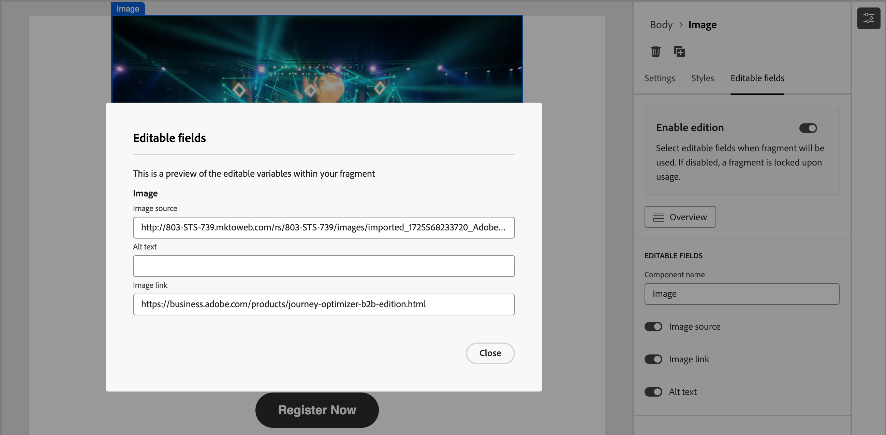

# Erstellen von Fragmenten

Nachdem Sie [ein Fragment erstellt haben](./fragments.md#create-fragments) verwenden Sie den visuellen Design-Bereich, um die Struktur- und Inhaltskomponenten in Ihrem Fragment zu erstellen.

## Hinzufügen von Struktur und Inhalten {#design-fragment}

{{$include /help/_includes/content-design-components.md}}

## Hinzufügen von Assets

{{$include /help/_includes/content-design-assets.md}}

## Navigieren in den Ebenen, Einstellungen und Stilen

{{$include /help/_includes/content-design-navigation.md}}

## Personalisieren von Inhalten

{{$include /help/_includes/content-design-personalization.md}}

## Bedingte Inhalte

Um bedingte Inhalte hinzuzufügen, die den Inhalt auf der Grundlage von Regeln an die Zielprofile anpassen, wählen Sie eine Inhaltskomponente aus und klicken Sie auf die Schaltfläche **[!UICONTROL Bedingten Inhalt aktivieren]** in der Komponenten-Symbolleiste. Wenn das veröffentlichte Fragment in einer E-Mail-Nachricht enthalten ist, bestimmen die bedingten Regeln die Variante einer bedingten Komponente, die in der E-Mail-Nachricht gerendert wird.

Weitere Informationen finden Sie unter [_Bedingter Inhalt_](./conditional-content.md).

## Aktivieren der Fragmentanpassung

Wenn ein Autor ein Fragment zu einer [E-](./email-authoring.md#content-authoring---use-visual-fragments) oder [E-Mail-Vorlage](./email-template-authoring.md#content-authoring---use-visual-fragments) hinzufügt, ist der Fragmentinhalt standardmäßig gesperrt. Alle Änderungen am veröffentlichten Fragment werden automatisch auf alle Inhalts-Assets übertragen, in denen das Fragment verwendet wird. Wenn Sie einen Parameter für eine Komponente im Fragment als bearbeitbar festlegen, kann der E-Mail- oder Vorlagenautor einen benutzerdefinierten Feldwert angeben, der speziell für seine Anforderungen gilt. Diese Anpassungsmarkierung ist auf visuelle Bild-, Text- und Schaltflächenkomponenten beschränkt. 

Wenn Sie beispielsweise ein wiederverwendbares Banner mit einer anklickbaren Schaltfläche entwerfen, können Sie den URL-Parameter für die Schaltfläche als bearbeitbar festlegen. E-Mail-Autoren können dann eine URL verwenden, die spezifischer für ihre E-Mail-Kampagne ist. Mit diesen anpassbaren Feldern können Marketing-Experten wiederverwendbare Inhalte verwalten und personalisieren, ohne völlig neue Inhaltsbausteine erstellen oder die vom ursprünglichen Fragment übernommenen Aktualisierungen unterbrechen zu müssen.

1. Wählen Sie im visuellen Inhaltseditor das Bild, den Text oder das Schaltflächenelement aus, für das Sie die Anpassung aktivieren möchten.

1. Wählen Sie in den Komponentendetails auf der rechten Seite die Registerkarte **[!UICONTROL Bearbeitbare Felder]** aus.

1. Klicken Sie auf **[!UICONTROL Umschalter für die Option]** Bearbeitung aktivieren“ und legen Sie die bearbeitbaren Felder fest.

   {width="700" zoomable="yes"}

   Sie können die Anpassung für die angezeigten Felder aktivieren, die vom Komponententyp und den im Fragment definierten Parametern abhängen.

   Ändern Sie den Umschalter für jedes Feld, in dem Sie eine Anpassung zulassen möchten, in einen aktivierten Status.

1. Klicken Sie **[!UICONTROL Übersicht]**, um alle bearbeitbaren Felder und ihre Standardwerte zu überprüfen.

   {width="700" zoomable="yes"}

1. Speichern Sie Ihre Änderungen.

## Verknüpftes URL-Tracking bearbeiten

{{$include /help/_includes/content-design-links.md}}
