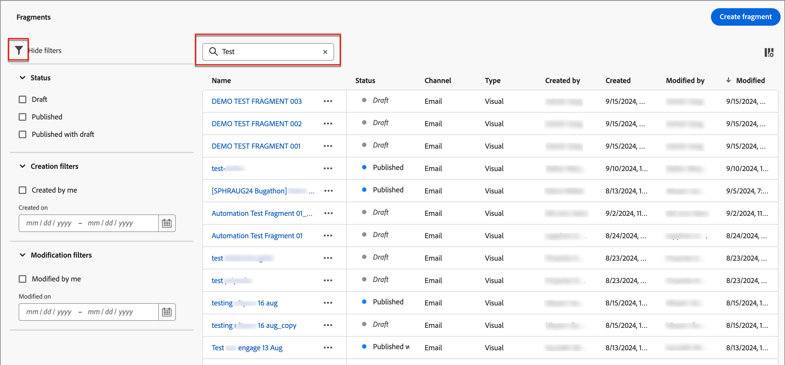

# Fragmente

Ein Fragment ist eine wiederverwendbare Komponente, die in einer oder mehreren E-Mail- und E-Mail-Vorlagen in Adobe Journey Optimizer B2B Edition referenziert werden kann. Normalerweise handelt es sich dabei um einen Inhaltsbaustein (Text, Bild oder beides), der vorab erstellt und schnell in eine E-Mail- oder E-Mail-Vorlage eingefügt werden kann. Mit dieser Funktion können Sie mehrere benutzerdefinierte Inhaltsbausteine vorerstellen, die von Ihren Marketing-Team-Mitgliedern verwendet werden können, um E-Mail-Inhalte für einen verbesserten Designprozess zusammenzustellen. Häufige Anwendungsfälle sind Kopfzeilen-/Fußzeilen-Inhaltsbausteine für E-Mails, Einladungsbanner für Ereignisse und saisonale Grußformeln.

So nutzen Sie Fragmente in Ihren Workflows optimal:

* _Eigene Fragmente erstellen_ - Erstellen Sie visuelle Fragmente entweder von Grund auf neu oder indem Sie Inhalte jederzeit im Visual Content Editor als Fragment speichern.
* _Wiederverwenden Sie Ihre fragment_s - Verwenden Sie sie so oft wie nötig in Ihrem Inhalt.

## Visuelle Fragmente

Visuelle Fragmente sind vordefinierte visuelle Bausteine, die mit dem Visual Content Editor erstellt wurden und die Sie über mehrere E-Mails oder E-Mail-Vorlagen hinweg wiederverwenden können. Der aktuelle Umfang von Journey Optimizer B2B Edition und dieser Dokumentation ist nur der von visuellen Fragmenten. Ausdrucksbasierte Fragmente werden in Journey Optimizer B2B Edition noch nicht unterstützt.

## Fragmente aufrufen und verwalten

Um auf visuelle Fragmente in der Adobe Journey Optimizer-B2B-Bearbeitung zuzugreifen, navigieren Sie zum linken Navigationsbereich und klicken Sie auf **[!UICONTROL Content Management]** > **[!UICONTROL Fragmente]**. Durch diese Aktion wird eine Listenseite mit allen Fragmenten geöffnet, die in der in einer Tabelle aufgelisteten Instanz erstellt wurden.

{width="700" zoomable="yes"}

Die Tabelle wird nach der Spalte _[!UICONTROL Geändert]_ sortiert, wobei sich die zuletzt aktualisierten Fragmente standardmäßig oben in der Liste befinden. Klicken Sie auf den Spaltentitel, um ihn zwischen auf- und absteigend zu ändern.

Suchen Sie nach einem beliebigen Fragment, indem Sie in die Suchleiste eine Textzeichenfolge nach einer Übereinstimmung mit dem Fragmentnamen eingeben. Klicken Sie auf das Symbol _Filter_ , um die angezeigten Elemente nach Ihren angegebenen Kriterien zu filtern.

{width="700" zoomable="yes"}

Passen Sie die Spalten, die in der Tabelle angezeigt werden sollen, an, indem Sie oben rechts auf das Symbol _Tabelle anpassen_ klicken. Wählen Sie die anzuzeigenden Spalten aus und klicken Sie auf **[!UICONTROL Anwenden]**.

## Erstellen von Fragmenten

Sie können neue visuelle Fragmente in Journey Optimizer B2B Edition erstellen, indem Sie oben rechts auf **[!UICONTROL Fragment erstellen]** klicken.

1. Geben Sie im Dialogfeld _[!UICONTROL Fragment erstellen]_ einen nützlichen **[!UICONTROL Namen]** und **[!UICONTROL Beschreibung]** ein (optional).

   Fragmentanforderungen:

   * Name - Maximal 100 Zeichen, muss eindeutig sein, Groß-/Kleinschreibung nicht berücksichtigt

   * Beschreibung - Maximal 300 Zeichen

   * Alpha, numerisch, Sonderzeichen zulässig

   * Reservierte Zeichen sind nicht zulässig: `\ / : * ? " < > |`

   {width="500"}

1. Klicken Sie auf **[!UICONTROL Erstellen]**.

   Der visuelle Inhaltseditor wird mit einer leeren Arbeitsfläche geöffnet. Informationen zum Erstellen eines Fragments mithilfe des Visual Content Editors finden Sie in den Themen zur Inhaltserstellung:

<!-- To be linked to the corresponding sections on this page: Adobe Journey Optimizer B2B Edition - Email Templates

Adding structure & content
Adding assets
Navigating the layers
Previewing & editing URLs
View options
More options -->

## Fragmentdetails anzeigen

Klicken Sie auf den Namen eines beliebigen Fragments auf der Listenseite, um die Seite mit den Fragmentdetails zu öffnen.

Von hier aus können Sie das Fragment bearbeiten, es umbenennen oder die Fragmentbeschreibung aktualisieren (nehmen Sie Aktualisierungen vor und klicken Sie außerhalb des Namens-/Beschreibungsfelds, um die Änderungen automatisch zu speichern).

Klicken Sie auf **[!UICONTROL Bearbeiten]** , um das Fragment im Visual Content Editor zu öffnen.

Beenden Sie die Ansicht jederzeit, indem Sie auf den Pfeil _Zurück_ oben links klicken, wodurch Sie zur Listenseite _Fragmente_ zurückkehren.

## Von Verweisen verwendetes Fragment anzeigen

Klicken Sie auf der Seite mit den Fragmentdetails auf die Registerkarte &quot;**[!UICONTROL Verwendet von]**&quot;, um Details dazu anzuzeigen, wo das Fragment derzeit in Journey Optimizer B2B Edition verwendet wird - für E-Mails, E-Mail-Vorlagen und Fragmente.

>[!IMPORTANT]
>
>Jedes Fragment, das aktuell von einer E-Mail- oder E-Mail-Vorlage verwendet wird, kann nicht gelöscht werden.

Verweise werden nach Kategorie angezeigt: _E-Mail_ oder _E-Mail-Vorlage_. E-Mails in Journey Optimizer B2B Edition werden in Konto-Journey eingebettet und verfasst, sodass die übergeordnete Journey der E-Mail, die das Fragment verwendet, in Verweisen angezeigt wird.

Klicken Sie auf den Link, um die entsprechende E-Mail- oder E-Mail-Vorlage zu öffnen, in der das Fragment verwendet wird.

## Fragmente löschen

Jedes Fragment, das aktuell von einer E-Mail- oder E-Mail-Vorlage verwendet wird, kann nicht gelöscht werden. Überprüfen Sie daher vor dem Starten eines Fragmenterlöschens die Verweise _used-by_ . Außerdem kann eine Entfernung nicht rückgängig gemacht werden. Überprüfen Sie daher, bevor Sie eine Löschaktion starten.

Sie können ein Fragment mit einer der folgenden Methoden löschen:

* Klicken Sie in den Fragmentdetails auf der rechten Seite auf **[!UICONTROL Löschen]**.
* Klicken Sie auf der Listenseite _[!UICONTROL Fragmente]_ auf das Auslassungszeichen neben dem Fragment und wählen Sie **[!UICONTROL Löschen]**.

Durch diese Aktion wird ein Bestätigungsdialogfeld geöffnet. Sie können den Vorgang abbrechen, indem Sie auf **[!UICONTROL Abbrechen]** klicken oder auf **[!UICONTROL Löschen]** klicken, um den Löschvorgang zu bestätigen.

Wenn das Fragment derzeit verwendet wird, öffnet die Aktion ein Informationsdialogfeld, das Sie darauf hinweist, dass das Fragment nicht gelöscht werden kann. Klicken Sie auf **[!UICONTROL OK]** , wodurch der Löschvorgang abgebrochen wird.

## Bearbeiten von Fragmenten

Sie können ein Fragment mit einer der folgenden Methoden bearbeiten:

* Klicken Sie in den Fragmentdetails auf der rechten Seite auf **[!UICONTROL Bearbeiten]**.
* Klicken Sie auf der Listenseite _[!UICONTROL Fragmente]_ auf das Auslassungszeichen neben dem Fragment und wählen Sie **[!UICONTROL Bearbeiten]**.

Durch diese Aktion wird das Fragment in einem visuellen Inhaltseditor geöffnet, in dem Sie das Fragment mit einer der Funktionen zum Erstellen eines Fragments [ bearbeiten können.](#create-fragments)

## Fragmente duplizieren

Sie können ein Fragment mit einer der folgenden Methoden duplizieren:

* Klicken Sie in den Fragmentdetails auf der rechten Seite auf **[!UICONTROL Duplizieren]**.
* Klicken Sie auf der Listenseite _[!UICONTROL Fragmente]_ auf das Auslassungszeichen neben dem Fragment und wählen Sie **[!UICONTROL Duplizieren]** aus.

Geben Sie im Dialogfeld einen nützlichen Namen (eindeutig) und eine Beschreibung ein. Klicken Sie auf **[!UICONTROL Duplizieren]** , um die Aktion abzuschließen.

Das duplizierte (neue) Fragment wird dann in der Liste _Fragmente_ angezeigt.

## Fragmente aus dem E-Mail- oder Vorlageneditor speichern

Jedes Mal, wenn Sie sich im visuellen Inhaltseditor für die Erstellung/Bearbeitung einer E-Mail- oder E-Mail-Vorlage befinden, können Sie den Inhalt oder Teile davon als Fragment speichern, damit er zur Wiederverwendung verfügbar ist.

1. Wenn Sie Inhalt als Fragment speichern möchten, klicken Sie auf **[!UICONTROL Mehr]** und wählen Sie **[!UICONTROL Als Fragment speichern]**.

1. Wählen Sie die verschiedenen Elemente aus, die in das Fragment aufgenommen werden sollen.

   Auswählen mehrerer Strukturen durch Drücken der STRG-Taste

   Sie können nur nebeneinander liegende Strukturen auswählen, in der Benutzeroberfläche ist es nicht möglich, nicht nebeneinander liegende Elemente auszuwählen.

1. Klicken Sie bei ausgewähltem Inhalt oben rechts auf **[!UICONTROL Erstellen]** .

1. Geben Sie im Dialogfeld einen nützlichen Namen und eine Beschreibung für das Fragment ein. Klicken Sie dann auf **[!UICONTROL Erstellen]**.

   Das neue Fragment wird dann auf der Listenseite _Fragmente_ angezeigt und kann auch in E-Mails und E-Mail-Vorlagen verwendet werden.

## Hinzufügen visueller Fragmente zu einer E-Mail oder Vorlage

Fragmente sind zur Wiederverwendung konzipiert und können zum Erstellen von E-Mail- und E-Mail-Vorlagen eingefügt werden. Sie können bis zu 30 Fragmente in einer E-Mail oder Vorlage hinzufügen. Fragmente können nur bis zu einer Ebene verschachtelt werden.

>[!BEGINTABS]

>[!TAB Fragmente zu einer E-Mail hinzufügen]

1. Navigieren Sie zu Journey und öffnen Sie eine bestehende Journey oder erstellen Sie eine neue Journey.

1. Erstellen Sie den Knoten &quot;Aktion durchführen > Aktion für Personen > E-Mail senden&quot;.

1. Erstellen oder bearbeiten Sie E-Mail-Inhalte für den Knoten.

1. Ziehen Sie ein Element aus dem Menü &quot;Komponenten&quot;und legen Sie es ab, um eine _Struktur_ für das Fragment bereitzustellen.

1. Um die Fragmentliste zu öffnen, klicken Sie auf das Symbol _Fragmente_.

   Sie können:
   * Sortieren Sie die Liste.
   * Suchen, Suchen, Filtern Sie die Liste.
   * Zwischen Miniatur- und Listenansichten wechseln.
   * Aktualisieren Sie die Liste, um eines der kürzlich erstellten Fragmente widerzuspiegeln.

1. Ziehen Sie eines der Fragmente in den Platzhalter der Strukturkomponente.

   Der Editor rendert das Fragment innerhalb des Bereichs/Elements der E-Mail-Struktur.

Der Inhalt des Fragments wird innerhalb der Struktur dynamisch aktualisiert, um eine visuelle Darstellung des Inhalts in der E-Mail zu erhalten.

Wenn Sie das Fragment so hinzufügen möchten, dass es das gesamte horizontale Layout der E-Mail einnimmt, fügen Sie eine 1:1-Spaltenstruktur hinzu und ziehen Sie das Fragment per Drag-and-Drop in die E-Mail.

Nachdem die E-Mail gespeichert wurde, wird sie auf der Seite mit den Fragmentdetails > Verwendet nach Abschnitt angezeigt. Zu einer E-Mail hinzugefügte Fragmente können nicht in der E-Mail bearbeitet werden. Der Inhalt wird durch das Quellfragment definiert.

>[!TAB Fragmente zu einer E-Mail-Vorlage hinzufügen]

1. Klicken Sie im linken Navigationsbereich auf **[!UICONTROL Content Management]** > **[!UICONTROL Vorlagen]**.

1. Erstellen Sie eine neue Vorlage oder öffnen Sie eine vorhandene E-Mail-Vorlage und klicken Sie auf **[!UICONTROL E-Mail-Vorlage bearbeiten]**.

1. Ziehen Sie ein Element aus dem Menü &quot;Komponenten&quot;und legen Sie es ab, um eine _Struktur_ für das Fragment bereitzustellen.

1. Um die Fragmentliste zu öffnen, klicken Sie auf das Symbol _Fragmente_.

   Sie können:
   * Sortieren Sie die Liste.
   * Suchen, Suchen, Filtern Sie die Liste.
   * Zwischen Miniatur- und Listenansichten wechseln.
   * Aktualisieren Sie die Liste, um eines der kürzlich erstellten Fragmente widerzuspiegeln.

1. Ziehen Sie eines der Fragmente in den Platzhalter der Strukturkomponente.

   Der Editor rendert das Fragment innerhalb des Bereichs/Elements der E-Mail-Vorlagenstruktur.

1. Ziehen Sie eines der Fragmente in den Platzhalter der Strukturkomponente.

   Der Editor rendert das Fragment innerhalb des Bereichs/Elements der E-Mail-Vorlagenstruktur.

Wenn Sie das Fragment so hinzufügen möchten, dass es das gesamte horizontale Layout der E-Mail-Vorlage belegt, fügen Sie eine 1:1-Spaltenstruktur hinzu und ziehen Sie das Fragment in das Fragment.

Nachdem die E-Mail-Vorlage gespeichert wurde, wird sie auf der Seite mit den Fragmentdetails > Abschnitt _[!UICONTROL Verwendet von]_ angezeigt. Zu einer E-Mail-Vorlage hinzugefügte Fragmente können nicht in der Vorlage bearbeitet werden. Der Inhalt wird durch das Quellfragment definiert.

>[!ENDTABS]

## Fragmentaktionen während der Bearbeitung

Nachdem ein Fragment zu einer E-Mail- oder E-Mail-Vorlage hinzugefügt wurde, kann der Fragmentinhalt nicht in der E-Mail oder Vorlage bearbeitet werden. Sie können jedoch die folgenden Aktionen durchführen:

* **[!UICONTROL Löschen]** - Dadurch wird das Fragment aus dem aktuellen E-Mail- oder E-Mail-Vorlageninhalt entfernt (die Fragmentquelle ist nicht betroffen).
* **[!UICONTROL Aktualisieren]** - Mit dieser Aktion wird der Inhalt des Fragments in der aktuellen E-Mail- oder E-Mail-Vorlage aktualisiert. Dies ist nützlich, wenn Sie etwaige Änderungen am Fragment nach dem Hinzufügen zur E-Mail- oder E-Mail-Vorlage widerspiegeln möchten.
* **[!UICONTROL Duplizieren]** - Mit dieser Aktion wird das Fragment innerhalb derselben E-Mail- oder E-Mail-Vorlage im Editor mit denselben Dimensionen dupliziert und direkt darunter hinzugefügt.
* **[!UICONTROL Fragment öffnen]** - Mit dieser Aktion wird eine neue Browser-Registerkarte mit der Seite des Fragment-Editors und Details geöffnet.
* **[!UICONTROL Vererbung unterbrechen]** - Diese Aktion unterbricht die Vererbung des Fragments (und seiner Änderungen) aus der Quelle. Verwenden Sie diese Aktion, um den Fragmentinhalt als unabhängigen und bearbeitbaren Inhalt in der E-Mail- oder E-Mail-Vorlage verfügbar zu machen. Durch diese Aktion wird auch die E-Mail- oder E-Mail-Vorlage aus dem Verweis _Verwendet von_ für das ursprüngliche Fragment entfernt.

Wenn Sie das Fragment auf der Editor-Seite auswählen, sind diese Aktionen in der Kontextsymbolleiste und im Eigenschaftenbedienfeld auf der rechten Seite verfügbar.
