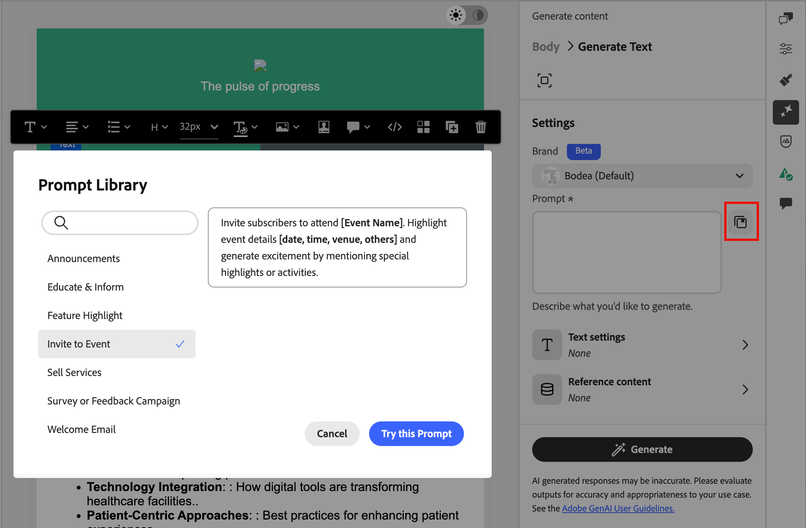
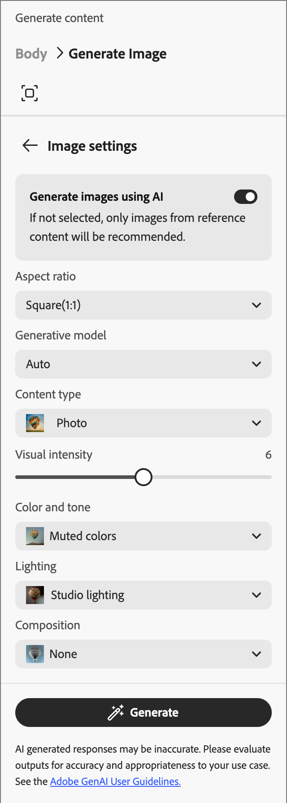
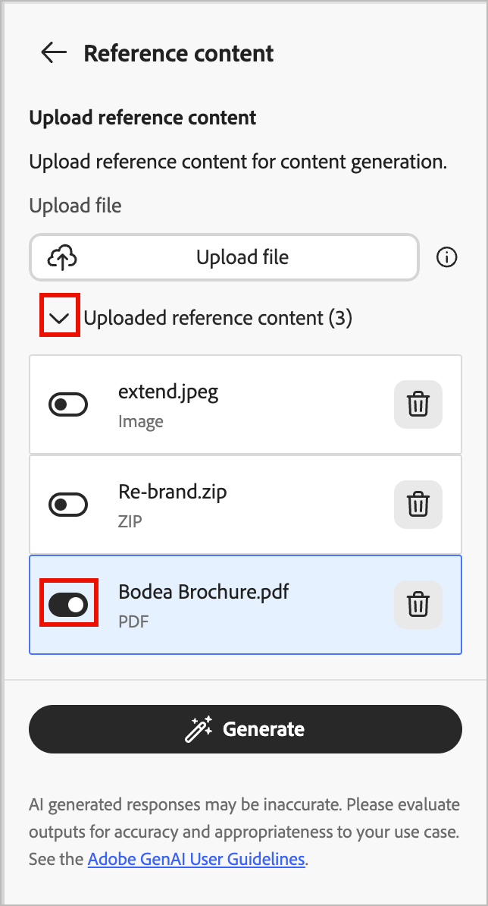
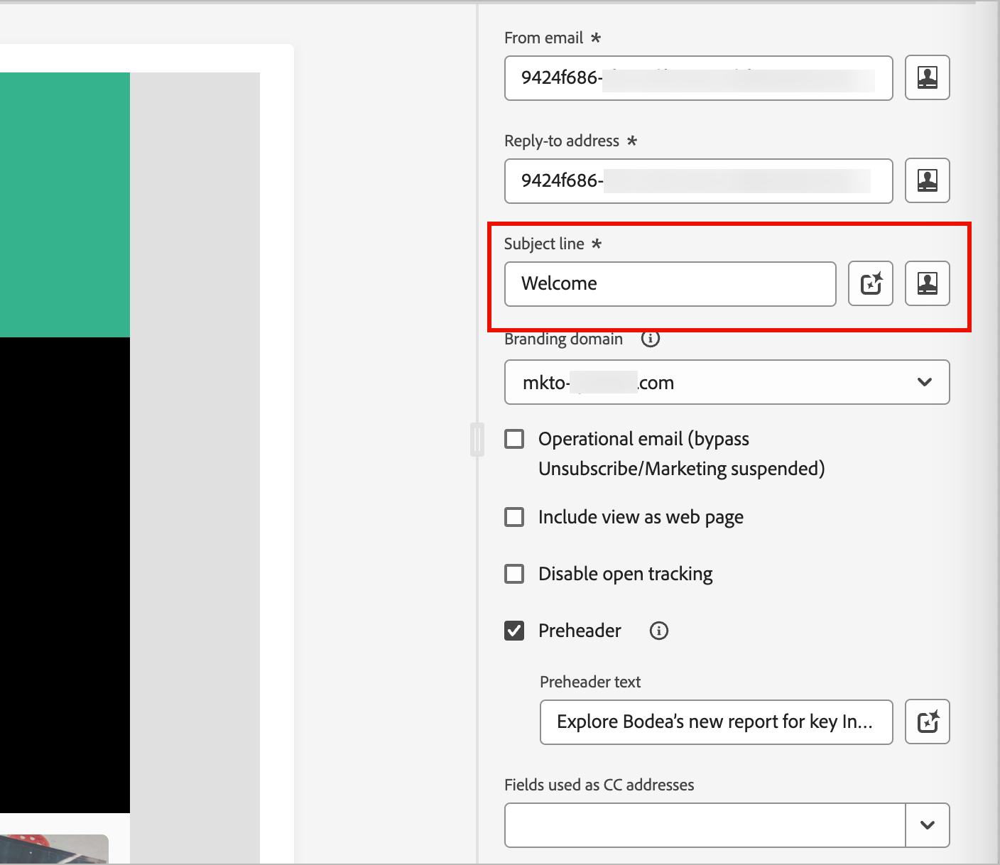
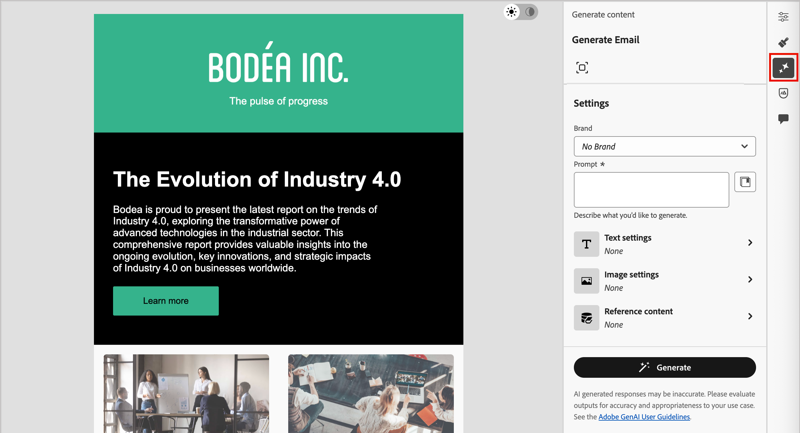
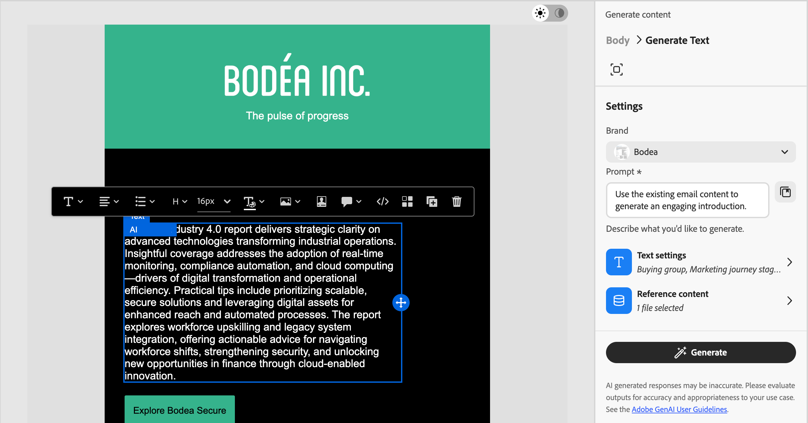
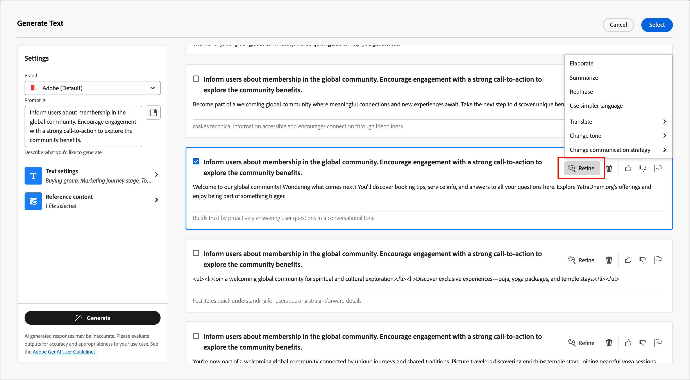

# E-Mail-Inhalt generieren

Da die Marketing-Branche wettbewerbsfähiger wird, suchen Marken nach effizienten Möglichkeiten, um wirkungsvolle Inhalte zu generieren. [!DNL Adobe Journey Optimizer B2B Edition] umfasst eine KI-gestützte Inhaltserstellung, mit der Marketing-Experten professionelle, markenkonsistente E-Mail-Inhalte erstellen können. Mit fortschrittlichen generativen KI-Modellen und einem tiefen Verständnis der Markenrichtlinien generiert er automatisch personalisierte, ansprechende und effektive Inhalte. Es verwendet Ihr Marketing-Ziel und optimiert den Inhalt für Markenstile, Layouts, Ton und mehr. Die Verwendung dieser Tools macht die Erstellung und Ausführung von E-Mail-Marketing-Kampagnen intuitiv, einfach und effizient. Durch das Hinzufügen dieser Funktion zu Ihren Workflows können Sie Zeit sparen, die Effizienz verbessern und bessere Ergebnisse erzielen.

Diese neue Funktion bietet eine sofortige Inhaltsgenerierung für die vollständige oder zielgerichtete E-Mail-Generierung in E-Mail-Strukturkomponenten. Für Bilder können Sie neue Bild-Assets generieren oder Empfehlungen aus dem Bildkatalog im Eingabe-Marken-Asset generieren. Mit dieser Funktion können Sie auch optimale Betreffzeilen und Preheader generieren, um die Öffnungsrate der E-Mail zu beeinflussen.

>[!PREREQUISITES]
>
>Um auf diese Funktionen in Adobe Journey Optimizer B2B edition zuzugreifen, benötigen Sie die Berechtigung _[!UICONTROL KI-Assistent]_ > _[!UICONTROL Inhalt generieren]_. Weitere Informationen dazu, wie ein Produktadministrator Funktionsberechtigungen erteilen kann, finden Sie unter [Rollen für Produktberechtigungen bearbeiten](../admin/user-management.md#edit-roles-for-product-permissions).

## Richtlinien und Einschränkungen

Bevor Sie mit der Verwendung dieser Funktion beginnen, lesen Sie die [Richtlinien und Einschränkungen](./generative-ai-content.md#general-guidelines-and-limitations). [Benutzerzustimmung](https://www.adobe.com/de/legal/licenses-terms/adobe-gen-ai-user-guidelines.html){target="_blank"} ist auch eine Akzeptanz erforderlich, bevor Sie KI-Funktionen in [!DNL Journey Optimizer B2B Edition] verwenden können. Weitere Informationen erhalten Sie beim Adobe-Support.

Adobe wendet [Inhaltsanmeldeinformationen](https://helpx.adobe.com/firefly/web/get-started/learn-the-basics/content-credentials-overview.html){target="_blank"} beim Herunterladen oder Exportieren auf Firefly-generierte Assets an, um die Transparenz zu erhöhen.

Die folgenden Einschränkungen und Richtlinien gelten für die Erstellung von E-Mail-Inhalten in [!DNL Journey Optimizer B2B Edition]:

* Englisch ist die einzige unterstützte Sprache.
* Der generierte Inhalt ist möglicherweise nicht korrekt. Geben Sie Ihr Feedback, damit Adobe-Techniker die Modelle verfeinern können.
* Sie können mehrere Inhaltsreferenz-Assets hochladen, aber nur eines für eine bestimmte Generation nutzen.
* Verwenden Sie eine markenspezifische oder benutzerdefinierte Vorlage zum Generieren von Inhalten für eine vollständige E-Mail. E-Mail-Vorlagen mit bis zu 8-10 Bildern werden empfohlen.
* Achten Sie bei der Auswahl generierter Varianten darauf, problematische Ausgaben mit den Symbolen „Daumen hoch“, „Daumen runter“ oder „Flag“ zu melden.

## Eingabe und Einstellungen für die Inhaltserstellung

Sie können den vollständigen Inhalt für eine E-Mail oder für ausgewählte Komponenten in der E-Mail generieren. Wenn Sie die Tools zur Inhaltserstellung verwenden, geben Sie Eingabeaufforderungen, Referenzinhalte und Einstellungen für Text und Bilder an.

### Prompts

Verwenden Sie klar definierte Eingabeaufforderungen für das generative KI-Modell, um die Interpretation präzise durchzuführen. Das von Ihnen angegebene Marketing-Ziel/die von Ihnen angegebene Eingabeaufforderung wirkt sich auf die Qualität des generierten Inhalts aus.

{width="320"}

Weitere Informationen zum Erstellen effektiver Eingabeaufforderungen finden Sie unter _[Best Practices für Eingabeaufforderungen](./generative-ai-content.md#generative-ai-prompting-guide)_.

>[!BEGINSHADEBOX]

#### Bibliothek der Eingabeaufforderung

Eine effektive Eingabeaufforderung ist für die Erstellung des bestmöglichen Inhalts unerlässlich. Wenn Sie Hilfe bei der Erstellung Ihrer Eingabeaufforderung benötigen, klicken Sie auf das Symbol _Bibliothek auffordern_ , um auf eine Bibliothek mit Eingabeaufforderungsideen zuzugreifen, die nach Zielen organisiert sind. Geben Sie Text in das Suchfeld ein, um eine Eingabeaufforderung basierend auf einer Keyword-Zeichenfolge zu finden.

{width="600" zoomable="no"}

Wählen Sie die Eingabeaufforderung aus, die Ihren Zielen am besten entspricht, und klicken Sie auf **[!UICONTROL Diese Eingabeaufforderung ausprobieren]**. Ersetzen Sie im _[!UICONTROL Eingabeaufforderung]_ die Platzhalter (z. B. `[Key Feature/Information]`) durch Ihre Marken-, Angebots-, Kampagnen- und Anwendungsfalldetails.

>[!ENDSHADEBOX]

### Texteinstellungen

Erweitern Sie die **[!UICONTROL Texteinstellungen]** im rechten Bereich und legen Sie die Optionen für den generierten Text fest.

* **[!UICONTROL Einkaufsgruppe]** - Wählen Sie die [Einkaufsgruppenrolle](../buying-groups/buying-groups-role-templates.md) aus, die für das Targeting Ihrer Nachrichten verwendet werden soll. [!DNL Journey Optimizer B2B Edition] bietet fünf vorkonfigurierte Standard-B2B-Einkaufsgruppenrollen. Jede Einkaufsgruppenrolle hat einen eigenen Messaging-Fokus:

  | Rolle | Messaging-Fokus |
  | ---- | --------------- |
  | Lenkungsausschuss | Produktinformationen  Preise  Details zur technischen Integration  Produktfunktionen und -funktionen |
  | Influencer | Qualitätsnachweis (  Implementierung  Fachwissen  Wettbewerbsvorteile |
  | Entscheidungsträger | Return on Investment  Financial Value (ROI)  Kundengeschichten |
  | Praktizierende | Benutzerfreundlichkeit  Produktfunktionen und -funktionalität  Produktkompatibilität  Einfache Produktintegration |
  | Champion | Bildungsinhalte  Vordenkerinhalte (Kundengeschichten  |

* **[!UICONTROL Marketing-Journey]**-Schritt: Wählen Sie den [Gruppen-](../buying-groups/buying-group-stages.md)) aus, der für das Targeting der Nachricht verwendet werden soll.
* **[!UICONTROL Kommunikationsstrategie]** - Wählen Sie den am besten geeigneten Kommunikationsstil für Ihren generierten Text.
* **[!UICONTROL Language]** - Wählen Sie die Sprache Ihrer generierten Inhalte aus.
* **[!UICONTROL Tone]** - Der Ton, der bei Ihrer Zielgruppe Anklang findet. Sie können die Nachricht zum Beispiel so anpassen, dass sie informativ, verspielt oder überzeugend klingt.

{width="350" zoomable="yes"}

Klicken Sie auf den Pfeil nach links, um zur Hauptseite (_[!UICONTROL )]_.

### Bildeinstellungen

Um Bilder in Ihren generierten Inhalt aufzunehmen, erweitern Sie **[!UICONTROL Bereich „Bildeinstellungen]** und legen Sie die Optionen fest.

Das System deaktiviert standardmäßig die Option **[!UICONTROL Generieren von Bildern mithilfe]** KI . Aktivieren Sie diese Funktion und legen Sie die folgenden Optionen fest, um generierte Bilder in die vorgeschlagenen Inhaltsvarianten aufzunehmen:

* **[!UICONTROL Generatives Modell]**: Wählen Sie aus dem einsatzbereiten, von Adobe bereitgestellten Modell, dem Partnermodell für spezielle Funktionen oder konfigurierten benutzerdefinierten Modellen, die für Ihre Marken-Assets trainiert wurden. Weitere Informationen zu generativen Modellen finden Sie unter _[Generative KI-Modelle für die Markenausrichtung](generative-ai-models.md)_.
* **[!UICONTROL Seitenverhältnis]**: Wenn eine Bildkomponente ausgewählt wird, bestimmt diese Einstellung die Breite und Höhe des Assets. Wählen Sie aus gängigen Verhältnissen wie 16:9, 4:3, 3:2 oder 1:1 oder geben Sie ein benutzerdefiniertes Verhältnis ein.
* **[!UICONTROL Inhaltstyp]**: Der Typ kategorisiert die Art des visuellen Elements, wobei zwischen verschiedenen Formen visueller Darstellung wie Fotos, Grafiken oder Kunst unterschieden wird.
* **[!UICONTROL Visuelle Intensität]**: Kontrollieren Sie die Wirkung des Bildes, indem Sie seine Intensität anpassen. Eine niedrigere Einstellung (z. B. 2) erzeugt ein weicheres, zurückhaltenderes Erscheinungsbild, während eine höhere Einstellung (z. B. 10) das Bild lebendiger und visuell leistungsfähiger macht.
* **[!UICONTROL Farbe und Ton]**: Das Gesamtbild der Farben innerhalb eines Bildes und die Stimmung oder Atmosphäre, die es vermittelt.
* **[!UICONTROL Beleuchtung]**: Der für das Bild verwendete Beleuchtungsstil, der seine Atmosphäre formt und bestimmte Elemente hervorhebt.
* **[!UICONTROL Komposition]**: Die Anordnung der Elemente innerhalb des Rahmens eines Bildes.

{width="350" zoomable="yes"}

Klicken Sie auf den Pfeil nach links, um zur Hauptseite (_[!UICONTROL )]_.

### Referenzinhalt

Laden Sie Referenz-Content-Assets hoch, um genaue, markeninterne Inhalte zu generieren. Andernfalls basiert der generierte Inhalt auf öffentlich verfügbaren Informationen. Referenzinhalte dienen als Quelle für die Inhaltserstellung und Bildempfehlungen. Richtlinien und Best Practices finden Sie unter _[Optimierte Referenzinhalte](./generative-ai-content.md#reference-content)_.

Klicken Sie in den **[!UICONTROL Referenzinhalt]** auf **[!UICONTROL Datei hochladen]**, um jedes Asset hinzuzufügen, das Inhalte enthält, die Sie für zusätzlichen Kontext verwenden möchten.

{width="350" zoomable="yes"}

Die hochzuladende Datei kann die folgenden Formate aufweisen: PDF-, JPEG-, PNG- oder ZIP-Dateien (mit unterstützten Dateiformaten). Die maximale Größe für ein hochgeladenes Marken-Asset beträgt 50 MB. Größere Dateien oder eine große Anzahl von Bildern können funktionieren, aber das erhöht die Verarbeitungszeit.

Wenn Sie eine zuvor hochgeladene Datei auswählen möchten, erweitern Sie die Liste **[!UICONTROL Hochgeladener Referenzinhalt]** und aktivieren Sie das Asset, das Sie für die Inhaltserstellung verwenden möchten.

{width="350" zoomable="yes"}

## E-Mail-Eigenschaften generieren

Wenn Sie [ Konto-Journey ](./add-email.md#add-an-email-action-node-in-a-journey)Aktion „E-Mail hinzufügen“ hinzufügen, definieren Sie eine Reihe von E-Mail-Eigenschaften, die zum Senden der E-Mail verwendet werden. Die Tools für generative KI können dazu beitragen, die E-Mail-Interaktion zu verbessern, indem empfohlene Inhalte für die E-Mail **_Betreffzeile_** und **_preheader)_**.

Wenn Sie eine E-Mail von einer Journey erstellen oder eine bestehende E-Mail von einem Journey-Knoten aus öffnen, wird die E-Mail-Vorschauseite mit den _[!UICONTROL E-Mail-Eigenschaften]_ auf der rechten Seite angezeigt. Auf der Registerkarte _[!UICONTROL Zusammenfassung]_ können Sie die Tools zur Inhaltserstellung verwenden, um eine Betreffzeile, einen Preheader oder beides zu generieren.

>[!BEGINTABS]

>[!TAB Erzeugung der Betreffzeile]

Die folgenden Schritte beschreiben die Aufgabensequenz zum Generieren einer optimierten Betreffzeile für Ihre E-Mail:

1. Scrollen _im Bedienfeld_ Zusammenfassung“ mit der ausgewählten Registerkarte _Details_ nach unten zum Feld **[!UICONTROL Betreffzeile]**.

1. Klicken Sie auf _Symbol_ Inhalt generieren{width="30"}Inhaltszugriff generieren) rechts neben dem Feld.

   {width="600" zoomable="yes"}

   Der _[!UICONTROL Betreffzeile generieren]_ wird mit den Generierungseinstellungen für die E-Mail-Betreffzeile geöffnet.

1. (Erforderlich) Geben Sie im **[!UICONTROL Eingabeaufforderung]** eine Beschreibung dessen ein, was Sie generieren möchten.

   Verwenden Sie die [Eingabeaufforderungsbibliothek](#prompt-library), wenn Sie Hilfe bei der Erstellung einer effektiven Eingabeaufforderung benötigen.

1. (Optional) Um zusätzliche Eingaben zum Generieren des Preheaders bereitzustellen, vervollständigen Sie die Einstellungen für die Inhaltsanleitung:

   * [**[!UICONTROL Texteinstellungen]**](#text-settings) - Anleitung für den generierten Textinhalt.
   * [**[!UICONTROL Referenzinhalt]**](#reference-content) - Stellen Sie das Inhalts-Asset bereit, das als Quelle für die Inhaltserstellung dient.

1. Wenn Ihre Eingabeaufforderung und die Einstellungen fertig sind, klicken Sie auf **[!UICONTROL Generieren]**.

   Die generierten Varianten werden im Dialogfeld angezeigt.

   {width="600" zoomable="yes"}

1. Scrollen Sie im _Inhalt generieren_ und durchsuchen Sie die generierten Varianten, um zu bestimmen, welche am besten geeignet ist.

   Sie können [Feedback senden](#submit-variation-feedback) für eine generierte Variante, indem Sie auf das Symbol _Daumen hoch_, _Daumen runter_ oder _Flag_ klicken und den Grund auswählen, der Ihr Feedback am besten zusammenfasst.

1. Klicken Sie auf die **[!UICONTROL Verfeinern]**, um auf zusätzliche Anpassungsfunktionen zuzugreifen:

   * **[!UICONTROL Umformulieren]** - Die Nachricht wird neu geschrieben, wobei ihre Bedeutung erhalten bleibt. Mit dieser Option können Sie alternative Formulierungen erstellen oder Formulierungen anpassen, ohne die Kernbotschaft zu ändern.

   * **[!UICONTROL Einfachere Sprache verwenden]** - Vereinfachen Sie die Sprache, indem Sie für ein breiteres Publikum Klarheit und Barrierefreiheit gewährleisten.

   * **[!UICONTROL Übersetzen]** - Übersetzen Sie den Text in eine andere Sprache. (Derzeit wird nur Englisch unterstützt. Weitere Sprachen sind für künftige Versionen geplant.)

   * **[!UICONTROL Ton ändern]** - Passen Sie den Ton der Nachricht an Ihren Kommunikationsstil an, z. B. freundlicher, professioneller, dringender oder inspirierender.

   * **[!UICONTROL Kommunikationsstrategie ändern]** - Ändern Sie den Messaging-Ansatz entsprechend Ihren Zielen, z. B. um Dringlichkeit zu schaffen oder um überzeugende Attraktivität hervorzuheben.

   {width="600" zoomable="yes"}

1. Klicken Sie **[!UICONTROL Auswählen]**, um den Betreffzeilentext durch die ausgewählte Variante zu ersetzen und zu den E-Mail-Eigenschaften zurückzukehren.

>[!TAB Preheader-Generierung]

Ein E-Mail-Preheader ist der kurze Zusammenfassungstext, der auf die Betreffzeile folgt, wenn eine E-Mail im Posteingang angezeigt wird. Dies ist ein optionales Element für eine E-Mail, aber eine effektive Möglichkeit, die Interaktion zu verbessern. Die folgenden Schritte beschreiben die Aufgabensequenz zum Generieren eines optimierten Preheaders für Ihre E-Mail:

1. Scrollen Sie im Bedienfeld _Zusammenfassung_ mit der ausgewählten Registerkarte _Details_ nach unten und aktivieren Sie das Kontrollkästchen **[!UICONTROL Preheader]**.

   {width="600" zoomable="yes"}

   Das _[!UICONTROL Preheader generieren]_ wird mit den Generierungseinstellungen für den E-Mail-Preheader geöffnet.

1. (Erforderlich) Geben Sie im **[!UICONTROL Eingabeaufforderung]** eine Beschreibung dessen ein, was Sie generieren möchten.

   Verwenden Sie die [Eingabeaufforderungsbibliothek](#prompt-library), wenn Sie Hilfe bei der Erstellung einer effektiven Eingabeaufforderung benötigen.

1. (Optional) Um zusätzliche Eingaben zum Generieren des Preheaders bereitzustellen, vervollständigen Sie die Einstellungen für die Inhaltsanleitung:

   * [**[!UICONTROL Texteinstellungen]**](#text-settings) - Anleitung für den generierten Textinhalt.
   * [**[!UICONTROL Referenzinhalt]**](#reference-content) - Stellen Sie das Inhalts-Asset bereit, das als Quelle für die Inhaltserstellung dient.

1. Wenn Ihre Eingabeaufforderung und die Einstellungen fertig sind, klicken Sie auf **[!UICONTROL Generieren]**.

   Die generierten Varianten werden im Dialogfeld angezeigt.

   {width="600" zoomable="yes"}

1. Scrollen Sie im Bedienfeld _Inhalt generieren_ nach unten und durchsuchen Sie die generierten Varianten, um zu bestimmen, welche am besten geeignet ist.

   Sie können [Feedback senden](#submit-variation-feedback) für eine generierte Variante, indem Sie auf das Symbol _Daumen hoch_, _Daumen runter_ oder _Flag_ klicken und den Grund auswählen, der Ihr Feedback am besten zusammenfasst.

1. Klicken Sie auf die **[!UICONTROL Verfeinern]**, um auf zusätzliche Anpassungsfunktionen zuzugreifen:

   * **[!UICONTROL Umformulieren]** - Die Nachricht wird neu geschrieben, wobei ihre Bedeutung erhalten bleibt. Mit dieser Option können Sie alternative Formulierungen erstellen oder Formulierungen anpassen, ohne die Kernbotschaft zu ändern.

   * **[!UICONTROL Einfachere Sprache verwenden]** - Vereinfachen Sie die Sprache, indem Sie für ein breiteres Publikum Klarheit und Barrierefreiheit gewährleisten.

   * **[!UICONTROL Übersetzen]** - Übersetzen Sie den Text in eine andere Sprache. (Derzeit wird nur Englisch unterstützt. Weitere Sprachen sind für künftige Versionen geplant.)

   * **[!UICONTROL Ton ändern]** - Passen Sie den Ton der Nachricht an Ihren Kommunikationsstil an, z. B. freundlicher, professioneller, dringender oder inspirierender.

   * **[!UICONTROL Kommunikationsstrategie ändern]** - Ändern Sie den Messaging-Ansatz basierend auf Ihren Zielen, z. B. der Schaffung von Dringlichkeit oder der Betonung aufregender Attraktivität.

   {width="500" zoomable="yes"}

1. Klicken Sie **[!UICONTROL Auswählen]**, um den Preheader durch die ausgewählte Variante zu ersetzen und zu den E-Mail-Eigenschaften zurückzukehren.

>[!ENDTABS]

## Generieren von E-Mail-Textinhalten {#generative-ai-email-design}

Nachdem Sie [E-Mail erstellt und personalisiert haben](./email-authoring.md) verwenden Sie die generativen KI-Tools von Adobe, um den Inhalt Ihres E-Mail-Textkörpers zu verbessern.

Im Bereich des E-Mail-Designs können Sie mit KI-Tools die Wirkung Ihrer Sendungen optimieren, indem Sie den vollständigen E-Mail-Textkörper, zielgerichtete Textinhalte und Bilder generieren, die bei Ihrer Audience Anklang finden. Diese Optimierung Ihrer E-Mail-Kampagnen sorgt für eine bessere Interaktion. Wählen Sie _Inhalt generieren_ aus ({width="25" zoomable="no"} ), um die Inhaltsgenerierungs-Tools anzuzeigen, die für die aktuelle Inhaltsauswahl verfügbar sind.

{width="600" zoomable="yes"}

Führen Sie die folgenden Schritte entsprechend dem Typ der E-Mail-Inhaltserstellung aus, den Sie verwenden möchten:

>[!BEGINTABS]

>[!TAB Vollständige E-Mail-Generierung]

Gehen Sie wie folgt vor, um eine vollständige E-Mail zu generieren, indem Sie eine vorhandene E-Mail-Vorlage verfeinern:

1. Klicken [ nach dem Erstellen der E](./add-email.md)Mail auf **[!UICONTROL E-Mail-Inhalt bearbeiten]**.

1. Wählen Sie eine Vorlage.

   Die vollständige Inhaltserstellung erfordert eine Vorlage. Dabei kann es sich um eine von Adobe bereitgestellte Standardvorlage oder um eine gespeicherte Vorlage handeln. Sie können auch die Option _[!UICONTROL HTML importieren]_ zum Importieren einer Vorlage verwenden.

   Weitere Informationen zur Verwendung einer E-Mail-Vorlage finden Sie unter _[Auswählen einer Vorlage](./email-authoring.md#select-a-template)_.

1. Klicken Sie im E-Mail-Design auf das Symbol _Inhalt generieren_ ({width="25"} generieren) auf der rechten Seite.

   Die Einstellungen auf der rechten Seite spiegeln &quot;_generieren_ wider.

   {width="600" zoomable="yes"}

1. Wählen Sie Ihre **[!UICONTROL Marke]** aus, um sicherzustellen, dass die von KI generierten Inhalte mit Ihren Markenspezifikationen übereinstimmen.

   Wenn keine veröffentlichten Marken vorhanden sind, klicken Sie auf **[!UICONTROL Marke erstellen]**, um Ihre [wiederverwendbaren Markenrichtlinien“ ](./brands-overview.md) definieren.

1. Geben **[!UICONTROL im Feld &quot;]**&quot; eine Beschreibung dessen ein, was generiert werden soll.

   Verwenden Sie die [Eingabeaufforderungsbibliothek](#prompt-library), wenn Sie Hilfe bei der Erstellung einer effektiven Eingabeaufforderung benötigen.

   >[!TIP]
   >
   >Wenn Sie mit der Einholung von generierten Inhalten noch nicht vertraut sind, lesen Sie den Abschnitt _[Best Practices zur Einholung von](./generative-ai-content.md#generative-ai-prompting-guide)_&quot;.

1. Um den generierten Inhalt anzupassen, füllen Sie die Einstellungen für Inhaltsanleitungen aus:

   * [**[!UICONTROL Texteinstellungen]**](#text-settings) - Anleitung für den generierten Textinhalt.
   * [**[!UICONTROL Bildeinstellungen]**](#image-settings) - Wenn Sie Bilder in den generierten Inhalt aufnehmen möchten, aktivieren Sie die Bildgenerierung und geben Sie eine Anleitung an.
   * [**[!UICONTROL Referenzinhalt]**](#reference-content) - Stellen Sie das Inhalts-Asset bereit, das als Quelle für die Inhaltserstellung dient.

1. Wenn Ihre Eingabeaufforderung und die Einstellungen fertig sind, klicken Sie auf **[!UICONTROL Generieren]**.

   Die generierten Varianten werden im rechten Bereich angezeigt.

1. Durchsuchen Sie die generierten Varianten oder klicken Sie auf das Symbol _Vollbild_ (  ), um das Dialogfeld _[!UICONTROL E-Mail]_) zu öffnen.

   Das Dialogfeld bietet zusätzlichen Platz zum Vergleichen der Varianten, Anpassen der Einstellungen für Text und Referenzinhalte (falls erforderlich) und Neugenerieren der Varianten.

   Sie können eine Variante auch optimieren, indem Sie Verfeinerungsaktionen anwenden und Feedback für die generierten Varianten senden. Weitere Informationen _[Verfeinerung von Varianten und Feedback finden](#refine-finalize)_ unter „Vorschau und Inhaltsverfeinerung“.

   {width="700" zoomable="yes"}

1. Klicken Sie **[!UICONTROL Auswählen]**, um den Vorlageninhalt durch die ausgewählte Variante zu ersetzen und zum E-Mail-Design zurückzukehren.

   Sie können die Bearbeitungs- und Formatierungswerkzeuge auf der Arbeitsfläche verwenden, um den generierten Inhalt sowie die Optionen _[!UICONTROL Einstellungen]_ und _[!UICONTROL Stil]_ auf der rechten Seite zu ändern.

>[!TAB Nur Text]

Gehen Sie wie folgt vor, um den Textinhalt für eine vorhandene E-Mail zu verfeinern oder zu verbessern:

1. Wählen Sie im E-Mail-Design-Bereich eine _Text_-Komponente aus, um den spezifischen Inhalt anzusprechen.

1. Klicken Sie in der äußeren Leiste des rechten Bedienfelds auf das Symbol _Inhalt generieren_ ({width="25"}).

   Die Einstellungen auf der rechten Seite spiegeln die Einstellungen zur Inhaltserstellung für die Textkomponente wider.

1. Wählen Sie Ihre **[!UICONTROL Marke]** aus, um sicherzustellen, dass die von KI generierten Inhalte mit Ihren Markenspezifikationen übereinstimmen.

   Wenn keine veröffentlichten Marken vorhanden sind, klicken Sie auf **[!UICONTROL Marke erstellen]**, um [Ihre wiederverwendbaren Markenrichtlinien zu definieren](./brands-overview.md).

1. Geben **[!UICONTROL im Feld &quot;]**&quot; eine Beschreibung dessen ein, was generiert werden soll.

   {width="600" zoomable="yes"}

   Verwenden Sie die [Eingabeaufforderungsbibliothek](#prompt-library), wenn Sie Hilfe bei der Erstellung einer effektiven Eingabeaufforderung benötigen.

1. Um den generierten Inhalt anzupassen, füllen Sie die Einstellungen für Inhaltsanleitungen aus:

   * [**[!UICONTROL Texteinstellungen]**](#text-settings) - Anleitung für den generierten Textinhalt.

   * [**[!UICONTROL Referenzinhalt]**](#reference-content) - Bereitstellung der Inhalts-Assets, die als Quelle für die Inhaltserstellung dienen.

1. Wenn Ihre Eingabeaufforderung und die Einstellungen fertig sind, klicken Sie auf **[!UICONTROL Generieren]**.

1. Durchsuchen Sie die generierten Varianten oder klicken Sie auf das Symbol _Vollbild_ (  ), um das Dialogfeld _[!UICONTROL Text generieren]_ zu öffnen.

   Das Dialogfeld bietet zusätzlichen Platz zum Vergleichen der Varianten, Anpassen der Einstellungen für Text und Referenzinhalt (falls erforderlich) und zum Neugenerieren der Varianten.

   Sie können eine Variante auch optimieren, indem Sie Verfeinerungsaktionen anwenden und Feedback für die generierten Varianten senden. Weitere Informationen _[Verfeinerung von Varianten und Feedback finden](#preview-and-refine-the-content)_ unter „Vorschau und Inhaltsverfeinerung“.

   {width="700" zoomable="yes"}

1. Wenn Sie den gewünschten Inhalt haben, klicken Sie auf **[!UICONTROL Auswählen]**, um den Text durch die ausgewählte Variante zu ersetzen und zum E-Mail-Design zurückzukehren.

   Sie können die Bearbeitungs- und Formatierungswerkzeuge auf der Arbeitsfläche verwenden, um den Text sowie die Optionen _[!UICONTROL Einstellungen]_ und _[!UICONTROL Stil]_ auf der rechten Seite zu ändern.

>[!TAB Nur Bild]

Gehen Sie wie folgt vor, um den Bildinhalt für eine vorhandene E-Mail zu verfeinern oder zu verbessern:

1. Wählen Sie im Bereich „E-Mail-Design“ eine Komponente _Bild_ aus, um auf den spezifischen Inhalt zuzugreifen.

1. Klicken Sie in der äußeren Leiste des rechten Bedienfelds auf das Symbol _Inhalt generieren_ ({width="25"}).

   Die Einstellungen auf der rechten Seite spiegeln die Erzeugungseinstellungen für die Bildkomponente wider.

1. Wählen Sie Ihre **[!UICONTROL Marke]** aus, um sicherzustellen, dass die von KI generierten Inhalte mit Ihren Markenspezifikationen übereinstimmen.

   Wenn keine veröffentlichten Marken vorhanden sind, klicken Sie auf **[!UICONTROL Marke erstellen]**, um [Ihre wiederverwendbaren Markenrichtlinien zu definieren](./brands-overview.md).

1. Geben Sie im Feld „Eingabeaufforderung“ eine Beschreibung **[!UICONTROL gewünschten]** ein.

   {width="600" zoomable="yes"}

   Verwenden Sie die [Eingabeaufforderungsbibliothek](#prompt-library), wenn Sie Hilfe bei der Erstellung einer effektiven Eingabeaufforderung benötigen.

1. Um den generierten Inhalt anzupassen, füllen Sie die Einstellungen für Inhaltsanleitungen aus:

   * [**[!UICONTROL Bildeinstellungen]**](#image-settings) - Wenn Sie Bilder in den generierten Inhalt aufnehmen möchten, aktivieren Sie die Bildgenerierung und verwenden Sie die Einstellungen für die Anleitung.

   * [**[!UICONTROL Referenzinhalt]**](#reference-content) - Bereitstellung der Inhalts-Assets, die als Quelle für die Inhaltserstellung dienen.

1. Wenn Sie mit Ihrer Eingabeaufforderung und den Einstellungen zufrieden sind, klicken Sie auf **[!UICONTROL Generieren]**.

   Das System verarbeitet die Anfrage und generiert basierend auf der Eingabeaufforderung und anderen Eingaben die am besten geeigneten Bilder.

   >[!IMPORTANT]
   >
   >Wenn der Referenzinhalt keine Bilder enthält oder für die Eingabeaufforderung keine Bilder relevant sind, ist die Ausgabe leer.

1. Durchsuchen Sie die generierten Varianten oder klicken Sie auf das Symbol _Vollbild_ (  ), um das Dialogfeld _[!UICONTROL Bild generieren]_ zu öffnen.

   Das Dialogfeld bietet zusätzlichen Platz zum Vergleichen der Varianten, Anpassen der Einstellungen für Bilder und Referenzinhalte (falls erforderlich) und Neugenerieren der Varianten.

   Sie können eine Variante auswählen und auf **[!UICONTROL Ähnlich generieren]** klicken, um zusätzliche Bilder zu generieren, die der ausgewählten Variante ähnlich sind. Oder klicken Sie auf **[!UICONTROL In Adobe Express bearbeiten]**, um Ihre eigenen Änderungen am Bild vorzunehmen. Weitere [ zur Verwendung von Adobe Express zum Verfeinern ](./image-edit-adobe-express.md#quick-actions-in-adobe-express) Bildern finden Sie unter „Schnellaktionen in Adobe Express&quot;.

   {width="700" zoomable="yes"}

   Sie können auch [Feedback senden](#submit-variation-feedback) für die generierten Varianten einreichen.

1. Markieren Sie das gewünschte Bild und klicken Sie auf **[!UICONTROL Auswählen]**, um das Bild oder den Platzhalter durch das ausgewählte Element zu ersetzen und zum E-Mail-Design zurückzukehren.

   Sie können die Bearbeitungs- und Formatierungswerkzeuge auf der Arbeitsfläche verwenden, um das Bild sowie die Optionen _[!UICONTROL Einstellungen]_ und _[!UICONTROL Stil]_ auf der rechten Seite zu ändern.

>[!ENDTABS]

## Anzeigen einer Vorschau und Verfeinern des Inhalts {#refine-finalize}

Nachdem Sie Inhaltsvarianten generiert haben, können Sie die Ergebnisse optimieren, um sicherzustellen, dass sie genau Ihren Anforderungen entsprechen. Überprüfen Sie die Markenausrichtung, passen Sie Ton und Sprache an und bereiten Sie den Inhalt für einen überprüfbaren Entwurf vor. Sie können auch Feedback für eine Variante senden, um die generativen KI-Tools zu trainieren und die zukünftige Ausgabe zu verbessern.

### Vollbildansicht öffnen

1. Navigieren Sie nach der ersten Inhaltserstellung durch die **[!UICONTROL Varianten]**.

1. Ermitteln Sie die Variante, die Ihren Zielen am besten entspricht, und klicken Sie auf das Symbol _Vollbild_ (  ), um die ausgewählte Variante detaillierter anzuzeigen.

   {width="700" zoomable="yes"}

1. Wenn Sie mit der ausgewählten Variante zufrieden sind, klicken Sie auf **[!UICONTROL Auswählen]**, um sie auf die Arbeitsfläche anzuwenden.

### Verfeinern einer Variante

Klicken Sie auf die **[!UICONTROL Verfeinern]**, um auf zusätzliche Anpassungsfunktionen für E-Mail- und Textvarianten zuzugreifen:

* **[!UICONTROL Ausarbeiten]** - Erweitern Sie Ihre Kenntnisse zu bestimmten Themen und liefern Sie zusätzliche Details, um das Verständnis und die Interaktion zu verbessern.

* **[!UICONTROL Zusammenfassen]** - Lange Informationen können die Leser überfordern. Verwenden Sie diese Option, um die wichtigsten Punkte in klaren, knappen Zusammenfassungen zusammenzufassen, die die Aufmerksamkeit auf sich ziehen und die Leser zum weiteren Lesen ermutigen.

* **[!UICONTROL Umformulieren]** - Die Nachricht wird neu geschrieben, wobei ihre Bedeutung erhalten bleibt. Mit dieser Option können Sie alternative Formulierungen generieren, den Lesefluss verbessern oder die Ausdrucksweise anpassen, ohne die Kernbotschaft zu ändern.

* **[!UICONTROL Einfachere Sprache verwenden]** - Vereinfachen Sie die Sprache, indem Sie für ein breiteres Publikum Klarheit und Barrierefreiheit gewährleisten.

* **[!UICONTROL Übersetzen]** - Übersetzen Sie den Text in eine andere Sprache. (Derzeit wird nur Englisch unterstützt. Weitere Sprachen sind für künftige Versionen geplant.)

* **[!UICONTROL Ton ändern]** - Passen Sie den Ton der Nachricht an Ihren Kommunikationsstil an, z. B. freundlicher, professioneller, dringender oder inspirierender.

* **[!UICONTROL Kommunikationsstrategie ändern]** - Ändern Sie den Messaging-Ansatz basierend auf Ihren Zielen, z. B. der Schaffung von Dringlichkeit oder der Betonung aufregender Attraktivität.

<!-- is this option coming back? * **[!UICONTROL Use as reference content]** - Select this option to use the variant as the reference content for generating other results. -->

{width="700" zoomable="yes"}

### Feedback zu Varianten senden

Geben Sie Feedback für die generierten Varianten, indem Sie auf das Symbol _Daumen hoch_, _Daumen runter_ oder _Flag_ klicken und den Grund auswählen, der Ihr Feedback am besten zusammenfasst.

{width="700" zoomable="yes"}

### Überprüfen der Markenausrichtung (Beta)

<!-- Are we surfacing scoring here in the future, or will it be a separate post-creation task? 1. Click the percentage icon to view your **[!UICONTROL Brand Alignment Score]** and identify any misalignments with your brand. -->

Die Bewertung und Bewertung der Markenausrichtung helfen Ihnen, die Konsistenz in Ton, Messaging und visueller Identität in Ihren E-Mail-Kampagnen sicherzustellen und gleichzeitig eine Qualitätsprüfung vor der Live-Schaltung Ihres Inhalts durchzuführen. Wenn der E-Mail-Inhalt fertig ist, klicken Sie auf das Symbol _Markenausrichtung_ (  ) auf der rechten Seite, um das rechte Bedienfeld _Markenausrichtung_ im E-Mail-Design zu öffnen.

{width="600" zoomable="yes"}

Ausführliche Informationen finden Sie unter [_Bewertung der Markenausrichtung_](./content-evaluation.md#brand-alignment-score)
