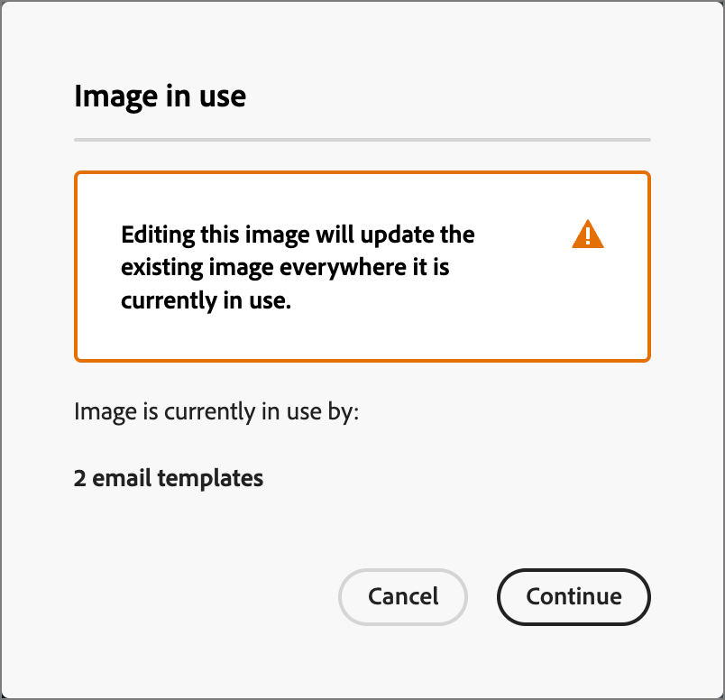

# Bearbeiten von Bildern mit Adobe Express {#edit-images-adobe-express}

>[!CONTEXTUALHELP]
>id="ajo-b2b_assets_edit_adobe_express"
>title="Bearbeiten von Bildern in Adobe Express"
>abstract="Einfache und intuitive Bildbearbeitungs-Tools, die von Adobe Express unterstützt werden, sind direkt in Adobe Journey Optimizer B2B Edition verfügbar, um die Content Velocity zu erhöhen."

Adobe Journey Optimizer B2B edition integriert sich nativ mit Adobe Express und ermöglicht Ihnen den Zugriff auf eine Reihe von Adobe Express-Tools zur Bildbearbeitung. Sie können diese Tools verwenden, um die im Arbeitsbereich von Journey Optimizer B2B edition gespeicherten Bilder für das verbundene Marketo Engage Asset-Repository zu ändern. Die Integration bietet die folgenden zentralen Vorteile:

* Erhöhte Wiederverwendung von Inhalten durch Bearbeiten und Speichern neuer Bild-Assets in Journey Optimizer B2B edition.

* Weniger Zeit und Aufwand beim Aktualisieren von Bild-Assets oder Erstellen neuer Versionen vorhandener Bild-Assets.

>[!NOTE]
>
>Berechtigungen für Adobe Express-Bearbeitungsfunktionen sind in allen Journey Optimizer B2B edition-Abonnements enthalten.

Die Adobe Express-Funktionen unterstützen PNG- und JPEG-Bilddateiformate.

_So ändern Sie ein Bild :_

1. Navigieren Sie zur linken Navigation und klicken Sie auf **[!UICONTROL Content-]** > **[!UICONTROL Assets]**.

Diese Aktion öffnet eine Listenseite mit allen aufgelisteten Assets. Der Arbeitsbereich _[!UICONTROL Journey Optimizer B2B edition]_ ist standardmäßig ausgewählt.

1. Suchen Sie das Bild, das Sie ändern oder als Original verwenden möchten, um ein neues Asset zu erstellen.

   * Um die Assets nach Arbeitsbereich und Ordner anzuzeigen, öffnen Sie die Struktur, indem Sie oben links auf _Ordner anzeigen_ klicken.

   * Um die Tabelle nach einer der Spalten zu sortieren, klicken Sie auf den Spaltentitel. Der Pfeil in der Titelzeile zeigt die aktuelle Sortierspalte und -reihenfolge an.

   * Um im ausgewählten Arbeitsbereich oder Ordner nach einem Bild-Asset zu suchen, geben Sie eine Textzeichenfolge in die Suchleiste ein.

   {width="800" zoomable="yes"}

1. Klicken Sie auf den Namen des Bild-Assets, um es zu öffnen und seine Details anzuzeigen.

   >[!TIP]
   >
   >Es empfiehlt sich, in den Bilddetails [&#x200B; Registerkarte _[!UICONTROL Verwendet von]_ auszuwählen &#x200B;](./marketo-engage-design-studio.md#view-asset-used-by-references) den Inhalt zu überprüfen, in dem das Bild derzeit verwendet wird, bevor Sie mit den Änderungen an der Bilddatei fortfahren.

1. Klicken Sie in _[!UICONTROL Abbildung]_ auf der rechten Seite auf **[!UICONTROL Mit Adobe Express bearbeiten]**.

   {width="600" zoomable="yes"}

   Wenn das Bild verwendet wird, werden Sie in einem Warndialogfeld darüber informiert, dass sich Ihre Änderungen auf diesen Inhalt auswirken. Klicken Sie **[!UICONTROL Fortfahren]**, um zum Adobe Express-Editor zu gelangen.

   {width="300"}

## Adobe Express Enterprise-Lizenz

Wenn Sie über eine Enterprise-Lizenz für Adobe Express verfügen, können Sie auf den Express-Editor zugreifen und ihn verwenden. Zu diesen Bearbeitungsfunktionen gehören Vorgänge zur Bildanpassung, wie z. B. Farbe, Helligkeit, Schärfe, Kontraste und Zuschneiden. Dazu gehören auch _KI-Magie_-Vorgänge wie das Entfernen von Hintergründen, das Einfügen und Entfernen von Objekten und das Löschen von Teilen des Bildes.

>[!NOTE]
>
>Ihre Adobe Express Enterprise-Lizenz muss unter derselben IMS-Organisation erworben werden, um auf diese vollständigen Editor-Funktionen von Journey Optimizer B2B edition zugreifen zu können. Als einzelnes Mitglied der IMS-Organisation benötigen Sie eine zugewiesene Lizenz in der Adobe Express-Instanz. Andernfalls ist der Zugriff auf Adobe Express auf die [Schnellaktionen auf Adobe Express](#quick-actions-in-adobe-express) in Journey Optimizer B2B edition beschränkt.

{width="600" zoomable="yes"}

Das [Adobe Express-Benutzerhandbuch](https://helpx.adobe.com/de/express/web.html){target="_blank"} enthält detaillierte Informationen zu den verfügbaren Bearbeitungsfunktionen.

## Schnellaktionen in Adobe Express

Wenn Sie keine Adobe Express Enterprise-Lizenz haben, haben Sie Zugriff auf den Adobe Express-Schnellaktionseditor.

1. Wählen Sie im Adobe Express-Schnellaktionseditor eine der Bildänderungsfunktionen aus, um das Bild zu ändern.

   * [**[!UICONTROL Bildgröße ändern]**](#resize-image)
   * [**[!UICONTROL Hintergrund entfernen]**](#remove-background)
   * [**[!UICONTROL Bild zuschneiden]**](#crop-image)
   * [**[!UICONTROL In PNG konvertieren]**](#convert-file-format) (wenn ein JPEG-Bild geladen wird)
   * [**[!UICONTROL In JPEG konvertieren]**](#convert-file-format) (wenn ein PNG-Bild geladen wird)

   {width="600" zoomable="yes"}

1. Wenn Sie zum Adobe Express-Schnellaktionseditor zurückkehren, klicken Sie auf **[!UICONTROL Speichern]**, um die geänderte Bilddatei im Journey Optimizer B2B edition Asset-Arbeitsbereich unter Verwendung desselben Dateinamens zu speichern.

## Bildgröße ändern

1. Verwenden Sie die Größeneinstellungen, um das Bild zu verkleinern oder zu erweitern:

   * Wählen Sie **[!UICONTROL Option „Seitenverhältnis]** aus. Verwenden Sie eine Standardgröße für digitale Inhalte oder wählen Sie **[!UICONTROL Benutzerdefiniert]**, wenn Sie Werte für **[!UICONTROL Breite]** und **[!UICONTROL Höhe]** eingeben möchten.

   * Die angezeigten _[!UICONTROL Originalgröße]_ und _[!UICONTROL Komprimierte Größe]_ zeigen die Größenänderungen an, die sich beim Anwenden der Änderungen ergeben. Mit dem **[!UICONTROL Zoom und Zuschneiden]** können Sie Teile des angezeigten Bildes genauer betrachten.

   * Wenn Sie das Bild in den Originalzustand zurückversetzen möchten, klicken Sie auf **[!UICONTROL Zurücksetzen]**.

   {width="600" zoomable="yes"}

1. Wenn Sie mit dem Ergebnis zufrieden sind, klicken Sie auf **[!UICONTROL Übernehmen]**.

## Hintergrund entfernen

{width="600" zoomable="yes"}

Adobe Express führt eine automatische Hintergrundentfernung durch, um das primäre Objekt im Bild zu isolieren. Wenn Sie mit dem Ergebnis zufrieden sind, klicken Sie auf **[!UICONTROL Übernehmen]**.

## Bild zuschneiden

1. Ziehen Sie die Griffe auf die Ecken des Bildes, um die äußeren Bereiche zu entfernen, die Sie nicht in das Bild-Asset aufnehmen möchten.

   {width="600" zoomable="yes"}

1. Wenn Sie mit dem Ergebnis zufrieden sind, klicken Sie auf **[!UICONTROL Übernehmen]**.

## Dateiformat konvertieren

* **[!UICONTROL In JPEG konvertieren]** - Bei einem PNG-Bild können Sie das Bild in eine JPEG-Bilddatei konvertieren und als neues Asset im Arbeitsbereich speichern.
* **[!UICONTROL In PNG konvertieren]** - Bei einem JPEG-Bild können Sie das Bild in eine PNG-Bilddatei konvertieren und als neues Asset im Arbeitsbereich speichern.

{width="600" zoomable="yes"}

1. Klicken Sie auf **[!UICONTROL Übernehmen]**.
