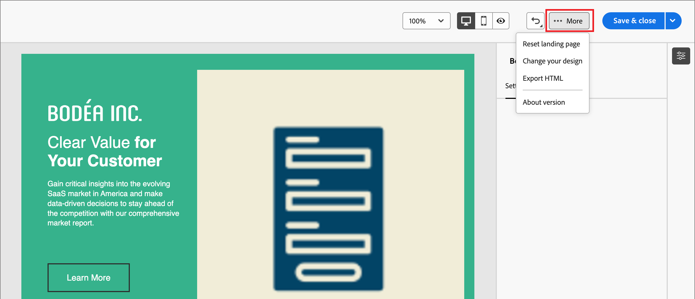

# Landingpage-Design

Nachdem Sie [Landingpage erstellt haben](./landing-pages.md#create-a-landing-page) verwenden Sie den visuellen Design-Bereich, um die Struktur- und Inhaltskomponenten in Ihrer Seite zu erstellen.

## Hinzufügen von Struktur und Inhalten {#structure-content-landing-page}

>[!CONTEXTUALHELP]
>id="ajo-b2b_landing_page_structure"
>title="Hinzufügen von Strukturkomponenten zur Landingpage"
>abstract="Strukturkomponenten definieren das Layout der Landingpage. Ziehen Sie eine **Strukturkomponente** per Drag-and-Drop auf die Arbeitsfläche, um mit der Gestaltung von Inhalten für Ihre Seite zu beginnen."

>[!CONTEXTUALHELP]
>id="ajo-b2b_landing_page_content_components"
>title="Über Inhaltskomponenten für Landingpages"
>abstract="Inhaltskomponenten sind leere Platzhalter für Inhalte, mit denen Sie das Layout einer Landingpage erstellen können."

{{$include /help/_includes/content-design-components.md}}

### Hinzufügen von Assets

{{$include /help/_includes/content-design-assets.md}}

### Formulare hinzufügen

{{$include /help/_includes/content-design-add-forms.md}}

### Navigieren in den Ebenen, Einstellungen und Stilen

{{$include /help/_includes/content-design-navigation.md}}

### Personalisieren von Inhalten

{{$include /help/_includes/content-design-personalization.md}}

### Verknüpftes URL-Tracking bearbeiten

{{$include /help/_includes/content-design-links.md}}

### Speichern Sie Ihre Arbeit

Klicken Sie **[!UICONTROL auf]**, um den Entwurf der Landingpage zu speichern.

Sie können die Entwurfsseite weiterhin bearbeiten. Wenn Sie bereit sind, die Seite anzuzeigen und für die Verknüpfung in einer E-Mail oder SMS-Nachricht verfügbar zu machen, können Sie die Seite veröffentlichen.

### Optionen anzeigen

Nutzen Sie die Ansicht- und Inhaltsvalidierungsoptionen, die im visuellen Design-Bereich verfügbar sind.

* Vergrößern/Verkleinern des Inhalts in allen vordefinierten Zoom-Optionen.

* Wechseln der Anzeige von Inhalten zwischen Desktop, Mobilgerät oder Nur-Text-/Nur-Text-Ansicht.
   * Klicken Sie auf das _Anzeigen_-Symbol für die geräteübergreifende Inhaltsvorschau.
   * Wählen Sie eines der standardmäßigen Geräte aus oder geben Sie benutzerdefinierte Dimensionen ein, um eine Vorschau des Inhalts anzuzeigen.

### Mehr Optionen

Im Menü _[!UICONTROL Mehr …]_ oben im visuellen Design-Bereich können Sie die folgenden Aktionen ausführen:

{width="500"}

* **[!UICONTROL Landingpage zurücksetzen]** - Klicken Sie auf diese Option, um die visuelle Design-Arbeitsfläche zu leeren und die Erstellung Ihres Seiteninhalts neu zu starten.
* **[!UICONTROL Design ändern]** - Kehren Sie zur Startseite von _[!UICONTROL Erstellen]_ primären Landingpage“ zurück. Dort können Sie eine andere Vorlage auswählen, um den Design-Prozess neu zu starten, oder die Seite von Grund auf auf auf einer leeren Arbeitsfläche entwerfen.
<!--- * **[!UICONTROL Save as content template]** - Save the page body as a landing page template to be reused across multiple landing pages. You provide a name and description for the template and save it to the list of saved  landing page templates. -->
* **[!UICONTROL HTML exportieren]** - Laden Sie den Inhalt auf der visuellen Arbeitsfläche in HTML im Format herunter, das als ZIP-Datei verpackt ist.
