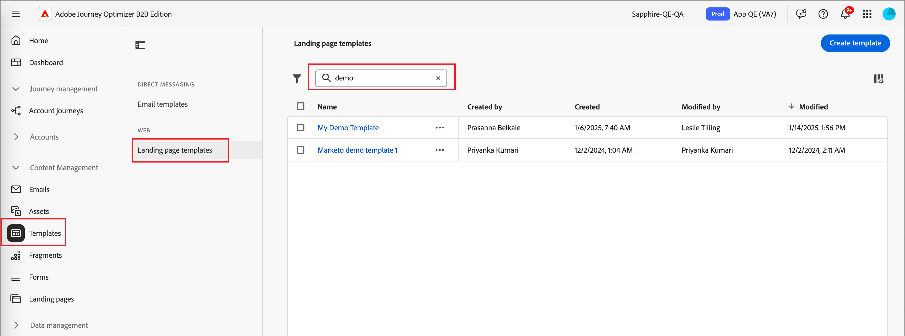
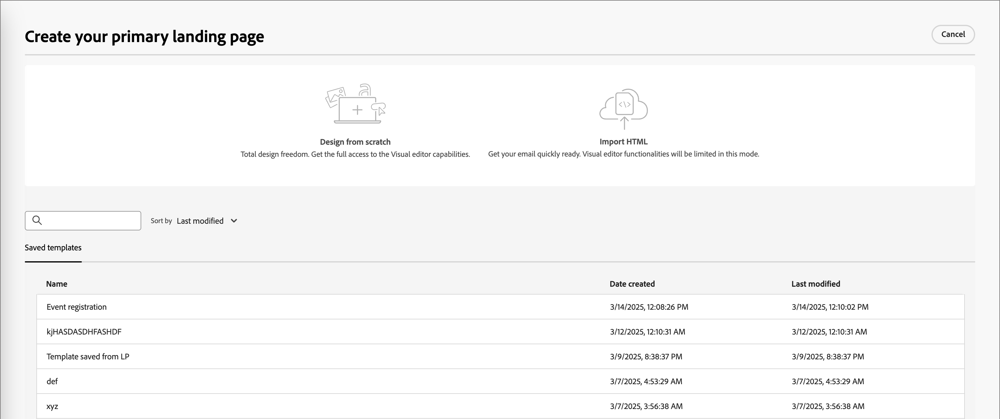
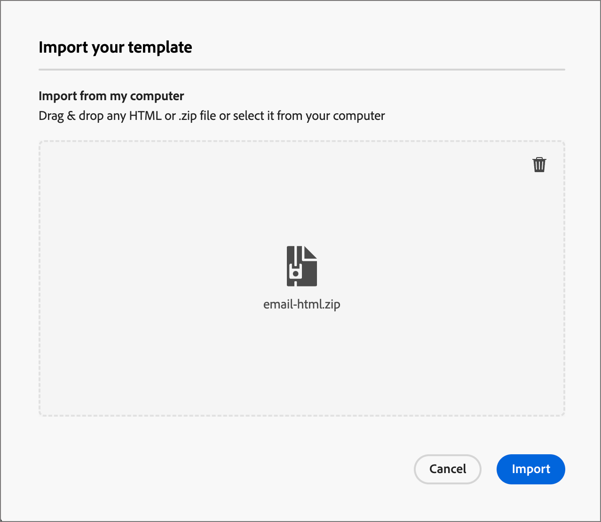
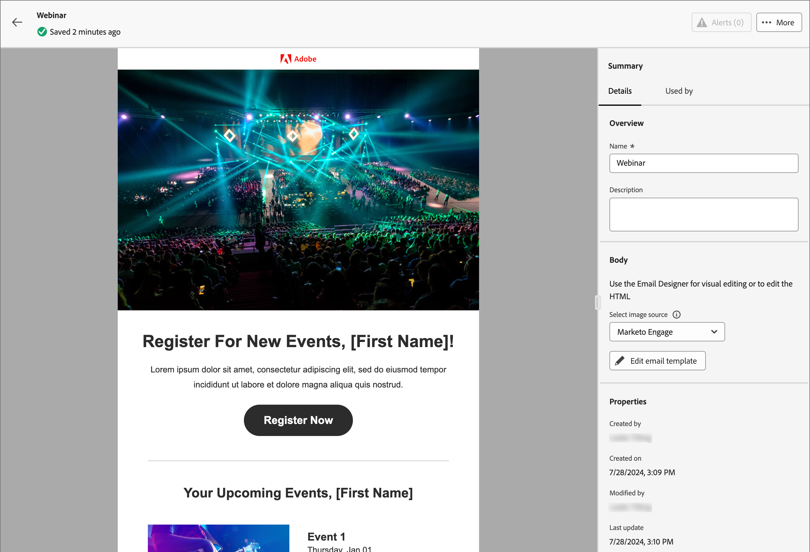
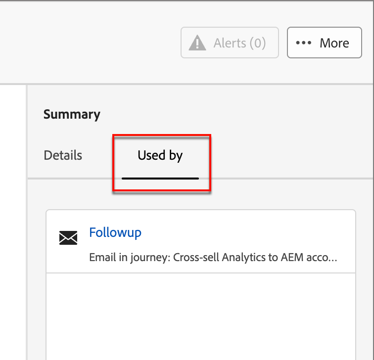

# Landingpage-Vorlagen

Für einen beschleunigten und verbesserten Design-Prozess können Sie eigenständige Landingpage-Vorlagen erstellen, um Ihr Seiten-Design und Ihre Inhalte zu standardisieren. Marketing-Strategen können die Seiten wiederverwenden und an die Verwendung in Kampagnen und Journey anpassen.

## Zugreifen auf und Verwalten von Landingpage-Vorlagen

Um auf Landingpage-Vorlagen in Adobe Journey Optimizer B2B Edition zuzugreifen, navigieren Sie zu **[!UICONTROL Content-Management]** > **[!UICONTROL Vorlagen]**. Wählen _[!UICONTROL unter]_ im Navigationsbereich die Option **[!UICONTROL Landingpage-Vorlagen]** aus.

Die angezeigte Auflistungsseite enthält alle Landingpage-Vorlagen, die in der im Tabellenformat aufgelisteten Instanz erstellt wurden. Die Tabelle wird standardmäßig nach der Spalte _[!UICONTROL Geändert]_ sortiert, wobei die zuletzt aktualisierten Vorlagen oben stehen. Klicken Sie auf den Spaltentitel, um zwischen aufsteigender und absteigender Reihenfolge zu wechseln.

Um nach einer Vorlage anhand des Namens zu suchen, geben Sie eine Textzeichenfolge in die Suchleiste ein.

{width="700" zoomable="yes"}

Klicken Sie oben links auf _Filter_-Symbol (  ), um die Liste nach Erstellungs- oder Änderungsdatum und nach Vorlagen zu filtern, die Sie erstellt oder geändert haben.

Passen Sie die Spalten an, die Sie in der Tabelle anzeigen möchten, indem Sie oben rechts auf _Tabelle anpassen_ („) klicken. Wählen Sie die anzuzeigenden Spalten aus und klicken Sie auf **[!UICONTROL Anwenden]**.

Aus der angezeigten Vorlagenliste können Sie die in den folgenden Abschnitten beschriebenen Aktionen durchführen.

## Erstellen einer Landingpage-Vorlage

Sie können eine Landingpage-Vorlage über die Landingpage-Vorlagenauflistungsseite erstellen, indem Sie oben rechts **[!UICONTROL Vorlage erstellen]** klicken.

1. Geben Sie im Dialogfeld einen eindeutigen **[!UICONTROL Namen“ (erforderlich]** und einen nützlichen **[!UICONTROL Beschreibung]** (optional) ein.

   {width="400"}

1. Klicken Sie auf **[!UICONTROL Erstellen]**.

Die Seite _[!UICONTROL Primäre Landingpage erstellen]_ wird geöffnet und bietet Optionen zum Erstellen der Vorlage: _[!UICONTROL Erstellen von neuen]_, _[!UICONTROL HTML importieren]_ oder eine der _[!UICONTROL gespeicherten Vorlagen]_.

{width="800" zoomable="yes"}

Nachdem Sie die Methode ausgewählt haben, mit der Sie mit dem Vorlagendesign beginnen möchten, verwenden Sie den visuellen Design-Bereich, um den Inhalt [&#x200B; Landingpage-Vorlage zu &#x200B;](./landing-page-design.md).

### Von Grund auf gestalten

Verwenden Sie den visuellen Design-Bereich, um die Struktur des Inhalts der Landingpage zu definieren. Durch das Hinzufügen und Verschieben von Strukturkomponenten mit einfachem Drag-and-Drop können Sie die Form des wiederverwendbaren Seiteninhalts innerhalb von Sekunden entwerfen.

>[!NOTE]
>
>Die verfügbaren Design-Tools entsprechen den Tools für das Design von Landingpages. Der Unterschied besteht darin, dass diese Inhalte als Vorlage gespeichert werden, die über mehrere Landingpages hinweg wiederverwendet werden kann.

1. Wählen Sie auf _[!UICONTROL Startseite]_ Vorlage entwerfen“ die Option **[!UICONTROL Erstellen von neuen]** aus.

1. [Struktur und Inhalt hinzufügen](./landing-page-design.md#add-structure-and-content) zur Vorlage hinzufügen.

### Importieren von HTML

Mit Adobe Journey Optimizer B2B Edition können Sie vorhandene HTML-Inhalte importieren, um Ihre Landingpage-Vorlagen zu gestalten.

{{$include /help/_includes/content-design-import.md}}

{width="500"}

>[!NOTE]
>
>Einen `<table>`-Tag als erste Ebene in einer HTML-Datei zu verwenden kann zum Verlust des Stils führen, einschließlich der Einstellungen für Hintergrund und Breite im Tag der obersten Ebene.

Sie können den importierten Inhalt nach Bedarf mit dem visuellen Design-Bereich personalisieren.

### Design-Vorlage auswählen

{{$include /help/_includes/content-design-select-template.md}}

## Seitenvorlagendetails anzeigen

Klicken Sie auf _Listenseite „Landingpage_ Vorlagen“ auf den Namen einer Landingpage-Vorlage, um die Detailseite zu öffnen. Von hier aus können Sie grundlegende Eigenschaften für die Landingpage-Vorlage anzeigen und auf den visuellen Design-Bereich zugreifen, um Änderungen am Vorlageninhalt vorzunehmen.

{width="700" zoomable="yes"}

* Zeigen Sie die Vorlagendetails an, wie z. B. Name und Beschreibung. Diese Einstellungen können bearbeitet werden. Klicken Sie auf eine Stelle außerhalb des Beschreibungsfelds, um die Änderungen automatisch zu speichern.

* Zeigen Sie die Vorlageneigenschaften an, z. B. Erstellt von, Erstellt am, Zuletzt aktualisiert von und Geändert von.

* Klicken Sie **[!UICONTROL oben]** auf „Mehr“, um schnelle Aktionen in der Landingpage-Vorlage durchzuführen, z. B. _Duplizieren_ und _Löschen_.

* Wenn aktive Warnhinweise vorhanden sind (Fehler und Warnhinweise für die Landingpage-Vorlage), klicken Sie oben **auf** Warnhinweise“, um die Informationen anzuzeigen.

  Diese Warnhinweise verbieten nicht die Verwendung der Landingpage-Vorlage zur Erstellung von Landingpages. Die Informationen bieten Marketing-Fachleuten in Ihrem Team einen Überblick darüber, was möglicherweise nicht funktioniert, und über die erforderlichen Aktualisierungen, bevor sie für die Bereitstellung verwendet werden können.

## Anzeigen der von Verweisen verwendeten Vorlage

Klicken Sie auf der Seite mit den Vorlagendetails auf **[!UICONTROL Registerkarte]** Verwendet von“, um Details dazu anzuzeigen, wo diese Vorlage in einer Landingpage verwendet wird.

{width="400"}

* Durch Klicken auf den Link gelangen Sie zur entsprechenden Landingpage, auf der die Vorlage verwendet wird.

* Sie können die Ansicht jederzeit verlassen, indem Sie auf den Rückwärtspfeil klicken, der Sie zur Auflistungsseite zurückführt.

## Bearbeiten von Landingpage-Vorlagen

Diese Aktion kann übernommen werden aus:

* Die Detailseite - Klicken Sie auf **[!UICONTROL Landingpage-Vorlage]**.
* Die Listenseite - Klicken Sie auf die Auslassungspunkte (**…**) neben einer Vorlage und wählen Sie **[!UICONTROL Bearbeiten]**.

Diese Aktion führt Sie zur Seite _Vorlage entwerfen_ oder zur Seite des visuellen Inhaltseditors (basierend auf dem zuletzt gespeicherten Status der Landingpage-Vorlage). Von hier aus können Sie den Inhalt Ihrer Landingpage-Vorlage nach Bedarf bearbeiten. Weitere [&#x200B; zu den Bearbeitungsoptionen finden Sie &#x200B;](#create-a-landing-page-template) „Erstellen einer Landingpage-Vorlage“.

## Duplizieren von Landingpage-Vorlagen

Sie können eine Landingpage-Vorlage mit einer der folgenden Methoden duplizieren:

* Erweitern Sie in den Vorlagendetails auf der rechten Seite &quot;**[!UICONTROL &quot;]** klicken Sie auf **[!UICONTROL Duplizieren]**.

  {width="400"}

* Klicken Sie auf der _[!UICONTROL Landingpage-Vorlagen]_ auf die Auslassungszeichen (…) neben der Vorlage und wählen Sie **[!UICONTROL Duplizieren]**.

Geben Sie im Dialogfeld einen nützlichen Namen (eindeutig) und eine Beschreibung ein. Klicken Sie **[!UICONTROL Duplizieren]**, um die Aktion abzuschließen.

Die duplizierte (neue) Landingpage-Vorlage wird dann in der Liste _Landingpage-Vorlagen_ angezeigt.

## Löschen von Landingpage-Vorlagen

Das Entfernen einer Landingpage-Vorlage kann nicht rückgängig gemacht werden. Überprüfen Sie dies, bevor Sie eine Löschaktion starten. Sie können eine Landingpage-Vorlage mit einer der folgenden Methoden löschen:

* Erweitern Sie in den Vorlagendetails auf der rechten Seite &quot;**[!UICONTROL &quot;]** klicken Sie auf **[!UICONTROL Löschen]**.
* Klicken Sie auf der _Landingpage-Vorlagen_ auf die Auslassungszeichen (…) neben der Vorlage und wählen Sie **[!UICONTROL Löschen]**.

  {width="500"}

Diese Aktion öffnet ein Bestätigungsdialogfeld. Sie können den Vorgang abbrechen, indem Sie auf **[!UICONTROL Abbrechen]** klicken oder auf **[!UICONTROL Löschen]** klicken, um die Entfernung zu bestätigen.

## Take bulk actions

From the landing page templates listing page, select multiple templates at a time by selecting the checkboxes to the left. A banner appears at the bottom when you select multiple templates.

{width="600"}

**[!UICONTROL Delete]** -- You can delete up to a maximum of 20 templates at one time. A confirmation dialog allows you to abort the action or confirm the removal of the templates.

## Author a landing page from a saved template

From the _[!UICONTROL Create your landing page]_ page, use the _Select design template_ section to start building your content from a template.

To start building your content with one of the landing page templates created, use the following steps:

1. Access the visual design space from the _Edit content_ page.

   On the _[!UICONTROL Create your landing page]_ page, the _Sample templates_ tab is selected by default.

1. To use a custom landing page template, select the **[!UICONTROL Saved templates]** tab.

   This tab displays a list of all landing page templates created on the sandbox. You can sort them _By name_, _Last modified_, and _Last created_.

1. Wählen Sie aus der Liste die gewünschte Vorlage aus.

   After selection, this displays a preview of the template. In preview mode, you can navigate between all the templates of one category (sample or saved, depending on your selection) using the right and left arrows.

1. Click **[!UICONTROL Use this template]** at the top right.

1. From the visual content design space, edit your content as needed.
