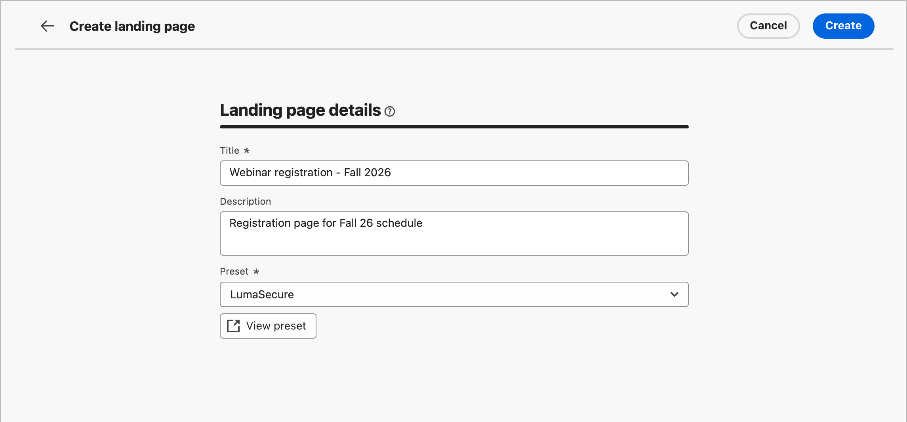
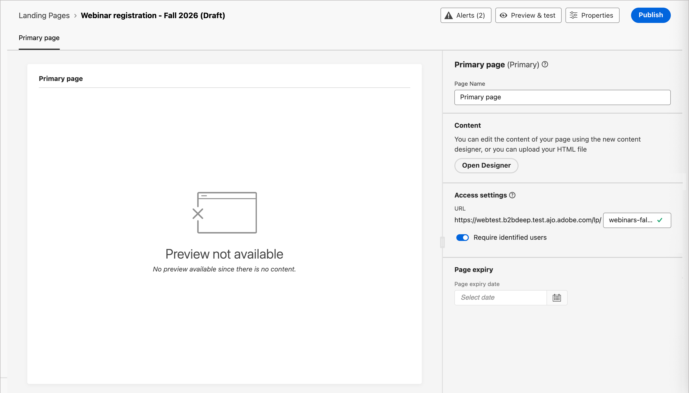

# Erstellen und Veröffentlichen von Landingpages

Als Marketing-Experte können Sie Seiten definieren und veröffentlichen, die Sie in Ihre Account- und Personen-Journey integrieren möchten. Wenn Sie eine neue Landingpage hinzufügen, konfigurieren Sie die Primärseite und alle Unterseiten, entwerfen Sie den Inhalt, testen Sie ihn und veröffentlichen Sie ihn.

>[!BEGINSHADEBOX]

## Voraussetzungen für die Landingpage {#landing-page-prerequisites}

Bevor Marketer Landingpages zur Unterstützung ihrer Journey und Kampagnen erstellen können, müssen die folgenden Konfigurationen und Assets vorhanden sein:

* [Landingpage-Subdomain](../admin/configure-channels-landing-pages.md#lp-subdomains) - Richten Sie eine Subdomain ein, die dem Hosten Ihrer Landingpages gewidmet ist.
* [Landingpage-Voreinstellung](../admin/configure-channels-landing-pages.md#lp-presets) Eine Voreinstellung definiert die Subdomain und andere Einstellungen, die auf Ihre Landingpages angewendet werden.
* [Formular](./forms.md) (für Anwendungsfälle der Datenerfassung) - Erforderlich, wenn Sie ein Formular in eine Landingpage einbetten und Daten an Experience Platform senden möchten.
  <!-- * Subscription list (for subscription use cases) - Required if you want customers to subscribe to or unsubscribe from a specific service. This is in AJO B2C-->

>[!ENDSHADEBOX]

## Erstellen einer Landingpage {#create-landing-page}

>[!CONTEXTUALHELP]
>id="ajo-b2b_lp_create"
>title="Definition und Konfiguration Ihrer Landingpage"
>abstract="Um eine Landingpage zu erstellen, müssen Sie eine Voreinstellung auswählen, dann die primäre Seite und die untergeordneten Seiten konfigurieren und Ihre Seite schließlich testen, bevor Sie sie veröffentlichen."

1. Navigieren Sie zur linken Navigation und wählen Sie **[!UICONTROL Content-Management]** > **[!UICONTROL Landingpages]**.

1. Klicken **[!UICONTROL oben]** auf „Landingpage erstellen“.

1. Geben Sie auf der Seite einen nützlichen **[!UICONTROL Titel]** (erforderlich) und **[!UICONTROL Beschreibung]** (optional) ein.

   Titel- und Beschreibungskriterien:

   * Titel - Maximal 100 Zeichen, muss eindeutig sein, Groß-/Kleinschreibung wird nicht beachtet

   * Beschreibung - Maximal 300 Zeichen

   * Alpha-, numerische und Sonderzeichen sind zulässig

   * Reservierte Zeichen sind **_nicht zulässig_**: `\ / : * ? " < > |`

   {width="600"}

1. Wählen Sie eine **[!UICONTROL Voreinstellung]** aus.

   Ein Produktadministrator [konfiguriert eine Voreinstellung), &#x200B;](../admin/configure-channels-landing-pages.md#lp-presets) die Subdomain und andere Einstellungen zu definieren, die für Landingpages verwendet werden. Sie können eine Vorgabe auswählen und dann auf **[!UICONTROL Vorgabe anzeigen]** klicken, um die Vorgabendetails zu öffnen und die Einstellungen zu überprüfen, um sicherzustellen, dass sie Ihren Landingpage-Anforderungen entspricht.

1. Klicken Sie auf **[!UICONTROL Erstellen]**.

   Die Primärseite und ihre Eigenschaften werden angezeigt.

   {width="700" zoomable="yes"}

## Konfigurieren der Primärseite {#configure-primary-page}

>[!CONTEXTUALHELP]
>id="ajo-b2b_lp_primary_page"
>title="Definieren der primären Seiteneinstellungen"
>abstract="Definieren Sie die Hauptseite, die sofort angezeigt wird, wenn ein Empfänger bzw. eine Empfängerin auf den Landingpage-Link klickt, beispielsweise in einer E-Mail oder auf einer Website."

>[!CONTEXTUALHELP]
>id="ajo-b2b_lp_access_settings"
>title="Definieren Ihrer Landingpage-URL"
>abstract="Definieren Sie in diesem Abschnitt eine eindeutige Landingpage-URL. Für den ersten Teil der URL müssen Sie zuvor eine Landingpage-Subdomain als Teil der von Ihnen ausgewählten Voreinstellung eingerichtet haben."

1. Ändern Sie den **[!UICONTROL Seitennamen]** entsprechend Ihren Anforderungen, der standardmäßig _Primär_ ist.

1. Definieren Sie den Endteil der Seiten-URL.

   Die von Ihnen ausgewählte Voreinstellung bestimmt den ersten Teil der URL.

   >[!CAUTION]
   >
   >Die Landingpage-URL muss eindeutig sein.
   >
   >Sie können nicht auf Ihre Landingpage zugreifen, indem Sie diese URL einfach in einen Webbrowser kopieren, selbst wenn sie bereits veröffentlicht wurde. Testen Sie sie mit der Vorschaufunktion.

1. Wenn Sie eine anonyme Landingpage verwenden möchten, deaktivieren Sie die Option **[!UICONTROL Identifizierte Benutzer]**.

   <!-- The option 'Require identified users' would be visible in both AJO & AJOB2B when the Landing page is of type 'Data capture' -->

1. Klicken Sie auf _Kalender_ (  ), um den (**[!UICONTROL )]** festzulegen.

   Nachdem Sie ein Ablaufdatum ausgewählt haben, wählen Sie die Aktion nach Ablauf der Seite aus:

   * **[!UICONTROL Umleitungs-URL]** - Geben Sie die URL der Seite ein, die als Umleitung verwendet werden soll.

     {width="400"}

     <!-- * **[!UICONTROL Custom page]** - Configure a subpage and select it from the list. -->
   * **[!UICONTROL Browser-Fehler]** - Geben Sie den Fehlertext ein, der anstelle der Seite angezeigt werden soll.

     {width="400"}

## Wählen des Inhaltserstellungstyps {#choose-design-type}

Um den _[!UICONTROL Inhalt]_ für die Seite hinzuzufügen, klicken Sie auf **[!UICONTROL Designer öffnen]**. Die _[!UICONTROL Erstellen Sie Ihre primäre Landingpage]_ Startseite wird geladen, und der Design-Prozess beginnt mit der Auswahl, wie Sie das Design starten möchten:

* [[!UICONTROL Von Grund auf gestalten]](#design-from-scratch)
* [[!UICONTROL Eigenen Code erstellen]](#code-your-own)
* [[!UICONTROL HTML importieren]](#import-html)
* [Landingpage-Vorlage verwenden](#select-template)

{width="800" zoomable="yes"}

Nachdem Sie Ihre bevorzugte Methode zum Starten des Landingpage-Designs ausgewählt haben, verwenden Sie die visuellen Design-Tools, [&#x200B; den Seiteninhalt &#x200B;](./landing-page-design.md).

### Von Grund auf gestalten {#design-from-scratch}

Verwenden Sie den visuellen Inhaltseditor, um die Struktur des Inhalts der Landingpage zu definieren. Durch das Hinzufügen und Verschieben von Strukturkomponenten mit einfachem Drag-and-Drop können Sie die Form des Seiteninhalts innerhalb von Sekunden entwerfen.

1. Wählen Sie auf _[!UICONTROL Startseite von „Primäre Landingpage erstellen]_ die Option **[!UICONTROL Erstellen von neuen]**) aus.

1. Wählen Sie aus, wie Sie die Formatierung für den Seiteninhalt verwalten möchten:

   * **[!UICONTROL Designs verwenden]** - Wählen Sie diese Option, um den Seiteninhalt im _Design-Modus_ zu erstellen. In diesem Modus können Sie ein definiertes [Markendesign](./brand-themes.md) verwenden, um den Inhaltserstellungsprozess zu optimieren und sicherzustellen, dass das Design den definierten Standards entspricht.

   * **[!UICONTROL Manueller Stil]** - Wählen Sie diese Option, um den Seiteninhalt im _manuellen Modus_ zu erstellen. In diesem Modus legen Sie die Formatierung für alle Struktur- und Inhaltskomponenten, die Sie der leeren Arbeitsfläche hinzufügen, manuell fest.

1. Klicken Sie auf **[!UICONTROL Bestätigen]**.

1. [Struktur und Inhalt hinzufügen](./landing-page-design.md#structure-content-landing-page) zur Seite hinzufügen.

### Eigenen Code erstellen {#code-your-own}

_Eigenen Code schreiben_ ermöglicht das Schreiben oder Einfügen von unbearbeitetem HTML, um den Seiteninhalt direkt im Design-Bereich zu erstellen. Verwenden Sie diesen Modus, wenn Sie Markup vollständig steuern müssen. Die Verwendung dieses Modus erfordert, dass Sie über HTML-Kenntnisse verfügen.

Nachdem Sie diesen Modus ausgewählt haben, bleiben Sie im Code-Editor, d. h. Sie können nicht zum visuellen Editor wechseln.

1. Wählen Sie auf _[!UICONTROL Startseite von]_ Primäre Landingpage erstellen **[!UICONTROL die Option Eigenen Code]**.

1. Geben Sie Ihren HTML-Roh-Code ein oder fügen Sie ihn ein.

Wenn Sie den Seiteninhalt löschen und von einem neuen Design ausgehen möchten, wählen Sie **[!UICONTROL Design ändern]** aus dem Optionsmenü aus.

### Importieren von HTML {#import-html}

Mit Adobe Journey Optimizer B2B edition können Sie vorhandene HTML-Inhalte importieren, um Ihre Landingpages zu gestalten.

{{$include /help/_includes/content-design-import.md}}

{width="500"}

>[!NOTE]
>
>Einen `<table>`-Tag als erste Ebene in einer HTML-Datei zu verwenden kann zum Verlust des Stils führen, einschließlich der Einstellungen für Hintergrund und Breite im Tag der obersten Ebene.

Sie können den importierten Inhalt nach Bedarf mit dem visuellen Design-Bereich personalisieren.

### Vorlage auswählen {#select-template}

[!BADGE Beta]{type=Informative tooltip="Beta-Funktion"}

Wenn Sie eine Landingpage-Vorlage verwenden möchten, können Sie aus folgenden Optionen wählen:

* **Beispielvorlagen**. Die Journey Optimizer B2B edition-Benutzeroberfläche bietet eine Sammlung vordefinierter Landingpage-Vorlagen, die Sie als Ausgangspunkt für Ihr Landingpage-Design verwenden können.

* **Gespeicherte Vorlagen**. Verwenden Sie eine gespeicherte benutzerdefinierte Vorlage, die von einem Mitglied Ihrer Organisation mithilfe des Menüs _[!UICONTROL Vorlagen]_ erstellt wurde<!-- or the _[!UICONTROL Save as content template]_ option when designing a landing page. -->

Im Abschnitt _[!UICONTROL Design-Vorlage auswählen]_ können Sie Inhalte mithilfe einer Vorlage erstellen. Sie können eine Beispielvorlage oder eine gespeicherte benutzerdefinierte Landingpage-Vorlage aus Ihrer Journey Optimizer B2B edition-Instanz verwenden.

>[!BEGINTABS]

>[!TAB Gespeicherte Vorlagen]

Auf _Startseite von „Primäre Landingpage erstellen_ wird standardmäßig die Registerkarte _Beispielvorlagen_ angezeigt. Um eine benutzerdefinierte Vorlage zu verwenden, wählen Sie die Registerkarte **[!UICONTROL Gespeicherte Vorlagen]** aus.

Die Liste aller gespeicherten Landingpage-Vorlagen wird angezeigt. Sie können sie sortieren nach _[!UICONTROL Name]_, _[!UICONTROL Zuletzt geändert]_ und _[!UICONTROL Zuletzt erstellt]_.

{width="700" zoomable="yes"}

Wählen Sie eine Vorlagenminiatur aus, um eine Vorschau anzuzeigen. Im Vorschaumodus können Sie mit den Rechts- und Linkspfeilen zwischen allen Vorlagen einer Kategorie (Beispielvorlage oder gespeicherte Vorlagen, je nach Ihrer Auswahl) navigieren.

{width="800" zoomable="yes"}

Wenn das Display dem entspricht, was Sie verwenden möchten, klicken **[!UICONTROL oben rechts]** Vorschaufenster auf „Diese Vorlage verwenden“.

Diese Aktion kopiert den Inhalt in den visuellen Design-Bereich, in dem Sie den Inhalt nach Bedarf bearbeiten können.

<!-- 
>[!NOTE]
>
>Saved templates may have governance (content locking) settings applied to one or more components. The design tools provide guidelines about locked components when you [author content from a governed template](./email-authoring-governance.md). 
-->

>[!TAB Beispielvorlagen]

Adobe Journey Optimizer B2B edition bietet eine Auswahl _standardmäßigen Landingpage_ Vorlagen, die Sie zum Erstellen Ihrer eigenen Landingpages und Landingpage-Vorlagen verwenden können.

<!-- {width="800" zoomable="yes"} -->

>[!ENDTABS]

## Prüfen von Warnhinweisen {#check-alerts}

Während Sie die Inhalte Ihrer Landingpage entwerfen, werden Warnhinweise oben rechts angezeigt, wenn wichtige Einstellungen fehlen.

{width="250"}

Wenn diese Schaltfläche nicht angezeigt wird, treten keine Probleme auf.

Es gibt zwei Arten von Warnhinweisen:

* **_Warnhinweise_** die auf Empfehlungen und Best Practices verweisen, z. B.:

   * `Placeholder links are present in the landing page body`: Vergessen Sie nicht, die Platzhalter durch gültige Links zu ersetzen.

   * `Text version of HTML is empty`: Vergessen Sie nicht, eine Textversion Ihres Seitentextes zu definieren, die verwendet wird, wenn HTML-Inhalte nicht angezeigt werden können.

   * `Empty link is present in page body`: Vergewissern Sie sich, dass alle Links auf Ihrer Seite korrekt sind.

* **_Fehler_** die verhindern, dass Sie die Journey/Kampagne testen oder aktivieren, solange nicht alle Fehler behoben sind, z. B.:

   * `The landing page content is empty`: Seiteninhalt ist obligatorisch.

## Testen der Landingpage {#test-landing-page}

>[!CONTEXTUALHELP]
>id="ajo-b2b_preview_lp_profiles"
>title="Erstellen einer Vorschau und Testen Ihrer Landingpage"
>abstract="Nachdem Sie die Einstellungen und den Inhalt Ihrer Landingpage definiert haben, verwenden Sie Testprofile, um eine Vorschau der Seite anzuzeigen."

Wenn die Einstellungen und Inhalte der Landingpage definiert sind, können Sie Testprofile verwenden, um eine Vorschau der Seite anzuzeigen. Wenn Sie [personalisierten Inhalt](./personalization.md) eingefügt haben, können Sie mithilfe von Testprofildaten überprüfen, wie dieser Inhalt auf der Landingpage angezeigt wird.

>[!PREREQUISITES]
>
>Um Landingpages in der Vorschau anzuzeigen und zu testen, benötigen Sie die Berechtigung **[!UICONTROL Nachrichten veröffentlichen]** und einen definierten Datensatz, der &quot;[&quot; &#x200B;](../audiences/test-profiles.md).

1. Klicken Sie **[!UICONTROL Vorschau und Test]**, um die Auswahl der Testprofile zu öffnen.

   >[!NOTE]
   >
   >Sie können auch **[!UICONTROL Inhalt simulieren]** verwenden, wenn Sie sich im visuellen Design-Bereich befinden.

1. Wählen Sie auf dem _[!UICONTROL Simulieren]_ ein Testprofil aus.

   {width="700" zoomable="yes"}

   Wenn die benötigten Profile nicht aufgelistet sind, klicken Sie auf **[!UICONTROL Testprofile verwalten]**, um eine bekannte E-[-Mail-Adresse &#x200B;](../audiences/test-profiles.md)Testprofil“ zu verwenden und sie der Liste hinzuzufügen.

   +++Hinzufügen von Testprofilen

   Klicken **[!UICONTROL für]** Identity-Namespace _auf das Symbol Auswählen_ (  ) und wählen Sie den `Email`-Namespace aus, der zum Testen von Profilen verwendet werden soll.

   {width="700" zoomable="yes"}

   Geben Sie im Feld **[!UICONTROL Identitätswert]** die E-Mail-Adresse ein, um das Testprofil zu identifizieren, und klicken Sie auf **[!UICONTROL Profil hinzufügen]**. Sie können dies wiederholen, um mehrere Profile hinzuzufügen.

   {width="700" zoomable="yes"}

   Klicken Sie oben links auf den Rückwärtspfeil, um zur Seite _[!UICONTROL Simulieren]_ zurückzukehren.

   +++

1. Wählen Sie **[!UICONTROL Vorschau öffnen]**, um Ihre Landingpage zu testen.

   Die Landingpage-Vorschau wird auf einer neuen Registerkarte geöffnet. Die ausgewählten Testprofildaten ersetzen personalisierte Elemente.

   {width="600"}

1. Wählen Sie für jede Variante Ihrer Landingpage andere Testprofile zum Rendern von Vorschauen aus.

## Veröffentlichen der Seite {#publish-landing-page}

>[!PREREQUISITES]
>
>Zum Veröffentlichen von Landingpages benötigen Sie die Berechtigung **[!UICONTROL Veröffentlichen von Nachrichten]**.  Prüfen [&#x200B; vor dem Veröffentlichen (alle Warnhinweise überprüfen und auflösen](#check-alerts).

Wenn die Entwurfsseite Ihren Kriterien entspricht und Sie die Seite für Links aus Journey-Nachrichten verfügbar machen möchten, klicken Sie oben rechts **[!UICONTROL Veröffentlichen]**. Klicken Sie dann im Bestätigungsdialogfeld auf **[!UICONTROL Veröffentlichen]**.

{width="250"}

Wenn die Landingpage veröffentlicht wird, wird sie in der Landingpage-Liste mit dem Status **_[!UICONTROL Veröffentlicht]_** angezeigt. Das bedeutet, dass sie live ist und in einer E-Mail-, SMS- oder WhatsApp-Nachricht verwendet werden kann, die über eine Journey gesendet wird.

Sie können nicht auf die veröffentlichte Landingpage zugreifen, indem Sie die URL in einen Webbrowser kopieren. Sie können sie jederzeit mit der &quot;[&quot; &#x200B;](#test-landing-page).

Sie können die Wirkung Ihrer Landingpage mithilfe spezifischer Berichte überwachen.
