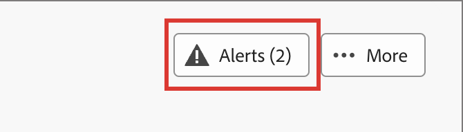

# Landingpages

Eine Landingpage ist eine eigenständige Web-Seite, auf der Sie Kontakte und Kunden leiten können, nachdem sie auf ein verknüpftes Element in einer E-Mail, SMS-Nachricht oder einem beliebigen digitalen Ort geklickt haben. Sie können diese Seiten in Ihre Account-Journey integrieren, damit Ihre Interessenten und Kunden Ihre Nachrichten im Internet anzeigen und in Ihren Account-Journey Fortschritte erzielen können. Im visuellen Design-Bereich für Landingpages können Sie Landingpages erstellen, personalisieren und in der Vorschau anzeigen.

Um Ihre Kunden beim Klicken auf einen bestimmten Link zu einer definierten Web-Seite weiterzuleiten, erstellen Sie in Journey Optimizer B2B edition eine Landingpage.

* Erstellen der Seite
* Landingpage gestalten und Inhalte erstellen
* Testen der Seite
* Veröffentlichen der Seite
* Link zur Seite aus Ihrem Journey-Inhalt

Sie können beispielsweise Landingpages erstellen und gestalten, um Ihre Benutzer zu Online-Informationen zu führen. Die Seite könnte ein Formular enthalten, über das der Empfänger Ihre Nachrichten abmelden oder abmelden kann. Oder es kann eine Möglichkeit sein, wiederkehrende Nachrichten wie einen Newsletter zu abonnieren.

Sie können Landingpages im visuellen Design-Bereich erstellen, personalisieren und in der Vorschau anzeigen.
<!-- 
For the Beta phase, you can only design landing pages from scratch and publish your landing pages. The landing pages will be served on adobe hosted domain for the Beta phase. The capability to define your branded domains for hosting will be delivered in a future release. -->

## Zugreifen auf und Verwalten von Landingpages

Um auf die Landingpages in Adobe Journey Optimizer B2B edition zuzugreifen, gehen Sie zum linken Navigationsbereich und klicken Sie auf **[!UICONTROL Content-Management]** > **[!UICONTROL Landingpages]**. Diese Aktion öffnet eine Listenseite mit allen in der Instanz erstellten Landingpages, die in einer Tabelle aufgeführt sind.

{width="800" zoomable="yes"}

Die Tabelle wird nach der Spalte _[!UICONTROL Geändert]_ sortiert, wobei die zuletzt aktualisierten Elemente standardmäßig oben stehen. Klicken Sie auf den Spaltentitel, um zwischen aufsteigender und absteigender Reihenfolge zu wechseln.

### Filtern der Landingpage-Liste

Um nach einer Landingpage anhand des Namens zu suchen, geben Sie eine Textzeichenfolge in die Suchleiste für eine Übereinstimmung ein. Klicken Sie auf _Filter_-Symbol (  ), um die verfügbaren Filteroptionen anzuzeigen und die Einstellungen zu ändern, um die angezeigten Elemente entsprechend Ihren angegebenen Kriterien zu filtern.

{width="700" zoomable="yes"}

### Spaltenanzeige anpassen

Passen Sie die Spalten an, die Sie in der Tabelle anzeigen möchten, indem Sie oben rechts auf _Tabelle anpassen_ („) klicken.

Wählen Sie im Dialogfeld die anzuzeigenden Spalten aus und klicken Sie auf **[!UICONTROL Anwenden]**.

{width="300"}

### Status und Lebenszyklus der Landingpage

Der Landingpage-Status bestimmt, ob Links in Ihren E-Mail- und SMS-Inhalten verfügbar sind und welche Änderungen Sie daran vornehmen können.

| Status | Beschreibung |
| -------------------- | ----------- |
| Entwurf | Wenn Sie eine Landingpage erstellen, befindet sie sich im Status Entwurf . Er bleibt in diesem Status, bis Sie den visuellen Inhalt definieren oder bearbeiten und bis Sie ihn als gehostete Seite veröffentlichen. Verfügbare Aktionen: <ul><li>Name oder Beschreibung bearbeiten<li>Link-URL bearbeiten<li>Bearbeiten im visuellen Design-Bereich<li>Veröffentlichen<li>Duplizieren<li>Löschen |
| Veröffentlicht | Wenn Sie eine Landingpage veröffentlichen, wird sie auf der Journey Optimizer B2B edition-Instanz gehostet und steht dann zur Verknüpfung in E-Mail- oder SMS-Nachrichteninhalten zur Verfügung. Verfügbare Aktionen: <ul><li>Name oder Beschreibung bearbeiten<li>Link-URL bearbeiten<li>Link im Inhalt von E-Mail- oder SMS-Nachrichten hinzufügen<li>Versionsentwurf erstellen<li>Duplizieren<li>Löschen |
| Mit Entwurf veröffentlicht | Wenn Sie einen Entwurf aus einer veröffentlichten Landingpage erstellen, bleibt die veröffentlichte Version erhalten, und der Entwurfsinhalt kann im visuellen Design-Bereich geändert werden. Wenn Sie die Entwurfsversion veröffentlichen, ersetzt sie die aktuell veröffentlichte Version, und der Inhalt wird auf der gehosteten Seite aktualisiert. Verfügbare Aktionen: <ul><li>Name oder Beschreibung bearbeiten<li>Link-URL bearbeiten<li>Link im Inhalt von E-Mail- oder SMS-Nachrichten hinzufügen<li>Bearbeiten der Entwurfsversion im visuellen Entwurfsbereich<li>Entwurfsversion veröffentlichen<li>Duplizieren<li>Löschen (löscht beide Versionen)<li>Entwurf verwerfen (kehrt zum Status „Veröffentlicht“ zurück) |

{zoomable="yes"}

## Erstellen einer Landingpage

Sie können in Journey Optimizer B2B edition eine neue Landingpage hinzufügen, indem **[!UICONTROL oben rechts auf]** Landingpage erstellen“ klicken.

1. Geben _[!UICONTROL im Dialogfeld „Landingpage erstellen]_ einen sinnvollen Wert **[!UICONTROL Name]** und **[!UICONTROL Beschreibung]** (optional) ein.

   Anforderungen an die Landingpage:

   * Name - Maximal 100 Zeichen, muss eindeutig sein, Groß-/Kleinschreibung wird nicht beachtet

   * Beschreibung - Maximal 300 Zeichen

   * Alpha-, numerische und Sonderzeichen sind zulässig

   * Reservierte Zeichen sind **_nicht zulässig_**: `\ / : * ? " < > |`

   {width="400"}

1. Falls erforderlich und mehrere Subdomains konfiguriert sind, ändern Sie die **[!UICONTROL Subdomain]** so, dass sie für die Landingpage verwendet wird.

1. Klicken Sie auf **[!UICONTROL Erstellen]**.

   Die Startseite _[!UICONTROL Erstellen einer primären]_-Seite“ wird geöffnet und bietet mehrere Optionen zum Erstellen der Seite: _[!UICONTROL Von Grund auf]_, _[!UICONTROL HTML importieren]_ oder eine gespeicherte Vorlage verwenden.

   {width="800" zoomable="yes"}

   Nachdem Sie die Methode ausgewählt haben, die Sie zum Starten des Landingpage-Designs verwenden möchten, verwenden Sie den visuellen Design-Bereich [Design der Seite](./landing-page-design.md).

### Von Grund auf gestalten

Verwenden Sie den visuellen Inhaltseditor, um die Struktur des Inhalts der Landingpage zu definieren. Durch das Hinzufügen und Verschieben von Strukturkomponenten mit einfachem Drag-and-Drop können Sie die Form des Seiteninhalts innerhalb von Sekunden entwerfen.

1. Wählen Sie auf _[!UICONTROL Startseite von „Primäre Landingpage erstellen]_ die Option **[!UICONTROL Erstellen von neuen]**) aus.

1. [Struktur und Inhalt hinzufügen](./landing-page-design.md#add-structure-and-content) zur Seite hinzufügen.

### Importieren von HTML

Mit Adobe Journey Optimizer B2B edition können Sie vorhandene HTML-Inhalte importieren, um Ihre Landingpages zu gestalten.

{{$include /help/_includes/content-design-import.md}}

{width="500"}

>[!NOTE]
>
>Einen `<table>`-Tag als erste Ebene in einer HTML-Datei zu verwenden kann zum Verlust des Stils führen, einschließlich der Einstellungen für Hintergrund und Breite im Tag der obersten Ebene.

Sie können den importierten Inhalt nach Bedarf mit dem visuellen Design-Bereich personalisieren.

### Gespeicherte Vorlage auswählen

Sie können aus folgenden Optionen wählen:

* **Beispielvorlagen**. Die Journey Optimizer-Benutzeroberfläche bietet eine Sammlung vordefinierter Landingpage-Vorlagen, aus denen Sie wählen können.

* **Gespeicherte Vorlagen**. Verwenden Sie eine gespeicherte benutzerdefinierte Vorlage, die von einem Mitglied Ihrer Organisation mithilfe des Menüs _[!UICONTROL Vorlagen]_ erstellt wurde<!-- or the _[!UICONTROL Save as content template]_ option when designing a landing page. -->

Im Abschnitt _[!UICONTROL Design-Vorlage auswählen]_ können Sie Inhalte mithilfe einer Vorlage erstellen. Sie können eine Beispielvorlage oder eine gespeicherte benutzerdefinierte Landingpage-Vorlage aus Ihrer Journey Optimizer B2B edition-Instanz verwenden.

>[!BEGINTABS]

>[!TAB Gespeicherte Vorlagen]

Auf der Startseite _Primäre Landingpage erstellen_ ist die Registerkarte _Beispielvorlagen_ standardmäßig ausgewählt. Um eine benutzerdefinierte Vorlage zu verwenden, wählen Sie die Registerkarte **[!UICONTROL Gespeicherte Vorlagen]** aus.

Die Liste aller gespeicherten Landingpage-Vorlagen wird angezeigt. Sie können sie sortieren nach _[!UICONTROL Name]_, _[!UICONTROL Zuletzt geändert]_ und _[!UICONTROL Zuletzt erstellt]_.

{width="700" zoomable="yes"}

Wählen Sie die gewünschte Vorlage aus der Liste aus.

Nach der Auswahl wird eine Vorschau der Vorlage angezeigt. Im Vorschaumodus können Sie mit den Rechts- und Linkspfeilen zwischen allen Vorlagen einer Kategorie (Beispielvorlage oder gespeicherte Vorlagen, je nach Ihrer Auswahl) navigieren.

{width="800" zoomable="yes"}

Wenn das Display dem entspricht, was Sie verwenden möchten, klicken **[!UICONTROL oben rechts]** Vorschaufenster auf „Diese Vorlage verwenden“.

Diese Aktion kopiert den Inhalt in den visuellen Design-Bereich, in dem Sie den Inhalt nach Bedarf bearbeiten können.

>[!TAB Beispielvorlagen]

Adobe Journey Optimizer B2B edition bietet eine Auswahl _standardmäßigen Landingpage_ Vorlagen, die Sie zum Erstellen Ihrer eigenen Landingpages und Landingpage-Vorlagen verwenden können.

<!-- {width="800" zoomable="yes"} -->

>[!ENDTABS]

<!-- 
>[!NOTE]
>
> Saved templates may have governance (content locking) settings applied to one or more components. The visual designer provides guidelines about locked components when you [author an email from a governed template](./email-authoring-governance.md). -->

## Bearbeiten einer Landingpage

Änderungen an einer Landingpage hängen vom aktuellen Status ab:

* Wenn sich eine Landingpage im Status **_Entwurf_** befindet, können Sie alle zugehörigen Details, die URL und den visuellen Inhalt bearbeiten.
* Wenn sich eine Landingpage im Status **_Veröffentlicht_** befindet, können Sie die Beschreibung bearbeiten, nicht jedoch den Namen. Um den visuellen Inhalt zu ändern, müssen Sie eine Entwurfsversion der Seite erstellen.
* Wenn sich eine Landingpage im Status **_Veröffentlicht mit Entwurf_** befindet, ist die Bearbeitung der Details auf die Beschreibung beschränkt. Sie können auch den visuellen Inhalt für die Entwurfsversion bearbeiten.

>[!BEGINTABS]

>[!TAB Entwurf]

1. Klicken Sie auf der _[!UICONTROL Landingpages]_ auf den Namen der Landingpage, um sie zu öffnen.

   Eine Vorschau des visuellen Inhalts mit den Details der Landingpage wird auf der rechten Seite angezeigt.

1. Ändern Sie alle Details, z. B. Namen und Beschreibung.

   {width="700" zoomable="yes"}

1. Um Änderungen am Inhalt im visuellen Design-Bereich vorzunehmen, klicken Sie auf **[!UICONTROL Landingpage bearbeiten]**.

   Verwenden Sie bei Bedarf visuelle Design-Tools:

   * [Hinzufügen von Struktur und Inhalten](./landing-page-design.md#add-structure-and-content)
   * [Assets hinzufügen](./landing-page-design.md#add-assets)
   * [Navigieren in den Ebenen, Einstellungen und Stilen](./landing-page-design.md#navigate-the-layers-settings-and-styles)
   * [Personalisieren von Inhalten](./landing-page-design.md#personalize-content)
   * [Verknüpftes URL-Tracking bearbeiten](./landing-page-design.md#edit-linked-url-tracking)

1. Klicken Sie **[!UICONTROL Speichern]** oder **[!UICONTROL Speichern und schließen]** um zu den Landingpage-Details zurückzukehren.

1. Wenn die Seite Ihren Kriterien entspricht und Sie sie zur Anzeige bereitstellen möchten, klicken Sie auf **[!UICONTROL Veröffentlichen]**.

>[!TAB Veröffentlicht]

1. Klicken Sie auf der _[!UICONTROL Landingpage]_ der Listenseite auf den Seitennamen, um sie zu öffnen.

   Eine Vorschau des visuellen Inhalts mit den Details der Landingpage wird auf der rechten Seite angezeigt.

1. Ändern Sie bei Bedarf die Beschreibung.

   Für eine veröffentlichte Landingpage können alle anderen Details nicht geändert werden.

1. Wenn Sie den Inhalt aktualisieren möchten, klicken Sie auf **[!UICONTROL rechten Seite auf]** Landingpage bearbeiten“.

   Klicken Sie **[!UICONTROL Dialogfeld auf]** Entwurfsversion erstellen“, um die Entwurfsversion im visuellen Entwurfsbereich zu öffnen.

   {width="300"}

   Verwenden Sie bei Bedarf visuelle Design-Tools:

   * [Hinzufügen von Struktur und Inhalten](./landing-page-design.md#add-structure-and-content)
   * [Assets hinzufügen](./landing-page-design.md#add-assets)
   * [Navigieren in den Ebenen, Einstellungen und Stilen](./landing-page-design.md#navigate-the-layers-settings-and-styles)
   * [Personalisieren von Inhalten](./landing-page-design.md#personalize-content)
   * [Verknüpftes URL-Tracking bearbeiten](./landing-page-design.md#edit-linked-url-tracking)

1. Klicken Sie **[!UICONTROL Speichern]** oder **[!UICONTROL Speichern und schließen]** um zu den Landingpage-Details zurückzukehren.

1. Wenn die Landingpage Ihren Kriterien entspricht und Sie die Änderungen auf der veröffentlichten Seite verfügbar machen möchten, klicken Sie auf **[!UICONTROL Veröffentlichen]**.

   Wenn Sie die Entwurfsversion veröffentlichen, ersetzt sie die aktuell veröffentlichte Version, und der Inhalt wird für die Seiten-URL aktualisiert.

>[!TAB Veröffentlicht mit Entwurf]

Beim Öffnen der Landingpage wird standardmäßig die Entwurfsversion angezeigt. Mit den Registerkarten oben im Vorschaubereich können Sie die Anzeige zwischen der veröffentlichten und der Entwurfsversion wechseln. Die Entwurfsaktionen und -details werden auf der rechten Seite angezeigt.

{width="700" zoomable="yes"}

So aktualisieren Sie den Inhalt:

1. Klicken **[!UICONTROL oben]** auf „Landingpage bearbeiten“. Verwenden Sie bei Bedarf visuelle Design-Tools:

   * [Hinzufügen von Struktur und Inhalten](./landing-page-design.md#add-structure-and-content)
   * [Assets hinzufügen](./landing-page-design.md#add-assets)
   * [Navigieren in den Ebenen, Einstellungen und Stilen](./landing-page-design.md#navigate-the-layers-settings-and-styles)
   * [Personalisieren von Inhalten](./landing-page-design.md#personalize-content)
   * [Verknüpftes URL-Tracking bearbeiten](./landing-page-design.md#edit-linked-url-tracking)

1. Klicken Sie **[!UICONTROL Speichern]** oder **[!UICONTROL Speichern und schließen]** um zu den Landingpage-Details zurückzukehren.

1. Wenn die Entwurfsseite Ihren Kriterien entspricht und Sie die Änderungen verfügbar machen möchten, klicken Sie auf **[!UICONTROL Veröffentlichen]**.

   Wenn Sie die Entwurfsversion veröffentlichen, ersetzt sie die aktuelle veröffentlichte Version, und der Inhalt wird auf der gehosteten Seite aktualisiert.

>[!ENDTABS]

### Prüfen von Warnhinweisen

Während Sie die Inhalte Ihrer Landingpage entwerfen, werden Warnhinweise in der Benutzeroberfläche (oben rechts) angezeigt, wenn wichtige Einstellungen fehlen.

{width="250"}

Wenn diese Schaltfläche nicht angezeigt wird, treten keine Probleme auf.

Es können zwei Arten von Warnhinweisen erkannt werden:

* **_Warnhinweise_** die auf Empfehlungen und Best Practices verweisen, z. B.:

   * `Placeholder links are present in the landing page body`: Vergessen Sie nicht, die Platzhalter durch gültige Links zu ersetzen.

   * `Text version of HTML is empty`: Vergessen Sie nicht, eine Textversion Ihres Seitentextes zu definieren, die verwendet wird, wenn HTML-Inhalte nicht angezeigt werden können.

   * `Empty link is present in page body`: Vergewissern Sie sich, dass alle Links auf Ihrer Seite korrekt sind.

* **_Fehler_** die verhindern, dass Sie die Journey/Kampagne testen oder aktivieren, solange nicht alle Fehler behoben sind, z. B.:

   * `The landing page content is empty`: Seiteninhalt ist obligatorisch.

## Duplizieren einer Landingpage

Sie können eine Landingpage mit einer der folgenden Methoden duplizieren:

* Klicken Sie auf der _[!UICONTROL Einstiegsseite]_ auf das Symbol _Mehr_ (**…**) neben dem Namen der Einstiegsseite und wählen Sie **[!UICONTROL Duplizieren]**.
* Klicken Sie oben rechts auf der Detailseite der Landingpage auf **[!UICONTROL … Mehr]** und wählen Sie **[!UICONTROL Duplizieren]**.

{width="600" zoomable="yes"}

Geben Sie im Dialogfeld einen nützlichen Namen (eindeutig) und eine Beschreibung (optional) ein. Klicken Sie **[!UICONTROL Duplizieren]**, um die Aktion abzuschließen.

{width="350"}

Die duplizierte (neue) Seite wird dann in der Liste _Landingpages_ angezeigt.

## Löschen einer Landingpage

Sie können eine Landingpage mit einer der folgenden Methoden löschen:

* Klicken Sie auf der _[!UICONTROL Einstiegsseite]_ auf das Symbol _Mehr_ (**…**) neben dem Namen der Einstiegsseite und wählen Sie **[!UICONTROL Löschen]**.
* Klicken Sie oben rechts auf der Detailseite der Landingpage auf **[!UICONTROL … Weitere]** und wählen Sie **[!UICONTROL Löschen]**.

Diese Aktion öffnet ein Bestätigungsdialogfeld. Sie können den Vorgang abbrechen, indem Sie auf **[!UICONTROL Abbrechen]** klicken oder auf **[!UICONTROL Löschen]** klicken, um den Löschvorgang zu bestätigen.

{width="400"}

## Link zu einer Landingpage

Als Marketing-Experte oder Designer, der E-Mail-, Fragment- und Seiteninhalte erstellt, können Sie Links zu den veröffentlichten (Live-)Landingpages einbetten, die in Ihrer Journey Optimizer B2B edition-Instanz erstellt werden.

1. Wählen Sie beim Arbeiten im visuellen Design für ein Fragment, eine E-Mail, eine Landingpage oder eine Vorlage einen Textauszug, eine Schaltflächenkomponente oder eine Bildkomponente für den Link aus.

   Die **[!UICONTROL Link]**-Optionen werden im rechten Bedienfeld angezeigt.

1. Wählen Sie für **[!UICONTROL Option]** Typ“ die Option **[!UICONTROL Landingpage]**.

   {width="700" zoomable="yes"}

1. Klicken Sie für die **[!UICONTROL Landingpage]**-Option auf das Symbol _Seite auswählen_ (  ).

1. Legen Sie im Dialogfeld „Landingpage auswählen **[!UICONTROL als]** **[!UICONTROL Journey Optimizer B2B edition]** fest, aktivieren Sie das Kontrollkästchen für die Landingpage in der Liste der veröffentlichten Seiten und klicken Sie auf **[!UICONTROL Auswählen]**.

   {width="600" zoomable="yes"}

1. Wählen Sie für **[!UICONTROL Option]** das Verhalten des Link-Ziels aus:

   * **[!UICONTROL None]** - öffnet den Link mit dem Standardverhalten des Browsers.
   * **[!UICONTROL Leer]** - öffnet den Link in einem neuen Fenster oder in einer neuen Registerkarte.
   * **[!UICONTROL Self]** - öffnet den Link im selben Frame.
   * **[!UICONTROL Parent]** - öffnet den Link im übergeordneten Frame.
   * **[!UICONTROL Oben]** - Öffnet den Link im gesamten Fenster.

1. (Nur Text-Link) Wenn Sie den verknüpften Text unterstreichen möchten, aktivieren Sie das Kontrollkästchen **[!UICONTROL Link unterstreichen]**.

   Sie können zusätzliche Stile für den Link-Text festlegen, einschließlich der Link-Farbe, indem Sie die Registerkarte **[!UICONTROL Stile]** im rechten Bedienfeld auswählen.
