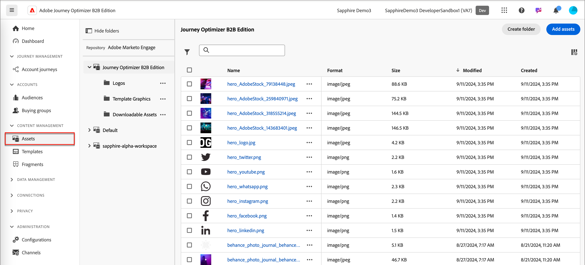
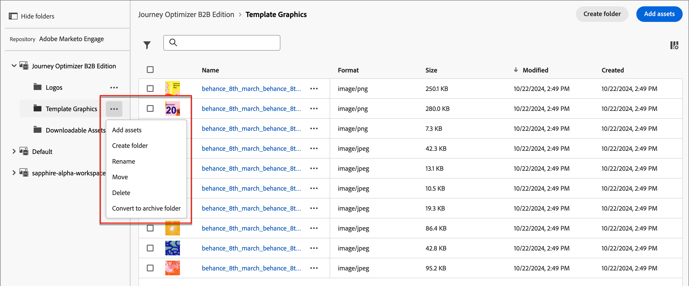
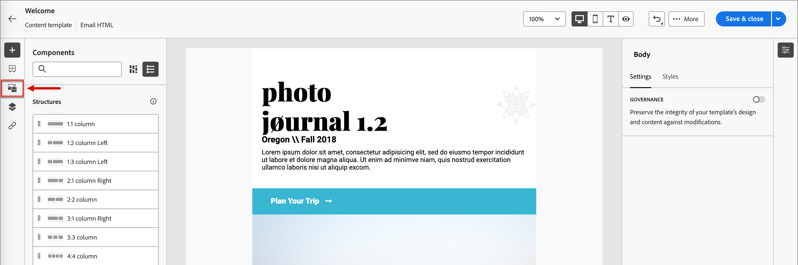

# Arbeiten mit Marketo Engage-Assets

Marketo Engage Design Studio ist die Standard-Asset-Quelle für Journey Optimizer B2B Edition. Sie können die verfügbaren Assets in Inhalten für Ihre Konto-Journey einfach verwalten und verwenden.

## Assets durchsuchen und aufrufen

Um von Journey Optimizer B2B Edition aus auf Adobe Marketo Engage Design Studio-Assets zuzugreifen, navigieren Sie zum linken Navigationsbereich und klicken Sie auf **[!UICONTROL Content Management]** > **[!UICONTROL Assets]**. Durch diese Aktion wird eine Listenseite mit allen aufgelisteten Assets geöffnet.

{width="600" zoomable="yes"}

* Um die Assets nach Ordner anzuzeigen, öffnen Sie die Ordnerstruktur, indem Sie links oben auf das Symbol _Ordner anzeigen_ klicken.

* Um die Tabelle nach einer der Spalten zu sortieren, klicken Sie auf den Spaltentitel.

* Um innerhalb des ausgewählten Ordners nach einem Bild-Asset zu suchen, geben Sie eine Textzeichenfolge in die Suchleiste ein.

* Um die in der Tabelle angezeigten Spalten anzupassen, klicken Sie oben rechts auf das Symbol _Tabelle anpassen_ .

  Wählen Sie die Spalten aus, die in der Liste angezeigt werden sollen, und klicken Sie auf **[!UICONTROL Anwenden]**.

## Asset-Details anzeigen

Klicken Sie auf den Namen eines Assets, um die Asset-Detailseite zu öffnen.

## Von Verweisen verwendetes Asset anzeigen

Klicken Sie auf der Asset-Detailseite auf die Registerkarte &quot;**[!UICONTROL Verwendet von]**&quot;, um Details dazu anzuzeigen, wo das Asset derzeit in Journey Optimizer B2B Edition verwendet wird - für E-Mails, E-Mail-Vorlagen und Fragmente.

>[!IMPORTANT]
>
>Assets, die derzeit _IN USE_ in E-Mails, E-Mail-Vorlagen oder Fragmenten **sind, können nicht** gelöscht werden.

Verweise werden nach Kategorie angezeigt: _E-Mail_, _E-Mail-Vorlage_ oder _Fragment_. E-Mails in Journey Optimizer B2B Edition sind in Journey eingebettet und verfasst, sodass die übergeordnete Journey der E-Mail, die das Asset verwendet, in Verweisen angezeigt wird.

Durch Klicken auf den Link gelangen Sie zur entsprechenden E-Mail, E-Mail-Vorlage oder zum Fragment, in dem das Asset verwendet wird.

## Hinzufügen von Assets

Auf der Assets-Listenseite können Sie Bild-Assets zur Adobe Marketo Engage Design Studio hinzufügen.

1. Klicken Sie oben rechts auf **[!UICONTROL Assets hinzufügen]** .

1. Ziehen Sie im Dialogfeld _[!UICONTROL Assets hinzufügen]_ eine oder mehrere Dateien aus Ihrem System in das Dateifeld.

   {width="500" zoomable="yes"}

   Sie können auch auf den Link _[!UICONTROL Datei von Ihrem Computer auswählen]_ klicken, um mithilfe des lokalen Dateisystems Dateien zu suchen und auszuwählen.

   Sie können Assets aus Ihrem lokalen System mit bis zu 10 Dateien gleichzeitig hochladen. Die maximale Dateigröße beträgt 100 MB.

   Die Dateinamen der ausgewählten Bilder werden im Dialogfeld angezeigt. Asset-Dateinamen müssen eindeutig sein (ordnerübergreifend). Wenn bereits eine Datei mit dem Namen vorhanden ist, wird eine Meldung angezeigt. Namen können maximal 100 Zeichen lang sein und dürfen keine Sonderzeichen wie `;`, `:`, `\` und `|` enthalten.

1. Wählen Sie den Zielordner aus, in dem die Assets mithilfe der Ordnerauswahl gespeichert werden sollen.

1. Wenn Sie Dateien beim Hochladen einer oder mehrerer Dateien mit einem vorhandenen Dateinamen überschreiben (ersetzen) möchten, aktivieren Sie das Kontrollkästchen **[!UICONTROL Vorhandene Dateien überschreiben]** .

1. Klicken Sie auf **[!UICONTROL Hinzufügen]**.

## Löschen von Assets

Assets, die derzeit in E-Mails, E-Mail-Vorlagen oder Fragmenten verwendet werden, können nicht gelöscht werden. Überprüfen Sie die von den Verweisen verwendeten Verweise, bevor Sie eine Asset-Entfernung starten. Eine Löschaktion kann nicht rückgängig gemacht werden. Überprüfen Sie daher, bevor Sie eine Löschaktion starten.

Sie können ein Asset mit einer der folgenden Methoden löschen:

* Wechseln Sie zu den Asset-Details und klicken Sie auf **[!UICONTROL ... Mehr]** oben rechts und wählen Sie **[!UICONTROL Löschen]** aus den Optionen aus.

  {width="500" zoomable="yes"}

* Klicken Sie auf der Listenseite _[!UICONTROL Assets]_ auf die Option _Ellipse_ (**[!UICONTROL ...]**) neben dem Asset-Element und wählen Sie **[!UICONTROL Löschen]** aus den Optionen aus.

  {width="500" zoomable="yes"}

Durch diese Aktion wird ein Bestätigungsdialogfeld geöffnet. Sie können den Vorgang abbrechen, indem Sie auf **[!UICONTROL Abbrechen]** klicken oder auf **[!UICONTROL Löschen]** klicken, um den Löschvorgang zu bestätigen.

Wenn das Asset derzeit verwendet wird, öffnet die Aktion ein Informationsdialogfeld, das Sie darauf hinweist, dass es nicht gelöscht werden kann. Klicken Sie auf **[!UICONTROL OK]** , wodurch der Löschvorgang abgebrochen wird.

## Assets ersetzen

Sie können ein Asset mit einer der folgenden Methoden ersetzen:

* Wechseln Sie zu den Asset-Details und klicken Sie auf **[!UICONTROL ... Mehr]** oben rechts und wählen Sie **[!UICONTROL Ersetzen]** aus den Optionen aus.

* Klicken Sie auf der Listenseite _[!UICONTROL Assets]_ auf die Option _Ellipse_ (**[!UICONTROL ...]**) neben dem Asset-Element und wählen Sie **[!UICONTROL Ersetzen]** aus den Optionen aus.

Ziehen Sie im Dialogfeld _[!UICONTROL Asset ersetzen]_ die Ersatzdatei aus Ihrem System in das Dateifeld. Sie können auch auf den Link _[!UICONTROL Datei von Ihrem Computer auswählen]_ klicken, um mithilfe Ihres lokalen Dateisystems eine Datei auszuwählen. (Wenn Sie mehrere Dateien in Ihrem lokalen System auswählen, wird die erste ausgewählte Datei für den Austausch verwendet.)

{width="500" zoomable="yes"}

Um fortzufahren, klicken Sie auf **[!UICONTROL Ersetzen]**. Sie können den Vorgang abbrechen, indem Sie auf **[!UICONTROL Abbrechen]** klicken.

Wenn die zu ersetzende Datei derzeit verwendet wird, werden Sie durch ein Informationsdialogfeld darauf hingewiesen, dass die neue Bilddatei das Bild an allen Stellen ersetzt, an denen es verwendet wird (E-Mails, E-Mail-Vorlagen und Fragmente).

## Herunterladen von Assets

Sie können ein Asset mit einer der folgenden Methoden herunterladen:

* Wechseln Sie zu den Asset-Details und klicken Sie oben rechts auf **[!UICONTROL Download]** .

* Klicken Sie auf der Listenseite _[!UICONTROL Assets]_ auf die Option _Ellipse_ (**[!UICONTROL ...]**) neben dem Asset-Element und wählen Sie **[!UICONTROL Download]** aus den Optionen aus.

Klicken Sie im Bestätigungsdialogfeld auf **[!UICONTROL Herunterladen]** , um den Download des Assets auf Ihr lokales System zu starten. Sie können den Vorgang abbrechen, indem Sie auf **[!UICONTROL Abbrechen]** klicken.

## Anwenden von Massenaktionen auf ausgewählte Assets

Wählen Sie auf der Listenseite (_[!UICONTROL Content Management]_ > _[!UICONTROL Assets]_) mehrere Assets gleichzeitig aus, indem Sie jedes Kontrollkästchen links neben dem Asset aktivieren. Unten wird ein Nachrichtenbanner angezeigt, wenn Sie mehrere Assets auswählen.

{width="700" zoomable="yes"}

Sie können die folgenden Massenaktionen ausführen:

+++Verschieben von Assets

1. Klicken Sie im Auswahlbanner auf **Verschieben**.

   Dadurch wird das Dialogfeld _[!UICONTROL Assets verschieben]_ geöffnet, in dem die Namen der ausgewählten Assets aufgelistet werden und Sie den Ordner _target_ auswählen können, in den Sie diese Assets verschieben möchten.

1. Wählen Sie einen Ordner.

   Der Pfad wird neben &quot;_[!UICONTROL Ausgewählte Assets&quot;in &quot;]_&quot;aktualisiert.

1. Klicken Sie auf **[!UICONTROL Verschieben]**.

+++

+++Löschen von Assets

>[!NOTE]
>
>Sie können eine Massenlöschung für maximal 20 ausgewählte Assets anwenden.

1. Klicken Sie im Auswahlbanner auf **[!UICONTROL Löschen]**.

1. Klicken Sie im Bestätigungsdialogfeld auf **[!UICONTROL Löschen]**.

   Wenn eines der ausgewählten Assets aktuell verwendet wird, wird das Entfernen des Assets abgebrochen und eine Warnmeldung angezeigt.

+++

## Ordner erstellen

1. Klicken Sie auf der Listenseite _[!UICONTROL Assets]_ oben rechts auf **[!UICONTROL Ordner erstellen]** .

1. Geben Sie im Dialogfeld den Ordnernamen ein und wählen Sie den (übergeordneten) Zielordner für den neuen Ordner aus.

   Ordnernamen müssen eindeutig sein, dürfen maximal 100 Zeichen lang sein und dürfen keine Sonderzeichen wie `;`, `:`, `\`, `|` enthalten.

   {width="500"}

1. Klicken Sie auf **[!UICONTROL Hinzufügen]**.

## Aktionen auf Ordnerebene anwenden

Sie können Aktionen auf einen Ordner oder Assets im Ordner anwenden. Klicken Sie auf das Symbol mit den Auslassungspunkten (**...**) für den Ordner, um die Optionen für Aktionen darauf anzuzeigen.

{width="500"}

Sie können die folgenden Aktionen auf Ordnerebene ausführen:

+++Hinzufügen von Assets

1. Wählen Sie **[!UICONTROL Assets hinzufügen]** aus, um Bilddateien in den Ordner hochzuladen.

1. Ziehen Sie die Dateien im Dialogfeld _[!UICONTROL Assets hinzufügen]_ aus Ihrem System. Sie können auch auf den Link klicken, um Ihr Dateisystem zur Auswahl der Dateien zu verwenden.

   Sie können Assets aus Ihrem lokalen System mit bis zu 10 Dateien gleichzeitig hinzufügen. Sie können Dateien beim Hochladen einer oder mehrerer Dateien mit einem vorhandenen Dateinamen überschreiben.

   Die Dateinamen der ausgewählten Bilder werden im Dialogfeld angezeigt. Asset-Dateinamen müssen eindeutig sein (ordnerübergreifend). Wenn eine Datei mit dem Namen bereits vorhanden ist, wird eine Fehlermeldung angezeigt. Namen können maximal 100 Zeichen lang sein und dürfen keine Sonderzeichen wie `;`, `:`, `\` und `|` enthalten.

1. Klicken Sie auf **[!UICONTROL Hinzufügen]**.

+++

+++Unterordner erstellen

1. Wählen Sie **[!UICONTROL Ordner erstellen]** aus.

1. Geben Sie im Dialogfeld den Ordnernamen ein.

   Ordnernamen müssen eindeutig sein, dürfen maximal 100 Zeichen lang sein und dürfen keine Sonderzeichen wie `;`, `:`, `\`, `|` enthalten.

1. Klicken Sie auf **[!UICONTROL Hinzufügen]**.

+++

+++Ordner umbenennen

1. Wählen Sie **[!UICONTROL Umbenennen]** aus.

1. Geben Sie im Dialogfeld den neuen Ordnernamen ein.

   Ordnernamen müssen eindeutig sein, dürfen maximal 100 Zeichen lang sein und dürfen keine Sonderzeichen wie `;`, `:`, `\`, `|` enthalten.

1. Klicken Sie auf **[!UICONTROL Speichern]**.

+++

+++Ordner verschieben

1. Um den Ordner in einen anderen übergeordneten Ordner zu verschieben, wählen Sie &quot;**[!UICONTROL Verschieben]**&quot;.

1. Wählen Sie im Dialogfeld den Zielordner als neuen übergeordneten Ordner für den Unterordner aus.

1. Klicken Sie auf **[!UICONTROL Verschieben]**.

   Wenn Sie versuchen, einen Ordner in einen seiner eigenen Unterordner (innerhalb der Struktur des ausgewählten Ordners) zu verschieben, wird eine Fehlermeldung angezeigt und der Verschiebevorgang wird abgebrochen.

+++

+++Ordner löschen

1. Wählen Sie **[!UICONTROL Löschen]** aus.

1. Klicken Sie im Bestätigungsdialogfeld auf **[!UICONTROL Löschen]**.

Wenn eines der Assets im Ordner derzeit verwendet wird, öffnet die Aktion ein Warndialogfeld, um Sie darüber zu informieren, dass das Asset nicht gelöscht werden kann. Klicken Sie auf **[!UICONTROL OK]** , wodurch das Entfernen abgebrochen wird.

+++

+++Konvertieren in einen Archivordner

Durch die Archivierung eines Ordners sind die darin enthaltenen Dateien nicht durchsuchbar. Verwenden Sie die Archivfunktion für Asset-Dateien, die Ihr Team-Mitglied in Zukunft nicht verwenden soll, z. B. ein veraltetes Ereignis-Werbe-Zeichen oder saisonale Inhalte. Später können Sie die Archivierung eines Ordners aufheben, wenn der Inhalt erneut verfügbar sein soll.

* Wählen Sie **[!UICONTROL In Archivordner konvertieren]**. Es wird ein Bestätigungsbanner angezeigt, mit dem bestätigt wird, dass der Ordnerstatus in &quot;Archiviert&quot;geändert wurde.

* Wählen Sie **[!UICONTROL Archivierungsordner aufheben]**. Es wird ein Bestätigungsbanner angezeigt, mit dem bestätigt wird, dass der Ordnerstatus in &quot;Nicht archiviert&quot;geändert wird.

+++

## Verwenden von Assets in E-Mail-Inhalten

Assets kann in der E-Mail-, E-Mail-Vorlage oder im visuellen Fragment-Authoring Ihres Teams im Visual Content Editor verwendet werden.

Wählen Sie in der Benutzeroberfläche des Visual Editors das Symbol _Asset-Wähler_ auf der linken Seitenleiste aus.

{width="700" zoomable="yes"}

Durch diese Aktion wird der Tool-Bereich geändert, in dem eine Liste der verfügbaren Assets angezeigt wird. Es gibt mehrere Methoden zum Hinzufügen eines Bild-Assets zur visuellen Arbeitsfläche:

* Ziehen Sie eine Miniaturansicht per Drag-and-Drop aus der linken Navigation.

* Fügen Sie der Arbeitsfläche eine Bildkomponente hinzu und klicken Sie auf **[!UICONTROL Durchsuchen]** , um das Dialogfeld _[!UICONTROL Asset aus Adobe Marketo Engage auswählen]_ zu öffnen.

  {width="700" zoomable="yes"}

  Im Dialogfeld können Sie ein Bild aus dem ausgewählten Repository auswählen. Klicken Sie auf **[!UICONTROL Auswählen]** , um das Asset hinzuzufügen.

  Es stehen Tools zur Verfügung, mit denen Sie das benötigte Asset finden können:

   * Klicken Sie oben links auf das Symbol _Filter_ , um die angezeigten Elemente nach Ihren Kriterien zu filtern.

   * Geben Sie Text in das Feld _Suche_ ein, um die angezeigten Elemente nach einer Übereinstimmung mit dem Asset-Namen zu filtern.

  {width="600" zoomable="yes"}
