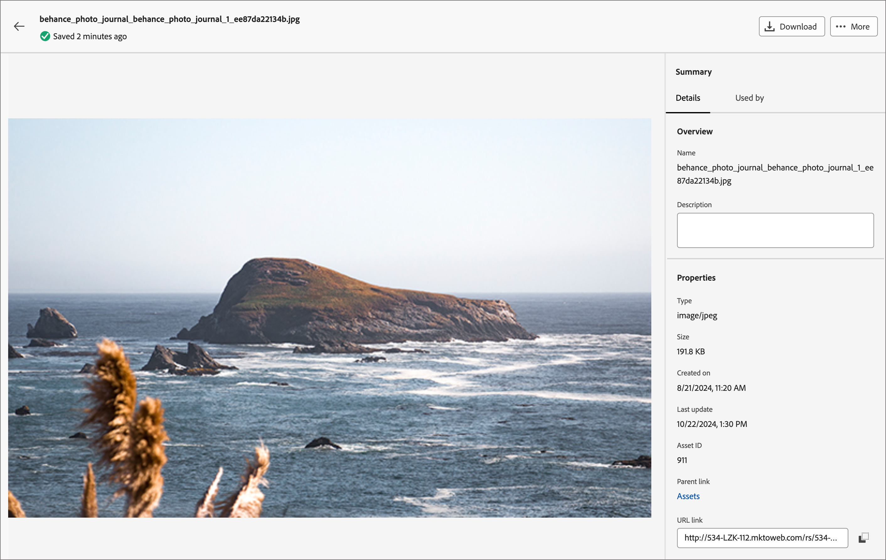
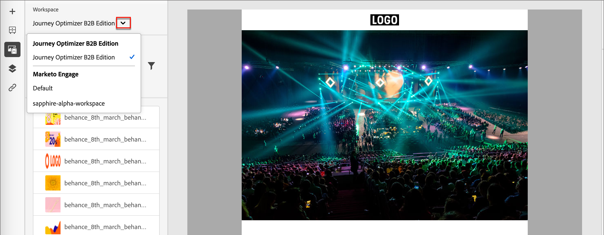

# Arbeiten mit Marketo Engage-Assets

Marketo Engage Design Studio ist die standardmäßige Asset-Quelle für Journey Optimizer B2B edition. Sie können die verfügbaren Assets einfach verwalten und verwenden, um Inhalte zu entwerfen, die die Journey Ihres Kontos unterstützen.

In Marketo Engage verwenden Marketing-Organisationen Arbeitsbereiche, um ihre Inhalts-Assets zu organisieren und Teams dabei zu helfen, auf das richtige Asset zuzugreifen. Gut definierte Arbeitsbereiche sind besonders hilfreich für große Unternehmen, die über ein großes Portfolio an Produktangeboten verfügen oder global mit unterschiedlichen Anforderungen für das Marketing in verschiedenen Regionen arbeiten.

## Zentrale Vermögensverwaltung

Standardmäßig gibt es einen **_[!UICONTROL Journey Optimizer B2B edition]_**-Arbeitsbereich, den Sie speziell für die Journey-Inhalte Ihres Kontos verwenden können. Die Assets, die Sie diesem Arbeitsbereich hinzufügen, sind in Marketo Engage nicht sichtbar oder nicht verfügbar. Für Assets, die sich in diesem Arbeitsbereich befinden, stehen alle Asset-Management-Funktionen in Journey Optimizer B2B edition zur Verfügung. Zu diesen Funktionen gehören:

* [Ersetzen](#replace-assets)
* [Löschen](#delete-assets)
* [Verschieben](#create-a-folder)
* [Mit Adobe Express bearbeiten](./image-edit-adobe-express.md)

Assets in den Marketo Engage-Arbeitsbereichen ist auf schreibgeschützten Zugriff zur Verwendung in E-Mails, E-Mail-Vorlagen und Fragmenten beschränkt. Sie können diesen Arbeitsbereichen neue Assets hinzufügen und eine Kopie eines Assets herunterladen.

## Durchsuchen von und Zugreifen auf Assets

Um über Journey Optimizer B2B edition auf Adobe Marketo Engage-Assets zuzugreifen, gehen Sie zum linken Navigationsbereich und klicken Sie auf **[!UICONTROL Content-Management]** > **[!UICONTROL Assets]**. Diese Aktion öffnet eine Listenseite mit allen aufgelisteten Assets.

{width="800" zoomable="yes"}

Der Journey Optimizer B2B edition-Arbeitsbereich ist standardmäßig ausgewählt. Die anderen Arbeitsbereiche sind unten aufgeführt.

* Um die Assets nach Arbeitsbereich und Ordner anzuzeigen, öffnen Sie die Struktur, indem _oben links auf_ Symbol „Ordner anzeigen“ klicken.

* Um die Tabelle nach einer der Spalten zu sortieren, klicken Sie auf den Spaltentitel. Der Pfeil in der Titelzeile zeigt die aktuelle Sortierspalte und -reihenfolge an.

* Um im ausgewählten Arbeitsbereich oder Ordner nach einem Bild-Asset zu suchen, geben Sie eine Textzeichenfolge in die Suchleiste ein.

* Um die in der Tabelle angezeigten Spalten anzupassen, klicken Sie auf das Symbol _Tabelle anpassen_ (  ) oben rechts.

  Wählen Sie die Spalten aus, die in der Liste angezeigt werden sollen, und klicken Sie auf **[!UICONTROL Anwenden]**.

## Asset-Details anzeigen

Klicken Sie auf den Namen eines Assets, um die Asset-Detailseite zu öffnen.

{width="700" zoomable="yes"}

## Anzeigen von durch Verweise verwendeten Assets

Klicken Sie auf der Seite mit den Asset-Details auf die Registerkarte **[!UICONTROL Verwendet von]**, um Details zur aktuellen Verwendung des Assets in Journey Optimizer B2B edition sowie zu E-Mails, E-Mail-Vorlagen und Fragmenten anzuzeigen.

>[!IMPORTANT]
>
>Assets, die derzeit in _E_ Mails, E-Mail-Vorlagen oder Fragmenten VERWENDET) sind **können** gelöscht werden.

Im Bedienfeld werden die Verweise nach Kategorie angezeigt: _E_, _E-Mail-Vorlage_ oder _Fragment_. E-Mails in Journey Optimizer B2B edition sind in Journey eingebettet und verfasst, sodass die übergeordnete Journey der E-Mail, die das Asset verwendet, als Referenzen angezeigt wird.

Durch Klicken auf den Link werden Sie zu der entsprechenden E-Mail, E-Mail-Vorlage oder dem Fragment weitergeleitet, in der bzw. dem das Asset verwendet wird.

{width="700" zoomable="yes"}

## Hinzufügen von Assets

Auf der Listenseite _Assets_ können Sie Bild-Assets zu Journey Optimizer B2B edition Workspace oder Marketo Engage Workspace hinzufügen.

1. Klicken **[!UICONTROL oben]** auf &quot;Assets hinzufügen“.

1. Ziehen Sie _[!UICONTROL Dialogfeld]_ Assets hinzufügen“ per Drag-and-Drop eine oder mehrere Dateien aus Ihrem System in das Feld „Datei“.

   {width="500"}

   Sie können auch auf den Link _[!UICONTROL Datei auf Ihrem Computer auswählen]_ klicken, um Ihr lokales Dateisystem zum Suchen und Auswählen von Dateien zu verwenden.

   Sie können Assets von Ihrem lokalen System mit bis zu 10 Dateien gleichzeitig hochladen. Die maximale Dateigröße beträgt 100 MB.

   Die Dateinamen der ausgewählten Bilder werden im Dialogfeld angezeigt. Asset-Dateinamen müssen eindeutig sein (in allen Ordnern). Wenn bereits eine Datei mit dem Namen vorhanden ist, wird eine Meldung angezeigt. Namen dürfen maximal 100 Zeichen lang sein und keine Sonderzeichen enthalten (beispielsweise `;`, `:`, `\` und `|`).

1. Wählen Sie den Zielarbeitsbereich oder -ordner aus, um die Assets zu speichern.

   >[!NOTE]
   >
   >Wenn Sie einen Speicherort im Arbeitsbereich _[!UICONTROL Journey Optimizer B2B edition]_ auswählen, können Sie das Asset in der App verwalten. Wenn Sie das Asset zu einem Marketo Engage-Arbeitsbereich hinzufügen, stehen die Asset-Management-Funktionen nur im Marketo Engage Design Studio zur Verfügung.

1. Um Dateien beim Hochladen einer oder mehrerer Dateien mit einem vorhandenen Dateinamen zu überschreiben (zu ersetzen), aktivieren Sie das Kontrollkästchen **[!UICONTROL Vorhandene Dateien überschreiben]**.

1. Klicken Sie auf **[!UICONTROL Hinzufügen]**.

## Löschen von Assets

Assets, die derzeit in E-Mails, E-Mail-Vorlagen oder Fragmenten verwendet werden, können nicht gelöscht werden. Überprüfen Sie die von verwendeten Referenzen, bevor Sie mit dem Entfernen eines Assets beginnen. Außerdem kann eine Löschaktion nicht rückgängig gemacht werden. Überprüfen Sie dies, bevor Sie eine Entfernungsaktion starten.

Verwenden Sie eine der folgenden Methoden, um ein Asset zu löschen, das sich im Arbeitsbereich _[!UICONTROL Journey Optimizer B2B edition]_ befindet:

* Gehen Sie zu den Asset-Details und klicken Sie auf **[!UICONTROL … Mehr]** oben rechts und wählen Sie **[!UICONTROL Löschen]** aus den Optionen aus.

  {width="600" zoomable="yes"}

* Klicken Sie auf der __ Assets _auf das Symbol Mehr_ (**[!UICONTROL …]**) neben dem Asset-Element und wählen Sie **[!UICONTROL Löschen]** aus den Optionen.

  {width="600" zoomable="yes"}

  >[!NOTE]
  >
  >Nur Assets, die sich im Arbeitsbereich _[!UICONTROL Journey Optimizer B2B edition]_ befinden, verfügen über Asset-Management-Funktionen im Menü _Mehr_.

Diese Aktion öffnet ein Bestätigungsdialogfeld. Sie können den Vorgang abbrechen, indem Sie auf **[!UICONTROL Abbrechen]** klicken oder auf **[!UICONTROL Löschen]** klicken, um den Löschvorgang zu bestätigen.

Wenn das Asset derzeit verwendet wird, wird durch die Aktion ein Informationsdialogfeld geöffnet, in dem Sie darauf hingewiesen werden, dass es nicht gelöscht werden kann. Klicken Sie auf **[!UICONTROL OK]**, wodurch die Entfernung abgebrochen wird.

## Ersetzen von Assets

Verwenden Sie eine der folgenden Methoden, um ein Asset zu ersetzen, das sich im Arbeitsbereich _[!UICONTROL Journey Optimizer B2B edition]_ befindet:

* Gehen Sie zu den Asset-Details und klicken Sie auf **[!UICONTROL … Mehr]** oben rechts und wählen Sie **[!UICONTROL Ersetzen]** aus den Optionen aus.

* Klicken Sie auf der __ Assets _auf das Symbol Mehr_ (**[!UICONTROL …]**) neben dem Asset-Element und wählen Sie **[!UICONTROL Ersetzen]** aus den Optionen aus.

Ziehen _[!UICONTROL im Dialogfeld]_ Asset ersetzen“ die Ersatzdatei per Drag-and-Drop von Ihrem System in das Feld „Datei“. Sie können auch auf den Link _[!UICONTROL Datei auf Ihrem Computer auswählen]_ klicken, um Ihr lokales Dateisystem zur Auswahl einer Datei zu verwenden. (Wenn Sie mehrere Dateien in Ihrem lokalen System auswählen, wird die erste ausgewählte Datei für den Ersatz verwendet.)

{width="500"}

Klicken Sie auf &quot;**[!UICONTROL &quot;, um]**. Sie können den Vorgang abbrechen, indem Sie auf **[!UICONTROL Abbrechen]** klicken.

Wenn die zu ersetzende Datei verwendet wird, werden Sie in einem Dialogfeld darauf hingewiesen, dass die neue Bilddatei das Bild dort ersetzt, wo sie verwendet wird (E-Mails, E-Mail-Vorlagen und Fragmente).

## Herunterladen von Assets

Sie können ein Asset mit einer der folgenden Methoden herunterladen:

* Gehen Sie zu den Asset-Details und klicken **[!UICONTROL oben]** auf „Herunterladen“.

* Klicken Sie auf der __ Assets _auf die_ (**[!UICONTROL …]**) neben dem Asset-Element und wählen Sie **[!UICONTROL Herunterladen]** aus den Optionen.

Klicken Sie im Bestätigungsdialogfeld auf **[!UICONTROL Herunterladen]**, um das Herunterladen des Assets auf Ihr lokales System zu starten. Sie können den Vorgang abbrechen, indem Sie auf **[!UICONTROL Abbrechen]** klicken.

## Massenaktionen auf ausgewählte Assets anwenden

Wählen Sie auf der Listenseite (_[!UICONTROL Content-Management]_ > _[!UICONTROL Assets]_) mehrere Assets gleichzeitig aus, indem Sie die einzelnen Kontrollkästchen links auswählen. Ein Nachrichtenbanner wird unten angezeigt, wenn Sie mehrere Assets auswählen.

{width="700" zoomable="yes"}

Sie können die folgenden Massenaktionen für ausgewählte Assets durchführen, die sich im Arbeitsbereich _[!UICONTROL Journey Optimizer B2B edition]_ befinden:

+++Verschieben von Assets

1. Klicken Sie im Auswahlbanner auf **[!UICONTROL Verschieben]**.

   Dadurch wird das Dialogfeld _[!UICONTROL Assets verschieben]_ geöffnet, in dem die Namen der ausgewählten Assets aufgelistet werden und Sie den _Zielordner_ auswählen können, in den Sie diese Assets verschieben möchten.

1. Ordner auswählen.

   Der Pfad neben _[!UICONTROL Ausgewählte Assets werden verschoben nach:]_ spiegelt die Änderung wider.

1. Klicken Sie **[!UICONTROL Verschieben]**.

+++

+++Löschen von Assets

>[!NOTE]
>
>Sie können einen Massenlöschvorgang für maximal 20 ausgewählte Assets anwenden.

1. Klicken Sie im Auswahlbanner auf **[!UICONTROL Löschen]**.

1. Klicken Sie im Bestätigungsdialog auf **[!UICONTROL Löschen]**.

   Wenn eines der ausgewählten Assets derzeit verwendet wird, wird das Entfernen dieses Assets abgebrochen und eine Warnmeldung wird angezeigt.

+++

## Erstellen eines Ordners

1. Klicken Sie auf der __ Assets **[!UICONTROL oben rechts auf]** Ordner erstellen“.

1. Geben Sie im Dialogfeld den Ordnernamen ein und wählen Sie den Ziel-(übergeordneten) Ordner für den neuen Ordner aus.

   Ordnernamen müssen eindeutig sein und dürfen maximal 100 Zeichen lang sein. Sie dürfen keine Sonderzeichen wie `;`, `:`, `\` oder `|` enthalten.

   {width="500"}

1. Klicken Sie auf **[!UICONTROL Hinzufügen]**.

## Anwenden von Aktionen auf Ordnerebene

Im Arbeitsbereich _[!UICONTROL Journey Optimizer B2B edition]_ können Sie Aktionen auf einen Ordner oder Assets im Ordner anwenden. Klicken Sie auf das _Mehr_-Symbol (**…**) neben dem Ordner, um die Aktionen anzuzeigen, die Sie darauf anwenden können.

{width="700" zoomable="yes"}

Sie können die folgenden Aktionen auf Ordnerebene ausführen:

+++Hinzufügen von Assets

1. Wählen Sie **[!UICONTROL Assets hinzufügen]** aus, um Bilddateien in den Ordner hochzuladen.

1. Ziehen Sie _[!UICONTROL Dialogfeld „Assets hinzufügen]_ die Dateien per Drag-and-Drop aus Ihrem System. Sie können auch auf den Link klicken, um Ihr Dateisystem zur Auswahl der Dateien zu verwenden.

   Sie können Assets aus Ihrem lokalen System mit bis zu 10 Dateien gleichzeitig hinzufügen. Sie haben die Möglichkeit, Dateien zu überschreiben, wenn Sie eine oder mehrere Dateien mit einem vorhandenen Dateinamen hochladen.

   Die Dateinamen der ausgewählten Bilder werden im Dialogfeld angezeigt. Asset-Dateinamen müssen eindeutig sein (in allen Ordnern). Wenn bereits eine Datei mit dem Namen vorhanden ist, wird eine Fehlermeldung angezeigt. Namen dürfen maximal 100 Zeichen lang sein und keine Sonderzeichen enthalten (beispielsweise `;`, `:`, `\` und `|`).

1. Klicken Sie auf **[!UICONTROL Hinzufügen]**.

+++

+++Erstellen eines Unterordners

1. Wählen Sie **[!UICONTROL Ordner erstellen]**.

1. Geben Sie im Dialogfeld den Ordnernamen ein.

   Ordnernamen müssen eindeutig sein und dürfen maximal 100 Zeichen lang sein. Sie dürfen keine Sonderzeichen wie `;`, `:`, `\` oder `|` enthalten.

1. Klicken Sie auf **[!UICONTROL Hinzufügen]**.

+++

+++Ordner umbenennen

1. Wählen Sie **[!UICONTROL Umbenennen]** aus.

1. Geben Sie im Dialogfeld den neuen Ordnernamen ein.

   Ordnernamen müssen eindeutig sein und dürfen maximal 100 Zeichen lang sein. Sie dürfen keine Sonderzeichen wie `;`, `:`, `\` oder `|` enthalten.

1. Klicken Sie auf **[!UICONTROL Speichern]**.

+++

+++Ordner verschieben

1. Um den Ordner in einen anderen übergeordneten Ordner zu verschieben, wählen Sie **[!UICONTROL Verschieben]** aus.

1. Wählen Sie im Dialogfeld den Zielordner als neuen übergeordneten Ordner für den Unterordner aus.

1. Klicken Sie **[!UICONTROL Verschieben]**.

   Wenn Sie versuchen, einen Ordner in einen seiner eigenen Unterordner zu verschieben (innerhalb der Struktur des ausgewählten Ordners), wird eine Fehlermeldung angezeigt und der Verschieben wird abgebrochen.

+++

+++Ordner löschen

1. Wählen Sie **[!UICONTROL Löschen]**.

1. Klicken Sie im Bestätigungsdialog auf **[!UICONTROL Löschen]**.

Wenn eines der Assets im Ordner derzeit verwendet wird, wird ein Warndialogfeld geöffnet, in dem Sie darüber informiert werden, dass es nicht gelöscht werden kann. Klicken Sie auf **[!UICONTROL OK]**, wodurch die Entfernung abgebrochen wird.

+++

+++In Archivordner konvertieren

Die Archivierung eines Ordners macht die darin enthaltenen Dateien undurchsuchbar. Verwenden Sie die Archivierungsfunktion für Asset-Dateien, die Ihr Teammitglied künftig nicht mehr verwenden soll, z. B. ein veraltetes Veranstaltungsabzeichen oder saisonale Inhalte. Später können Sie die Archivierung eines Ordners aufheben, wenn der Inhalt wieder verfügbar sein soll.

* Wählen Sie **[!UICONTROL In Archivordner konvertieren]**. Ein Bestätigungsbanner wird angezeigt, um zu bestätigen, dass der Ordnerstatus in „Archiviert“ geändert wurde.

* Wählen Sie **[!UICONTROL Archivierung des Ordners aufheben]**. Ein Bestätigungsbanner wird angezeigt, um zu bestätigen, dass der Ordnerstatus in „Nicht archiviert“ geändert wurde.

+++

## Verwenden von Assets in Inhalten

Assets kann in der E-Mail-, E-Mail-Vorlage oder beim Erstellen visueller Fragmente des Teams über den Visual Content Editor verwendet werden.

Wählen Sie in der visuellen Entwurfsleiste das Symbol _Marketo Engage Assets_ (  ) in der linken Seitenleiste aus.

Durch diese Aktion wird das Bedienfeld Tools geändert, das eine strukturierte Liste der verfügbaren Assets im ausgewählten Arbeitsbereich anzeigt. Wählen Sie den Arbeitsbereich aus, den Sie für die Auswahl eines Assets anzeigen möchten.

{width="700" zoomable="yes"}

Es gibt mehrere Methoden zum Hinzufügen eines Bild-Assets zur visuellen Arbeitsfläche:

* Ziehen Sie eine Miniaturansicht per Drag-and-Drop aus dem linken Navigationsbereich.

* Fügen Sie eine Bildkomponente zur Arbeitsfläche hinzu und klicken Sie in der Komponente auf **[!UICONTROL Marketo EngageAssets]**, um das Dialogfeld _[!UICONTROL Asset aus Adobe Marketo Engage auswählen]_ zu öffnen.

  {width="700" zoomable="yes"}

  Im Dialogfeld können Sie ein Bild aus dem ausgewählten Repository auswählen. Klicken Sie auf **[!UICONTROL Auswählen]**, um das Asset hinzuzufügen.

  Es stehen Tools zur Verfügung, mit denen Sie das benötigte Asset finden können:

   * Klicken Sie _oben links auf_ Filter), um die angezeigten Elemente nach Ihren Kriterien zu filtern.

   * Geben Sie Text in das _Suchen_-Feld ein, um die angezeigten Elemente nach einer Übereinstimmung mit dem Asset-Namen zu filtern.

  {width="700" zoomable="yes"}
