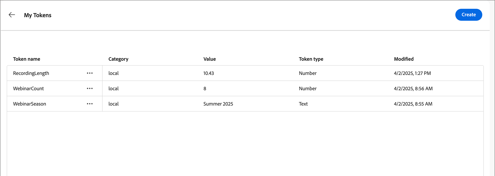

# Benutzerdefinierte Token für die E-Mail-Personalisierung

Die Inhaltspersonalisierung verwendet Token als Platzhalter oder Variablen, die beim Generieren des Inhaltsartefakts aufgefüllt werden. Standard-Personalisierungs-Token sind für E-Mails, Landingpages, Fragmente und Vorlagen verfügbar. Sie können auch einen Satz benutzerdefinierter Token mit Werten definieren, die für die Konto-Journey spezifisch sind. Dieser Satz benutzerdefinierter Token wird als &quot;_Token“ bezeichnet_ und jedes dieser benutzerdefinierten Token dient zur Personalisierung beim [Verfassen von Journey-E-Mails](./email-authoring.md#content-authoring---personalization).

Zusätzlich zu _Meine Token_ die speziell für die Account-Journey gelten, können Sie jedes der standardmäßigen (integrierten) Token für die E-Mail-Personalisierung verwenden.

## Meine Token verwalten {#my-tokens}

Die _Meine Token_ sind benutzerdefinierte Variablen, die Sie für eine Konto-Journey im Entwurfsstatus erstellen oder ändern. Dieser benutzerdefinierte Token-Satz unterstützt derzeit Text- und Zahlen-Token-Definitionen.

Wenn Sie einer E-Mail ein benutzerdefiniertes Token hinzufügen, wird es als `{{my.TokenName}}` angezeigt. Beispielsweise könnten Sie `{{my.EventDate}}` oder `{{my.WebinarSpeaker}}` Token erstellen, um E-Mail-Inhalte im Zusammenhang mit kommenden Webinaren zu verwalten.

_So greifen Sie auf die benutzerdefinierten Token für eine Konto-Journey zu:_

1. Öffnen Sie die Journey des Kontoentwurfs.

1. Klicken Sie oben rechts auf das **[!UICONTROL Mehr…]** und wählen Sie **[!UICONTROL Meine Token]**.

   {width="450"}

   Auf _Seite „Meine_&quot; werden alle benutzerdefinierten Token aufgelistet, die für die Journey definiert sind.

   {width="700" zoomable="yes"}

### Erstellen eines Tokens

1. Klicken Sie auf _[!UICONTROL Seite]_ Meine Token“ auf **[!UICONTROL Erstellen]** und wählen Sie den Tokentyp aus, den Sie definieren möchten:

   * **[!UICONTROL Text]** - Verwenden Sie diesen Typ, um ein Token mit einem grundlegenden Text-Zeichenfolgenwert zu definieren.

   * **[!UICONTROL Number]** - Verwenden Sie diesen Typ, um ein Token mit einem numerischen Wert zu definieren.

1. Geben Sie im Dialogfeld die Werte **[!UICONTROL Name]** und **[!UICONTROL Wert]** für das Token ein.

   {width="400"}

   Sie können im Token-Namen keine Leerzeichen oder Sonderzeichen verwenden. Sie können _Binnenmajuskel-Schreibweise_ wie `EventType` verwenden, um einen Namen mit mehreren Wörtern zu verwenden, der leicht zu identifizieren ist.

   Wenn Sie ein Token _Zahl_ definieren, darf der Wert nur numerische Zeichen enthalten. Sie können einen Dezimalwert verwenden.

   {width="400"}

1. Klicken Sie auf **[!UICONTROL Hinzufügen]**.

### Token bearbeiten

Solange die Konto-Journey im Entwurfsstatus verbleibt, können Sie jedes der definierten „Meine Token“ bearbeiten.

1. Klicken Sie auf _[!UICONTROL Seite]_ Meine Token“ auf das Symbol _Mehr Aktionen_ (**…**) neben dem Token-Namen und wählen Sie **[!UICONTROL Bearbeiten]**.

   {width="430"}

1. Ändern Sie im Dialogfeld die Werte **[!UICONTROL Name]** und **[!UICONTROL Value]** nach Bedarf für die Journey.

   {width="400"}

1. Klicken Sie auf **[!UICONTROL Bearbeiten]**.

### Token löschen

Sie können ein benutzerdefiniertes Token aus der Liste _Meine Token_ löschen, sollten jedoch sicherstellen, dass es derzeit nicht in Ihrem Journey-E-Mail-Inhalt verwendet wird.

1. Klicken Sie auf _[!UICONTROL Seite]_ Meine Token“ auf das Symbol _Mehr Aktionen_ (**…**) neben dem Token-Namen und wählen Sie **[!UICONTROL Löschen]**.

1. Klicken Sie im Bestätigungsdialogfeld auf **[!UICONTROL Löschen]**.

## Verwenden benutzerdefinierter Token in Ihrem Inhalt

Wenn Sie E-Mail-Inhalte für Ihre Konto-Journey erstellen, können Sie eines der Token aus der Liste _Meine Token_ verwenden, wenn Sie die Personalisierungs-Tools im visuellen Design verwenden.

1. Wählen Sie die Textkomponente aus und klicken Sie auf das Symbol _Personalisierung hinzufügen_ (  ) in der Symbolleiste.

   {width="600"}

   Dadurch wird das Dialogfeld _Personalization bearbeiten_ geöffnet. Das Dialogfeld enthält einen Ordner _[!UICONTROL Meine Token]_ in der _[!UICONTROL Personalization Tokens]_-Bibliothek, wenn benutzerdefinierte Token für die Konto-Journey definiert sind.

1. Erweitern Sie den Ordner **[!UICONTROL Meine Token]** und klicken Sie dann auf **+** oder **…**, um eines Ihrer benutzerdefinierten Token zu dem Leerzeichen hinzuzufügen.

   Sie können bei Bedarf zusätzlichen statischen Text hinzufügen.

   {width="700" zoomable="yes"}

1. Klicken Sie auf **[!UICONTROL Speichern]**.
