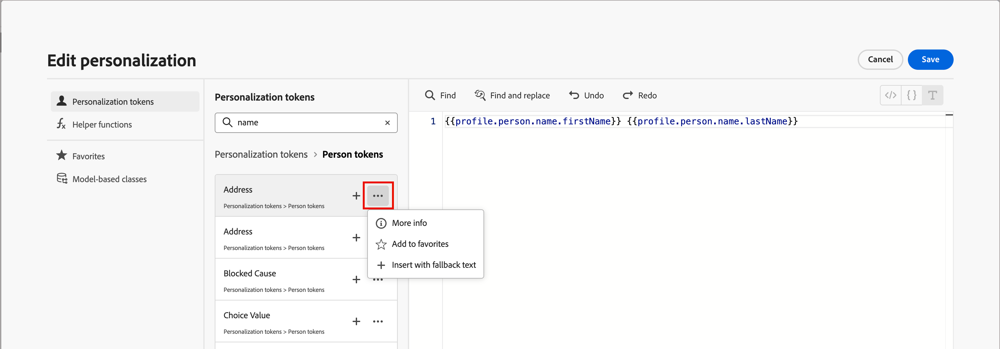
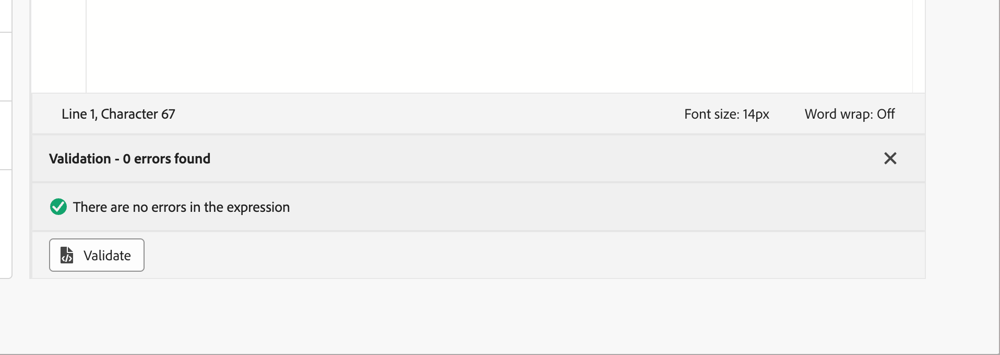

# Content-Personalisierung {#add-personalization}

>[!CONTEXTUALHELP]
>id="aj-b2b_personalization"
>title="Personalisieren von Inhaltserlebnissen"
>abstract="Verwenden Sie **Adobe Journey Optimizer B2B Edition**, um Ihre Nachrichten an einzelne Empfängerinnen und Empfänger anzupassen, indem Sie die Daten und Informationen nutzen, die Sie über diese haben. Dabei kann es sich um den Vornamen, die Branche, den Titel und mehr handeln."

[!DNL Adobe Journey Optimizer B2B Edition] Personalisierungsfunktionen ermöglichen es Ihnen, Ihre E-Mail-Nachrichten an jeden einzelnen Empfänger anhand der vorhandenen Daten anzupassen. Dabei kann es sich um den Vornamen, die Branche, den Titel und mehr handeln.

Mit dem _Personalisierungseditor_ können Sie alle Daten auswählen, anordnen, anpassen und validieren, um eine benutzerdefinierte Personalisierung für Ihre Inhalte zu erstellen. Verwenden Sie verschiedene Tools, z. B. Hilfsfunktionen, um Nachrichten anzupassen. Der Editor verwendet eine Inline-Personalisierungssyntax, die auf _Handlebars_ basiert. Dabei werden Ausdrücke mit Inhalten erstellt, die von geschweiften Klammern `{{}}` eingeschlossen sind.

Bei der Verarbeitung der Nachricht ersetzt Journey Optimizer B2B edition den Ausdruck durch die im Adobe Experience Platform-Datensatz enthaltenen Daten und die Werte des lokalen Systems. Beispielsweise wird `Hello {{profile.person.name.firstName}} {{profile.person.name.lastName}}` dynamisch zu `Hello John Doe`.

Mit dieser Syntax können Sie Nachrichten über mehrere Felder hinweg personalisieren, einschließlich E-Mail-Betreffzeilen, Nachrichtentexten und Absenderinformationen.

## Personalization-Token

In [!DNL Journey Optimizer B2B Edition] können Sie Ihren dynamischen E-Mail-Inhalt mithilfe von Personalisierungs-Token erstellen:

* **Konto-Token** - Diese Token basieren auf den Kontoattributen, z _B. „Kontoname_, _Branche_ und _Anzahl der Mitarbeiter_. Verwenden Sie diese Token, um Attributdaten auszufüllen, die vom Schema **_XDM Business Account Details_** verwaltet werden, das in Adobe Experience Platform definiert ist.

* **Personen**-Token: Diese Token basieren auf den Attributen von Geschäftspersonen, wie _Vorname_, _Stellenbezeichnung_ und _Firmenname_. Verwenden Sie diese Token, um Attributdaten auszufüllen, die vom Schema **_XDM-Geschäftspersonendetails_** verwaltet werden, das in Adobe Experience Platform definiert ist.

* **System-**: Diese Token basieren auf den Systemfeldwerten, z. B. _Datum_, _Uhrzeit_ und _Abmelde-Link_.

* **Meine Token** (wenn für die Journey definiert) - Die [benutzerdefinierten Token, die für die Journey definiert sind](./personalization-my-tokens.md) in denen sich die E-Mail befindet.

>[!NOTE]
>
>Weitere Informationen zu den XDM-Schemata finden Sie in der Dokumentation zum [Adobe Experience Platform-Datenmodell (XDM)](https://experienceleague.adobe.com/de/docs/experience-platform/xdm/home){target="_blank"}.

## Personalisierungseditor

Der Personalisierungseditor ist in jedem Kontext verfügbar, in dem Sie die Personalisierung in E-Mail-Inhalten definieren müssen. Im Editor können Sie alle Daten auswählen, anordnen, anpassen und validieren, um eine benutzerdefinierte Personalisierung für Ihre Inhalte zu erstellen.

Fügen Sie Personalisierung in einem beliebigen Feld oder einer beliebigen Inhaltskomponente hinzu, indem Sie auf das Symbol _Personalisierung hinzufügen_ ( klicken.

{width="800" zoomable="yes"}

### Token und Helper-Funktionen

Um ein Personalisierungs-Token oder eine Hilfsfunktion zu verwenden, suchen Sie es im linken Navigationsbereich und klicken Sie auf **+**, um es bzw. sie dem Ausdruck hinzuzufügen.

Klicken Sie auf das Symbol _Mehr_ ( **…** ) (neben dem Symbol _Hinzufügen_ ( **+** ), um weitere Details zu jedem Attribut anzuzeigen und Ihre am häufigsten verwendeten Attribute zu den _Favoriten_ hinzuzufügen. Zu Favoriten hinzugefügte Attribute sind über das Menü **[!UICONTROL Favoriten]** im linken Navigationsbereich des Editors zugänglich.

{width="800" zoomable="yes"}

<!--
>[!NOTE]
>
>By default, the attributes list shows only populated attributes. To display all attributes, click the _Settings_ icon above the search field and toggle off the **[!UICONTROL Show only populated attributes]** option.
-->

Sie können auch eine standardmäßige Fallback-Textzeichenfolge definieren, die angezeigt wird, wenn ein Profilattribut vom Typ Zeichenfolge leer ist. Klicken Sie auf das Symbol _Mehr_ ( **…** ) für das Attribut und wählen Sie **[!UICONTROL Einfügen mit Fallback-Text]**. Geben Sie den Text ein, der angezeigt werden soll, wenn der Wert des Attributs für ein Profil leer ist, und klicken Sie dann auf **[!UICONTROL Hinzufügen]**.

Es empfiehlt sich, den Ausdruck zu validieren, bevor Sie ihn in den Inhalt einfügen. Klicken **[!UICONTROL unten]** Editor auf „Validieren“, um Ihre Syntax zu überprüfen und sicherzustellen, dass keine Fehler auftreten.

{width="500"}

Wenn der Ausdruck vollständig und fehlerfrei ist, klicken Sie auf **[!UICONTROL Speichern]**.

### Benutzerdefinierte Datensätze

[!BADGE Beta]{type=Informative tooltip="Beta-Funktion"}

Sie können relationale Schemata zur E-Mail-Personalisierung verwenden. Die benutzerdefinierten Objekte werden in _relationalen Schemata_ definiert und ein Produktadministrator kann [relationale Schemafelder konfigurieren](../admin/xdm-field-management.md#relational-schemas) in [!DNL Journey Optimizer B2B Edition]. Auf diese Felder kann über den Personalisierungseditor zugegriffen werden. Es sind nur benutzerdefinierte Objekte verfügbar, die eine Eins-zu-Viele-Beziehung (1:M) zu Personen oder Konto haben.

>[!IMPORTANT]
>
>Bevor Sie benutzerdefinierte Objekte für die skriptbasierte Personalisierung verwenden, stellen Sie sicher, dass Sie die [Handlebars-Vorlagensprache](https://handlebarsjs.com/guide/), [Personalisierungssyntax](./personalization-syntax.md) und die integrierten [Hilfsfunktionen](./personalization-helper-functions.md).

Wenn Sie die Personalisierung mit benutzerdefinierten Objekten definieren, können Sie in Objekten, auf die über das Skript zugegriffen werden kann, auf alle Variablen in den **[!UICONTROL Personalization-Token]** (Person/Lead, Konto, System und Meine Token) und den **[!UICONTROL Benutzerdefinierte Objekte]** (relationale Schemata) zugreifen. Wenn Sie benutzerdefinierte Objekte ausgewählt haben, können Sie die Felder anzeigen, indem Sie auf den Ordner Benutzerdefinierte Objekte klicken. Klicken Sie für jedes Feld, das Sie dem Ausdruck hinzufügen möchten, auf **+**.

{width="700" zoomable="yes"}
