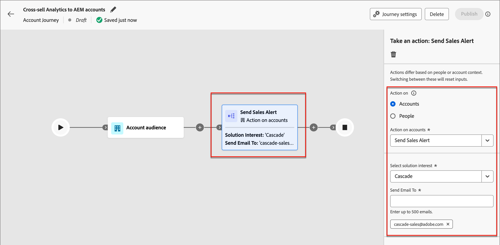

# Benachrichtigungs-E-Mail für Verkauf

Eine _Benachrichtigungs-E-Mail_ signalisiert die Übergabe von Einkaufsgruppen an den Verkauf. Die E-Mail enthält eine Zusammenfassung der Einkaufsgruppe und Informationen über die Mitglieder der Einkaufsgruppe und ihre Aktivitäten.

Als Marketing-Experte können Sie einen E-Mail-Knoten für Verkaufswarnungen in Ihren Account-Journey konfigurieren, um Ihr Sales-Team über den Abschluss der Journey für bestimmte Einkaufsgruppen zu informieren. Innerhalb des Knotens können Sie die E-Mail-Adressen des Vertriebsteams oder einen Verteilungsalias angeben, der eine Reihe von Konten erreicht.

>[!IMPORTANT]
>
>Vergewissern Sie sich, dass die Zulassungsliste Ihres Unternehmens aktualisiert wurde, damit eine E-Mail mit einem Warnhinweis für den Verkauf zugestellt werden kann. Weitere Informationen finden Sie unter [Protokolle für Tracking und E-Mail-Versand](../start/email-protocols.md).

## E-Mail-Inhalt

+++Beispiel einer E-Mail zu einem Verkaufsalarm
{width="500" zoomable="yes"}

+++

| Abschnitt | Name | Beschreibung |
| - | ---- | ----------- |
| Informationen zur Einkaufsgruppe | Name der Einkaufsgruppe | Anzeigename für die Einkaufsgruppe. |
|   | Kontoname | Name des Kontos. |
|   | Engagement-Bewertung | Engagement-Score der kaufenden Gruppe, basierend auf den aktiven Interaktionsaktivitäten der letzten 30 Tage. |
|   | Vollständigkeitsindex | Vollständigkeitsbewertung der Einkaufsgruppe. |
|   | Lösungsinteresse | Interesse an der Lösung in Verbindung mit der kaufenden Gruppe“ |
|   | Status | Status der Einkaufsgruppe. |
| Einkaufsgruppen-Highlights | Am häufigsten beteiligte Mitglieder | Top-Engagierte Mitglieder der Einkaufsgruppe, indem sie den Engagement-Score und die Rolle eines Gruppenmitglieds kaufen. |
|   | Interessantes Thema | Die häufigsten Schlüsselwörter, die bei der Interaktion mit Inhalten auftreten, basierend auf E-Mails, Downloads, Chat, PDF-Überprüfung, Aktivitätszusammenfassung und Fragen zu Webinaren. |
|   | Fehlende Rollen | Obligatorische Rollen in der Vorlage, fehlen jedoch in der Einkaufsgruppe. |
| Zusammenfassung der Einkaufsgruppe | Aktivitätsübersicht (unterstützt durch generative KI) | KI-generierte Zusammenfassung der Einkaufsgruppe basierend auf den Aktivitäten der Mitglieder. Die Aktivitäten der letzten 30 Tage werden berücksichtigt. |
|   | Wichtige interessante Momente | Neueste interessante Momente im Zusammenhang mit den Mitgliedern der Einkaufsgruppe. |
| Mitglieder | Liste von vier kaufenden Mitgliedern | Details zu den vier besten Mitgliedern der Einkaufsgruppe nach Engagement und Rolle. |
| Jedes Mitglied der Einkaufsgruppe | Abonnentenname | Name des kaufenden Gruppenmitglieds. |
|   | Titel | Titel des kaufenden Gruppenmitglieds. |
|   | Role | Die Rolle der Einkaufsgruppe des Mitglieds. |
|   | Engagement-Bewertung | Bewertung der Interaktion mit kaufenden Gruppenmitgliedern. Die Punktzahl basiert auf den aktiven Interaktionsaktivitäten der letzten 30 Tage. |
|   | Letzter interessanter Moment | Der neueste interessanteste Moment bezog sich auf das Mitglied. |
|   | Zuletzt verwendete Aktivitäten | Die letzten beiden Aktivitäten beziehen sich auf das Mitglied der Einkaufsgruppe. |
|   | E-Mail-ID | E-Mail-ID des kaufenden Gruppenmitglieds. |
|   | Telefonnummer | Telefonnummer des kaufenden Gruppenmitglieds. |

## Hinzufügen einer E-Mail-Aktion für Verkaufswarnung zu einer Konto-Journey

Sie können den E-Mail-Versand von Warnhinweisen für den Verkauf auf einer Konto-Journey einrichten, wenn Sie einen _[!UICONTROL Aktion durchführen]_-Knoten hinzufügen:

1. Wählen Sie für _[!UICONTROL Zielgruppe]_ Aktion“ die Option **[!UICONTROL Konto]** aus.

1. Wählen Sie für _[!UICONTROL Aktion auf]_ Konten“ **[!UICONTROL Verkaufswarnung senden]** aus.

1. Wählen Sie unter **[!UICONTROL Interesse an Lösung auswählen]** die gewünschte Lösung für den generierten E-Mail-Inhalt aus.

1. Geben **[!UICONTROL unter „E-Mail]**&quot; jede E-Mail-Adresse oder jeden Alias ein, den Sie für den Versand verwenden möchten.

   {width="600" zoomable="yes"}

   Nach der Veröffentlichung der Account-Journey wird die Verkaufswarnung gemäß diesen Parametern zugestellt.
