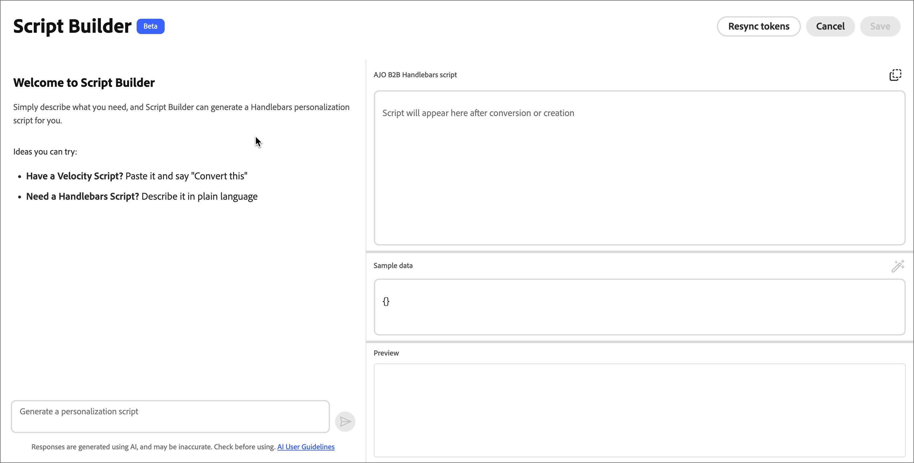

# Skript-Builder

_Script Builder_ ist ein KI-gestützter Assistent, der im [!DNL Adobe Journey Optimizer B2B Edition] E-Mail-Design-Bereich verfügbar ist. Dies hilft Marketing-Experten und E-Mail-Entwicklern, Personalisierungsskripte schneller zu erstellen, und es hilft bei der Migration aus [!DNL Marketo Engage], indem bestehende Personalisierungslogik in [!DNL Journey Optimizer B2B Edition] konvertiert wird, ohne Code manuell neu zu schreiben.

>[!AVAILABILITY]
>
>Script Builder ist derzeit für ausgewählte Kunden als eingeschränkte Beta-Version für E-Mails verfügbar (nur **_-Journey_**. Der Support für Personen-Journey ist für eine künftige Version geplant. Wenden Sie sich an Ihren Adobe-Support-Mitarbeiter, um Zugriff zu erhalten.

Für die Erstellung von bedingter E-Mail-Personalisierung, wie das Wechseln von Sprachblöcken nach Gebietsschema, das Austauschen von Inhalten nach Region oder Rolle oder das Einfügen dynamischer Profil- oder Objektwerte, ist die Erstellung von _Handlebars_-Ausdrücken erforderlich. Wenn Sie von [!DNL Marketo Engage] migrieren, stehen Sie vor der zusätzlichen Herausforderung, _Velocity_-Skripte Zeile für Zeile neu zu schreiben. Script Builder beseitigt beide Hindernisse über eine einzige Oberfläche für Gespräche:

* Generieren eines neuen Handlebars-Personalisierungsskripts aus einer einfachen Beschreibung
* Fügen Sie ein [!DNL Marketo Engage] Velocity-Skript ein und konvertieren Sie es in ein äquivalentes Handlebars-Skript mit automatischer Token-Zuordnung.
* Vorschau, Bearbeitung, Validierung und Speichern der Ausgabe direkt in der E-Mail, ohne zwischen Tools zu kopieren und einzufügen.

## Richtlinien und Einschränkungen

>[!IMPORTANT]
>
>Der Benutzerzugriff auf Script Builder wird über dieselben Berechtigungen gesteuert wie für andere generative KI-Funktionen in [!DNL Journey Optimizer B2B Edition]. Informationen zum Gewähren von Funktionsberechtigungen finden Sie unter [Aktivieren des Zugriffs auf den KI-Assistenten](../ai-assistant/enable-ai-assistant-access.md).

Bevor Sie Script Builder verwenden, lesen Sie die [Richtlinien und Einschränkungen](../ai-assistant/generative-ai-content.md#general-guidelines-and-limitations) die für Funktionen der generativen KI in [!DNL Journey Optimizer B2B Edition] gelten. [Benutzerzustimmung](https://www.adobe.com/de/legal/licenses-terms/adobe-gen-ai-user-guidelines.html){target="_blank"} ist auch eine Akzeptanz erforderlich, bevor Sie KI-Funktionen verwenden können.

Machen Sie sich mit der [Handlebars-Vorlagensprache](https://handlebarsjs.com/guide/){target="_blank"}, der [Personalisierungssyntax](./personalization-syntax.md) und den [Hilfsfunktionen](./personalization-helper-functions.md) vertraut, die in [!DNL Journey Optimizer B2B Edition] unterstützt werden. Script Builder generiert gültige Handlebars für Sie. Wenn Sie die Syntax jedoch verstehen, können Sie die Ausgabe mit Konfidenz überprüfen und bearbeiten.

## Skriptbaukasten öffnen {#open-script-builder}

Script Builder ist im [Personalisierungseditor](./personalization.md) verfügbar, während Sie [E-Mail-Inhalte erstellen](./email-authoring.md) für eine Konto-Journey.

1. Wählen Sie im E-Mail-Design-Bereich die Komponente aus, der Sie ein Personalisierungsskript hinzufügen oder ersetzen möchten.

1. Um den Personalisierungseditor zu öffnen, klicken Sie auf das Symbol _Personalisierung hinzufügen_ (  ).

1. Wählen Sie im Editor die Option **[!UICONTROL Script Builder]**.

   {width="700" zoomable="yes"}

   >[!BEGINSHADEBOX]

   Wenn Sie das erste Mal auf Script Builder zugreifen, lesen Sie die [_[!UICONTROL Nutzungsbedingungen für Generative AI ]_](https://www.adobe.com/de/legal/licenses-terms/adobe-gen-ai-user-guidelines.html){target="_blank"} und bestätigen Sie Ihre Zustimmung.

   {width="400"}

   >[!ENDSHADEBOX]

   Das Script Builder-Bedienfeld öffnet sich mit einer Chat-Oberfläche.

   {width="700" zoomable="yes"}

1. Starten Sie den Chat entsprechend dem, was Sie tun möchten:

   * [Neues Skript erzeugen](#generate-personalization-script)
   * [Konvertieren eines vorhandenen Velocity-Skripts](#convert-marketo-velocity-script)

## Personalisierungsskript generieren {#generate-personalization-script}

Verwenden Sie den Skriptgenerator, um ein neues Handlebars-Personalisierungsskript aus einer Beschreibung in einfacher Sprache zu erstellen, ohne den Ausdruck selbst zu schreiben.

Script Builder enthält eine Zuordnungsbibliothek, die [!DNL Marketo Engage] Lead- und Kontofelder basierend auf der für Ihre Organisation definierten [XDM-Feldzuordnung](../admin/xdm-field-management.md) in ihre entsprechenden [!DNL Journey Optimizer B2B Edition]-XDM-Profilattribute auflöst.

1. Beschreiben Sie in der Chat-Oberfläche von Script Builder die gewünschte Personalisierungslogik.

   Beschreiben Sie beispielsweise das Attribut, das benutzerdefinierte Objekt oder die Bedingung, die bestimmt, welche Inhaltsvariante angezeigt werden soll.

1. Überprüfen Sie das generierte Handlebars-Skript im Vorschaufenster.

1. Bearbeiten Sie das Skript direkt im Vorschaubereich, wenn Sie die Logik oder den Wortlaut verfeinern möchten.

1. Klicken Sie **[!UICONTROL Validieren]**, um das Skript mit dem [!DNL Journey Optimizer B2B Edition] Schema abzugleichen.

   Die Validierung erfasst Syntaxfehler und nicht aufgelöste Token-Verweise, bevor Sie das Skript speichern, sodass eine fehlerhafte Personalisierung nie in einer Live-E-Mail veröffentlicht wird.

1. Klicken Sie **[!UICONTROL Speichern]**, um das Skript direkt an der ausgewählten Position in der E-Mail einzufügen.

## Konvertieren eines Marketo Engage Velocity-Skripts {#convert-marketo-velocity-script}

Verwenden Sie Script Builder, um ein vorhandenes [!DNL Marketo Engage] Velocity-Skript in ein äquivalentes Handlebars-Skript für [!DNL Journey Optimizer B2B Edition] zu migrieren.

1. Geben Sie im Script Builder-Chat `Convert this` ein und fügen Sie das Velocity-Skript ein, das Sie konvertieren möchten.

   Script Builder analysiert die Velocity-Konstrukte, gleicht die Token-Verweise auf XDM-Profilattribute ab und generiert das entsprechende Handlebars-Skript.

1. Überprüfen Sie den [Konversionsbericht](#review-conversion-report) und [ Sie alle Token auf, die manuelles Mapping benötigen](#resolve-tokens-without-mapping).

1. [Vorschau und Validierung](#preview-validate-script) das generierte Skript anzeigen und es dann direkt in der E-Mail speichern.

### Unterstützte Velocity-Konstrukte {#supported-velocity-constructs}

Script Builder konvertiert die folgenden [!DNL Marketo Engage]-Flusssteuerungs-Konstrukte in ihre entsprechenden Handlebars oder bedingten Inhaltsausdrücke:

| Geschwindigkeitskonstrukt | Handlebars oder entsprechendes bedingtes Inhaltselement |
| ------------------- | --------------------------------------------- |
| `#if` / `#elseif` / `#else` | Handlebars-`{{#if}}`, -`{{else if}}` und -`{{else}}` oder eine [!DNL Journey Optimizer B2B Edition]-Regel [bedingter Inhalt](./conditional-content.md) |
| `#set` | Eine Handlebars-Variablenzuweisung innerhalb des generierten Skripts |

Es übersetzt segmentbasierte bedingte Logik in [bedingte Inhalte](./conditional-content.md) Regeln, die das Verzweigungsverhalten replizieren, einschließlich E-Mails mit vielen Sprachvariantenblöcken.

Wenn ein Velocity-Konstrukt keine direkte Handlebars oder ein bedingtes Inhaltsäquivalent hat, kennzeichnet Script Builder es im [Konversionsbericht](#review-conversion-report) anstatt einen unvollständigen oder falschen Ausdruck zu generieren.

### Überprüfen des Konversionsberichts {#review-conversion-report}

Nach jeder Konvertierung zeigt Script Builder einen strukturierten Bericht an, der Folgendes auflistet:

* Token, die erfolgreich zugeordnet wurden.
* Token, die eine manuelle Auflösung erfordern.
* Geschwindigkeitskonstrukte ohne direkte Handlebars-Entsprechung.

Verwenden Sie den Bericht, um zu bestätigen, dass die Konvertierung abgeschlossen ist, bevor Sie die verbleibenden Token auflösen und das Skript speichern.

### Auflösen von Token ohne Zuordnung {#resolve-tokens-without-mapping}

Bei Token, die sich nicht in der Zuordnungsbibliothek befinden, z. B. benutzerdefinierte Lead-Attribute oder benutzerdefinierte [!DNL Marketo Engage], versucht Script Builder, eine Zuordnung in der folgenden Reihenfolge aufzulösen:

1. Es wird eine wahrscheinliche Zuordnung basierend auf den verfügbaren XDM-Feldern und, bei benutzerdefinierten Objekten, den [modellbasierten Klassen](./personalization.md#custom-datasets) vorgeschlagen, die für Ihre Organisation konfiguriert sind, wenn eine sichere Übereinstimmung vorhanden ist.

1. Wenn keine sichere Übereinstimmung angezeigt werden kann, werden Sie aufgefordert, im Chat die richtige Zuordnung anzugeben.

Wenn Sie eine Zuordnung für ein Token bestätigen, das sich nicht in der Bibliothek befand, fragt Script Builder, ob Sie die Entscheidung speichern möchten. Wenn Sie zustimmen, wird die Zuordnung für die Quell-[!DNL Marketo Engage]-Instanz gespeichert, die durch ihre Munchkin-ID identifiziert wird, sodass dasselbe Token automatisch aufgelöst wird, wenn Sie das nächste Mal ein Skript aus dieser Instanz konvertieren.

### Vorschau anzeigen und Skript validieren {#preview-validate-script}

Bevor Sie eine Konversion übergeben, zeigt Script Builder eine Vorschau des ursprünglichen Velocity-Skripts und der generierten Handlebars-Ausgabe an, wobei die Inline-Bearbeitung unterstützt wird. Verwenden Sie die Vorschau, um die beiden Versionen zu vergleichen und Anpassungen direkt im generierten Skript vorzunehmen.

Klicken Sie **[!UICONTROL Validieren]**, um die generierten Handlebars mit dem [!DNL Journey Optimizer B2B Edition] Schema abzugleichen. Die Validierung wird beim Speichern erneut ausgeführt, sodass eine fehlerhafte Personalisierung nie in einer Live-E-Mail veröffentlicht wird.

Wenn Sie mit dem Ergebnis zufrieden sind, klicken Sie auf **[!UICONTROL Speichern]**, um das Skript direkt an der ausgewählten Position in der E-Mail einzufügen.

<!--
### Save reusable conversion profiles {#save-reusable-conversion-profiles}

Save your field mappings and segment mappings as a reusable conversion profile so that your token schema does not need to be re-entered for each script or migration batch. Select a saved profile at the start of a conversion to apply its mappings automatically.

### Audit logs {#conversion-audit-logs}

Script Builder records an audit log for every conversion event, including which scripts were processed, which tokens were remapped, which tokens required manual intervention, and who approved the final output. Use the audit log to review migration activity across your organization.

-->
