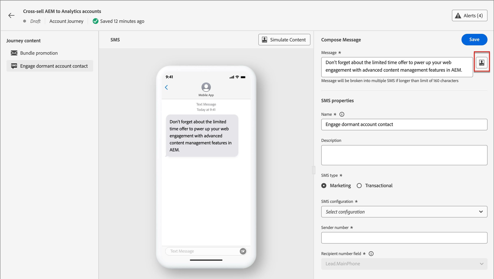

# SMS-Authoring

Verwenden Sie Adobe Journey Optimizer B2B Edition, um Ihren Kunden auf ihren Mobilgeräten Textnachrichten (SMS) zu senden. Sie können Nachrichten im Textformat im SMS-Editor erstellen, personalisieren und in der Vorschau anzeigen.

## SMS-Konfigurationen

Adobe Journey Optimizer B2B Edition sendet Textnachrichten über SMS-Dienstleister (oder SMS Gateway Provider). Konfigurieren Sie vor der Erstellung Ihrer SMS-Nachricht Ihren Dienstleister in den Administrator-Einstellungen.

### SMS-Gateway-Dienstleister

Adobe Journey Optimizer B2B Edition ist derzeit mit Drittanbietern integriert, die unabhängig voneinander Textnachrichten anbieten. Unterstützte Anbieter für Textnachrichten sind Sinch, Twilio und Infobip.

Bevor Sie einen SMS-Kanal in Adobe Journey Optimizer B2B Edition konfigurieren, müssen Sie ein Konto bei einem dieser Anbieter erstellen, um Ihr API-Token und Ihre Service-ID zu erhalten. Diese Anmeldeinformationen sind erforderlich, um die Verbindung zwischen Adobe Journey Optimizer B2B Edition und dem entsprechenden Provider zu konfigurieren.

>[!IMPORTANT]
>
>Ihre Nutzung von Textnachrichten unterliegt zusätzlichen Bedingungen des jeweiligen Anbieters. Als Drittanbieterlösungen stehen Sinch, Twilio und Infobip Benutzern von Adobe Journey Optimizer B2B Edition über eine Integration zur Verfügung. Adobe kontrolliert keine Produkte von Drittanbietern und ist nicht für diese verantwortlich. Wenden Sie sich bei Problemen oder Ersuchen um Unterstützung im Zusammenhang mit den Textnachrichtendiensten (SMS) an Ihren Provider.

### Vorhandene SMS-API-Konfiguration überprüfen

>[!NOTE]
>
>Die beschriebenen Einstellungen sind nur für Benutzer mit SMS-Administratorrechten zugänglich.

Erweitern Sie im linken Navigationsbereich den Abschnitt **[!UICONTROL Administrator]** und klicken Sie auf **[!UICONTROL Konfiguration]**.

{width="800" zoomable="yes"}

Auf der Seite werden die verfügbaren API-Konfigurationen für Ihre Instanz aufgelistet. Sie können die angezeigten API-Anmeldeinformationen nach dem SMS-Dienstleister oder Ersteller filtern.

{width="500"}

### Erstellen neuer API-Anmeldeinformationen für einen SMS-Dienstanbieter

>[!BEGINTABS]

>[!TAB Sinch]

_So konfigurieren Sie Sinch als SMS-Provider mit Adobe Journey Optimizer B2B Edition:_

1. Erweitern Sie im linken Navigationsbereich den Abschnitt **[!UICONTROL Administrator]** und klicken Sie auf **[!UICONTROL Konfiguration]**.

1. Klicken Sie oben rechts in der Liste _[!UICONTROL API-Anmeldeinformationen]_ auf die Schaltfläche **[!UICONTROL Neue API-Anmeldeinformationen erstellen]** .

1. Konfigurieren Sie Ihre SMS-API-Anmeldeinformationen:

   {width="500"}

   * **[!UICONTROL SMS-Anbieter]** - Wählen Sie `Sinch` als SMS-Provider aus.

   * **[!UICONTROL Name]** - Geben Sie einen Namen für Ihre API-Berechtigung ein.

   * **[!UICONTROL Dienst-ID]** und **[!UICONTROL API-Token]** - Greifen Sie über Ihr Einzelkonto auf die API-Seite zu (Ihre Anmeldeinformationen finden Sie auf der Registerkarte SMS ).

   Weitere Informationen zum Auffinden dieser Informationen für Ihr Einzelkonto finden Sie in der [Dokumentation für Einzelentwickler](https://developers.sinch.com/docs/sms/getting-started/#2-get-credentials)

1. Klicken Sie auf **[!UICONTROL Senden]** , wenn die Konfigurationsdetails Ihrer API-Anmeldeinformationen abgeschlossen sind.

>[!TAB Twilio]

_So konfigurieren Sie Twilio als SMS-Provider mit Adobe Journey Optimizer B2B Edition:_

1. Erweitern Sie im linken Navigationsbereich den Abschnitt **[!UICONTROL Administrator]** und klicken Sie auf **[!UICONTROL Konfiguration]**.

1. Klicken Sie oben rechts in der Liste _[!UICONTROL API-Anmeldeinformationen]_ auf die Schaltfläche **[!UICONTROL Neue API-Anmeldeinformationen erstellen]** .

1. Konfigurieren Sie Ihre SMS-API-Anmeldeinformationen:

   {width="500"}

   * **[!UICONTROL SMS-Anbieter]** - Wählen Sie `Twilio` als SMS-Provider aus.

   * **[!UICONTROL Name]** - Geben Sie einen Namen für Ihre API-Anmeldedefinition ein.

   * **[!UICONTROL Konto-SID]** und **[!UICONTROL Authentifizierungstoken]** - Greifen Sie auf den Bereich _Kontoinformationen_ Ihrer Twilio Console-Dashboard-Seite zu, um Ihre Anmeldeinformationen zu finden.

   Weitere Informationen zum Auffinden dieser Informationen für Ihr Twilio-Konto finden Sie im [Twilio Help Center](https://help.twilio.com/articles/14726256820123-What-is-a-Twilio-Account-SID-and-where-can-I-find-it-).

1. Klicken Sie oben rechts auf der Seite auf **[!UICONTROL Senden]** , wenn die Konfigurationsdetails Ihrer API-Anmeldeinformationen abgeschlossen sind.

>[!TAB Infobip]

_So konfigurieren Sie Infobip als SMS-Provider mit Adobe Journey Optimizer B2B Edition:_

1. Erweitern Sie im linken Navigationsbereich den Abschnitt **[!UICONTROL Administrator]** und klicken Sie auf **[!UICONTROL Konfiguration]**.

1. Klicken Sie oben rechts in der Liste _[!UICONTROL API-Anmeldeinformationen]_ auf die Schaltfläche **[!UICONTROL Neue API-Anmeldeinformationen erstellen]** .

1. Konfigurieren Sie Ihre SMS-API-Anmeldeinformationen:

   {width="500"}

   * **[!UICONTROL SMS-Anbieter]** - Wählen Sie `Infobip` als SMS-Provider aus.

   * **[!UICONTROL Name]** - Geben Sie einen Namen für Ihre API-Anmeldedefinition ein.

   * **[!UICONTROL API-Basis-URL]** und **[!UICONTROL API-Schlüssel]** - Greifen Sie auf die Homepage Ihrer Web-Oberfläche oder die API-Schlüsselverwaltungsseite für Ihr Infobip-Konto zu, um Ihre Anmeldeinformationen zu finden.

   Weitere Informationen zum Auffinden dieser Informationen für Ihr Infobip-Konto finden Sie in der [Infobip-Dokumentation](https://www.infobip.com/docs/api/_blank).

1. Klicken Sie oben rechts auf der Seite auf **[!UICONTROL Senden]** , wenn die Konfigurationsdetails Ihrer API-Anmeldeinformationen abgeschlossen sind.

>[!ENDTABS]

Wenn Sie auf _[!UICONTROL Senden]_ klicken, werden die Anmeldeinformationen sofort validiert und gespeichert und Sie werden zur Seite mit der Auflistung der _[!UICONTROL API-Anmeldeinformationen]_ weitergeleitet. Wenn die übermittelten Anmeldeinformationen ungültig sind, zeigt das System auf der Listenseite eine Fehlermeldung an. In diesem Fall können Sie die Konfiguration abbrechen oder aktualisieren und erneut senden.

## Hinzufügen einer SMS-Aktion auf einer Konto-Journey

Sie können Textnachrichten-Sendungen in einer Konto-Journey einrichten, wenn Sie einen Knoten _[!UICONTROL Aktion ausführen]_ hinzufügen und folgende Schritte ausführen:

1. Wählen Sie für die _[!UICONTROL Aktion auf]_ Ziel **[!UICONTROL Personen]** aus.

1. Wählen Sie für die Aktion _[!UICONTROL für Personen]_ die Option **[!UICONTROL SMS senden]**.

   {width="800" zoomable="yes"}

1. Klicken Sie unten im Bedienfeld _[!UICONTROL Aktion durchführen]_ auf **[!UICONTROL SMS erstellen]**.

1. Geben Sie im Dialogfeld einen eindeutigen **[!UICONTROL Namen]** für die E-Mail und eine **[!UICONTROL Betreffzeile]** ein.

   {width="500"}

## SMS erstellen

>[!IMPORTANT]
>
>**Verwaltung der SMS-Einwilligung** 
> 
>In Übereinstimmung mit den Branchenstandards und -vorschriften müssen alle SMS-Marketingnachrichten eine Möglichkeit enthalten, mit der sich die Empfänger leicht abmelden können. Zu diesem Zweck können SMS-Empfänger mit Opt-in- und Opt-out-Keywords antworten. Alle standardmäßigen Opt-in- und Opt-out-Suchbegriffe werden unterstützt und berücksichtigt. Darüber hinaus werden alle benutzerdefinierten Suchbegriffe unterstützt und berücksichtigt, die für Ihr SMS-Dienstanbieterkonto konfiguriert wurden.

1. Geben Sie im Feld **[!UICONTROL Nachricht]** den Text ein, den Sie senden möchten.

   Sie können eine Nachricht mit bis zu 1600 Zeichen erstellen, wobei jede 160 Zeichen als eine SMS-Nachricht betrachtet wird.

1. **Personalisieren Sie die Textnachricht**.

   Klicken Sie beim Verfassen der Textnachricht jederzeit auf das Symbol _Personalize_ rechts neben dem Textfeld.

   {width="800" zoomable="yes"}

   Die angezeigte Seite bietet Zugriff auf Ihre Adobe Marketo Engage-Lead- und System-Token. Sowohl Standard- als auch benutzerdefinierte Token sind enthalten. Sie können die Suchleiste verwenden, um das benötigte Token zu suchen, oder durch die Ordnerstruktur navigieren, um eines der Lead-/System-Token zu suchen und auszuwählen.

   Platzieren Sie den Cursor an der Stelle in der Nachricht, an der Sie das Token hinzufügen möchten. Fügen Sie ein Token hinzu, indem Sie auf das Pluszeichen ( **+** ) daneben klicken. Wenn Sie das Token mit einem Fallback hinzufügen möchten (Standard, der angezeigt wird, falls dieses Feld für einen Lead nicht verfügbar ist), klicken Sie auf die Auslassungszeichen ( **...** ) und wählen Sie **[!UICONTROL Mit Fallback-Text einfügen]**.

   {width="700" zoomable="yes"}

   Geben Sie im Dialogfeld _[!UICONTROL Fallback-Wert eingeben]_ den Text ein, der als Fallback angezeigt wird, und klicken Sie dann auf **[!UICONTROL Hinzufügen]**.

   {width="400"}

   Wenn Ihre Personalisierungstoken platziert werden, klicken Sie auf **[!UICONTROL Speichern]** , um die Änderungen zu speichern und zum SMS-Authoring-Hauptarbeitsbereich zurückzukehren. Sie können die Nachricht mit den Token nach Bedarf weiter bearbeiten.

<!-- 1. **Add URLs to text message**.

   After defining your content, you can add URLs to your message by clicking the _Link_ icon.
   
   You can add two types of URLs: 

   External URLs - This is ANY external URL that can be directly typed into/ pasted into the input text box
   Adobe Marketo Engage Design Studio Landing Pages - Selecting this option, you will see a 'Landing Page picker' from which you can select any of the listed approved Landing Pages from Marketo Engage

   You can choose to 'shorten' either of these URLs by selecting the checkbox
   Note that the URL shortening function, uses the Marketo subdomain for shortening
   The shortened URL appears as a read-only field within the modal
   You can optionally track clicks on the URL
   You can also choose to include 'mkt_tok' for tracking activity against a user
   Click on Add to save changes & add the chosen URL to the SMS message
-->

## SMS-Eigenschaften festlegen

1. Geben Sie im Abschnitt _[!UICONTROL SMS-Eigenschaften]_ einen **[!UICONTROL Namen]** (erforderlich, maximal 100 Zeichen) und eine **[!UICONTROL Beschreibung]** (optional, maximal 300 Zeichen) für Ihre Nachricht ein.

   Für diese Felder sind Alpha-, numerische, Sonderzeichen zulässig. Die folgenden reservierten Zeichen sind **nicht erlaubt**: `\`, `/`, `:`, `*`, `?`, `"`, `<`, `>` und `|`.

1. Wählen Sie den **[!UICONTROL SMS-Typ]** aus:

   * Verwenden Sie `Marketing` für Werbetexte, für die die Zustimmung des Benutzers erforderlich ist.
   * Verwenden Sie `Transactional` für nicht kommerzielle Nachrichten, wie z. B. Bestellbestätigungen, Benachrichtigungen beim Zurücksetzen des Kennworts oder Versandinformationen.

1. Wählen Sie für die **[!UICONTROL SMS-Konfiguration]** eine der vordefinierten API-Konfigurationen aus.

   Diese Einstellung legt fest, welcher SMS Gateway-Dienstleister und welches Konto für den Nachrichtenversand verwendet wird.

1. Geben Sie die **[!UICONTROL Absendernummer]** &#x200B; ein, die Sie für Ihre Kommunikation verwenden möchten.

   {width="700" zoomable="yes"}

   Die Empfängernummer wird immer dem Feld `Lead.MainPhone` im Marketo Engage zugeordnet.

<!-- ## Preview the text message content

When your message content is defined, you can use test profiles to preview its content. If you inserted personalized content, you can check how this content is displayed in the message, using test profile data.

1. Click **[!UICONTROL Simulate Content]** at the top of the SMS authoring workspace.

1. From the _[!UICONTROL Simulate Content]_ page, click **[!UICONTROL Add People]**.

1. Use the # page to manage the leads used for your test profile.

   In the displayed list, you can search for and add any of the leads (up to 10 leads at a time) from the Marketo Engage lead database.

   To search, enter the whole email address and click enter. The corresponding lead profile shows up for selection.

   The preview updated to the personalization fields for the selected profile.

   All the added leads appear on the left rail of the 'Simulate Content' page

   You can manage this list by adding more people and deleting individual leads from the profile listing (it does not remove them from the database).

1. Simulate content for a lead.

   Select any of the leads listed on the left rail of the Simulate Content page and the SMS preview on the page updates for the corresponding lead.

   You can also select a lead from the 'drop-down' box above the preview space and the SMS preview on the page updates for the corresponding lead

1. To exit the _[!UICONTROL Simulate Content]_ page and return back to the SMS authoring workspace, click Close. -->
