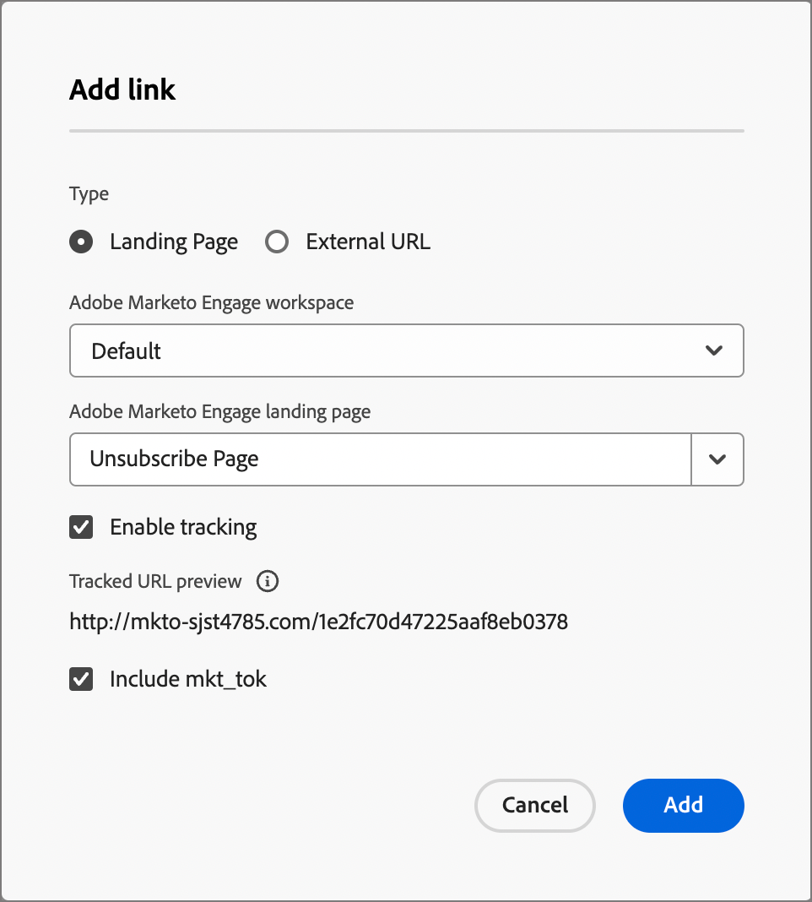

# SMS-Authoring

Verwenden Sie Adobe Journey Optimizer B2B edition , um Ihren Kunden auf ihren Mobilgeräten Textnachrichten (SMS) zu senden. Mit dem SMS-Editor können Sie Nachrichten im Textformat erstellen, personalisieren und in der Vorschau anzeigen.

Bevor Sie SMS-Nachrichten für Kontobewegungen erstellen, stellen Sie sicher, dass der [SMS-Dienstanbieter](../admin/configure-channels-sms.md) in den Einstellungen für _[!UICONTROL Administrator]_ konfiguriert ist.

## Hinzufügen einer SMS-Aktion auf einer Konto-Journey

Sie können Textnachrichten-Sendungen in einer Konto-Journey einrichten, wenn Sie einen Knoten _[!UICONTROL Aktion ausführen]_ hinzufügen und folgende Schritte ausführen:

1. Wählen Sie für die _[!UICONTROL Aktion auf]_ Ziel **[!UICONTROL Personen]** aus.

1. Wählen Sie für die Aktion _[!UICONTROL für Personen]_ die Option **[!UICONTROL SMS senden]**.

   {width="800" zoomable="yes"}

1. Klicken Sie unten im Bedienfeld _[!UICONTROL Aktion durchführen]_ auf **[!UICONTROL SMS erstellen]**.

1. Geben Sie im Dialogfeld einen eindeutigen **[!UICONTROL Namen]** für die SMS-Nachricht ein.

   {width="400"}

1. Klicken Sie auf **[!UICONTROL Erstellen]**.

   Der _Journey Content Designer_ wird geöffnet. Sie können die Nachricht erstellen und die SMS-Eigenschaften für den Nachrichtenversand festlegen.

### SMS erstellen

>[!IMPORTANT]
>
>**Verwaltung der SMS-Einwilligung** 
>
>In Übereinstimmung mit den Branchenstandards und -vorschriften müssen alle SMS-Marketingnachrichten eine Möglichkeit enthalten, mit der sich die Empfänger leicht abmelden können. Zu diesem Zweck können SMS-Empfänger mit Keywords zum Opt-in oder Opt-out antworten. Alle standardmäßigen Opt-in- und Opt-out-Suchbegriffe werden unterstützt und berücksichtigt. Darüber hinaus werden alle benutzerdefinierten Suchbegriffe unterstützt und berücksichtigt, die für Ihr SMS-Dienstanbieterkonto konfiguriert wurden.

Geben Sie im Feld **[!UICONTROL Nachricht]** den Text ein, den Sie senden möchten.

Sie können eine Nachricht mit bis zu 1600 Zeichen erstellen, wobei jede 160 Zeichen als eine SMS-Nachricht betrachtet wird.

{width="800" zoomable="yes"}

#### Textnachricht personalisieren

1. Klicken Sie beim Verfassen der Textnachricht jederzeit auf das Symbol _Personalize_ (  ) rechts neben dem Textfeld.

   Die angezeigte Seite bietet Zugriff auf Ihre Adobe Marketo Engage-Lead- und System-Token. Sowohl Standard- als auch benutzerdefinierte Token sind enthalten. Sie können die Leiste _Suchen_ verwenden, um das benötigte Token zu finden, oder durch die Ordnerstruktur navigieren, um eines der Lead-/System-Token zu suchen und auszuwählen.

1. Platzieren Sie den Cursor an der Stelle in der Nachricht, an der Sie das Token hinzufügen möchten.

1. Fügen Sie ein Token hinzu, indem Sie auf das Pluszeichen ( **+** ) daneben klicken.

   Wenn Sie das Token mit einem Fallback hinzufügen möchten (Standardeinstellung, die angezeigt wird, falls dieses Feld für einen Lead nicht verfügbar ist), klicken Sie auf das Symbol _Mehr_ ( **...** ) und wählen Sie **[!UICONTROL Mit Fallback-Text einfügen]**.

   {width="700" zoomable="yes"}

1. Geben Sie im Dialogfeld _[!UICONTROL Fallback-Wert eingeben]_ den Text ein, der als Fallback angezeigt wird, und klicken Sie dann auf **[!UICONTROL Hinzufügen]**.

   {width="400"}

1. Wenn Ihre Personalisierungstoken platziert werden, klicken Sie auf **[!UICONTROL Speichern]** , um die Änderungen zu speichern und zum SMS-Authoring-Hauptarbeitsbereich zurückzukehren.

   Sie können die Nachricht mit den Token nach Bedarf weiter bearbeiten.

#### Links (URLs) zur Textnachricht hinzufügen

1. Klicken Sie nach Eingabe des Nachrichtentextes auf das Symbol _Link_ (  ) rechts neben dem Textfeld.

1. Wählen Sie im Dialogfeld den Typ der zu verknüpfenden URLs aus:

   * **[!UICONTROL Landingpage]** - Wählen Sie diese Option, um eine der genehmigten Adobe Marketo Engage Design Studio-Landingpages aus Ihrer Marketo Engage-Instanz auszuwählen. Wählen Sie den Arbeitsbereich und dann die Landingpage aus.

   * **[!UICONTROL Externe URL]** - Dieser Typ ist eine externe URL, die Sie in das Textfeld eingeben.

1. Wenn Sie sich für die Verwendung einer Landingpage entscheiden, legen Sie die Tracking-Optionen fest.

   * **[!UICONTROL Tracking aktivieren]** - Aktivieren Sie dieses Kontrollkästchen, um das Tracking zu aktivieren. Dafür ist eine _Verkürzung_ der URL erforderlich. Bei einer Landingpage wird die Marketo Engage-Subdomäne für die gekürzte URL verwendet. Ein Beispiel für das gekürzte URL-Format wird angezeigt. Die tatsächliche URL wird erstellt, wenn die SMS an den Empfänger gesendet wird.

   * **[!UICONTROL mkt_tok einschließen]** - Aktivieren Sie dieses Kontrollkästchen, um die Aktivität gegen einen Benutzer zu verfolgen.

     >[!NOTE]
     >
     >Wenn Sie das Tracking zulassen, aber _[!UICONTROL mkt_tok einschließen]_ deaktivieren, enthält die Ziel-URL nach der Umleitung nicht den Abfragezeichenfolgenparameter `mkt_tok` . Dieser Parameter wird von Marketo Engage-Landingpages und Munchkin verwendet, um sicherzustellen, dass die Verfolgung von Personenaktivitäten (z. B. wenn sich eine Person von einer E-Mail abmeldet) gewährleistet ist. Deaktivieren Sie diese Option nur, wenn der Parameter Probleme auf Ihrer Website verursacht. 
     >Weitere Informationen zur Verwendung von Munchkin-Trackingcodes auf Ihrer Website finden Sie in der [Marketo Engage-Dokumentation](https://experienceleague.adobe.com/en/docs/marketo/using/product-docs/administration/additional-integrations/add-munchkin-tracking-code-to-your-website){target="_blank"}.

   {width="470"}

1. Wenn die Link-Optionen abgeschlossen sind, klicken Sie auf **[!UICONTROL Hinzufügen]** , um die Änderungen zu speichern und den URL-Link zur SMS-Nachricht hinzuzufügen.

### SMS-Eigenschaften festlegen

1. Geben Sie im Abschnitt _[!UICONTROL SMS-Eigenschaften]_ einen **[!UICONTROL Namen]** (erforderlich, maximal 100 Zeichen) und eine **[!UICONTROL Beschreibung]** (optional, maximal 300 Zeichen) für Ihre Nachricht ein.

   Für diese Felder sind Alpha-, numerische, Sonderzeichen zulässig. Die folgenden reservierten Zeichen sind **nicht erlaubt**: `\`, `/`, `:`, `*`, `?`, `"`, `<`, `>` und `|`.

1. Wählen Sie den **[!UICONTROL SMS-Typ]** aus:

   * Verwenden Sie `Marketing` für Werbetexte, für die die Zustimmung des Benutzers erforderlich ist.
   * Verwenden Sie `Transactional` für nicht kommerzielle Nachrichten, wie z. B. Bestellbestätigungen, Benachrichtigungen beim Zurücksetzen des Kennworts oder Versandinformationen.

1. Wählen Sie für die **[!UICONTROL SMS-Konfiguration]** eine der vordefinierten API-Konfigurationen aus.

   Diese Einstellung legt fest, welcher SMS Gateway-Dienstleister und welches Konto für den Nachrichtenversand verwendet wird.

1. Geben Sie die **[!UICONTROL Absendernummer]** &#x200B; ein, die Sie für Ihre Kommunikation verwenden möchten.

   {width="700" zoomable="yes"}

   Die Empfängernummer wird immer dem Feld `Lead.mobilePhone` im Marketo Engage zugeordnet.

### Simulieren des Inhalts der Textnachricht {#preview-test}

>[!CONTEXTUALHELP]
>id="ajo-b2b_sms_preview_simulate"
>title="Überprüfen des Inhalt-Renderings"
>abstract="Wenn Ihr Inhalt definiert wurde, können Sie ihn in der Vorschau anzeigen und überprüfen, ob das Rendering entsprechend dem verwendeten Kanal korrekt ist."

Wenn Ihr Nachrichteninhalt definiert ist, können Sie mithilfe von Testprofilen dessen Inhalt simulieren (in der Vorschau anzeigen). Wenn Sie personalisierten Inhalt eingefügt haben, können Sie anhand von Testprofildaten überprüfen, wie dieser Inhalt in der Nachricht angezeigt wird.

>[!IMPORTANT]
>
>Speichern Sie Ihre SMS-Nachricht, bevor Sie mit der Simulation der Textnachricht fortfahren.

1. Klicken Sie oben im SMS-Authoring-Arbeitsbereich auf **[!UICONTROL Inhalt simulieren]** .

1. Klicken Sie auf der Seite _[!UICONTROL Inhalt simulieren]_ auf **[!UICONTROL Personen hinzufügen]**.

1. Verwenden Sie die Seite _Inhalt simulieren_ , um die Leads zu verwalten, die für Ihr Testprofil verwendet werden.

   In der angezeigten Liste können Sie nach Leads suchen und diese (bis zu 10 Leads gleichzeitig) aus der Marketo Engage-Lead-Datenbank hinzufügen.

   Geben Sie zum Durchsuchen die gesamte E-Mail-Adresse ein und drücken Sie die _Eingabetaste_. Das entsprechende Lead-Profil wird zur Auswahl angezeigt.

   Die Vorschau aktualisiert die Personalisierungsfelder für das ausgewählte Profil.

   Alle hinzugefügten Leads werden links angezeigt.

   Sie können diese Liste verwalten, indem Sie weitere Personen hinzufügen und einzelne Leads aus der Profilliste löschen (sie werden nicht aus der Datenbank entfernt).

1. Inhalt für einen ausgewählten Lead simulieren.

   Wählen Sie eine der links aufgelisteten Leads aus. Die SMS-Vorschau auf der Seite wird für den ausgewählten Lead aktualisiert.

   Sie können auch einen Lead aus dem Selektor über dem Vorschaubereich auswählen, um die SMS-Vorschau auf der Seite für den entsprechenden Lead zu aktualisieren.

1. Um die Seite _[!UICONTROL Inhalt simulieren]_ zu verlassen und zum SMS-Authoring-Arbeitsbereich zurückzukehren, klicken Sie oben rechts auf **[!UICONTROL Schließen]** .

## Verwaltung von SMS-Einverständnissen

Es ist gesetzlich vorgeschrieben, Empfängern die Möglichkeit zu geben, sich vom Erhalt von Nachrichten einer Marke abzumelden und diese Entscheidung zu befolgen. Die Nichteinhaltung dieser Vorschriften birgt rechtliche Risiken für Ihre Marke. Diese Funktion hilft Ihnen auch, den Versand unerwünschter Nachrichten an Ihre Empfänger zu vermeiden, was dazu führen könnte, dass diese Ihre Nachrichten als Spam markieren und Ihrer Reputation schaden.

Wenn Sie diese Option bereitstellen, können SMS-Empfänger mit Opt-in- und Opt-out-Keywords antworten. Alle standardmäßigen Opt-in- und Opt-out-Suchbegriffe werden unterstützt und berücksichtigt sowie alle benutzerdefinierten Suchbegriffe, die beim SMS-Dienstanbieter konfiguriert sind. Bei der Abmeldung werden die Profile automatisch aus der Audience künftiger Marketing-Nachrichten entfernt.

Journey Optimizer B2B edition bietet die Möglichkeit, das Opt-out in SMS-Nachrichten mithilfe der folgenden Logik zu verwalten:

* Wenn ein Lead sich vom Erhalt von Nachrichten von Ihnen abgemeldet hat, wird das entsprechende Profil standardmäßig von nachfolgenden SMS-Sendungen ausgeschlossen

* Diese Lead-Einwilligung aus verschiedenen Quellen (z. B. AEP oder der SMS-Dienstleister) wird mit Journey Optimizer B2B edition synchronisiert. Derzeit unterstützt es nur einen einzelnen Zustimmungsstatus pro Lead auf Instanzenebene (ein Lead &quot;John Doe&quot;wird entweder für alle Promotion-SMS in der Instanz angemeldet oder von dieser abgemeldet). Es wird derzeit keine Anmeldung mit zweifacher Bestätigung für die Zustimmung auf Markenniveau oder auf Ebene der individuellen Abonnementliste unterstützt.
