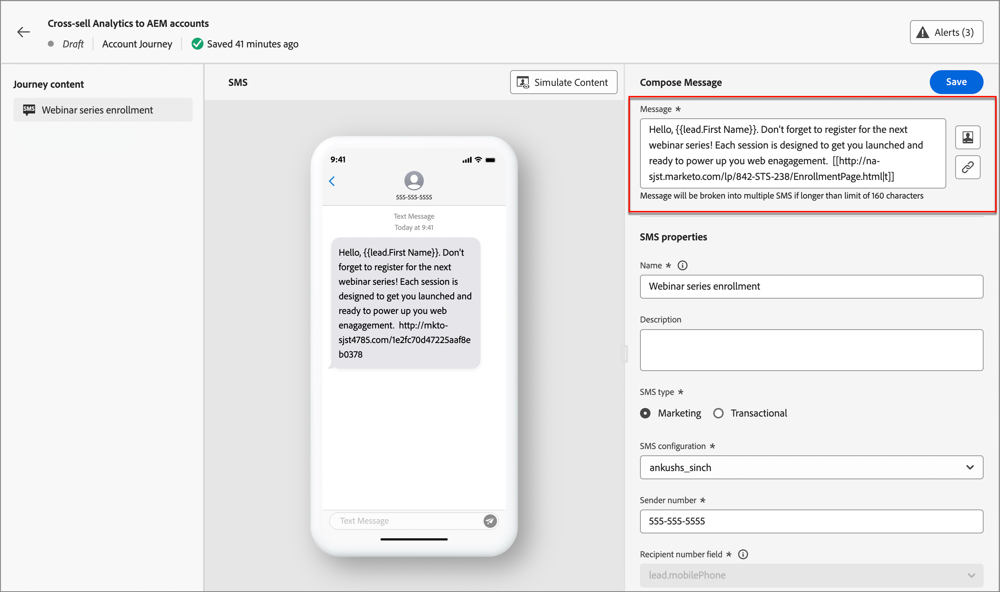

# SMS-Erstellung

Verwenden Sie Adobe Journey Optimizer B2B edition, um Textnachrichten (SMS) an die Mobilgeräte Ihrer Kunden zu senden. Mit dem SMS-Editor können Sie Nachrichten im Textformat erstellen, personalisieren und in der Vorschau anzeigen.

Bevor Sie SMS-Nachrichten für Konto-Journey erstellen, stellen Sie sicher, dass der [SMS-Service-Provider“ &#x200B;](../admin/configure-channels-sms.md) den Einstellungen _[!UICONTROL Administrator]_ konfiguriert ist.

## Hinzufügen einer SMS-Aktion auf einer Konto-Journey

Sie können einen Textnachrichten-Versand auf einer Konto-Journey einrichten, wenn Sie einen Knoten _[!UICONTROL Aktion ausführen]_ hinzufügen und dann Folgendes ausführen:

1. Wählen Sie für _[!UICONTROL Ziel]_ Aktion auf“ **[!UICONTROL Personen]**.

1. Wählen Sie für _[!UICONTROL Aktion für Personen]_ die Option **[!UICONTROL SMS senden]** aus.

   {width="800" zoomable="yes"}

1. Klicken Sie unten im Bedienfeld _[!UICONTROL Aktion ausführen]_ auf **[!UICONTROL SMS erstellen]**.

1. Geben Sie im Dialogfeld einen eindeutigen **[!UICONTROL Namen“ für]** SMS-Nachricht ein.

   {width="400"}

1. Klicken Sie auf **[!UICONTROL Erstellen]**.

   Die _Journey-Zuordnung_ wird geöffnet. Sie können die Nachricht erstellen und die SMS-Eigenschaften für den Nachrichtenversand festlegen.

### SMS-Nachricht erstellen

>[!IMPORTANT]
>
>**Einverständnisverwaltung für SMS** 
>
>In Übereinstimmung mit den Branchenstandards und -vorschriften müssen alle SMS-Marketing-Nachrichten eine Möglichkeit für die Empfänger enthalten, ihr Abonnement einfach zu kündigen. Zu diesem Zweck können SMS-Empfänger mit Keywords zum Opt-in oder Opt-out antworten. Alle standardmäßigen Keywords zum Opt-in und Opt-out werden unterstützt und berücksichtigt. Darüber hinaus werden alle benutzerdefinierten Keywords, die für Ihr SMS-Service-Provider-Konto konfiguriert sind, unterstützt und berücksichtigt.

Geben Sie den zu sendenden Text in das Feld **[!UICONTROL Nachricht]** ein.

Sie können eine Nachricht mit bis zu 1.600 Zeichen erstellen, wobei alle 160 Zeichen als eine einzige SMS-Nachricht betrachtet werden.

{width="800" zoomable="yes"}

#### Textnachricht personalisieren

1. Platzieren Sie den Cursor an der Stelle in der Nachricht, an der Sie das Personalisierungs-Token hinzufügen möchten.

1. Klicken Sie auf _Personalisieren_-Symbol (  ) rechts neben dem Textnachrichtenfeld.

   Das Dialogfeld bietet Zugriff auf die Konto-Token, Personen-Token und System-Token. Sowohl standardmäßige als auch benutzerdefinierte Token sind enthalten. Sie können die _Suche_ verwenden, um das benötigte Token zu finden, oder durch die Ordnerstruktur navigieren, um eines der Token zu finden und auszuwählen.

1. Fügen Sie ein Token hinzu, indem Sie auf das Pluszeichen ( **+** ) daneben klicken.

   Wenn Sie das Token mit einem Fallback hinzufügen möchten (Standard, der angezeigt wird, falls dieses Feld für einen Lead nicht verfügbar ist), klicken Sie auf das Symbol _Mehr_ ( **…** ) und wählen Sie **[!UICONTROL Einfügen mit Fallback-Text]**.

   {width="700" zoomable="yes"}

1. Geben _[!UICONTROL im Dialogfeld „Fallback-]_ eingeben“ den Text ein, der als Fallback angezeigt wird, und klicken Sie dann auf **[!UICONTROL Hinzufügen]**.

   {width="450"}

1. Wenn Ihre Personalisierungs-Token platziert sind, klicken Sie auf **[!UICONTROL Speichern]**, um Änderungen zu speichern und zum Haupt-Arbeitsbereich für die SMS-Bearbeitung zurückzukehren.

   Sie können die Nachricht weiterhin nach Bedarf mit den Token bearbeiten.

#### Hinzufügen von Links (URLs) zur Textnachricht

1. Klicken Sie nach der Eingabe Ihres Nachrichtentextes auf _Link_-Symbol (  ) rechts neben dem Textnachrichtenfeld.

1. Geben Sie die **[!UICONTROL URL]** für den Link ein.
<!--    
1. In the dialog, choose the type of URLs to link:

   * **[!UICONTROL Landing Page]** - Choose this option to select any of the approved Adobe Marketo Engage landing pages from your Marketo Engage instance. Select the workspace, and then select the landing page.

   * **[!UICONTROL External URL]** - This type is any external URL that you enter in the text box. -->

1. Wenn Sie eine Marketo Engage-Landingpage verwenden möchten, legen Sie die Tracking-Optionen fest.

   * **[!UICONTROL Tracking aktivieren]** - Aktivieren Sie dieses Kontrollkästchen, um das Tracking zu aktivieren. Dazu muss _URL_ werden. Für eine Landingpage wird die Marketo Engage-Subdomain als gekürzte URL verwendet. Ein Beispiel für das gekürzte URL-Format wird angezeigt. Die eigentliche URL wird erstellt, wenn die SMS an den Empfänger gesendet wird.

   * **[!UICONTROL mkt_tok einschließen]** - Aktivieren Sie dieses Kontrollkästchen, um die Aktivität in Bezug auf einen Benutzer zu verfolgen. 

     >[!NOTE]
     >
     >Wenn Sie Tracking zulassen, aber _[!UICONTROL Include mkt_tok]_ deaktivieren, enthält die Ziel-URL nach der Umleitung den `mkt_tok` Abfragezeichenfolgenparameter nicht. Dieser Parameter wird von Marketo Engage-Landingpages und Munchkin verwendet, um sicherzustellen, dass das Tracking von Personenaktivitäten erfolgt (z. B. wenn eine Person sich von einer E-Mail abmeldet). Deaktivieren Sie diese Option nur, wenn der Parameter Probleme auf Ihrer Website verursacht. 
     >Weitere Informationen zur Verwendung von Munchkin-Trackingcodes auf Ihrer Website finden Sie in der [Dokumentation zu Marketo Engage](https://experienceleague.adobe.com/en/docs/marketo/using/product-docs/administration/additional-integrations/add-munchkin-tracking-code-to-your-website){target="_blank"}.

   {width="470"}

1. Wenn die Link-Optionen abgeschlossen sind, klicken Sie auf **[!UICONTROL Hinzufügen]**, um die Änderungen zu speichern und den URL-Link zur SMS-Nachricht hinzuzufügen.

### SMS-Eigenschaften festlegen

1. Geben Sie im Abschnitt _[!UICONTROL SMS]_ einen **[!UICONTROL Name]** (erforderlich, maximal 100 Zeichen) und **[!UICONTROL Beschreibung]** (optional, maximal 300 Zeichen) für Ihre Nachricht ein.

   Alpha, numerische Zeichen und Sonderzeichen sind für diese Felder zulässig. Die folgenden reservierten Zeichen sind **nicht zulässig**: `\`, `/`, `:`, `*`, `?`, `"`, `<`, `>` und `|`.

1. Wählen Sie den **[!UICONTROL SMS-Typ]**:

   * Verwenden Sie `Marketing` für Werbenachrichten, für die das Einverständnis des Benutzers erforderlich ist.
   * Verwenden Sie `Transactional` für nicht-kommerzielle Nachrichten, z. B. Bestellbestätigungen, Benachrichtigungen beim Zurücksetzen des Kennworts oder Versandinformationen.

1. Wählen Sie **[!UICONTROL „SMS]** Konfiguration“ eine der vordefinierten [SMS-API-Konfigurationen](../admin/configure-channels-sms.md#create-new-api-credentials-for-an-sms-service-provider).

   Diese Einstellung bestimmt, welcher SMS-Gateway-Dienstleister und welches Konto zum Versand der Nachricht verwendet wird.

1. Geben Sie die **[!UICONTROL Absendernummer]** ein&#x200B; die Sie für Ihre Nachrichten verwenden möchten.

   {width="500" zoomable="yes"}

   Die Empfängernummer wird immer dem `profile.mobilePhone.number` in Experience Platform zugeordnet.

### Simulieren des Inhalts der Textnachricht {#preview-test}

>[!CONTEXTUALHELP]
>id="ajo-b2b_sms_preview_simulate"
>title="Überprüfen des Inhalts-Renderings"
>abstract="Wenn Ihr Inhalt definiert wurde, können Sie ihn in der Vorschau anzeigen und überprüfen, ob das Rendering entsprechend dem verwendeten Kanal korrekt ist."

Wenn der Inhalt Ihrer Nachricht definiert ist, können Sie Testprofile verwenden, um den Inhalt zu simulieren (eine Vorschau anzuzeigen). Wenn Sie personalisierten Inhalt eingefügt haben, können Sie mithilfe von Testprofildaten überprüfen, wie dieser Inhalt in der Nachricht angezeigt wird.

>[!IMPORTANT]
>
>Denken Sie daran, Ihre SMS-Nachricht zu speichern, bevor Sie mit der Simulation der Textnachricht fortfahren.

1. Klicken Sie **[!UICONTROL oben]** Arbeitsbereich für die SMS-Bearbeitung auf „Inhalt simulieren“.

1. Klicken Sie auf der _[!UICONTROL Inhalt simulieren]_ auf **[!UICONTROL Personen hinzufügen]**.

1. Verwenden Sie die _Inhalt simulieren_, um die Leads zu verwalten, die für Ihr Testprofil verwendet werden.

   In der angezeigten Liste können Sie nach allen Leads (bis zu 10 Leads gleichzeitig) in der Marketo Engage-Lead-Datenbank suchen und diese hinzufügen.

   Geben Sie zum Suchen die gesamte E-Mail-Adresse ein und drücken Sie _Eingabe_. Das entsprechende Lead-Profil wird zur Auswahl angezeigt.

   Die Vorschau aktualisiert sich auf die Personalisierungsfelder für das ausgewählte Profil.

   Alle hinzugefügten Leads werden auf der linken Seite angezeigt.

   Sie können diese Liste verwalten, indem Sie weitere Personen hinzufügen und einzelne Leads aus der Profilliste löschen (die Liste wird nicht aus der Datenbank entfernt).

1. Inhalt für einen ausgewählten Lead simulieren.

   Wählen Sie einen der auf der linken Seite aufgelisteten Leads aus. Die SMS-Vorschau auf der Seite wird für den ausgewählten Lead aktualisiert.

   Sie können auch einen Lead aus dem Selektor über der Vorschaufläche auswählen, um die SMS-Vorschau auf der Seite für den entsprechenden Lead zu aktualisieren.

1. Um die Seite _[!UICONTROL Inhalt simulieren]_ zu verlassen und zum Arbeitsbereich für die SMS-Bearbeitung zurückzukehren, klicken **[!UICONTROL oben rechts auf]** Schließen“.

## SMS-Einverständnisverwaltung

Es ist gesetzlich vorgeschrieben, den Empfängern die Möglichkeit zu geben, sich vom Erhalt von Mitteilungen einer Marke abzumelden und diese Entscheidung zu berücksichtigen. Die Nichtbeachtung dieser Vorschriften birgt rechtliche Risiken für Ihre Marke. Mit dieser Funktion vermeiden Sie auch den Versand unerwünschter Nachrichten an Ihre Empfänger, die Ihre Nachrichten als Spam markieren und Ihrer Reputation schaden könnten.

Wenn Sie diese Option bereitstellen, können SMS-Empfänger mit Keywords zum Opt-in oder Opt-out antworten. Alle standardmäßigen Opt-in- und Opt-out-Keywords werden unterstützt und berücksichtigt, ebenso alle benutzerdefinierten Keywords, die mit dem SMS-Service-Provider konfiguriert sind. Bei der Abmeldung werden die Profile automatisch aus der Audience künftiger Marketing-Nachrichten entfernt.

Journey Optimizer B2B edition bietet die Möglichkeit, das Opt-out in SMS-Nachrichten mithilfe der folgenden Logik zu verwalten:

* Wenn sich ein Lead vom Erhalt von Nachrichten von Ihnen abgemeldet hat, wird das entsprechende Profil standardmäßig von nachfolgenden SMS-Sendungen ausgeschlossen

* Dieses Lead-Einverständnis aus verschiedenen Quellen (z. B. AEP oder der SMS-Dienstleister) wird mit Journey Optimizer B2B edition synchronisiert. Derzeit wird pro Lead auf Instanzebene nur ein einziger Einverständnisstatus unterstützt (ein Lead &#39;Martin Müller&#39; hat alle Werbe-SMS in der Instanz entweder abonniert oder abgemeldet). Derzeit wird kein Double-Opt-in auf der Ebene der Marke/der individuellen Abonnement-Liste unterstützt.
