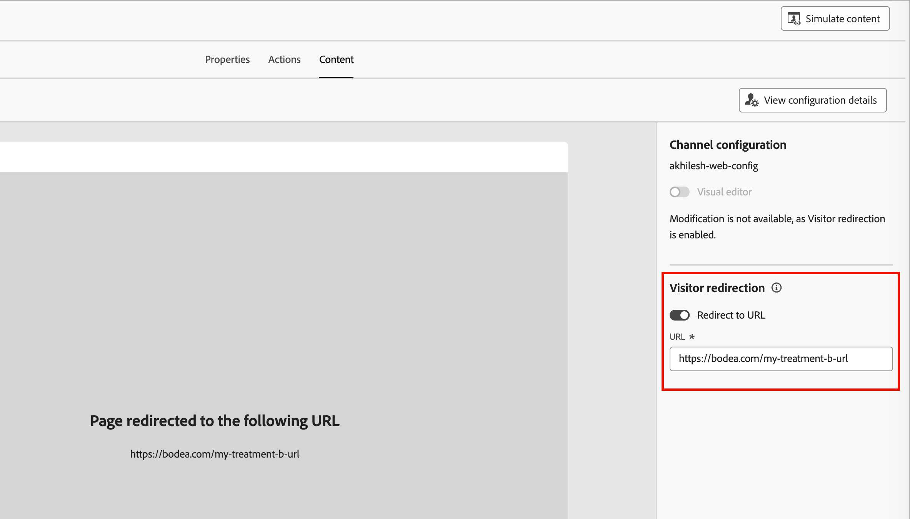

# Web-Erlebnisse

Der Web-Kanal in Adobe Journey Optimizer B2B edition ermöglicht es Ihnen, personalisierte Erlebnisse direkt auf Ihrer Website zu erstellen, sodass Sie aussagekräftige Verbindungen zu Kunden herstellen können. Diese Funktion bietet ein flexibles Set von Tools, mit denen Sie die Interaktion mit maßgeschneiderten Inhalten verbessern und diese nahtlos in andere Kanäle wie E-Mail und SMS integrieren können.

Web-Erlebnisse ermöglichen Ihnen Folgendes:

* Bereitstellen personalisierter Inhaltsänderungen für ausgewählte Website-Besucher
* Website-Elemente wie Banner, Text, Bilder und Schaltflächen mithilfe von Kontoattributen anpassen
* Targeting bestimmter Seiten oder Anwenden von Änderungen auf mehrere Seiten mithilfe von URL-Abgleichregeln
* Interaktion verfolgen und die Wirkung Ihrer Web-Personalisierungsmaßnahmen überwachen

>[!BEGINSHADEBOX]

## Voraussetzungen

Bevor Sie Web-Erlebnisse erstellen können, stellen Sie sicher, dass die folgenden Anforderungen erfüllt sind:

* Ein Produktadministrator hat einen oder mehrere Web-Kanäle konfiguriert, um die URLs (Seiten) zu definieren, die für ein Web-Erlebnis eingeschlossen werden sollen. Weitere Informationen finden Sie unter [Webkanalkonfigurationen](../admin/configure-channels-web.md).

* Auf Ihrer Website ist [Adobe Experience Platform Web SDK](https://experienceleague.adobe.com/en/docs/experience-platform/collection/js/js-overview) (`alloy.js`) für die Besucheridentifizierung und Inhaltsbereitstellung implementiert. Stellen Sie sicher, dass die Adobe Experience Platform Web SDK-Version 2.16 oder höher ist.

* Sie verfügen über die erforderlichen [Berechtigungen](../admin/user-management.md#b2b-product-permissions) um Web-Erlebnisse auf einer Journey zu erstellen und zu verwalten:
   * _[!UICONTROL Kampagnen]_ > _[!UICONTROL Kampagnen verwalten]_ - Erforderlich zum Hinzufügen oder Aktualisieren eines Web-Personalisierungsaktionsknotens.
   * _[!UICONTROL Kampagnen]_ > _[!UICONTROL Kampagnen anzeigen]_ - Erforderlich, um Details für einen Aktionsknoten der Web-Personalisierung anzuzeigen.
   * _[!UICONTROL Kampagnen]_ > _[!UICONTROL Kampagnen genehmigen und veröffentlichen]_ - Erforderlich zum Veröffentlichen einer Journey mit einem oder mehreren Web-Personalisierungsaktionsknoten.

* Die Browser-Erweiterung [Visual Editing Helper](#install-the-visual-editing-helper-extension) für Ihren Webbrowser wurde installiert. Diese Erweiterung ist erforderlich, um Web-Seiten zuverlässig im Journey Optimizer B2B edition Content Design Space zu öffnen, zu erstellen und in der Vorschau anzuzeigen.

  >[!NOTE]
  >
  >Google Chrome und Microsoft Edge sind derzeit die einzigen Browser, die die Erstellung von Web-Seiten in Journey Optimizer B2B edition unterstützen.

>[!ENDSHADEBOX]

## Installieren der Erweiterung Visual Editing Helper

1. Öffnen Sie eine neue Registerkarte in Ihrem Browser ([!DNL Google Chrome] oder [!DNL Microsoft Edge]).

1. Navigieren Sie zum [Google Chrome Web Store](https://chromewebstore.google.com/category/extensions).

   Wenn Sie [!DNL Microsoft Edge] verwenden, wählen Sie _Erweiterungen zulassen_ aus anderen Stores auf dem oberen Banner aus. Durch Aktivierung dieser Option können Sie Erweiterungen aus der [!DNL Chrome Web Store] zu [!DNL Microsoft Edge] hinzufügen.

1. Suchen Sie die Browser-Erweiterung _[!DNL Adobe Experience Cloud Visual Editing Helper]_und navigieren Sie zu ihr.

   {width="800" zoomable="yes"}

1. Klicken Sie **[!UICONTROL Zu Chrome hinzufügen]** und klicken Sie dann ]**Bestätigungsdialogfeld auf**[!UICONTROL  Erweiterung hinzufügen“.

   Wenn Sie [!DNL Microsoft Edge] verwenden, fügt diese Aktion die Erweiterung zu [!DNL Edge] hinzu.

1. Stellen Sie sicher, dass die [!DNL Visual Editing Helper] Browser-Erweiterung in Ihrer Browser-Symbolleiste korrekt aktiviert ist.

   {width="450"}

Die [!DNL Adobe Experience Cloud Visual Editing Helper] ist jetzt automatisch aktiviert, wenn eine Website im visuellen Editor von Journey Optimizer B2B edition für Web-Erlebnisse geöffnet wird. Die Erweiterung verfügt über keine bedingten Einstellungen und verarbeitet alle Einstellungen automatisch, einschließlich der SameSite-Cookie-Einstellungen.

>[!NOTE]
>
>Einige Websites werden möglicherweise aus einem der folgenden Gründe nicht zuverlässig im Journey Optimizer B2B edition-Web-Editor geöffnet:
>
>* Die Website hat strenge Sicherheitsrichtlinien.
>* Die Website befindet sich in einem iFrame.
>* Die Kunden-QA- oder Staging-Site ist nicht extern verfügbar (die Site ist intern).

## Web-Erlebnis erstellen

Sie können Web-Erlebnisse auf einer Journey einrichten, wenn Sie [einen Knoten _[!UICONTROL Aktion durchführen]_ hinzufügen ](../journeys/action-nodes.md) Folgendes tun:

1. Wählen Sie für _[!UICONTROL Ziel]_ Aktion auf“ **[!UICONTROL Personen]**.

1. Wählen Sie für _[!UICONTROL Aktion für Personen]_ die Option **[!UICONTROL Web-Erlebnis personalisieren]**.

   {width="500"}

1. Klicken Sie **[!UICONTROL Web-Erlebnis erstellen]**.

1. Geben _[!UICONTROL im Dialogfeld „Web]_ Erlebnis erstellen“ einen nützlichen **[!UICONTROL Name]** und **[!UICONTROL Beschreibung]** (optional) ein.

   * Name - Maximal 100 Zeichen, muss eindeutig sein, Groß-/Kleinschreibung wird nicht beachtet

   * Beschreibung - Maximal 300 Zeichen

   >[!NOTE]
   >
   >Die Felder Name und Beschreibung unterstützen Alpha-, numerische und Sonderzeichen. Reservierte Zeichen (`\ / : * ? " < > |`) sind **_nicht zulässig_**.

   {width="400"}

<!-- What is this for? 1. Properties? -->

1. Geben **[!UICONTROL auf der]** „Eigenschaften“ die Beschreibung für das Web-Erlebnis ein.

1. Klicken Sie auf **[!UICONTROL Aktionen]** und wählen Sie den **[!UICONTROL Web-Kanal]** aus, der für das Web-Erlebnis verwendet werden soll.

   Die Webkanal-Konfiguration bestimmt, wo die Inhaltsänderungen angewendet werden, basierend auf den konfigurierten Regeln zum Seitenabgleich. Weitere Informationen finden [ unter ](../admin/configure-channels-web.md) von Web-Kanälen .

   {width="700" zoomable="yes"}

1. Um die Web-Änderungen zu definieren, klicken Sie auf **[!UICONTROL Inhalt bearbeiten]**.

   Der Editor wird auf der Registerkarte _[!UICONTROL Inhalt]_ geöffnet, auf der Sie die Änderungen für Ihr Web-Erlebnis definieren können. Siehe [Web-Erlebnisdesign](./web-experience-design.md) für detaillierte Informationen zur Verwendung der Design-Tools zum Hinzufügen der Inhaltsänderungen für Web-Erlebnisse.

1. Legen Sie im rechten Bedienfeld die Eigenschaften des Web-Erlebnisses entsprechend Ihrer Definition und Verwaltung fest.

   * **[!UICONTROL Visual Editor]** - Wechseln Sie zwischen dem [visuellen und nicht visuellen Editor](./web-experience-design.md#web-design-tools) für das Design zur Bearbeitung von Web-Erlebnissen.
   * **[!UICONTROL Besucherumleitung]** - Aktivieren Sie diese Option, um [Besucher zu einer anderen vorhandenen URL umzuleiten](#redirect-to-url) anstatt eine neue Variante auf der Registerkarte „Inhalt“ zu erstellen.

   {width="700" zoomable="yes"}

1. Klicken Sie auf **[!UICONTROL Webseite bearbeiten]**, um [Ihre Web-Änderungen zu ](./web-experience-design.md).

1. Wenn die Änderungen abgeschlossen sind, klicken Sie auf den linken Pfeil über dem Editor, um zur Registerkarte „Inhalt“ und zu den Eigenschaften des personalisierten Web-Erlebnisknotens zurückzukehren.

   Klicken Sie oben auf den Pfeil nach links, um zur Journey-Arbeitsfläche zurückzukehren.

## Web-Erlebnis bearbeiten

1. Öffnen Sie die Journey und wählen Sie den Aktionsknoten **[!UICONTROL Web-Erlebnis personalisieren]** aus.

1. Um Änderungen an der Konfiguration oder dem Inhalt des Webkanals vorzunehmen, klicken Sie auf **[!UICONTROL Web-Erlebnis bearbeiten]**.

1. Wählen Sie die **[!UICONTROL Aktionen]** aus und ändern Sie die Web-Konfiguration nach Bedarf.

1. Wählen Sie die **[!UICONTROL Inhalt]** aus und verwenden Sie bei Bedarf visuelle Design-Tools.

   * _Visual Editor_ - Klicken Sie auf **[!UICONTROL Inhalt bearbeiten]**.
   * _Nicht visueller Editor_ - Klicken Sie auf **[!UICONTROL Änderung hinzufügen]**.

   Siehe [Web-Erlebnisdesign](./web-experience-design.md) für detaillierte Informationen.

1. Wenn die Änderungsdefinitionen abgeschlossen sind, klicken Sie auf den linken Pfeil über dem Editor, um zur Registerkarte „Inhalt“ und zu den Eigenschaften des Web-Erlebnisses zurückzukehren.

   Klicken Sie oben auf den Pfeil nach links, um zur Journey-Arbeitsfläche zurückzukehren.

## Zur URL umleiten

Beim Erstellen eines Web-Erlebnisses können Sie Besucher zu einer anderen vorhandenen URL umleiten, anstatt eine neue Variante im Inhaltseditor zu erstellen. Diese Option ist nützlich, wenn Sie ein Inhaltsexperiment ausführen möchten, bei dem zwei verschiedene Erlebnisse verglichen werden, anstatt einige Elemente innerhalb einer Seite zu ändern.

Erstellen Sie beispielsweise eine Web-Kampagne mit zwei Abwandlungen:

Erstellen Sie in Abwandlung A für die Hälfte Ihrer Zielpopulation ein Web-Erlebnis mit dem Inhaltseditor.

Wählen Sie in Variante B für _[!UICONTROL andere Hälfte der Zielpopulation die Option]_ Umleiten an URL) aus. Geben Sie die URL einer Seite mit einem alternativen Design ein, das Sie außerhalb von Journey Optimizer B2B edition erstellt haben.

{width="500" zoomable="yes"}

>[!NOTE]
>
>Wenn diese Option aktiviert ist, wird die Website-Vorschau nicht angezeigt und der Umschalter _[!UICONTROL Visual Editor]_ ist deaktiviert.

Wenn Ihre Web-Kampagne live ist, können Sie verfolgen, wie das in Journey Optimizer B2B edition definierte Web-Erlebnis im Vergleich zu Web-Erlebnissen funktioniert, die eine Umleitung zur Alternativseite verwenden.

## Testen des Web-Erlebnisses

Nachdem der Inhaltsentwurf für das Web-Erlebnis abgeschlossen ist, können Sie die Funktion _Inhalt simulieren_ verwenden, um eine Vorschau Ihrer Web-Seitenänderungen anzuzeigen. Wenn Sie personalisierten Inhalt eingefügt haben, können Sie mithilfe von Testprofildaten überprüfen, wie der Inhalt gerendert wird. Die Simulationstools sind auf der Registerkarte _[!UICONTROL Inhalt]_ für das Web-Erlebnis oder den Visual Design Editor für Inhalte verfügbar.

1. Klicken **[!UICONTROL oben]** auf „Inhalt simulieren“.

1. Wählen Sie ein Testprofil aus.

1. Um Ihre Web-Seite mithilfe der Testprofildaten zu überprüfen, fügen Sie ein Testprofil hinzu.

<!-- This works differently than emails (rely on Marketo data), currently. Will expand when we figure it out -->

## Web-Erlebnis aktivieren

Ihr Web-Erlebnis wird aktiviert und für die Zielgruppe sichtbar, wenn Sie [die Journey veröffentlichen](../journeys/create-publish-journey.md#publish-a-journey). Bevor Sie ein Web-Erlebnis über eine Journey aktivieren, beachten Sie Folgendes:

* Wenn Sie eine Journey mit einem Web-Erlebnis veröffentlichen, das sich auf dieselben Seiten auswirkt wie eine andere bereits aktive Journey, werden alle Änderungen auf die Web-Seiten angewendet.

* Wenn mehrere Journey dieselben Elemente Ihrer Website aktualisieren, hat die zuletzt angewendete Änderung Vorrang.

### Versandanforderungen

Um die Bereitstellung von Web-Erlebnissen zu aktivieren, müssen die folgenden Einstellungen definiert werden:

* Stellen Sie bei der Datenerfassung in Adobe Experience Platform sicher, dass ein Datenstrom definiert ist. Stellen Sie sicher, dass die Option &quot;Adobe Journey Optimizer B2B edition&quot; im Adobe Experience Platform-Service aktiviert ist.

  Durch diese Konfiguration wird sichergestellt, dass die Adobe Experience Platform Edge eingehende Ereignisse korrekt verarbeiten kann. [Weitere Informationen](https://experienceleague.adobe.com/de/docs/experience-platform/datastreams/configure)

* Achten Sie darauf, dass in Adobe Experience Platform bei einer der Zusammenführungsrichtlinien die Option _[!UICONTROL Active-On-Edge]_ aktiviert ist.

  Wählen Sie in Experience Platform unter dem Menü Kunde > Profile > Zusammenführungsrichtlinien eine Richtlinie aus. [Weitere Informationen](https://experienceleague.adobe.com/en/docs/experience-platform/profile/merge-policies/ui-guide#configure)

  Eingehende Journey Optimizer B2B edition-Kanäle verwenden diese Zusammenführungsrichtlinie, um eingehende Web-Erlebnisse auf der Edge korrekt zu aktivieren und zu veröffentlichen. [Weitere Informationen](https://experienceleague.adobe.com/en/docs/experience-platform/profile/merge-policies/ui-guide)

### Fehlerbehebung

Sie können die Edge Delivery-Ansicht in Adobe Experience Platform Assurance verwenden, um eine Fehlerbehebung bei der Bereitstellung von Journey Optimizer B2B edition Web-Erlebnissen durchzuführen. Mit diesem Plug-in können Sie Anforderungsaufrufe im Detail überprüfen, die erwarteten Edge-Aufrufe überprüfen und Profildaten untersuchen. Zu diesen Profildaten gehören Identitätszuordnungen, Segmentzugehörigkeiten und Einverständniseinstellungen. Sie können auch die qualifizierten und nicht qualifizierten Aktivitäten für die Anfrage überprüfen.

Weitere Informationen zur Edge Delivery-Ansicht in Assurance finden Sie in der [Experience Platform-Dokumentation](https://experienceleague.adobe.com/de/docs/experience-platform/assurance/view/edge-delivery).
