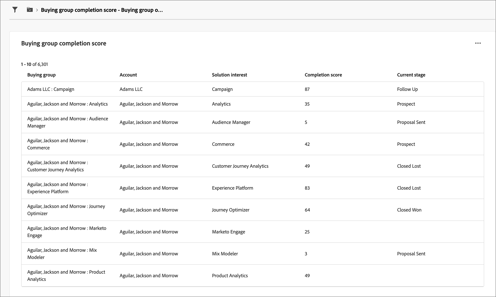

# Übersichts-Dashboard für Einkaufsgruppen

Das Übersichts-Dashboard für Einkaufsgruppen wurde für den B2B-Verkaufs-Übergabeprozess entwickelt. Dadurch kann das Marketing-Team _bereite_ Einkaufsgruppen und ihre Mitglieder sowie wichtige Daten zur Ausführung an das Vertriebs-Team weitergeben. Dieser Prozess sorgt für einen optimierten Übergang vom Marketing zum Vertrieb.

Die Übergabe an den Verkauf umfasst:

* **Datenübergabe**: Marketing identifiziert _fertige_ Zieldaten und macht sie für den Vertrieb im CSV-Format zugänglich. 
* **Verkaufsakzeptanz**: Der Vertrieb überprüft manuell _einsatzbereite_ Ziele in seine Pipeline.

Um auf dieses Dashboard zuzugreifen, erweitern Sie **[!UICONTROL Konten]** im linken Navigationsbereich und wählen Sie dann **[!UICONTROL Einkaufsgruppen]**. Wählen Sie die **[!UICONTROL Übersicht]** aus, wenn sie nicht standardmäßig angezeigt wird.

{width="800" zoomable="yes"}
<!--
## Buying Group Status

Gain insights into your buying groups' progression with the Buying Group Status view. This visualization showcases the distribution of your buying groups categorized by their most recent status update within a specified time frame.

{width="800" zoomable="yes"}

**[!UICONTROL Status]** (y-axis): Track the journey of buying groups through various stages.
**[!UICONTROL Number of Buying Groups]** (x-axis): Quantify the number of buying groups at each status, providing a clear metric of your funnel's health and activity.

To generate a shareable PDF of your current view, click **[!UICONTROL Export]** at the top-right corner of the page. -->

## Verteilung der Abschlussbewertung der Käufergruppe

Diese Visualisierung veranschaulicht die Verteilung der Einkaufsgruppen basierend auf den Abschlussbewertungen und ist in vier verschiedene Bewertungsbänder unterteilt. Die zentrale Zahl gibt die Gesamtzahl der Einkaufsgruppen an und gibt einen schnellen Überblick über den Gesamtfortschritt. Die segmentierten Farben geben den Anteil der Einkaufsgruppen innerhalb jedes Bewertungsbereichs an, sodass Sie Abschlusstrends auf einen Blick beurteilen können.

Um detailliertere Informationen anzuzeigen, klicken Sie auf das Menüsymbol **…** oben rechts.

{width="500"}

## Verteilung der Interaktionsbewertung der Käufergruppe

Diese Visualisierung veranschaulicht die Verteilung der Einkaufsgruppen basierend auf ihren Interaktionsbewertungen und ist in vier verschiedene Bewertungsbänder unterteilt. Die zentrale Zahl gibt die Gesamtzahl der Einkaufsgruppen an und gibt einen schnellen Überblick über den Gesamtfortschritt. Die segmentierten Farben geben den Anteil der Einkaufsgruppen innerhalb jedes Bewertungsbereichs an, sodass Sie Abschlusstrends auf einen Blick beurteilen können.

Um detailliertere Informationen anzuzeigen, klicken Sie auf das Menüsymbol **…** oben rechts.

{width="500"}

## Käufergruppen nach Lösungsinteresse

Diese Visualisierung veranschaulicht die Verteilung von Einkaufsgruppen nach Lösungsinteressen und hilft Ihnen zu ermitteln, welche Lösungen das größte Interesse generieren. Jeder Balken stellt eine spezifische Lösung dar, wobei seine Länge die Anzahl der mit diesem Interesse verbundenen Einkaufsgruppen angibt. Dieses Balkendiagramm bietet ein klares und sofortiges Verständnis der Trends bei der Lösungsnachfrage.

Um detailliertere Informationen anzuzeigen, klicken Sie auf das Menüsymbol **…** oben rechts. Wählen Sie **Drill-Through** oder **Weitere anzeigen**.

{width="500"}

## Filtern der Daten

Klicken Sie oben links auf _Filter_-Symbol  ), um die angezeigten Daten mithilfe eines der folgenden Attribute zu filtern:

* Aktuelle Phase
* Branche
* Region
* Lösungsinteresse

{width="500"}

Wählen Sie für jedes Attribut, das Sie zum Filtern der Daten verwenden möchten, so viele Werte aus und klicken Sie auf **[!UICONTROL Anwenden]**.

## Interagieren mit den Daten

Um mit den Daten zu interagieren _verwenden Sie das Menü_&#x200B;**Mehr…**) oben rechts in jedem Diagramm.

### [!UICONTROL Drill-Through]

Wählen Sie **[!UICONTROL Drill-Through]** für eine detaillierte Analyse einzelner Gruppenbewertungen oder -verteilungen aus.

{width="700" zoomable="yes"}

Die auf das Dashboard angewendeten globalen Filter werden übernommen. Klicken Sie oben links auf _Filter_ (  ), um [die Attributfilter zu ändern](#filter-the-data) für die Drill-Through-Ansicht.

Sie können oben rechts auf das _Mehr_-Menü (**…**) klicken und **[!UICONTROL Mehr anzeigen]** wählen, um [erweiterte Daten anzuzeigen](#view-more).

### [!UICONTROL Mehr anzeigen]

Wählen Sie **[!UICONTROL Mehr anzeigen]**, um erweiterte Daten und Einblicke anzuzeigen.

{width="700" zoomable="yes"}

Das angezeigte Popup enthält ein Diagramm und eine Tabelle, die die Aufschlüsselung der Verteilung der Einkaufsgruppe anzeigt.

Um die Daten herunterzuladen, klicken **[!UICONTROL oben rechts in]** Datentabelle auf „CSV herunterladen“. Um zum Übersichts-Dashboard zurückzukehren, klicken Sie auf **[!UICONTROL Schließen]**.
