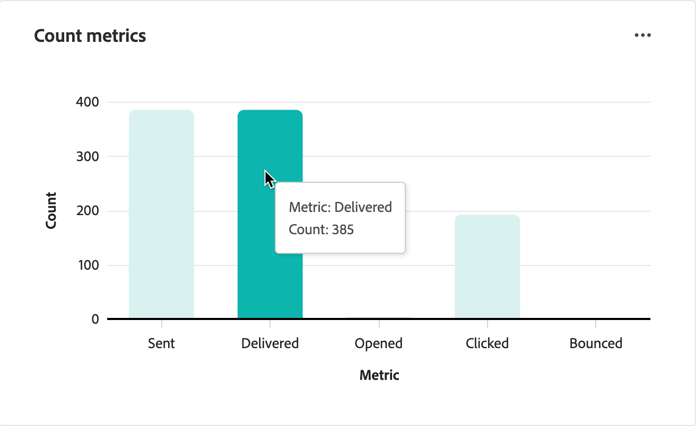

# E-Mail-Leistungsbericht

Der **E-Mail** Leistungsbericht bietet Marketing-Experten einen einheitlichen Überblick über E-Mail-Aktivitäten in allen Journey in Adobe Journey Optimizer B2B edition. Es aggregiert Metriken für Versand, Versand, Interaktion und Opt-out. Indem Sie sowohl die Rohanzahl als auch die berechneten Raten anzeigen, können Sie den Zustand von Kampagnen überwachen, die E-Mail-Leistung vergleichen und Zustellbarkeits- oder Interaktionsprobleme auf einen Blick erkennen. Metriken auf Journey-Ebene für E-Mail- und SMS-Kanäle finden Sie unter [Account Journey Dashboard](./journeys-dashboard.md).

## Zugriff auf den Bericht

1. Wählen Sie in der linken Navigation **[!UICONTROL Dashboard]** aus.
1. Wählen Sie die **[!UICONTROL E-Mail]** Leistung) oben im Reporting-Dashboard aus.

{width="800" zoomable="yes"}

## Filtern der Daten

Klicken Sie _oben links auf_ Filter ), um die Datenanzeige mithilfe der beiden unterstützten Filtertypen zu filtern. Diese Filter gelten für alle Bereiche gleichzeitig:

* **[!UICONTROL Journey]** - Filtert den Bericht, um Daten für eine oder mehrere ausgewählte Journey anzuzeigen. Verwenden Sie diesen Filter, um die Leistung der Journey zu isolieren, die für Ihre Kampagne oder Ihr Programm wichtig sind.

* **Datumsbereich** - Beschränkt alle Metriken auf E-Mails, die innerhalb des angegebenen Zeitfensters gesendet werden. Unterstützt voreingestellte Bereiche und eine benutzerdefinierte Datumsauswahl. Die Datumsbereichsauswahl befindet sich oben rechts im Dashboard.

{width="500"}

Wenn Sie Filter im Dialogfeld Filter ändern, klicken Sie auf **[!UICONTROL Anwenden]**.

## Diagramme mit Metriken für Anzahl und Rate

Der obere Abschnitt des E-Mail-Leistungsberichts enthält zwei nebeneinander liegende Balkendiagramme, die eine visuelle Zusammenfassung des allgemeinen Zustands des E-Mail-Programms über den ausgewählten Datumsbereich und das ausgewählte Journey hinweg bieten.

**Zählmetriken** - Zeigt das absolute Volumen der E-Mail-Aktivität an. Jede Leiste stellt die Gesamtanzahl eines E-Mail-Schlüsselereignisses für alle E-Mails im gefilterten Umfang dar: gesendet, zugestellt, geöffnet, geklickt, gebounct und Abmeldungen.

**Ratenmetriken** - Zeigt berechnete Prozentsätze an, mit denen Sie die Interaktion und Zustellbarkeitsqualität unabhängig vom Volumen bewerten können: Zustellrate, Öffnungsrate, Klickrate, Bounce-Rate, Klickrate zum Öffnen und Abmelderate.

Bewegen Sie den Mauszeiger über das Diagramm, um numerische Daten anzuzeigen.

{width="500"}

| Metrik | Typ | Beschreibung |
|--------|------|-------------|
| Gesendet | Anzahl | Gesamtzahl der für den Versand gesendeten E-Mail-Nachrichten. |
| Zugestellt | Anzahl | E-Mails wurden vom E-Mail-Server des Empfängers erfolgreich akzeptiert. |
| Geöffnet | Anzahl | Anzahl der zugestellten E-Mails, die mindestens einmal geöffnet wurden. |
| Angeklickt | Anzahl | Anzahl der E-Mails, die mindestens einen Link-Klick erhalten haben. |
| Hardbounce aufgetreten | Anzahl | E-Mails, die nicht zugestellt werden konnten (Hard- oder Softbounce) |
| Abbestellungen | Anzahl | Empfänger, die sich über einen Abmelde-Link in der E-Mail abgemeldet haben. |
| Zustellrate | Rate | Zugestellt ÷ gesendet. Gibt den Prozentsatz der E-Mails an, die die Posteingänge erreicht haben. |
| Öffnungsrate | Rate | Geöffnet ÷ zugestellt. Misst die Interaktion der Empfänger mit den Betreffzeilen. |
| Klickrate | Rate | Hat auf Zugestellt ÷. Misst die gesamte Klickinteraktion pro zugestellter E-Mail. |
| Bounce-Rate | Rate | Bounce ÷ gesendet. Hebt Zustellbarkeit hervor und listet Gesundheitsprobleme auf. |
| Clickto-Open-Rate (CTOR) | Rate | Haben Sie ÷ geöffnet. Misst Inhalte und die Effektivität von CTA unter engagierten Lesern. |
| Abmelderate | Rate | Abmeldungen ÷ zugestellt. Signalisiert Relevanz und Zielgruppenanpassung. |

## E-Mail-Leistungstabelle

Unten auf der Seite zeigt eine detaillierte Tabelle Metriken pro E-Mail für jedes E-Mail-Asset im gefilterten Bereich an. Standardmäßig zeigt die Tabelle zehn Zeilen pro Seite an.

Die Spalte **Abmelden %** ist eine priorisierte Metrik für die Überwachung der Opt-out-Aktivität direkt in der Tabellenansicht.

| Spalte | Beschreibung |
|--------|-------------|
| E-Mail-Name | Der Name des [E-Mail-Assets](../content/add-email.md) wie auf der Journey konfiguriert. |
| Gesendet | Gesamtzahl der Sendevorgänge für diese E-Mail innerhalb des ausgewählten Datumsbereichs. |
| Zugestellt | Anzahl der E-Mails, die erfolgreich an Empfänger-E-Mail-Server zugestellt wurden. |
| Versand % | Zugestellt ÷ gesendet (in Prozent) |
| Geöffnet | Gesamtzahl der für diese E-Mail aufgezeichneten offenen Ereignisse. |
| % öffnen | Öffnungen ÷ zugestellt, ausgedrückt als Prozentsatz. |
| Klicks | Gesamte Link-Klickereignisse für diese E-Mail. |
| Klicken Sie auf % | Klicks ÷ zugestellt, ausgedrückt als Prozentsatz. |
| CTOR % | Klicks-zum-Öffnen-Rate: Klicks ÷ Öffnungen, ausgedrückt als Prozentsatz. |
| Bounces | Anzahl nicht zustellbarer E-Mails (Hard- und Softbounces) |
| Bounce % | Bounces ÷ gesendet, ausgedrückt als Prozentsatz. |
| Abmelden in % | Abmeldungen ÷ zugestellt. Priorisierte Metrik für die Überwachung des Opt-out-Status. |
| Erste Aktivität | Zeitstempel des ersten aufgezeichneten Ereignisses (Senden, Öffnen oder Klicken) für diese E-Mail im ausgewählten Zeitraum. |
| Letzte Aktivität | Zeitstempel des letzten aufgezeichneten Ereignisses für diese E-Mail im ausgewählten Zeitraum. |

## Exportieren von Berichtsdaten

Der E-Mail-Leistungsbericht unterstützt den Datenexport zur weiteren Analyse in externen Tools oder zum Austausch von Ergebnissen mit Stakeholdern. Sie können die Tabellendaten im CSV-Format exportieren, das mit jedem Datenanalyse- oder BI-Tool kompatibel ist.

>[!CAUTION]
>
>Exporte spiegeln die derzeit aktiven Filter wider. Stellen Sie vor dem Export sicher, dass Ihre Datumsbereich- und Journey-Filter korrekt eingestellt sind, um unvollständige Daten in der Ausgabedatei zu vermeiden.

**_So exportieren Sie Berichtsdaten:_**

1. Legen Sie Ihren Datumsbereich oben rechts fest und wenden Sie die **[!UICONTROL Journey]**-Filterung nach Bedarf an.
1. Klicken Sie auf das Menüsymbol **…** oben rechts im Bedienfeld E-Mail-Leistung und wählen Sie **[!UICONTROL Mehr anzeigen]**.
1. Klicken Sie **[!UICONTROL Menü auf]** CSV herunterladen“.

   {width="700" zoomable="yes"}

   Die Datei wird automatisch auf den standardmäßigen Download-Speicherort Ihres Browsers heruntergeladen.

1. Klicken Sie auf **[!UICONTROL Schließen]**, um zum E-Mail-Leistungsbericht zurückzukehren.
