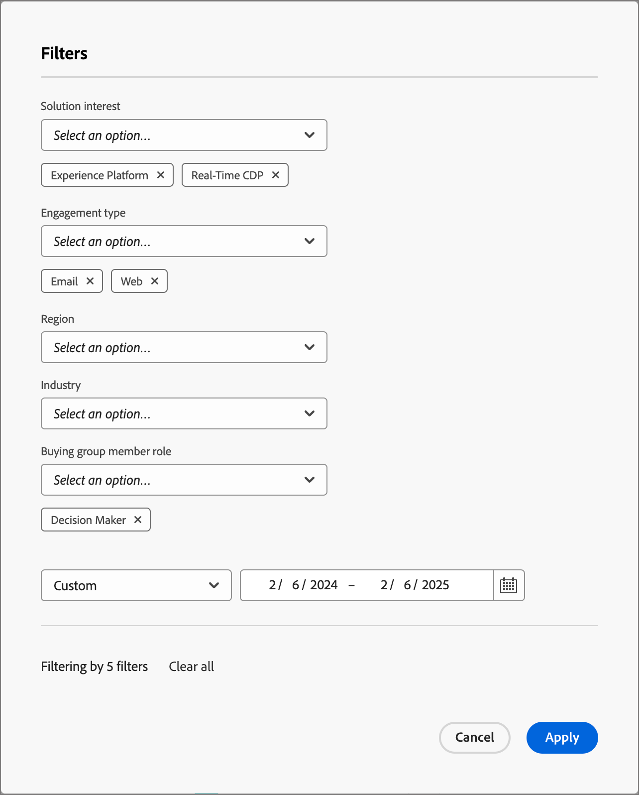
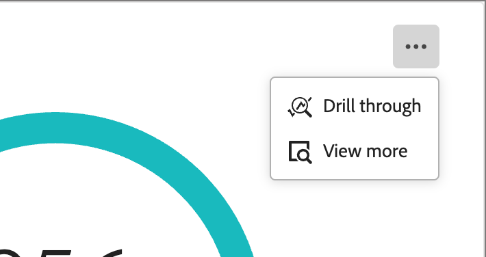
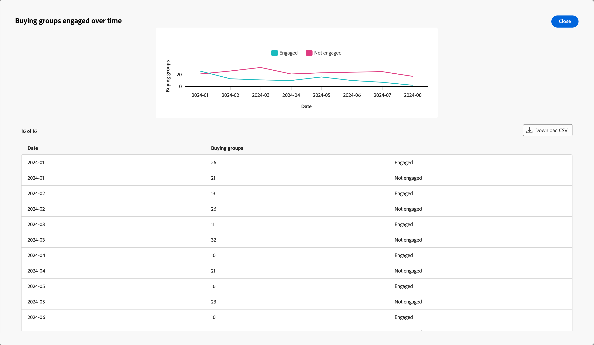

# Interaktionsübersicht-Dashboard

Dieses Dashboard bietet eine umfassende Ansicht der Interaktion und zeigt Echtzeitmetriken der Konto- und individuellen Interaktionen durch Momentaufnahme-Ringdiagramme und Trendaufnahmen im Zeitverlauf auf. Dies hilft Ihnen, Ihre Interaktionsbemühungen effektiv zu überwachen und zu strategisieren.

Um auf das _Interaktions-Dashboard_ zuzugreifen, wählen Sie **[!UICONTROL linken Navigationsbereich das]** Dashboard“ aus. Wählen Sie dann oben **[!UICONTROL der Seite]** Registerkarte „Interaktion“ aus.

<!-- To generate a shareable PDF of your current view, click **[!UICONTROL Export]** at the top-right corner of the page. To engage with the data, use the action menu in the top-right corner. -->

{width="800" zoomable="yes"}

## Interaktion nach Konten/Einkaufsgruppe/Personen

Die Kreisdiagramme unterteilen Konten, Einkaufsgruppen oder Personen in engagierte und nicht engagierte Kategorien. Die zentrale Abbildung zeigt die Gesamtanzahl innerhalb jeder Kategorie an und bietet so einen Überblick über die gesamte Interaktion.

{width="500"}

## Konten/Einkaufsgruppen/im Zeitverlauf engagierte Personen

Diese Liniendiagramme zeigen die Interaktionsstufen von Konten oder Personen im Zeitverlauf an. Mit unterschiedlichen Linien für „Interagiert“ und „Nicht interagiert“, die neben einer horizontalen Achse mit Zeitstempel visualisiert werden, können Sie Trends und Muster identifizieren. Sie können den Mauszeiger über eine Zeile bewegen, um präzise Metriken für ein bestimmtes Datum anzuzeigen.

{width="500"}

## Filtern der Daten

Sie können die angezeigten Daten nach Datumsbereich und Attributen filtern.

### Filter für Datumsbereich

Verwenden Sie den _[!UICONTROL Datumsbereichsfilter]_ oben rechts, um die Daten nach dem Datumsbereich zu filtern.

{width="380"}

Für den Bereich **[!UICONTROL Benutzerdefiniert]** können Sie mit dem Kalenderwerkzeug ein Start- und Enddatum angeben. Das Enddatum wird standardmäßig auf den aktuellen Tag festgelegt.

{width="380"}

### Attributfilter

Klicken Sie oben links auf _Filter_-Symbol  ), um die angezeigten Daten mithilfe eines der folgenden Attribute zu filtern:

* Lösungsinteresse
* Interaktionstyp
* Region
* Branche
* Rolle des Käufergruppenmitglieds

{width="500"}

Wählen Sie für jedes Attribut, das Sie zum Filtern der Daten verwenden möchten, so viele Werte aus und klicken Sie auf **[!UICONTROL Anwenden]**.

## Interagieren mit den Daten

Um mit den Daten zu interagieren, verwenden Sie das Menü **…** oben rechts in jedem Diagramm.

{width="300"}

### Drill-Through

Wählen Sie für ein Kreisdiagramm **[!UICONTROL Drill-Through]**, um eine detaillierte Analyse der Daten zu einzelnen Gruppeninteraktionen durchzuführen.

Die globalen Filter (Datenbereich und Attribute) werden auf das Dashboard angewendet und übernommen. Klicken Sie oben links auf _Filter_ (  ), um [die Attributfilter zu ändern](#filter-the-data) für die Drill-Through-Ansicht. Verwenden Sie die Datumsbereichsauswahl oben rechts, um [ Drill-Through](#date-range-filter)Ansicht den Datumsbereich zu ändern.

{width="700" zoomable="yes"}

| Interaktion nach Konten | Interaktion nach Käufergruppen | Interaktion nach Personen |
| ---------------------- | --------------------------- | -------------------- |
| <li>Kontoname <li>Status <li>Interaktive Personen (Zahl)<li>Interaktionsaktivitäten (Zahl) <li>Letzte Interaktion (Datum) | <li>Käufergruppe <li>Konto <li>Lösungsinteresse <li>Status <li>Interaktionsaktivitäten (Zahl) | <li>Name <li>Status <li>E-Mail (Adresse) <li>Interaktionsaktivitäten (Zahl) <li>Letzte Interaktion (Datum) |

Sie können oben rechts auf das Menüsymbol **…** klicken und **[!UICONTROL Weitere anzeigen]** wählen, um [erweiterte Daten und Erkenntnisse anzuzeigen](#view-more).

### Mehr anzeigen

Wählen Sie **[!UICONTROL Mehr anzeigen]**, um erweiterte Daten und Einblicke zu erhalten.

{width="700" zoomable="yes"}

Abhängig vom Diagramm gibt es erweiterte Daten für Folgendes:

| Interaktion nach Konten/Einkaufsgruppen/Personen | Konten/Einkaufsgruppen/im Zeitverlauf engagierte Personen |
| ----------------------------------------------- | -------------------------------------------------- | 
| <li>Eingebunden <li>Nicht eingestellt | <li>Datum <li>Konten / Einkaufsgruppen / Personen (Zahl) <li>Eingebunden/Nicht eingebunden |

Um die erweiterten Daten zu kopieren, klicken Sie **[!UICONTROL oben]** auf „CSV herunterladen“.
